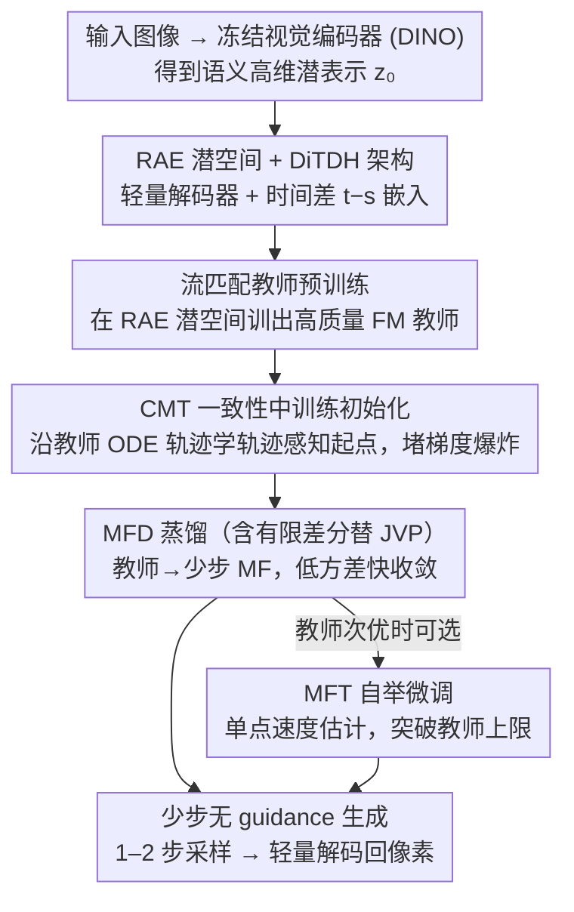

# MeanFlow Transformers with Representation Autoencoders

**会议**: CVPR 2026  
**论文**: [CVF Open Access](https://openaccess.thecvf.com/content/CVPR2026/html/Hu_MeanFlow_Transformers_with_Representation_Autoencoders_CVPR_2026_paper.html)  
**代码**: https://github.com/sony/mf-rae  
**领域**: 扩散模型 / 少步生成  
**关键词**: MeanFlow, 表示自编码器, 流匹配蒸馏, 一致性中训练, 少步采样

## 一句话总结
MeanFlow-RAE 把少步生成模型 MeanFlow 从传统 SD-VAE 潜空间搬到"表示自编码器（RAE）"的语义潜空间里训练，用一致性中训练（CMT）做轨迹感知初始化稳住梯度爆炸、用流匹配蒸馏（MFD）替代从零训练、再用有限差分省掉 JVP，最终在 ImageNet 256 上把单步生成 FID 从 vanilla MF 的 3.43 压到 2.03，同时采样 GFLOPS 降 38%、总训练成本降约 83%。

## 研究背景与动机
**领域现状**：扩散/流匹配模型生成质量极高，但采样要解概率流常微分方程（PF-ODE），需几十上百次网络前向，慢得出名。近期 flow map 模型（以 MeanFlow 即 MF 为代表）直接学 PF-ODE 的解映射，把"从噪声到数据"压成一到两步，是少步生成的有力路线。实践中 MF 常在潜空间里跑，借用预训练的 SD-VAE 处理高维图像。

**现有痛点**：即便在潜空间，MF 训练依旧昂贵且不稳——ImageNet 256 上 vanilla MF 要 600+ H100 GPU-天。它还被一堆超参拖累：类条件生成依赖复杂的 classifier-free guidance（CFG），涉及两个 CFG 尺度 + 两个触发区间超参，全靠网格搜索调；MF 损失里的雅可比向量积（JVP）既增加算力又带来不稳定，连在 Flash Attention 这类现代组件上支持 JVP 都要额外工程。推理端，把潜向量解码回像素的 SD-VAE 解码器才是大头——在 ImageNet 256 上 SD-VAE 解码占了总算力约 73%（310 GFLOPS vs DiT 的 114 GFLOPS）。

**核心矛盾**：少步模型的瓶颈已从"迭代次数"转移到"解码器开销 + 训练不稳 + 超参繁杂"，而 SD-VAE 这套老潜空间既贵又难训。最近的 RAE 用冻结的预训练视觉编码器（如 DINO）当 tokenizer、只训一个轻量 ViT 解码器，其解码器只要 ~106 GFLOPS（比 SD-VAE 近 3 倍提速），语义丰富的高维潜空间天然适配少步模型——但把 MF 直接搬进 RAE 潜空间会立刻梯度爆炸。

**本文目标**：在 RAE 潜空间里训出一个稳定、快速、高质量的少步 MF，并系统拆解 MF 训练的各个环节、逐一给出改进。

**切入角度**：作者把 MF 训练分解成四条正交的轴——更好的潜空间、轨迹感知的初始化、代理速度的选择、传输导数的高效计算——分别下手。

**核心 idea**：用 RAE 语义潜空间 + DiTDH 架构换掉 SD-VAE，用 CMT 初始化堵住梯度爆炸，用 MFD 蒸馏替代从零 MFT，用有限差分替掉 JVP，从而既去掉 guidance 超参又大幅降本提质。

## 方法详解

### 整体框架
MF-RAE 把"在 RAE 潜空间训出少步生成器"这件难事拆成分治的三阶段流水线：先在 RAE 潜空间预训练一个高质量流匹配教师；再用 CMT 做轨迹感知的 MF 初始化（教师生成参考轨迹、并作为 CMT 的初始权重）；最后从 CMT 权重出发、用带有限差分的 MFD 训练 MF，必要时再补一段可选的 MFT 进一步压低偏差。架构上，作者在 RAE 用的 DiTDH 骨干（DiT + 宽而轻的 DDT head）基础上，额外加一个对时间差 $t-s$ 的嵌入模块——把类别、当前时间 $t$、时间差 $t-s$ 三者嵌入相加，让模型显式编码绝对时间与时间差，这是学准 flow map 的关键。整条链每一阶段都为下一阶段铺路：预训练给出好教师，CMT 给出能稳定训练的起点，MFD 在这个起点上快速收敛。

### 关键设计

**1. RAE 语义潜空间 + DiTDH 架构：把瓶颈从解码器和迭代次数上同时卸掉**

vanilla MF 用 SD-VAE，解码器吃掉约 73% 的生成算力；RAE 改用冻结的预训练语义编码器 $E$（如 DINOv2/SigLIP2）当 tokenizer，只训一个 ViT 解码器 $D$，重建损失 $L_{rec}=\omega_L\,\mathrm{LPIPS}(\hat x,x)+L_1(\hat x,x)+\omega_G\,\mathrm{GAN}(\hat x,x)$。对普通潜扩散，RAE 提速有限（瓶颈在多次 ODE 求解）；但对 MF 这种只评 1–2 步的少步模型，RAE 的轻量解码器（~106 GFLOPS）优势被放大，且语义丰富的高维潜空间还能加速收敛、让类条件生成无需任何 guidance。为处理高维潜空间，RAE 把 DiT 扩成带宽 DDT head 的 DiTDH；作者在此基础上加 $t-s$ 嵌入以适配 flow map 学习。任何为适配 DiT/SiT 到 MF 而做的架构改动，都能同样插进 DiTDH，保证了通用性。

**2. CMT 一致性中训练初始化：堵住 RAE 潜空间里的梯度爆炸**

直接在 RAE 潜空间训 MF 极不稳：无论随机初始化还是用预训练 FM 教师初始化，梯度都会爆炸——XL 模型第 2 个 epoch 损失与梯度范数就飙到约 $10^5$，发散前最好的单步 FID 仍 >20，远未收敛。根因是训练信号错配：流匹配学的是 PF-ODE 轨迹上的无穷小局部跳变，而 MF 要学远距离时间步之间的"长跳"，随机初始化更雪上加霜。CMT 用教师 FM 的数值 ODE 轨迹来学一个轨迹感知的初始化，目标为 $L_{\text{CMT-MF}}(\theta)=\mathbb{E}\big\|h_\theta(\hat z_{t_i},t_i,t_j)-\frac{\hat z_{t_i}-\hat z_{t_j}}{t_i-t_j}\big\|_2^2$，即让 $h_\theta$ 复现教师轨迹上对应的长跳。在 RAE 设定下，一阶 Euler 解 16 NFE 就够（RAE 扩散 16 步即达 FID 2.32），不必像原版 CMT 用二阶 Heun。

**3. MFD 与 MFT 的偏差–方差权衡：先蒸馏后（可选）自举**

MF 的回归代理速度 $w$ 可取单点速度估计 $\hat v$（MFT）或预训练教师 $v_\theta$（MFD）。作者首次给出二者的理论刻画（命题 3.1）：用 $w_\eta=(1-\eta)\hat v+\eta v_\theta$ 代入广义损失后，损失分解出三类残差——单点速度残差、教师–oracle 速度残差、oracle 偏差。$\eta=0$ 退化为纯 MFT，损失含单点估计带来的全部方差项；$\eta=1$ 为纯 MFD，方差项消失、只剩教师残差与 oracle 偏差。结论是：当教师足够好（$\delta v_\theta\approx 0$）时 MFD 兼具更小偏差与更低方差、收敛更快；若教师次优，可在 MFD 收敛后再补一段 MFT（此时从已收敛点出发，方差被有效压低），用一点速度估计进一步削减残差偏差、突破教师质量给 MF 设下的天花板。

**4. 有限差分替代 JVP：省掉 MF 最大的算力与稳定性瓶颈**

MF 回归目标里的传输导数 $\frac{d}{dt}h_{\theta^-}=(\partial_z h_{\theta^-})w+\partial_t h_{\theta^-}$ 需要 JVP，既贵又不稳、还难在现代组件上实现。作者用有限差分近似时间导数：$\frac{d}{dt}h_\theta\approx\frac{h_\theta(z_{t+\Delta t},t+\Delta t,s)-h_\theta(z_{t-\Delta t},t-\Delta t,s)}{2\Delta t}$，其中 $z_{t\pm\Delta t}\approx z_t\pm\Delta t\,w(z_t,t)$ 由沿教师速度场的一阶 Euler 步得到。实测 $\Delta t\in[0.001,0.01]$ 训练稳定、性能与精确 JVP 几乎一致，全程固定取中值 $\Delta t=0.005$。

### 损失函数 / 训练策略
三阶段流水线：(1) 预训练——在 RAE 潜空间训高质量 FM 教师；(2) 中训练——用 CMT 学轨迹感知的 MF 初始化（教师生成参考轨迹并作 CMT 初始权重）；(3) 后训练——从 CMT 权重出发、用带有限差分的 MFD 训 MF，可选再补 MFT。超参极简：几乎复用 DiTDH 流匹配阶段的配置，只把 batch size 从 1024 降到 256/128（ImageNet 256/512）、学习率从 $2\times10^{-4}$ 降到 $1\times10^{-4}$、EMA 调到 0.9999/0.9995；保留教师的均匀时间采样、类条件生成不用任何 guidance。相比之下 vanilla MF 要换成精调的对数正态时间分布并依赖一堆 CFG 超参。

## 实验关键数据

### 主实验
ImageNet 256 类条件生成，MF-RAE 在所有 flow map 模型里取得 SOTA 的单步/两步质量，且生成与训练成本都更低：

| 方法 | NFE | FID↓ | #Params |
|------|-----|------|---------|
| SiT-XL/2 | 250×2 | 2.06 | 675M |
| RAE | 50×2 | 1.13 | 839M |
| MeanFlow（vanilla） | 1 / 2 | 3.43 / 2.20 | 676M |
| CMT w/ MF | 1 | 3.34 | 676M |
| AlphaFlow | 1 / 2 | 2.58 / 1.95 | 675M |
| **MF-RAE（本文）** | 1 / 2 | **2.03 / 1.89** | 841M |

成本侧：1 步生成 vanilla DiT-MF 需 $310+114=424$ GFLOPS，本文仅 $106+157=263$ GFLOPS（降 38%）；训练上 vanilla MF 从零 MFT 需 1400 epoch、600+ H100 GPU-天，MF-RAE 三阶段合计约 100 H100 GPU-天（FM 预训练 78 + CMT 2.1 + MFD 21），降约 6 倍；若教师已现成，CMT+MFD 仅需 23 H100 GPU-天。ImageNet 512 上单步 FID 3.23，且 GFLOPS 在所有 baseline 中最低。

### 消融实验
潜空间 × 训练方案的组合（ImageNet 256）：

| 算法 | 是否 guidance | 架构 | NFE | FID↓ |
|------|------|------|-----|------|
| MFT | 有 | SD-VAE + DiT/SiT | 1 / 2 | 3.38 / 2.20 |
| MFD | 有 | SD-VAE + DiT/SiT | 1 / 2 | 3.15 / 1.95 |
| MFD | 无 | SD-VAE + DiT/SiT | 1 / 2 | 5.94 / 4.01 |
| MFT | 无 | RAE + DiTDH | 1 / 2 | 2.81 / 2.56 |
| **MFD** | 无 | **RAE + DiTDH** | 1 / 2 | **2.03 / 1.89** |

JVP vs 有限差分 $\Delta t$（默认 $5\times10^{-3}$）：

| $\Delta t$ | JVP | $10^{-4}$ | $10^{-3}$ | $5\times10^{-3}$ | $10^{-2}$ |
|------|------|------|------|------|------|
| 1-step FID | 1.96 | 5.63 | 2.06 | 2.03 | 2.17 |
| 2-step FID | 1.87 | 4.22 | 1.87 | 1.89 | 1.94 |

### 关键发现
- **RAE 潜空间是去 guidance 的关键**：SD-VAE 上去掉 guidance 后 MFD 严重退化（FID 5.94/4.01），而 RAE+DiTDH 无 guidance 仍达 2.03/1.89——语义潜空间让类条件生成不再依赖 CFG 超参。
- **CMT 是 RAE 上能否训起来的开关**：vanilla MF 在 SD-VAE 上能从随机初始化训起（但要 1400 epoch），而 RAE 潜空间无论随机还是用扩散教师初始化都训不起来，唯有 CMT 初始化才行。
- **同潜空间下 MFD 显著优于 MFT**：RAE 上 MFD 1.89/2.03 对 MFT 的 2.56/2.81；因教师-学生 FID 差距已很小（教师 50 NFE 即 FID 1.51），此时无需再加自举 MFT。
- **有限差分几乎免费匹配 JVP**：$\Delta t=5\times10^{-3}$ 时 FID 与精确 JVP 基本持平，省掉了 JVP 的算力与实现负担。

## 亮点与洞察
- **把"少步生成"的瓶颈重新定位并各个击破**：作者识别出瓶颈已从迭代次数转向解码器开销、训练不稳、超参繁杂，用 RAE 解码器、CMT 初始化、MFD 蒸馏分别对症，思路清晰、收益可叠加。
- **MFD/MFT 的偏差–方差理论刻画很有价值**：命题 3.1 把"该蒸馏还是该从单点估计训"讲成可分析的 bias-variance 控制，给出"先 MFD 后可选 MFT"的实用 recipe，可迁移到其它 flow map 蒸馏。
- **超参鲁棒性是隐藏卖点**：MF-RAE 几乎能直接复用流匹配预训练的超参、只改几个标量，免去 vanilla MF 的 CFG 网格搜索——这对工程落地价值极高。

## 局限与展望
- **依赖好教师与多阶段流水线**：方法本质是"教师→CMT→MFD"的分治链，需要先有/先训一个高质量 FM 教师；从零训练在 RAE 潜空间被证明训不起来，灵活性受限。
- **未做自举时的边界**：论文称教师够强时 MFT 自举"不必要"，但当教师明显次优时自举到底能把上限抬多高，缺少更系统的量化扫描。
- **评测集中在 ImageNet 类条件**：在文本到图像等更复杂条件、更高分辨率上的稳定性与收益仍待验证。
- **有限差分步长需固定经验值**：$\Delta t=0.005$ 是经验中值，$10^{-4}$ 时 FID 反而恶化到 5.63，说明步长仍有敏感区间、换设置可能需重调。

## 相关工作与启发
- **vs vanilla MeanFlow**：同样学平均速度做少步生成，但 vanilla MF 在 SD-VAE 上从零训、依赖 CFG 超参与 JVP；MF-RAE 换到 RAE 潜空间、用 CMT+MFD+有限差分，FID 3.43→2.03、训练成本降约 6 倍、去掉所有 guidance 超参。
- **vs RAE（原版）**：RAE 本是为潜流匹配设计、对普通扩散提速有限（瓶颈在多次 ODE 求解）；本文指出 RAE 的解码器效率恰恰最契合少步 MF，把它的价值"激活"到了少步生成场景。
- **vs CM / CTM 等 flow map 模型**：CM 学任意噪声点到干净点的映射、CTM 学轨迹上任意两点映射、MF 学两点间平均 ODE 积分（与 CTM 参数化数学等价）；本文不改 flow map 范式，而是把 MF 的"潜空间+初始化+目标+导数计算"四个环节系统优化。

## 评分
- 新颖性: ⭐⭐⭐⭐ 不是全新范式，但把 RAE+CMT+MFD+有限差分系统组合并配上 MFD/MFT 理论分析，组合创新扎实。
- 实验充分度: ⭐⭐⭐⭐⭐ ImageNet 256/512 主结果 + 潜空间/训练方案/JVP 多组消融，成本与质量都量化清楚。
- 写作质量: ⭐⭐⭐⭐⭐ 四轴分解逻辑清晰，瓶颈定位与每步动机讲得透。
- 价值: ⭐⭐⭐⭐⭐ 训练降本约 83%、采样降 38%、去掉 guidance 超参，对少步生成的工程落地价值高。

<!-- RELATED:START -->

## 相关论文

- [\[CVPR 2026\] Understanding, Accelerating, and Improving MeanFlow Training](understanding_accelerating_and_improving_meanflow_training.md)
- [\[CVPR 2026\] Temporal Equilibrium MeanFlow: Bridging the Scale Gap for One-Step Generation](temporal_equilibrium_meanflow_bridging_the_scale_gap_for_one-step_generation.md)
- [\[CVPR 2026\] Interpretable and Steerable Concept Bottleneck Sparse Autoencoders](interpretable_and_steerable_concept_bottleneck_sparse_autoencoders.md)
- [\[ICML 2026\] OMP: One-step Meanflow Policy with Directional Alignment](../../ICML2026/image_generation/omp_one-step_meanflow_policy_with_directional_alignment.md)
- [\[CVPR 2026\] Extending One-Step Image Generation from Class Labels to Text via Discriminative Text Representation](emf_meanflow_text_to_image.md)

<!-- RELATED:END -->
