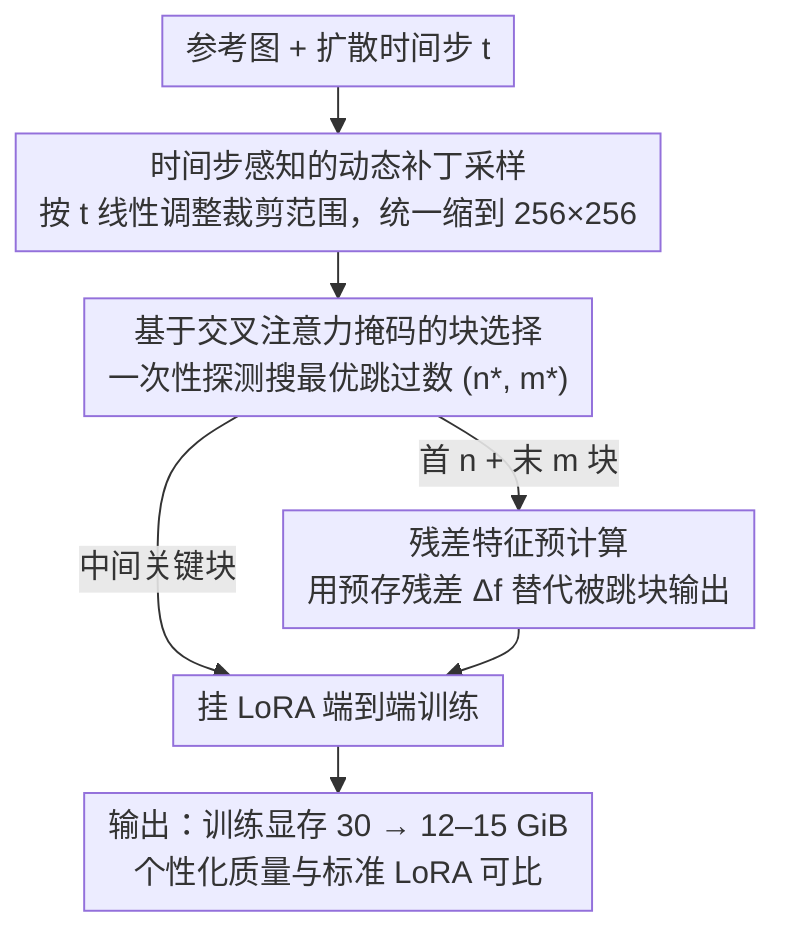

# Memory-Efficient Fine-Tuning Diffusion Transformers via Dynamic Patch Sampling and Block Skipping

**会议**: CVPR 2026  
**arXiv**: [2603.20755](https://arxiv.org/abs/2603.20755)  
**代码**: 无  
**领域**: 扩散模型 / 高效微调  
**关键词**: 扩散Transformer, 高效微调, 动态补丁采样, 块跳过, 个性化生成

## 一句话总结

提出 DiT-BlockSkip 框架，通过时间步感知的动态补丁采样（低分辨率训练但动态调整裁剪范围）和基于交叉注意力分析的关键块选择+残差特征预计算的块跳过策略，在 FLUX 上将 LoRA 微调显存减少约 50%，同时维持与标准 LoRA 可比的个性化生成质量。

## 研究背景与动机

1. **领域现状**：基于扩散 Transformer (DiT) 的文生图模型（如 FLUX、SANA）显著提升了图像生成质量。个性化微调通常使用 LoRA 等 PEFT 方法在少量参考图像上适配。

2. **现有痛点**：(a) DiT 模型参数量极大（FLUX 有 19 个 double-stream + 38 个 single-stream 块），即使用 LoRA 仍需完整前向和反向传播，显存开销巨大（FLUX LoRA 在 512×512 下需约 30 GiB）；(b) 量化方法会损失精度；(c) 梯度无关方法（如 ZOODiP）优化不稳定，需 30000 步才能收敛。

3. **核心矛盾**：DiT 架构的深度和容量使其在训练时的激活内存远超 U-Net，而现有显存高效方法多针对 U-Net 设计（如 HollowedNet），无法直接迁移。

4. **本文目标** 在 DiT 上实现大幅显存削减的同时维持个性化质量，目标推向端侧部署。

5. **切入角度**：(a) 扩散过程中不同时间步学习不同特征——高噪声学全局结构、低噪声学细粒度细节；(b) DiT 并非所有块对个性化同等重要——中间层块更关键。

6. **核心 idea**：动态裁剪+低分辨率训练减少前向/反向显存，选择性跳过非关键块+预计算残差特征减少参数和优化器状态显存。

## 方法详解

### 整体框架

这篇论文要解决的是：在 FLUX 这种巨型扩散 Transformer 上做 LoRA 个性化微调时，激活内存大得离谱（512×512 下要 30 GiB），普通显卡根本跑不动。作者发现显存压力来自两个独立的源头——前向/反向要在全分辨率上算，以及全部 57 个块都要参与训练——于是用两个正交的手段分别去掉它们。第一个手段把训练分辨率压下来：根据当前扩散时间步动态裁一块区域、统一缩到 256×256 再喂给模型，让前向和反向都在低分辨率上跑。第二个手段把训练的块数砍掉：先用一次性的注意力探测找出哪些块对个性化真正重要，把首尾不重要的块整段跳过、只用预先存好的残差特征替代它们的输出，最终只对中间那批关键块挂 LoRA 端到端训练。两个组件叠加，FLUX 的 LoRA 微调显存就从 30 GiB 降到 12–15 GiB。

### 关键设计

**1. 时间步感知的动态补丁采样：用低分辨率训练但不丢全局结构**

降分辨率是省激活内存最直接的办法，但天真地把整图缩到 256×256 会把细节糊掉，而固定裁一小块又看不到全局构图——两种做法都会让个性化质量掉。作者的观察是扩散过程本身在不同时间步学不同尺度的东西：高噪声步学的是全局结构，低噪声步学的是细粒度细节。于是裁剪区域的大小不固定，而是随时间步 $t$ 线性变化，$f(s_{min}, s_{max}, t) = s_{min} + \frac{t}{T} \cdot (s_{max} - s_{min})$，高噪声时裁一大片去捕全局结构、低噪声时裁一小块去抠细节，裁完一律 resize 到 $s_{min}\times s_{min}$（如 256×256），补丁边界按 VAE 的 16 倍下采样因子对齐离散化。这样模型在不同时间步「看到」的尺度刚好匹配它该学的内容，等于在低分辨率的算力预算下复刻了高分辨率训练的表示能力——消融里它的 DINO 0.7253 明显高于简单 resize 的 0.7164。

**2. 基于交叉注意力掩码的块选择：实验探出哪些块能跳**

DiT 不像 U-Net 有明确的编码-解码层级，没法靠结构先验判断哪些块可以省，得实测。作者在已微调好的模型上，依次把不同位置、连续 14 个块的交叉注意力（图像 query 到文本 key）掩掉，看生成结果和完整模型的语义距离怎么变。结果很干脆：掩掉中间层块时主体直接消失、语义距离最大，掩掉首尾块几乎没影响。量化时对 30 个 CustomConcept101 类别算 DINO 嵌入的语义距离，搜一对最优跳过数 $(n^*, m^*)$，使「跳掉首 $n$ 块 + 末 $m$ 块」的掩码影响之和最小。关键是这套探测只跑一次就能对任意跳过比例查表，不用每换一个预算就重训——比逐块做梯度分析省事得多。

**3. 残差特征预计算：跳过块也要补回它的信息**

直接把块删掉会让特征分布严重错位——HollowedNet 那种 U-Net 上的 naive 跳过搬到 DiT 上 DINO 从 0.73 暴跌到 0.43，基本崩了。原因是被跳的块虽然不「关键」，但仍然对特征做了非平凡的变换，直接短路会造成训练时的特征和推理时对不上。作者的补丁很简单：对要跳的连续 $l$ 个块，训练前用原始模型预先算好它们的残差并存下来，

$$\Delta f_{i,i+l} = f_{i+l} - f_i$$

训练时不再真正过这些块，而是把这个固定残差加到更新后的输入上，$f'_{i+l} = f'_i + \Delta f_{i,i+l}$。等于用一个预存的偏置近似「跳过块本来会做的事」，存储开销极低，却把性能从崩溃的 0.43 拉回 0.72，几乎追平不跳过的基线。

### 损失函数 / 训练策略

训练目标就是标准的 conditional flow matching loss，和 FLUX/SANA 原始训练一致，不引入额外正则。LoRA 只注入到未被跳过的中间块，被跳的块参数从 GPU 卸载到 CPU、预计算的残差按需加载，进一步压低驻留显存。评估设定上每个 subject 用 4–6 张参考图、25 个类别特定 prompt，每个 prompt 生成 4 张图。

## 实验关键数据

### 主实验

**FLUX 上 DreamBooth 数据集个性化质量对比：**

| 方法 | 跳过比例 | 训练分辨率 | DINO↑ | CLIP-I↑ | CLIP-T↑ |
|------|---------|-----------|-------|---------|---------|
| LoRA (baseline) | – | 512×512 | 0.7324 | 0.8146 | 0.3173 |
| LISA | – | 512×512 | 0.7387 | 0.8194 | 0.3177 |
| HollowedNet | 50% | 512×512 | 0.4435 | 0.6930 | 0.3094 |
| **Ours** | **30%** | **256×256** | **0.7194** | **0.8036** | **0.3199** |
| **Ours** | **40%** | **256×256** | **0.7171** | **0.8034** | **0.3194** |
| **Ours** | **50%** | **256×256** | **0.6963** | **0.7877** | **0.3184** |

**显存对比（FLUX BFloat16）：**

| 方法 | 训练显存 (GiB) | TFLOPs |
|------|---------------|--------|
| LoRA 512×512 | ~30 | ~28 |
| Ours 30% 256×256 | ~15 | ~7 |
| Ours 50% 256×256 | ~12 | ~5 |

### 消融实验

| 配置 | DINO | CLIP-I | CLIP-T | 说明 |
|------|------|--------|--------|------|
| LoRA 512×512 | 0.7324 | 0.8146 | 0.3173 | 基线 |
| + Resize 到 256 | 0.7164 | 0.8044 | 0.3176 | 简单降分辨率 |
| + Dynamic Patch | 0.7253 | 0.8099 | 0.3196 | 动态采样优于简单 resize |
| Block Skip (无残差) 50% | 0.4301 | 0.6794 | 0.3047 | naive 跳过崩溃 |
| Block Skip + 残差 50% | 0.7150 | 0.8035 | 0.3182 | 残差修复性能 |
| 跳首 50% 块 | 0.6651 | 0.7646 | 0.3193 | 不如本文策略 |
| 跳末 50% 块 | 0.4808 | 0.7111 | 0.3090 | 末层更关键 |
| 本文策略 (首+末) 50% | 0.7150 | 0.8035 | 0.3182 | 最优跳过组合 |

### 关键发现

- **动态补丁采样优于简单 resize**：DINO 0.7253 vs 0.7164，说明时间步感知的尺度变化确实有效
- **残差特征预计算是块跳过的核心**：无残差时 DINO 从 0.73 暴跌到 0.43，加残差后恢复到 0.72
- **跳末层比跳首层影响更大**：单独跳末 50% 块 DINO 仅 0.48，验证了中间层重要性
- **30% 跳过是最优性价比**：DINO 0.7194 接近 LoRA baseline 0.7324（差距 1.8%），显存约减半
- **HollowedNet 在 DiT 上完全失效**：DINO 仅 0.44，而本文方法同比例跳过仍达 0.70+

## 亮点与洞察

- **时间步-尺度对齐思想**：利用扩散过程的固有属性（高噪声=粗结构，低噪声=细细节）来指导训练策略设计，思路自然且通用。这个思路可迁移到视频扩散模型的高效训练
- **残差特征预计算**：极简的方法弥补块跳过的信息损失，本质上是将"跳过块的功能"用一个固定偏置来近似，计算开销极低但效果显著
- **交叉注意力掩码探测**：用注意力掩码实验替代梯度分析来识别关键层，更直观且计算量小，为 DiT 的可解释性研究提供了新视角

## 局限与展望

- **推理时不减显存**：方法仅优化训练阶段，推理仍需完整模型前向。若需端侧推理还需额外的剪枝/蒸馏
- **预计算残差有存储开销**：需要存储与训练迭代数相同的残差特征，大规模训练时存储可能成为瓶颈
- **SANA 和 FLUX 的最优跳过比例不同**：泛化到新架构需重新做块选择分析
- **可改进方向**：(a) 探索动态残差而非静态预计算，允许残差随 LoRA 更新而自适应；(b) 将块选择策略扩展到推理加速；(c) 结合 gradient checkpointing 进一步降低激活内存

## 相关工作与启发

- **vs HollowedNet**: HollowedNet 为 U-Net 设计的层跳过方法，直接应用到 DiT 性能崩溃（DINO 0.44）。本文通过交叉注意力分析+残差预计算解决了 DiT 的块跳过问题
- **vs ZOODiP**: 零阶优化避免反向传播但需 30000 步收敛且不稳定，本文方法在标准步数内即可收敛
- **vs LISA/LoRA-FA**: 这些 LLM 领域的高效训练方法在 DiT 上效果不一致（SANA 上显著退化），本文方法更通用

## 评分

- 新颖性: ⭐⭐⭐⭐ 动态补丁采样和块跳过分别不算全新，但组合使用+交叉注意力块选择有创新
- 实验充分度: ⭐⭐⭐⭐ 涵盖 FLUX 和 SANA 两种架构，消融全面，但缺少更多模型的验证
- 写作质量: ⭐⭐⭐⭐ 结构清晰，动机明确，图表设计合理
- 价值: ⭐⭐⭐⭐ 对 DiT 高效微调有实际意义，显存减半且质量几乎无损，具备端侧部署潜力

<!-- RELATED:START -->

## 相关论文

- [\[CVPR 2026\] DDiT: Dynamic Patch Scheduling for Efficient Diffusion Transformers](ddit_dynamic_patch_scheduling_for_efficient_diffusion_transformers.md)
- [\[CVPR 2026\] Region-Adaptive Sampling for Diffusion Transformers](region-adaptive_sampling_for_diffusion_transformers.md)
- [\[ECCV 2024\] Memory-Efficient Fine-Tuning for Quantized Diffusion Model](../../ECCV2024/image_generation/memory-efficient_fine-tuning_for_quantized_diffusion_model.md)
- [\[CVPR 2026\] MPDiT: Multi-Patch Global-to-Local Transformer Architecture for Efficient Flow Matching](mpdit_multi-patch_global-to-local_transformer_architecture_for_efficient_flow_ma.md)
- [\[CVPR 2026\] DPAR: Dynamic Patchification for Efficient Autoregressive Visual Generation](dpar_dynamic_patchification_for_efficient_autoregressive_visual_generation.md)

<!-- RELATED:END -->
