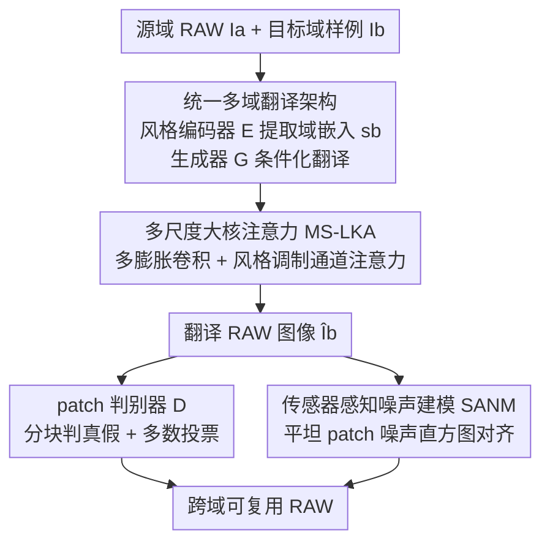

# MERIT: Multi-domain Efficient RAW Image Translation

**会议**: CVPR 2026  
**论文**: [CVF Open Access](https://openaccess.thecvf.com/content/CVPR2026/html/Huang_MERIT_Multi-domain_Efficient_RAW_Image_Translation_CVPR_2026_paper.html)  
**代码**: 有（论文称已开源，链接待确认）  
**领域**: 图像生成 / RAW 图像翻译 / 跨相机域适应  
**关键词**: RAW2RAW 翻译, 多域生成, 传感器噪声建模, 大核注意力, GAN

## 一句话总结
MERIT 是首个用单一模型完成多相机域 RAW-to-RAW 翻译的统一框架：靠风格嵌入条件化实现任意源域到任意目标域的转换，用传感器感知噪声建模损失显式对齐 Poisson-Gaussian 噪声统计，配合多尺度大核注意力增强 RAW 特征建模，并发布首个多域 RAW 基准 MDRAW，在画质（+5.56 dB PSNR）和可扩展性（训练迭代减少约 80%）上同时超过此前方法。

## 研究背景与动机
**领域现状**：RAW 数据因保留线性光信号、动态范围大，被越来越多下游视觉任务（超分、低光成像、检测、3D 重建等）采用。但不同相机传感器的光谱响应、噪声特性、色调行为差异巨大——同一场景被不同设备拍出的 RAW 在颜色、动态范围、噪声结构上都不一样（论文图 1a）。

**现有痛点**：要复用为某台相机训练好的下游模型，就得做 RAW-to-RAW（RAW2RAW）翻译把别的相机 RAW 映射过来。但此前方法（Rawformer、Xie et al. 等）只能学**一对一**映射：每个"源相机→目标相机"对都要单独训一个翻译模型。当现实中要支持 $n$ 台商用相机时，需要 $O(n^2)$ 量级的模型，参数量和训练成本随域数迅速膨胀（论文图 1e），完全不可扩展。

**核心矛盾**：跨相机域偏移的根源是图像形成物理过程中相机光谱响应 $R_c(\lambda)$ 的差异（成像方程 $I(x)=\int_\omega R_c(\lambda)S(x,\lambda)L(\lambda)d\lambda$），而其中很大一部分域特有变化来自**相机相关的噪声模式**。现有 GAN 方法只靠对抗训练隐式地学这些特性，往往无法准确复现目标域的噪声统计。

**本文目标**：(1) 用一个模型支持任意域对的多域 RAW2RAW 翻译；(2) 把噪声从隐式学习改成显式建模，提升翻译保真度；(3) 提供能标准化评测多域 RAW 翻译的数据集。

**切入角度**：作者观察到 RAW 域差异的"物理可建模性"——噪声服从 Poisson-Gaussian 模型，可以用统计量直接对齐；同时 RAW 的信号/噪声分布在不同空间尺度和传感器间变化，需要既看局部细节又看长程依赖的特征建模。

**核心 idea**：用风格嵌入条件化单生成器实现"一对多/多对多"翻译，把噪声建模从隐式变显式，再用多尺度大核注意力做域自适应的特征调制。

## 方法详解

### 整体框架
设 $X$、$Y$ 分别为 RAW 图像集合与 RAW 域集合。给定源域 $a$ 的图像 $I_a$，目标是训练单个生成器 $G$，能生成除源域外任意目标域 $b\in Y\setminus\{a\}$ 的对应 RAW 图像 $\hat I_b=G(I_a,s_b)$。整个框架由三个模块协同：可学习的**风格编码器** $E$ 从目标域样例提取域风格嵌入 $s_b=E(I_b)$；**生成器** $G$ 据风格嵌入翻译图像，其上采样路径嵌入多尺度大核注意力（MS-LKA）；**patch 判别器** $D$ 对图像分块判别真假并用多数投票出图级结论。损失侧由传感器感知噪声建模损失与一组对抗/循环一致性损失共同约束。

### 关键设计

**1. 统一多域翻译架构：单模型 + 风格嵌入打破一对一瓶颈**

此前方法每个相机对都要单训模型，根源在于翻译被绑死成两域间的固定映射。作者用风格编码器 $E$ 把"目标域是什么"编码成域特有、内容无关的风格嵌入 $s_b=E(I_b)$（同域任意图像应得到相似嵌入），再让生成器条件化生成 $\hat I_b=G(I_a,s_b)$，这样一个 $G$ 就能在任意域对间转换，去掉了"必须提供参考图"的约束。判别器 $D$ 采用 patch 级对抗：把图像切块、每块独立判真假，再对块级结果**多数投票**得到图级判定，从而既鼓励全局一致又保证局部真实。这套设计把模型数量从 $O(n^2)$ 降到 1，是可扩展性提升（约 80% 训练迭代、2× 更小）的根本来源。

**2. 多尺度大核注意力 MS-LKA：在不上昂贵自注意力的前提下做域自适应特征建模**

RAW 图像有空间相关的光照模式、传感器特有色调、信号相关噪声，既需要全局感受野又要保住局部结构。常规卷积抓不到长程依赖，而 Transformer 自注意力对高分辨率输入太贵。作者把大核注意力扩展为多尺度版本，放在 $G$ 的上采样路径：先用三路不同膨胀率的深度卷积并行抽取不同感受野的特征 $F_1,F_2,F_3$，拼接后用 $1\times1$ 卷积压回原维度得 $F_{concat}$；再做**风格调制通道注意力**——把风格嵌入 $s$ 过一个轻量 FFN 产生通道权重 $A_s\in\mathbb{R}^C$，逐通道相乘 $F_{out}=A_s\odot F_{concat}$。这让 $G$ 能按目标传感器风格动态强调相关通道，在几乎不增参数的前提下兼顾多尺度局部细节与长程依赖。

**3. 传感器感知噪声建模 SANM：把噪声从隐式学习变成显式统计对齐**

RAW2RAW 不像 sRGB 翻译那样"看起来真"就够，必须复现传感器相关的噪声统计才有物理可信度（尤其高 ISO/低光）。RAW 仍在线性光域，噪声可用 Poisson-Gaussian 模型近似：$\text{Var}(x)=\alpha\cdot z+\beta$（$\alpha$ 为信号相关散粒噪声、$\beta$ 为信号无关读出噪声）。作者要让翻译图像的"强度—方差"依赖关系与目标传感器一致。具体地，从图像取小的不重叠 patch、算每块的均值强度与基于中值绝对偏差的稳健方差估计；为保证方差反映传感器噪声而非纹理，用 **Sobel 梯度幅值**筛出平坦区（梯度低于某百分位阈值的 patch 才保留）。再按强度把 patch 分到固定宽度的强度 bin（如 $[0,1]$ 内 100 个 bin），求每 bin 平均方差，得到生成图的噪声直方图 $H_{fake}\in\mathbb{R}^{C\times B}$；目标域真实图预先按同流程算 $H_{real}$ 存成查找表。噪声损失对齐两者：$L_{noise}=\tfrac{1}{BC}\sum_{c=1}^{C}\sum_{b=1}^{B}|H_{fake}[c,b]-H_{real}[c,b]|\cdot\mathbb{1}_{valid}[c,b]$，其中 $\mathbb{1}_{valid}$ 屏蔽空 bin 防止退化梯度。该损失完全可微、对图像内容鲁棒、且有物理噪声模型支撑，让生成器学到的不只是外观风格还有统计噪声行为。

### 损失函数 / 训练策略
总损失为五项加权和：$L_{total}=\lambda_1 L_{noise}+\lambda_2 L^D_{adv}+\lambda_3 L^G_{adv}+\lambda_4 L_{cycle\text{-}L1}+\lambda_5 L_{cycle\text{-}SSIM}$。其中对抗损失 $L_{adv}$ 让 $D$ 区分真实/生成 RAW、$G$ 生成以假乱真的目标域图；风格重建损失 $L_{style}=\mathbb{E}\|E(I_b)-E(G(I_a,E(I_b)))\|_1$ 强制 $G$ 真正用上风格嵌入；循环一致性 $L_{cycle\text{-}L1}$ 保内容与布局不变；并额外引入**循环 SSIM 损失** $L_{cycle\text{-}SSIM}=\mathbb{E}[1-\text{SSIM}(I_a,G(G(I_a,E(I_b)),E(I_a)))]$——作者发现单靠像素级 L1 不足以保住 RAW 的纹理与细粒度传感器细节，SSIM 项补上结构/感知保真。训练用 Adam（$\beta_1=0.9,\beta_2=0.99$）、batch 8、固定学习率 $1\times10^{-4}$、200K 迭代，单张 NVIDIA H200，输入裁成 $256\times256$ patch。推理时按亮度相似度从训练集挑目标域参考图来抽风格嵌入（用四个 Bayer 通道的空间均值组成 4 维向量比对）。

## 实验关键数据

### 主实验
在公开 RAW-to-RAW mapping 数据集（Samsung Galaxy S9 / iPhone X，各 196 张无配对训练 + 115 张配对测试）上，对比非学习、半监督、无监督多种范式。MERIT 在无监督设定下取得 SOTA，6 个指标中 5 个最优。

| 方向 | 指标 | 本文 MERIT | 之前最好（无监督） | 提升 |
|------|------|------|----------|------|
| Samsung→iPhone | PSNR↑ | 35.29 | Rawformer 29.73 / Xie 29.73 ⚠️ | +5.56 dB |
| Samsung→iPhone | MAE↓ | 0.015 | Rawformer 0.023 | −0.008 |
| iPhone→Samsung | PSNR↑ | 31.90 | Rawformer 28.45 | +3.45 dB |
| iPhone→Samsung | MAE↓ | 0.021 | Rawformer 0.034 | −0.013 |

> ⚠️ 缓存中 Xie et al. 与 Rawformer 在不同方向的 PSNR 数值存在 OCR 串行，"之前最好"以 Rawformer（作者按相同设置重训）为准；半监督的 Afifi et al. 在 Samsung→iPhone 达 29.65/0.89 但需配对监督，MERIT 无需配对即超过它。

### 跨域可扩展性与 MDRAW 基准
作者发布首个多域 RAW 基准 **MDRAW**：5 台不同传感器相机（三星 S23 Ultra、华为 P30、iPhone 13 Pro、尼康 Z5、佳能 EOS Rebel T6），共 519 张无配对 + 285 张配对（57 组）RAW，并用扩展自 LoFTR 的跨域匹配管线抽取像素级对齐 patch 对做评测。下表为 MDRAW 上 MERIT 的部分成对翻译结果（格式 MAE / PSNR / SSIM / KL）：

| 源→目标 | MAE↓ | PSNR↑ | SSIM↑ | KL↓ |
|---------|------|-------|-------|-----|
| Samsung→Huawei | 0.026 | 30.77 | 0.77 | 1.53 |
| Samsung→iPhone | 0.026 | 31.15 | 0.78 | 1.46 |
| Samsung→Nikon | 0.036 | 29.11 | 0.75 | 1.64 |
| Huawei→iPhone | 0.033 | 29.20 | 0.77 | 2.38 |

在 20 个非对角域对上，单个 MERIT 模型即覆盖全部组合；相比为每对单训模型的范式，随域数增长其参数量与训练迭代显著更省（论文图 1e：约 80% 训练迭代缩减、2× 更小模型）。

### 关键发现
- **显式噪声建模是画质提升关键**：把噪声从对抗训练隐式学习改成 SANM 显式直方图对齐，使生成 RAW 在噪声敏感区（高 ISO/低光）更物理可信，是 +5.56 dB 的重要来源（⚠️ SANM 与 MS-LKA 的逐组件消融数值在补充材料，缓存正文未给全表）。
- **单模型多域是可扩展性来源**：模型数从 $O(n^2)$ 降到 1，随相机域数增加，MERIT 在参数量和训练成本上的优势越发明显。
- **无需配对监督仍超半监督**：MERIT 全程用无配对图训练，却超过需要配对监督的 Afifi et al.，说明风格条件化 + 物理噪声先验的组合很有效。

## 亮点与洞察
- **把"域差异"拆成可显式建模的物理量**：作者识别出跨相机域偏移很大一部分来自噪声模式，于是用 Poisson-Gaussian + 噪声直方图把它显式对齐——这种"先归因、再针对性建模"的思路比一股脑交给对抗损失更可控，可迁移到任何需要保真传感器特性的低层视觉任务。
- **用 Sobel 平坦区筛选解耦噪声与纹理**：估方差时只取梯度低的平坦 patch，巧妙避免纹理污染噪声统计，是个简单但实用的工程 trick。
- **风格嵌入条件化把 $O(n^2)$ 压成单模型**：这是从"模型即映射"转向"模型 + 域条件"的范式转变，对任何多域翻译问题都有借鉴意义。
- **MS-LKA 用多膨胀大核 + 风格调制替代自注意力**：在高分辨率 RAW 上兼顾长程依赖与效率，提供了一种比 Transformer 更省的域自适应特征建模方式。

## 局限与展望
- 噪声建模假设 Poisson-Gaussian 模型成立，对偏离该假设的传感器（如复杂非线性 ISP 前处理）是否仍准确，正文未深入讨论。
- 推理依赖"按亮度挑参考图"来抽风格嵌入，若目标域训练集缺少亮度匹配样本，风格嵌入质量可能下降。
- 缓存正文未给出 SANM、MS-LKA、循环 SSIM 等组件的完整消融表（在补充材料），各组件单独贡献难以从正文定量核对（⚠️）。
- MDRAW 规模仍偏小（519 无配对 + 285 配对），5 台相机的覆盖面对"任意商用相机"的泛化仍是开放问题。
- 改进方向：引入更通用/可学习的噪声模型替代固定 Poisson-Gaussian；用自动参考选择或域原型替代亮度匹配的参考图策略。

## 相关工作与启发
- **vs Rawformer / Xie et al.**：它们是为特定相机对设计的一对一 RAW2RAW 翻译，画质强但不可扩展；MERIT 用单模型多域 + 风格条件化，既在 5/6 指标上超过它们，又随域数增长大幅省参省训。
- **vs CycleGAN / UVCGAN / CUT**：通用图像翻译方法靠对抗/对比隐式学风格，对 RAW 的传感器噪声统计刻画不足；MERIT 加 SANM 显式对齐噪声直方图，保真度更高。
- **vs Afifi et al.（半监督）**：需要配对监督做域对齐；MERIT 无需配对即超过它，体现物理噪声先验 + 风格条件化的数据效率。

## 评分
- 新颖性: ⭐⭐⭐⭐ 首个统一多域 RAW2RAW + 显式噪声直方图建模，思路新颖
- 实验充分度: ⭐⭐⭐⭐ 公开集 + 自建 MDRAW 多域成对评测充分，但正文缺完整组件消融表
- 写作质量: ⭐⭐⭐⭐ 物理动机—方法—基准闭环清晰，公式与图示完整
- 价值: ⭐⭐⭐⭐⭐ 单模型多域 + 新基准 MDRAW，对跨相机 RAW 视觉的实用与生态价值高

<!-- RELATED:START -->

## 相关论文

- [\[CVPR 2026\] Decoupled Residual Denoising Diffusion Models for Unified and Data Efficient Image-to-Image Translation](decoupled_residual_denoising_diffusion_models_for_unified_and_data_efficient_ima.md)
- [\[CVPR 2026\] SynthRGB-T: Language-Vision Guided Image Translation for Diversity Synthesis](synthrgb-t_language-vision_guided_image_translation_for_diversity_synthesis.md)
- [\[CVPR 2026\] LaRP: Efficient Multi-View Inpainting with Latent Reprojection Priors](larp_efficient_multi-view_inpainting_with_latent_reprojection_priors.md)
- [\[CVPR 2026\] DBMSolver: A Training-free Diffusion Bridge Sampler for High-Quality Image-to-Image Translation](dbmsolver_a_training-free_diffusion_bridge_sampler_for_high-quality_image-to-ima.md)
- [\[CVPR 2026\] Scaling Multi-Identity Consistency for Image Customization via Multi-to-Multi Matching Paradigm](scaling_multi-identity_consistency_for_image_customization_via_multi-to-multi_ma.md)

<!-- RELATED:END -->
