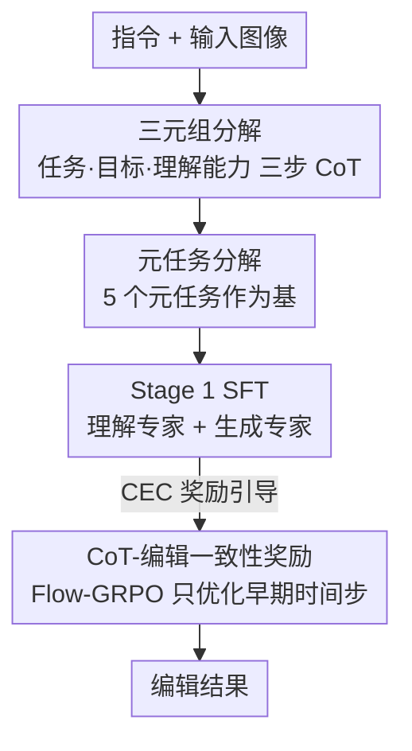

# Meta-CoT: Enhancing Granularity and Generalization in Image Editing

**会议**: CVPR 2026  
**论文**: [CVF Open Access](https://openaccess.thecvf.com/content/CVPR2026/html/Zhang_Meta-CoT_Enhancing_Granularity_and_Generalization_in_Image_Editing_CVPR_2026_paper.html)  
**代码**: 已开源（论文称 code/benchmark/model 已 release，具体地址待确认）  
**领域**: 图像生成 / 图像编辑 / 多模态推理  
**关键词**: 指令图像编辑、Chain-of-Thought、任务分解、元任务、强化学习对齐

## 一句话总结
针对统一多模态模型做指令图像编辑时「CoT 要么太泛、要么太专」的困境，Meta-CoT 把任意单图编辑显式拆成「(任务, 目标, 所需理解能力)」三元组、再把任务进一步拆成 5 个可组合的「元任务」基，并用一个「CoT-编辑一致性奖励」做 RL 对齐，在 21 类编辑基准上比同数据同参数的无-CoT 基线整体提升 15.8%，且只训练 5 个元任务就能泛化到大量未见编辑任务。

## 研究背景与动机

**领域现状**：以 Bagel、GoT 为代表的统一「理解 + 生成」多模态模型，开始在图像编辑里引入 Chain-of-Thought——先用文字推理出「要改什么、怎么改」，再驱动生成，借此激活模型的理解能力、提高指令遵循度。

**现有痛点**：现有编辑 CoT 走两个极端。一类太通用（如 Bagel 直接 think），推理空泛、激发不出细粒度理解；另一类太专门（如 GoT 往 CoT 里塞定位框等特定理解线索），在它擅长的任务上好，但换到风格迁移、视角变换这类任务就失灵——为某种理解形式量身定制的 CoT 不具备跨任务通用性。

**核心矛盾**：「理解粒度」和「跨任务泛化」之间存在张力。把 CoT 写得越具体（利于某类任务的粒度），越不通用；写得越通用，又激发不出足够的理解粒度。论文要回答的正是：**什么样的 CoT 形式 + 训练策略，能同时提升理解粒度和泛化能力？**

**本文目标**：① 设计一种结构化 CoT，让模型对「编辑什么任务、编辑哪个目标、需要哪种理解」都有细粒度推理；② 让训练不必覆盖所有任务类型也能泛化到未见任务；③ 解决 CoT 推理与最终编辑结果对不上的问题。

**切入角度**：作者观察到，任意单图编辑操作都能被一个三元组唯一刻画——`(任务 Task, 目标 Target, 所需理解能力 Understanding)`。例如「把小狗数量改成三只」= 任务「数量修改」+ 目标「小狗」+ 需要「定位 + 计数」能力。沿此再观察到：所有编辑任务都能由极少数「原子操作」组合而成，正如向量空间里的基。

**核心 idea**：用「三元组分解」把编辑指令拆成 task / target / understanding 三个可独立监督的元素以提升粒度，再用「元任务分解」把 task 进一步表示为 5 个基础元任务的组合以换取泛化，最后用一个 VLM 打分的一致性奖励把 CoT 推理和真实编辑结果对齐。

## 方法详解

### 整体框架
Meta-CoT 不改模型骨架（基于统一多模态模型 Bagel），改的是「CoT 的写法」和「训练/对齐的目标」。给定输入图像 + 编辑指令，第一层做 **三元组分解**——以三步 CoT（任务摘要 → 任务思考 → 目标遍历）把指令拆成 task 和 target，并在训练数据里混入多样视觉理解任务来补齐第三元素 understanding；第二层做 **元任务分解**——把「任务摘要」替换成「元任务摘要」，把每个任务表示成 5 个元任务（增/删/替换/相机运动/位置变化）的组合，从而只训练这几个元任务就能组合泛化到未见任务。两层分解先经 Stage 1 SFT 学会，再用 **CoT-编辑一致性（CEC）奖励** 在 Stage 2 用 Flow-GRPO 做 RL 对齐，把推理和编辑结果拉到一致。

### 关键设计

**1. 三元组分解：把「改什么任务 / 改哪个目标 / 要哪种理解」拆开学**

针对「CoT 粒度不足」这个痛点，论文先在理论上论证分解的合理性：设原始 CoT 空间为 $T$，三元组空间 $S_{\text{triplet}} = T_1 \times T_2 \times T_3$（任务/目标/理解），用 $H = \log|\text{space}|$ 表示空间复杂度（熵），证明 $H(T_1,T_2,T_3) = \log|S_{\text{triplet}}| < \log|T| = H(T)$，即分解降低了编辑复杂度；再用「每单位熵的互信息」$G = \frac{I(T; X_{\text{tgt}})}{H(T)}$ 定义理解粒度（$X_{\text{tgt}}$ 是目标图像），证明 $G(T_1,T_2,T_3) > G(T)$，即分解后的 CoT 比经典 CoT 粒度更高（⚠️ 完整推导在补充材料，此处以原文为准）。

落到 CoT 写法上，三元组分解展开成固定三步：**(1) 任务摘要**——从指令归纳出任务类型；**(2) 任务思考**——按任务类型生成专门的推理过程（如风格迁移就分析目标风格的视觉属性，相机运动就推断哪些物体会出现/消失，逻辑推理类编辑就推导指令隐含的操作）；**(3) 目标编辑模式遍历**——遍历图中所有目标，逐一判断「是否要改、怎么改」，从而保证空间和语义一致、给出细粒度可解释的编辑指引。第三元素 understanding 没法靠 CoT 文本直接学，因此训练时**混入多样视觉理解任务数据**（定位、计数、OCR、空间推理等），让模型在学编辑的同时补齐三元组里的理解能力。

**2. 元任务分解：把任务表示成 5 个原子操作的组合，换取跨任务泛化**

三元组解决了粒度，但要泛化还得解决「训练必须覆盖所有任务类型」的问题。作者观察到单图编辑里存在一组通用原子操作——**元任务（meta-task）**，类比向量空间的基：任意复杂编辑都能由它们组合张成。形式化地，称集合 $B=\{t_1,\dots,t_n\}$ 是任务空间 $T$ 的一组基，若 $\forall T\in\mathcal{T},\ \exists t_{i_1},\dots,t_{i_k}\in B$ 使 $T = t_{i_1}\circ t_{i_2}\circ\cdots\circ t_{i_k}$。实践中定义 **5 个元任务**（增加 / 删除 / 替换 / 相机运动 / 位置变化），三元组随之演化为 `(元任务, 目标, 所需理解)`，并把第一步「任务摘要」替换为「元任务摘要」，把指令拆成元任务的组合。例如「风格迁移」= 对目标的「风格属性」做一次 replacement；「数量修改」= add 与 remove 的组合。这样训练时不必逐一覆盖每种任务，**只训练这 5 个元任务**，模型就能用组合推理泛化到其余复杂编辑任务——这是 Meta-CoT 泛化性的来源。

**3. CoT-编辑一致性（CEC）奖励：用 RL 把「想的」和「做的」对齐**

作者发现一个常见 failure：尤其当指令没明说操作时，模型即便在 CoT 里推理对了，最终编辑也可能不按 CoT 执行，导致编辑错误。为此设计 **CEC 奖励**——用一个 VLM（Qwen2.5-VL）从「任务」和「目标」两个视角评估生成的编辑结果是否和 CoT 推理一致，给出 0–10 的分数。奖励上线前先做相关性校准：用 SFT 模型生成 500 个带 CoT 的编辑样本，4 名标注者打一致性分，迭代调整 VLM 的初始 prompt，直到 VLM 打分与人工标注的 Pearson 相关 $r\ge 0.8$、平均绝对误差 $\epsilon_{\text{MAE}}\le 2.5$ 才采用。然后用 **Flow-GRPO** 以 CEC 奖励优化模型，并且**只优化早期去噪时间步**（语义保真最关键的阶段），跳过后期更新——经验上这还顺带缓解了 Flow-GRPO 引入的噪声伪影。

### 损失函数 / 训练策略
两阶段训练：**Stage 1 SFT** 同时调理解专家和生成专家来学 CoT 推理与图像编辑，理解编码器也一起更新；在 1.5M「图像-指令-CoT」数据 + 100k 理解数据上训 10k 步（48 GPU）。**Stage 2 RL** 冻结理解编码器、只训生成专家，在额外 20K 编辑数据上用 Flow-GRPO + CEC 奖励训 500 步（32 GPU）。这样设计基于两个观察：SFT 后 CoT 已足够准确、应被保留；RL 阶段若同时训两个模块会优化不稳并破坏 SFT 学到的推理能力。数据构造管线为：Qwen2.5 按预定义规则判定任务类型 → Gemini-2.5-Flash 做任务类型与指令的一致性校验 → Qwen2.5-VL 依据源图/目标图/指令/任务类型生成（元）任务摘要、任务思考、目标遍历三段 Meta-CoT，并自检与真实编辑过程的对齐。

## 实验关键数据

### 主实验
评测基于自建 21 类编辑基准（11 类沿用 GEdit-Bench、4 类逻辑相关来自 RiseBench、多指令类来自 ComplexEdit、另加 5 个全新任务类别），用 VIEScore 的 Overall Score（衡量指令遵循、主体一致、自然度、伪影，0–10）并由 GPT-4.1 评分；另在 ImgEdit（9 类、734 真实样本）评测。

| 设置 | 21 类基准 Overall ↑ | ImgEdit Overall ↑ |
|------|---------------------|-------------------|
| Bagel（w/o think） | 5.673 | 3.20 |
| Bagel（w think） | 5.307 | 3.39 |
| Train Editing Only（同数据同参、无 Meta-CoT） | 5.538 | — |
| SFT(Meta-CoT) | 6.224 | — |
| **Meta-CoT + RL（本文）** | **6.415** | **3.83** |

相对同数据同参的 Train-Editing-Only 基线，整体提升 **15.8%**；相对 Bagel(no-think) 在 21 类提升 13.1%、ImgEdit 提升 19.7%；相对 Bagel(think) 分别为 20.1% 与 13.0%。逐任务看，除「文本编辑」外所有任务都提升（作者分析：大量文字推理反而干扰了对待改文本的识别），ImgEdit 上 ∆Over Base 在数量修改类高达 +25.9%、动作类 +17.2%。

### 消融实验

| 配置 | Ins.（指令遵循） | Con.（一致） | Nat.（自然） | Art.（伪影） | 说明 |
|------|------|------|------|------|------|
| Train Editing Only | 6.61 | 8.22 | 7.18 | 8.06 | 无 Meta-CoT 基线 |
| SFT(3 meta) | 6.75 | 8.33 | 7.15 | 7.86 | 仅 add/del/replace |
| SFT(5 meta) | 7.09 | 8.48 | 7.20 | 8.10 | 仅训 5 个元任务 |
| SFT(6 meta) | 7.13 | 8.51 | 7.22 | 8.07 | 增到 6 个元任务 |
| SFT(5 meta, full-task) | 7.20 | 8.49 | 7.23 | 8.12 | 5 元任务定义 + 全任务训练 |
| SFT(w/o task think) | 6.98 | 8.35 | 7.19 | 8.07 | 去掉「任务思考」步 |
| SFT(Meta-CoT) | 7.23 | 8.53 | 7.26 | 8.25 | 完整 SFT |
| **SFT + RL（本文）** | **7.44** | **8.53** | **7.31** | **8.34** | 加 CEC 奖励 |

### 关键发现
- **泛化是真的便宜**：只训 5 个元任务（SFT(5 meta) Ins=7.09）就已逼近 5 元任务定义 + 全任务训练（7.20），并显著超过 Train-Editing-Only（6.61）——印证「元任务作为基、组合即可泛化」的核心主张；元任务从 3→5→6 收益递减，5 个是性价比拐点。
- **CEC 奖励的增益集中在指令遵循**：RL 把 Ins. 从 7.23 拉到 7.44（VIEScore 四维里提升最大），说明对齐 CoT 与编辑结果主要改善了「按指令办事」而非画质。
- **「任务思考」步不可省**：去掉后 Ins. 从 7.23 跌到 6.98，验证逐任务专门推理这一步的贡献。

## 亮点与洞察
- **「编辑 = 三元组」+「任务 = 元任务组合」是两个很干净的抽象**：把模糊的「编辑意图」结构化成可分别监督的元素，并给出熵/互信息层面的理论论证（复杂度更低、粒度更高），让 CoT 设计从经验调 prompt 变成有依据的分解——这套「分解换粒度、基组合换泛化」的思路可迁移到视频编辑、3D 编辑等同样苦于任务种类爆炸的生成任务。
- **「只优化早期去噪时间步」是个实用 trick**：CEC 奖励衡量的是语义对齐，而语义在扩散早期最关键，因此把 Flow-GRPO 的更新限制在早期步，既对症又顺带压住了后期步引入的噪声伪影。
- **奖励上线前先做人机相关性校准**（$r\ge0.8$、$\epsilon_{\text{MAE}}\le2.5$ 才用）是负责任的做法，避免用一个没校准的 VLM 打分直接做 RL。

## 局限与展望
- **文本编辑反而变差**：这是唯一掉点的任务，作者归因于冗长文字推理干扰了对待改文本的识别——如何在保留推理的同时维持精确文本感知是 open problem。
- **强依赖外部大模型搭数据/奖励**：数据构造用到 Qwen2.5 / Gemini-2.5-Flash / Qwen2.5-VL，奖励用 Qwen2.5-VL，评测用 GPT-4.1；CEC 奖励质量上限被 VLM 的判别能力卡住，且这些「裁判」本身的偏差未被充分讨论。⚠️ 部分理论结论（复杂度/粒度不等式）依赖补充材料推导，正文只给结论。
- **「5 个元任务即够」是否对所有领域成立存疑**：元任务集是在单图编辑空间里人工总结的，换到更开放或专业的编辑域（如医学、CAD）未必仍构成完备基。

## 相关工作与启发
- **vs Bagel**：本文以 Bagel 为统一模型底座；Bagel 的 think 较通用、激发不出细粒度理解（21 类 Overall 仅 5.307，甚至低于 no-think 的 5.673），Meta-CoT 用结构化三步 CoT 把它提到 6.415，说明「会不会想」不如「按什么结构想」。
- **vs GoT 等定位增强 CoT**：GoT 把定位等特定理解线索塞进 CoT，在对应任务上强但跨任务差（如风格迁移、视角变换）；Meta-CoT 用元任务组合避免为单一理解形式量身定制，换来跨任务通用性。
- **vs 直接训全任务**：Train-Editing-Only 用相同数据相同参数但不走 Meta-CoT，整体落后 15.8%，证明增益来自 CoT 结构与训练策略而非数据/算力。

## 评分
- 新颖性: ⭐⭐⭐⭐ 「三元组分解 + 元任务基 + 一致性奖励」抽象干净且有理论支撑，但单图编辑里总结原子操作的思路并非首创
- 实验充分度: ⭐⭐⭐⭐ 自建 21 类基准 + ImgEdit，主实验/逐任务/元任务数量/VIEScore 四维消融都齐全；但严重依赖大模型裁判，缺人评主实验
- 写作质量: ⭐⭐⭐⭐ 动机—分解—对齐三段逻辑清晰，图表丰富；部分关键推导甩给补充材料
- 价值: ⭐⭐⭐⭐ 「只训少量元任务即泛化」对降低指令编辑数据成本很有现实意义，方法也较易迁移到其他生成域

<!-- RELATED:START -->

## 相关论文

- [\[ICML 2026\] Semantic Granularity Navigation in Image Editing](../../ICML2026/image_generation/semantic_granularity_navigation_in_image_editing.md)
- [\[AAAI 2026\] UNSEEN: Enhancing Dataset Pruning from a Generalization Perspective](../../AAAI2026/image_generation/unseen_enhancing_dataset_pruning_from_a_generalization_perspective.md)
- [\[CVPR 2026\] COT-FM: Cluster-wise Optimal Transport Flow Matching](cot-fm_cluster-wise_optimal_transport_flow_matching.md)
- [\[CVPR 2026\] ReasonEdit: Towards Reasoning-Enhanced Image Editing Models](reasonedit_towards_reasoning-enhanced_image_editing_models.md)
- [\[CVPR 2026\] EditMGT: Unleashing Potentials of Masked Generative Transformers in Image Editing](editmgt_unleashing_potentials_of_masked_generative_transformers_in_image_editing.md)

<!-- RELATED:END -->
