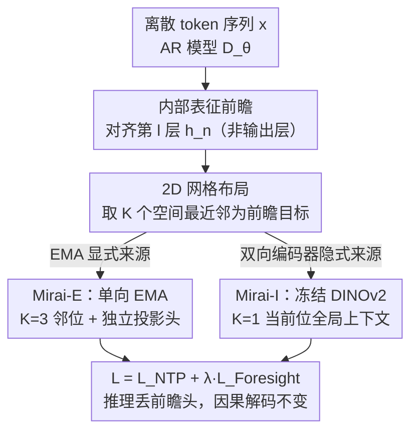

# Mirai: Autoregressive Visual Generation Needs Foresight

**会议**: CVPR 2026  
**论文**: [CVF Open Access](https://openaccess.thecvf.com/content/CVPR2026/html/Yu_Mirai_Autoregressive_Visual_Generation_Needs_Foresight_CVPR_2026_paper.html)  
**代码**: 有（项目页 https://y0uroy.github.io/Mirai ）  
**领域**: 图像生成 / 自回归生成 / 表征对齐  
**关键词**: 自回归视觉生成, 前瞻信号, 表征对齐, 2D 网格, 训练加速

## 一句话总结
自回归（AR）图像生成器逐 token 因果建模、只看"下一个 token"，导致全局结构容易错乱、收敛慢；本文提出 Mirai，在训练时额外引入"前瞻（foresight）"信号——把 AR 模型的中间层表征在 **2D 网格** 上对齐到未来 token 的表征（来自 EMA 的显式前瞻 Mirai-E，或来自冻结双向编码器 DINOv2 的隐式前瞻 Mirai-I），不改架构、不增推理开销，就把 LlamaGen-B 的收敛加速最多 10×、FID 从 5.34 降到 4.34。

## 研究背景与动机
**领域现状**：AR 视觉生成把图像按光栅顺序序列化成离散 token，用严格因果的"下一 token 预测（NTP）"逐步生成，建模联合分布 $p_\theta(x)=\prod_{n=1}^N p_\theta(x_n\mid x_{<n})$，训练目标是 NTP 损失 $\mathcal{L}_{\text{NTP}}=-\mathbb{E}\big[\tfrac1N\sum_n\log p_\theta(x_n\mid x_{<n})\big]$。LlamaGen 等证明了纯 GPT 式 AR 在足够规模下能逼近甚至超过扩散模型。

**现有痛点**：严格因果的"逐 token teacher forcing"在语言上很好用，但视觉 token 本质依赖**双向、长程**上下文。只看下一个 token 的局部监督，使得全局线索要经过很多 AR 步才能传播，生成结果"局部合理、全局错位"——论文图 1 里 baseline 生成的鹦鹉姿态扭曲、脑袋断开，火箭发射场景烟雾错位。

**核心矛盾**：推理时必须保持因果逐 token 解码（这是 AR 范式的根基，不能动），但训练时纯因果监督缺少"全局规划信号"，于是收敛慢、全局不连贯。语言里的多 token 预测（MTP）想做有限前瞻，但直接搬到视觉会引入梯度冲突反而变差。

**本文目标**：在**不改架构、不增推理开销**的前提下，给训练注入"未来信息"，让隐状态学会提前规划全局结构。拆成三个子问题——前瞻信号注入在哪一层？在 1D 扫描序还是 2D 网格上摆放？前瞻信号从哪来？

**切入角度**：作者沿"注入层级 / 前瞻布局 / 前瞻来源"三条轴做受控诊断实验，发现一个共同规律：**把前瞻对齐到 AR 的内部表征、并在 2D 网格上摆放，能强化因果建模**。

**核心 idea**：前瞻不是违反因果，而是学好因果的催化剂——用"内部表征 + 2D 网格对齐"的前瞻监督代替"输出层多 token 预测"，并提供 EMA（显式）与双向编码器（隐式）两种前瞻来源。

## 方法详解

### 整体框架
Mirai 是一个**训练时的辅助监督框架**，在原 NTP 损失之外加一项"前瞻对齐损失"，总损失 $\mathcal{L}_{\text{Mirai}}=\mathcal{L}_{\text{NTP}}+\lambda\,\mathcal{L}_{\text{Foresight}}$。给定 AR 模型在位置 $n$、第 $l$ 层的隐状态 $h_n=D_\theta^{[:l]}(x_{<n})$，前瞻编码器 $R$ 产出该位置的若干"未来目标表征" $f_n=\{f_n^{[k]}\}_{k=1}^K$，对齐损失把 $h_n$ 经轻量投影头 $\rho_k$ 投到同维后，最大化与 $f_n^{[k]}$ 的余弦相似度：

$$\mathcal{L}_{\text{Foresight}}=-\mathbb{E}\Big[\tfrac{1}{NK}\sum_{n=1}^{N}\sum_{k=1}^{K}\mathrm{sim}\big(f_n^{[k]},\,\rho_k(h_n)\big)\Big].$$

关键选择有三：注入在**中间层**（不是输出层）、未来位置按 **2D 网格最近邻** 选（不是 1D 扫描序）、前瞻来源是 EMA（Mirai-E，显式）或冻结双向编码器（Mirai-I，隐式）。推理时丢掉所有投影头与前瞻编码器，解码退回标准因果逐 token，计算量与 baseline 完全一致。

### 关键设计

**1. 内部表征级前瞻：避开输出层多 token 预测的梯度冲突**

痛点是"如何注入未来信息而不破坏 NTP"。最朴素的做法是把接下来 $K$ 个 token 当前瞻目标、在最后一层 $l=L$ 上做多 token 交叉熵预测——这其实就退化成语言里的 MTP。作者发现这样**反而低于 baseline**：同一个隐状态既要支持当前下一 token 预测、又要在离散 token 空间里预测多个更难的未来 token，产生"目标竞争"和有害的梯度干扰。Mirai 改为只用前瞻去**监督中间层表征**（$0<l<L$）：不让模型"吐出"未来 token，而是让其隐状态 $h_n$ 去**对齐**未来表征 $f_n$。这样既暴露了结构化的未来信息，又把对齐参数与 NTP 解耦，让主干安心做下一 token 预测。实验（Tab.1）显示同样 $K=3$，内部层 2D 对齐 FID 5.22，而输出层 1D 反而恶化到 7.28，baseline 是 6.36。

**2. 2D 网格布局：让前瞻尊重图像几何**

痛点是"未来 token 怎么选"。早期做法按光栅扫描序取接下来的 $K$ 个 token，即 1D 邻域 $\mathcal{N}^{1D}_K(n)=\{n,n+1,\dots,n+K-1\}$；但扫描序上相邻的 token 在图像上可能空间无关。作者改用 2D 策略：在图像网格坐标 $q_n$ 上取 $K$ 个空间最近邻 $\mathcal{N}^{2D}_K(n)=\arg\mathrm{topK}\big(-\lVert q_n-q_j\rVert_2\big)$。Tab.1 表明在各种 $K$ 下 2D 对齐都一致优于 1D（如 $K=3$ 内部层 2D 5.22 vs 1D 6.20）。直觉是：视觉 AR 里前瞻有没有用，不仅取决于"注入什么未来信息"，还取决于"它在 2D token 网格上摆在哪"；尊重 2D 空间结构能提供几何上更连贯的监督，鼓励模型在内部表征里维持一致的局部邻域（论文用 t-SNE 上色可视化证实 Mirai 的层 8 表征色场更平滑）。

**3. Mirai-E：来自单向 EMA 的显式前瞻**

这一支的前瞻编码器 $R_\phi$ 是 AR 解码器前 $l$ 层 $D_\theta^{[:l]}$ 的指数滑动平均（EMA，$\phi\leftarrow\tau\phi+(1-\tau)\theta$，$\tau=0.9999$，15 epoch warm-up 后启用）。因为 EMA 是**单向**架构，每个前瞻 token 都带有明确的位置含义（显式 lookahead），与因果解码兼容。作者给 2D 邻域里 $K$ 个未来位置各配一个独立投影头 $\rho_k$（按网格距离排序索引），把当前 $h_n$ 分别映射到第 $j$ 个未来目标的表征空间再联合对齐——独立头让监督"在空间上显式化"，每个隐状态对应到 $K$ 个具体编号的未来位置而非一个池化信号。$K=3$ 效果最好（在线 EMA 与 AR 联合更新，过多前瞻 token 会带来冲突梯度）；若改用预训练 LlamaGen-B 的静态 EMA，则 $K=9$ 才最好（静态监督需更多偏移来覆盖多样空间）。

**4. Mirai-I：来自冻结双向编码器的隐式前瞻**

这一支用预训练**双向**视觉编码器（默认 DINOv2-B）当 $R_\phi$，对完整图像 $X$ 提特征 $f_n=R_\phi(X)_n$。由于双向自注意力聚合了全图上下文，每个 token 的输出已经**隐式**编码了未来信息。AR 隐状态 $h_n$ 经一个轻量投影头 $\rho$ 对齐到**同位置**的前瞻特征 $f_n$（保持 $R_\phi$ 冻结）。作者用块因果掩码做诊断：逐渐限制编码器能看到的未来上下文（block size 变小），生成质量单调变差，恢复全双向才最好并超过 baseline——证明"隐式前瞻"确实是质量来源。这支里 $K=1$（只对齐当前位）最好：DINOv2 每个 token 已含足够前瞻，再引入额外未来位会干扰这个已学好的前瞻。

### 损失函数 / 训练策略
总损失 $\mathcal{L}_{\text{Mirai}}=\mathcal{L}_{\text{NTP}}+\lambda\mathcal{L}_{\text{Foresight}}$，对齐用余弦相似度。对齐层选 LlamaGen-B 的第 **8/12** 层（中间层语义最丰富、最通用，迁移到大模型时保持 8/12 的相对深度比）。系数 $\lambda$ 用**阶梯调度**最佳：从 2 在训练中点降到 1（早期强前瞻正则帮助建立全局结构，后期减弱以免过正则、让模型精修 token 预测）。优化器 AdamW、恒定学习率 $10^{-4}$、batch 256；推理用 CFG（LlamaGen-B 引导尺度 2.0）、温度 1.0。

## 实验关键数据

### 主实验（System-Level Comparison, ImageNet 256×256, 300 epochs）
| 模型 | 参数量 | FID↓ | sFID↓ | IS↑ |
|------|--------|------|-------|-----|
| LlamaGen-B | 111M | 5.34 | 6.93 | 215.7 |
| + Mirai-I | 111M | **4.34** | 7.13 | 226.8 |
| + Mirai-E | 111M | 4.49 | 6.78 | 225.7 |
| LlamaGen-L | 343M | 3.73 | 6.68 | 256.4 |
| + Mirai-I | 343M | **3.07** | 6.72 | 263.7 |
| LlamaGen-XL | 775M | 3.16 | 6.55 | 293.6 |
| + Mirai-I | 775M | **2.59** | 6.60 | 286.9 |

Mirai-I 在 XL 上达到 FID 2.59，优于所有 AR 类方法（VQGAN 15.78、ViT-VQGAN 4.17、RQTransformer 7.55）。

### 消融实验（注入层级 × 布局，LlamaGen-B, 80 epochs, Tab.1）
| 注入层 | 布局 | $K$ | FID↓ | IS↑ |
|--------|------|-----|------|-----|
| baseline | – | – | 6.36 | 185.54 |
| 输出层 | 1D | 3 | 7.28 | 163.31 |
| 输出层 | 2D | 3 | 6.48 | 185.57 |
| 内部层 | 1D | 3 | 6.20 | 176.36 |
| 内部层 | 2D | 3 | **5.22** | 197.14 |

### 关键发现
- **注入层级影响最大**：输出层 1D 前瞻（即朴素 MTP）反而比 baseline 差（7.28 vs 6.36），换成内部层 2D 直接降到 5.22——印证"目标竞争"假设，监督表征而非预测离散 token 是关键。
- **对齐层选中间层**：Tab.2 显示第 8 层最优（Mirai-I 4.77、Mirai-E 5.22），太浅是视觉基元、太深专做下一 token 预测；跨层对齐（8→6）效果最差。
- **前瞻 token 数因来源而异**：Mirai-I（双向）$K=1$ 最好，Mirai-E（在线 EMA）$K=3$ 最好，Mirai-E（预训练 EMA）$K=9$ 最好。
- **编码器选择**：Tab.4 中 DINOv2-B 最佳（FID 4.77, 80 epochs），DINOv3-B 5.02，MAE-B 仅 6.34（像素重建模型不适合做前瞻源）。
- **收敛大幅加速**：仅 40 epoch 的 Mirai-I 或 80 epoch 的 Mirai-E 就能匹敌 baseline 训练 400 epoch 的 FID，约 **10× / 5×** 加速。

## 亮点与洞察
- **"前瞻不是破坏因果，而是学好因果的催化剂"** 是全文最漂亮的洞察：训练时偷看未来、推理时严格因果，零额外推理开销就拿到全局规划能力。
- **三轴诊断方法论**（注入层级 / 1D vs 2D / 显式 vs 隐式）干净地把"该怎么注入前瞻"拆开逐一验证，结论可复用：表征级 + 2D + 合适来源。
- **2D 网格对齐**把"图像的二维几何"显式带进一维 AR 序列的训练监督，t-SNE 色场可视化直观证明内部表征更有空间组织，这个 trick 可迁移到任何光栅序 AR 视觉模型。
- **两种前瞻源各有适用**：自蒸馏 EMA（无需外部模型、显式位置）与冻结 DINOv2（强全局上下文、隐式），给不同算力/数据条件下的部署留了选择。

## 局限与展望
- **Mirai-I 依赖外部预训练编码器**（DINOv2），引入额外训练时开销与对编码器质量的依赖；编码器若与目标域不匹配（如 MAE）增益甚微。
- **仅在 ImageNet 类条件生成、LlamaGen 系列上验证**，未涉及文本到图像、更大词表/分辨率或非 LlamaGen 架构，泛化性待考。
- **超参敏感**：对齐层、$\lambda$ 调度、$K$ 都需按来源仔细调（Mirai-E 对 $\lambda$ 尤其敏感），迁移到新模型需重新搜索（作者用固定相对深度比 8/12 缓解）。
- **改进方向**：把 2D 前瞻推广到视频/3D token、探索可学习的前瞻编码器、或与 MTP 推理加速结合在保持质量的同时也加速采样。

## 相关工作与启发
- **vs MTP [13,24]**：MTP 在输出层预测多个未来 token，本文证明这在视觉 AR 上有害（梯度干扰）；Mirai 改为内部表征对齐，且前瞻显式二维化、位置索引化。
- **vs REPA [50]**：REPA 蒸馏当前图像的预训练语义特征、面向扩散/双向生成器；Mirai 的监督在时间与位置上都是因果的，专为严格 AR 设计。
- **vs LlamaGen [38]**：同一 AR 主干与设置，Mirai 只在训练加一项前瞻对齐，FID 全面下降（B: 5.34→4.34，XL: 3.16→2.59）且推理零额外成本。
- **vs 扩散/掩码 AR（DiT、MaskGIT、VAR）**：Mirai 保持纯因果 AR 范式不变，用训练时前瞻把 AR 推到 XL FID 2.59，缩小与扩散（DiT-XL 2.27）的差距。

## 评分
- 新颖性: ⭐⭐⭐⭐⭐ "训练时前瞻 + 2D 内部表征对齐"角度新颖，三轴诊断给出清晰可复用结论
- 实验充分度: ⭐⭐⭐⭐ 三种模型规模、丰富消融（层/布局/来源/编码器/λ），但局限于 ImageNet 类条件与 LlamaGen
- 写作质量: ⭐⭐⭐⭐ 动机—诊断—方法链条清晰，公式与可视化到位
- 价值: ⭐⭐⭐⭐⭐ 不改架构、零推理开销就 10× 加速并提质，对 AR 视觉生成实用价值高

<!-- RELATED:START -->

## 相关论文

- [\[CVPR 2026\] DPAR: Dynamic Patchification for Efficient Autoregressive Visual Generation](dpar_dynamic_patchification_for_efficient_autoregressive_visual_generation.md)
- [\[CVPR 2026\] Markovian Scale Prediction: A New Era of Visual Autoregressive Generation](markovian_scale_prediction_a_new_era_of_visual_autoregressive_generation.md)
- [\[CVPR 2026\] FVAR: Next-Focus Prediction for Visual Autoregressive Modeling](fvar_next-focus_prediction_for_visual_autoregressive_modeling.md)
- [\[CVPR 2026\] SparVAR: Exploring Sparsity in Visual Autoregressive Modeling for Training-Free Acceleration](sparvar_exploring_sparsity_in_visual_autoregressive_modeling_for_training-free_a.md)
- [\[ICCV 2025\] Randomized Autoregressive Visual Generation](../../ICCV2025/image_generation/randomized_autoregressive_visual_generation.md)

<!-- RELATED:END -->
