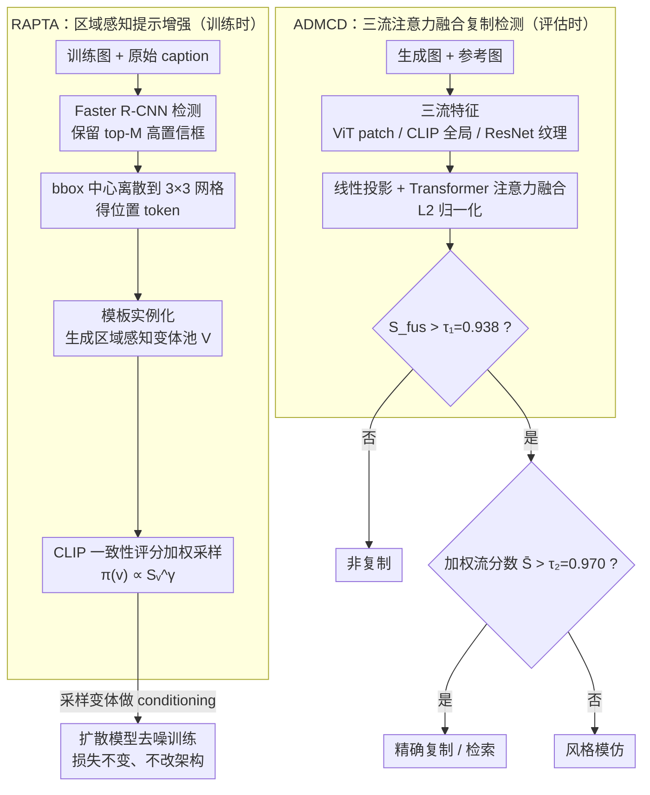

# Mitigating Memorization in Text-to-Image Diffusion via Region-Aware Prompt Augmentation and Multimodal Copy Detection

**会议**: CVPR 2026  
**arXiv**: [2603.13070](https://arxiv.org/abs/2603.13070)  
**代码**: 无  
**领域**:图像生成
**关键词**: 扩散模型记忆化, 训练时提示增强, 多模态复制检测, 版权保护, 注意力融合

## 一句话总结

提出训练时区域感知提示增强(RAPTA)和注意力驱动多模态复制检测(ADMCD)两个互补模块，前者通过目标检测器proposal生成语义接地的提示变体来缓解扩散模型训练数据记忆化，后者融合patch级/CLIP/纹理三流特征实现零训练复制检测与分类，在LAION-10k上将复制率从7.4降至2.6。

## 研究背景与动机

**领域现状**：文本到图像扩散模型（Stable Diffusion等）生成质量出色，但存在严重的训练数据记忆化问题——模型可能复制训练图像或在风格层面模仿训练样本，带来版权侵权和隐私泄露风险。

**现有痛点**：

1. 推理时扰动方法（随机token插入、BLIP改写、CLIP嵌入加噪声）可减少复制但损害提示-图像对齐质量，且不解决训练时记忆化根因
2. 单一检测指标（SSIM/LPIPS/CLIP余弦）各有偏向性——LPIPS偏纹理、ORB偏关键点、SSIM偏结构——无法区分精确复制和风格模仿
3. 缺乏针对扩散模型复制行为的大规模标注数据集来训练检测器

**核心矛盾**：大模型容量 + 强文本-图像对齐 + 对训练时caption-image对的过度依赖 → 记忆化是训练时问题，但现有缓解方案都在推理时做文章。

**本文目标** 训练时缓解记忆化 + 评估时可靠检测和分类复制行为的端到端方案。

**切入角度**：训练时用目标检测驱动的语义提示增强打破一对一caption依赖；推理时用多模态注意力融合做鲁棒复制检测。

**核心 idea**：用区域感知提示变体替代固定caption训练 + 三流注意力融合替代单一指标检测。

## 方法详解

### 整体框架

这篇把扩散模型记忆化当成一个「训练时种因、评估时结果」的完整链路来治，给出两个互不依赖的模块。RAPTA 作用在训练阶段：对每张训练图用 Faster R-CNN 检测显著区域、生成一池带位置信息的提示变体，经 CLIP 评分加权采样后拿去 conditioning 扩散模型，打破「一张图永远配同一句 caption」的强绑定。ADMCD 作用在推理/评估阶段：抽 ViT patch 特征、CLIP 全局特征、ResNet 纹理特征三路，经 Transformer 注意力融合后用双阈值判断是否复制、以及是精确复制还是风格模仿。

### 关键设计

**1. RAPTA：用区域感知的提示变体打破 caption-image 一对一依赖**

记忆化的训练时根因，是模型反复看到同一张图配同一句固定 caption、把这对映射死记下来。RAPTA 对每张训练图跑预训练 Faster R-CNN、保留 top-M 个高置信度（$S_i>\tau_b$）检测框，把每个 bbox 中心离散化到 $3\times3$ 网格得到位置 token（top-left、center、bottom-right 等，避免连续坐标的组合爆炸），再用一小套模板生成区域感知变体，如“p, with a ⟨c⟩ in the ⟨pos⟩”。变体池 $V = \{原始prompt\} \cup \{所有模板实例化结果\}$，按 CLIP 一致性评分 $S_v = \cos(f_I, f_v)$ 加权 $w_v = S_v^\gamma$ 归一化成采样分布 $\pi(v)$，每次迭代采一个变体 $\tilde p \sim \pi(\cdot)$ 做 conditioning——模型每次看到的描述都不同、但都语义一致。损失函数完全不变 $\mathcal{L}_{\text{diff}} = \mathbb{E}[\|\epsilon - \epsilon_\theta(x_t, t, e)\|^2]$，只是 $e$ 来自采样到的变体，所以不改架构、不加额外损失、开销极低。

**2. ADMCD：三流注意力融合替代单一相似度指标做鲁棒复制检测**

单一指标各有偏向——LPIPS 偏纹理、ORB 偏关键点、SSIM 偏结构——既分不清精确复制和风格模仿，也扛不住图像扰动。ADMCD 提取三流特征 $f_{\text{vis}}$（ViT patch 级）、$f_{\text{clip}}$（CLIP 全局语义）、$f_{\text{tex}}$（ResNet 纹理），线性投影到同维后过 Transformer 编码器注意力融合、L2 归一化得 $\hat{f}_{\text{fus}}$，再两阶段判定：先看融合相似度 $S_{\text{fus}} = \cos(\hat{f}_{\text{fus}}(G), \hat{f}_{\text{fus}}(R)) > \tau_1 = 0.938$ 判是否为复制（Copy）；是复制再算加权流分数 $\bar{S} = 0.24 \cdot S_{\text{vis}} + 0.38 \cdot S_{\text{clip}} + 0.38 \cdot S_{\text{tex}}$，$\bar{S} > \tau_2 = 0.970$ 判精确复制/检索（Exact Copy）、否则判风格模仿（Style Copy）。两个阈值和三流权重都靠验证集扫描确定，不用训练下游分类器，等于零训练部署。

正因三流互补，ADMCD 单拎出来还能当通用鲁棒相似度度量：在高斯噪声、模糊、椒盐、遮挡、旋转、翻转、裁剪等 10 种常见攻击下，它的融合相似度稳定在 0.748–0.974，而 LPIPS/ORB/SSIM 波动剧烈。稳的原因正是三路彼此兜底——LPIPS 对亮度敏感失灵时 CLIP 和纹理顶上，ORB 关键点稀疏时 patch 特征补上，没有哪一种退化能同时打垮三路。

### 损失函数 / 训练策略

RAPTA 不引入额外损失，仍用标准扩散去噪目标，唯一变化是 conditioning 来自采样变体。ADMCD 的阈值 $\tau_1=0.938$（F1 峰值）、$\tau_2=0.970$（5 名标注者一致验证）以及三流权重 $(0.24, 0.38, 0.38)$ 全部从验证集确定，不训练任何下游模块。

## 实验关键数据

### 主实验

| 方法 | Copy Rate↓ | FID↓ | CLIP Score↑ | KID↓ |
|------|-----------|------|------------|------|
| DCR | 3.2 | 7.9 | 30.5 | 2.9 |
| LDM-T2I | 5.3 | 10.4 | 33.2 | 3.1 |
| SD2.1-base | 7.4 | 8.3 | 27.8 | 3.3 |
| **RAPTA (Ours)** | **2.6** | 8.1 | 23.1 | **1.6** |

### 鲁棒性实验（噪声/几何攻击下的相似度稳定性）

| 方法 | 原始 | 高斯噪声 | 高斯模糊 | 泊松 | 椒盐 | 散斑 |
|------|------|---------|---------|------|------|------|
| LPIPS↓ | 0.233 | 0.444 | 0.335 | 0.375 | 0.612 | 0.569 |
| SSCD | 0.680 | 0.594 | 0.443 | 0.429 | 0.485 | 0.407 |
| DreamSim | 0.857 | 0.781 | 0.714 | 0.691 | 0.689 | 0.707 |
| **ADMCD** | **0.974** | **0.923** | **0.940** | **0.929** | **0.871** | **0.894** |

### 关键发现

- RAPTA将Copy Rate从7.4(SD2.1)降至2.6（-64.9%），同时KID从3.3降至1.6(-51.5%)
- CLIP Score从27.8降至23.1——缓解记忆化与文本对齐之间存在trade-off
- ADMCD在所有攻击类型下相似度最高且波动最小（0.871-0.974 vs DreamSim的0.689-0.857）
- Top-5检索中ADMCD给出的排名最清晰稳定——最相似邻居得分(0.959)远高于次相似(0.859)，而DreamSim差距小

## 亮点与洞察

- 训练时增强思路优雅：不改模型架构、不加额外损失，仅替换每次迭代的conditioning embedding，开销极低
- 三流注意力融合检测器具通用性——任何需要鲁棒图像相似度度量的场景均可借鉴
- 完全零训练检测器——不需标注数据训练分类器，只靠预训练特征+阈值即可部署
- 位置离散化到3×3网格是实用技巧——避免连续坐标的组合爆炸，同时提供足够的空间信息

## 局限与展望

- 评估集仅1200对且retrieve/exact仅约25对，规模偏小且不均衡
- LAION-10k上的复制率可能低估真实世界记忆化程度（作者自行承认）
- RAPTA依赖预训练检测器质量——检测器在某类图像上失效时无法生成有意义变体
- CLIP Score下降明显(27.8→23.1)，说明记忆化缓解与文本对齐存在固有矛盾
- 未探索不同检测器（DINO、GroundingDINO）或LLM生成模板的影响

## 相关工作与启发

- **vs 推理时扰动方法**：随机token插入、BLIP改写、嵌入噪声仅在推理时生效且损害质量；RAPTA从训练源头减少记忆化，通过CLIP评分保证语义一致性
- **vs DreamSim/SSCD**：DreamSim优化通用感知相似度而非复制检测；SSCD单流全局嵌入对局部差异不够敏感。ADMCD三流融合+注意力在鲁棒性和区分力上全面超越
- **vs GLIGEN/ControlNet grounding**：这些方法用对象/布局做条件控制但通用模板可能语义漂移；RAPTA的提示变体严格锚定在图像实际检测内容上
- 启发：三流融合检测思路可迁移到deepfake检测、图像水印验证等领域

## 评分

- 新颖性: ⭐⭐⭐⭐ 训练时区域感知提示增强+三流融合检测的组合较新颖，但各技术单独看并非全新
- 实验充分度: ⭐⭐⭐ 鲁棒性验证充分，但评估集规模小(仅25对精确复制)，缺少更多缓解方法的系统对比
- 写作质量: ⭐⭐⭐⭐ 结构清晰，方法描述详尽，图表设计规范
- 价值: ⭐⭐⭐⭐ 扩散模型记忆化是当前热点问题，ADMCD作为通用相似度度量具有广泛应用价值

<!-- RELATED:START -->

## 相关论文

- [\[CVPR 2026\] Verify Claimed Text-to-Image Models via Boundary-Aware Prompt Optimization](verify_claimed_text-to-image_models_via_boundary-aware_prompt_optimization.md)
- [\[CVPR 2026\] AutoDebias: An Automated Framework for Detecting and Mitigating Backdoor Biases in Text-to-Image Models](autodebias_automated_framework_for_debiasing_text-to-image_models.md)
- [\[CVPR 2026\] Gaussian Shannon: High-Precision Diffusion Model Watermarking Based on Communication](gaussian_shannon_high-precision_diffusion_model_watermarking_based_on_communicat.md)
- [\[CVPR 2026\] Neighbor-Aware Localized Concept Erasure in Text-to-Image Diffusion Models](neighbor-aware_localized_concept_erasure_in_text-to-image_diffusion_models.md)
- [\[CVPR 2026\] GlyphPrinter: Region-Grouped Direct Preference Optimization for Glyph-Accurate Visual Text Rendering](glyphprinter_region-grouped_direct_preference_optimization_for_glyph-accurate_vi.md)

<!-- RELATED:END -->
