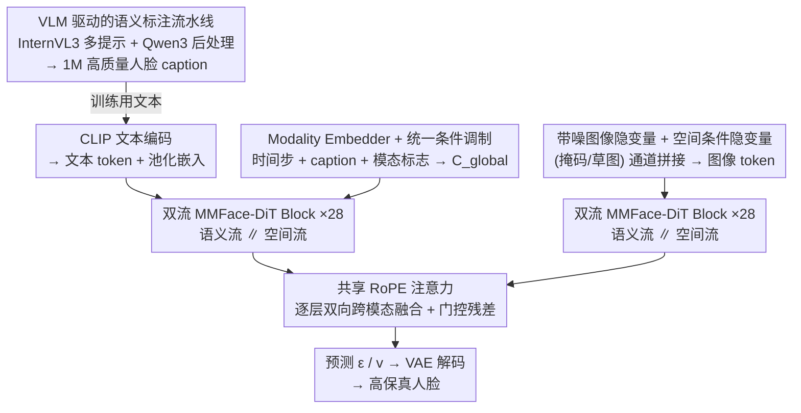

# MMFace-DiT: A Dual-Stream Diffusion Transformer for High-Fidelity Multimodal Face Generation

**会议**: CVPR 2026  
**论文**: [CVF Open Access](https://openaccess.thecvf.com/content/CVPR2026/html/Krishnamurthy_MMFace-DiT_A_Dual-Stream_Diffusion_Transformer_for_High-Fidelity_Multimodal_Face_Generation_CVPR_2026_paper.html)  
**代码**: 项目页 vcbsl/MMFace-DiT（论文称代码与数据集开源）  
**领域**: 扩散模型 / 多模态可控人脸生成  
**关键词**: 扩散 Transformer, 双流融合, RoPE 注意力, 多模态可控生成, 人脸合成

## 一句话总结
MMFace-DiT 用一个把"文本语义流"和"掩码/草图空间流"放在同一 Transformer 里**并行、对等处理**的双流 DiT，通过共享 RoPE 注意力做逐层深度融合，再配一个 Modality Embedder 让单个模型不重训就能切换掩码/草图条件，在文本+掩码、文本+草图两种可控人脸生成上相对 6 个 SOTA 把 FID 等指标整体拉高约 40%。

## 研究背景与动机
**领域现状**：可控人脸生成希望同时听从"高层语义意图（文本）"和"低层结构布局（分割掩码、草图、边缘图）"。当前主流做法是在预训练文生图扩散模型上**外挂**空间控制：要么像 ControlNet 那样给冻结主干加可训练旁路，要么用推理期组合框架把多个单模态生成器拼起来。

**现有痛点**：这些"打补丁"式设计有几个具体毛病。ControlNet 的主干被冻结，文本与空间特征无法**双向深度互调**；推理期组合框架（如 Unite-and-Conquer、Collaborative Diffusion）受限于最弱的那个子模型，还强行要求各模态隐空间维度对齐，一旦模态冲突（例如把"长发"提示套在男性掩码上）就会失败；GAN 路线（TediGAN、MM2Latent）的隐空间纠缠，画不好耳环、帽子这类细粒度配饰。

**核心矛盾**：所有这些范式都卡在**空间保真度与语义一致性的此消彼长**上——结构对齐做好了，文本/属性就跟不上；反过来也一样。一个模态太强会"压制"另一个模态（modal dominance）。再加上语义标注充分的人脸数据稀缺（CelebA-HQ 文本太浅、FFHQ 干脆没标注），进一步拖累多模态人脸生成。

**本文目标**：造一个**原生**统一、端到端的扩散 Transformer，让语义与空间条件不是主辅关系而是对等关系，并解决数据瓶颈。

**切入角度**：与其外挂控制模块，不如把空间 token 和文本 token 当成两条对等的流，在 DiT 的**每一层**都让它们通过同一套注意力深度互相"看见"。

**核心 idea**：用"双流 + 共享 RoPE 注意力"在每个 block 内做对称深度融合，避免模态压制；用一个轻量 Modality Embedder 把"当前是掩码还是草图"编码进全局条件，让单套权重动态适配不同空间模态。

## 方法详解

### 整体框架
MMFace-DiT 工作在 VAE 隐空间。前向时，把带噪图像隐变量 $z_t$ 与空间条件隐变量 $z_c=E_{vae}(c_{sp})$（掩码或草图）**沿通道拼接**后做 patch embedding，得到图像 token $T_i$；文本提示经 CLIP 编码出序列 token（投影成 $T_t$）和池化嵌入 $c_{pooled}$。一个全局条件向量 $C_{global}$ 把时间步、文本池化嵌入、以及 Modality Embedder 的输出加在一起，作为所有 block 的调制信号。token 流过 28 个双流 MMFace-DiT block（每个 block 内：AdaLN 调制 → 共享 RoPE 注意力融合 → 门控残差），最后预测噪声 $\epsilon$（DDPM）或速度 $v$（Rectified Flow），unpatchify 后由 VAE 解码出人脸。

### 关键设计

**1. 双流对等的 MMFace-DiT Block：把语义和空间当共同主角，杜绝模态压制**

针对"外挂控制 / 推理期组合导致一个模态压制另一个"的痛点，本文不再设主辅，而是让图像流 $T_i$ 和文本流 $T_t$ **并行**穿过同一个 block，且在每个 block 内持续融合。block 由三件套驱动：AdaLN 做细粒度条件调制、共享 RoPE 注意力做中央融合、门控残差动态平衡信息流。其中 AdaLN 用全局向量 $C_{global}$ 经线性层生成两条流各自独立的调制参数 $\{\gamma,\beta,\alpha\}$，让文本、时间步、当前激活的模态都能逐层、分流地施加控制。MLP 是扩展 4 倍隐维、中间夹 GeLU 的两层前馈。这样语义与空间在每一层都被对等地塑形，而不是结构信息一股脑盖过文本。

**2. 共享 RoPE 注意力：让每个图像 patch 与每个文本 token 双向互看**

这是融合的核心机制。两条流的 token 各自投影出 query/key/value 后**拼成统一张量** $Q=[Q_i;Q_t]$、$K=[K_i;K_t]$、$V=[V_i;V_t]$，再对拼接后的 $Q,K$ 施加旋转位置编码：图像 token 用 **2D 轴向 RoPE**（编码高、宽方向的空间关系），文本 token 用 **1D 序列 RoPE**，从而在同一次注意力里自然处理"2D 图像 patch + 1D 文本序列"的异构结构：

$$\mathrm{Attention}(Q,K,V)=\mathrm{softmax}\!\left(\frac{\mathrm{RoPE}(Q)\,\mathrm{RoPE}(K)^{\top}}{\sqrt{d_k}}\right)V$$

由于 $Q,K$ 是两条流拼起来的，softmax 后每个图像 patch 能 attend 到所有文本 token、反之亦然，形成密集的双向信息流——这正是 ControlNet 那种"冻结主干 + 旁路"做不到的深度对齐，也是空间保真与语义一致能同时上去的关键。

**3. Modality Embedder + 门控残差：单套权重动态切换掩码/草图，并防止强模态盖过弱信号**

针对"每种空间模态要单独训一个模型"的痛点，本文把全局条件写成

$$C_{global}=E_{time}(t)+E_{caption}(c_{pooled})+E_{modality}(m)$$

其中 $E_{modality}$ 是 Modality Embedder：把离散模态标志 $m$（如 0=掩码、1=草图）映射成 $\mathbb{R}^D$ 的稠密向量注入全局上下文，让**同一套权重**根据输入类型重配置处理方式，无需为掩码、草图各训一个模型。配合的门控残差则做信息流闸门：对某条流 $T_{in}$ 和 block 操作 $F(\cdot)$，更新为 $T_{out}=T_{in}+\alpha\odot F(\mathrm{AdaLN}(T_{in},\gamma,\beta))$，门控标量 $\alpha$ 同样来自 $C_{global}$，作为可学习的动态滤波器，按需放大或抑制某模态——这能防止"稠密草图"这种强几何先验把文本里细微的语义线索压没。

**4. VLM 驱动的语义标注流水线：补上语义充分的人脸文本数据**

为解决人脸数据语义标注稀缺，本文用 InternVL3 这个 VLM 给 FFHQ 和 CelebA-HQ 造大规模 caption：每张图用十条工程化提示（兼顾自然描述与结构化人口学线索），再做两段精炼——规则过滤去伪迹、Qwen3 语言模型后处理压制 VLM 幻觉并提升事实一致性，每条限 77 token，最终产出 1M 高质量 caption（10 万张图 × 每张 10 条）并开源。这条数据流不是锦上添花：没有它，模型就缺少把"金耳环、高发髻、灰白头发"这类细粒度文本对齐到像素的监督。

### 损失函数 / 训练策略
模型支持两种互补的扩散训练范式。其一是 **DDPM + Min-SNR 加权**：预测加到隐变量 $z_0$ 上的噪声，用 $w(t)=\min(\mathrm{SNR}(t),\lambda)/\mathrm{SNR}(t)$（$\lambda=5.0$）平衡不同噪声水平下的 MSE，加速收敛并改善高分辨率感知质量。其二是 **Rectified Flow Matching (RFM)**：把扩散看成学习噪声到数据之间的速度场，采样 $t\sim U[0,1]$、构造 $z_t=(1-t)x_0+tx_1$，模型预测常速度 $v=x_1-x_0$，免去方差调度、推理更快更稳。模型 13.45 亿参数、28 层、hidden 1152、16 头，吃 16 通道 FLUX VAE 的 32 通道隐输入；先在 $256^2$ 训 300 epoch、再在 $512^2$ 微调 50 epoch，靠 bfloat16、8-bit AdamW、全梯度检查点、预算 VAE 隐变量等省显存技巧，**仅用两张 RTX 5000 Ada** 就训完。

## 实验关键数据

### 主实验
在 CelebA-HQ + FFHQ 上训练，用 Segformer 生成掩码、U2Net 生成草图。指标含 FID、LPIPS、SSIM、掩码下的像素精度 ACC 与 mIoU、CLIP Score 与 CLIP Distance，以及 **LLM Score（用大模型评的语义一致性）**。Ours (D)=DDPM 变体，Ours (F)=流匹配变体。

文本+掩码（节选关键指标）：

| 方法 | FID ↓ | SSIM ↑ | mIoU ↑ | CLIP ↑ | LLM Sc. ↑ |
|------|-------|--------|--------|--------|-----------|
| TediGAN | 62.55 | 0.48 | 39.02 | 25.26 | 0.41 |
| ControlNet | 49.39 | 0.41 | 43.95 | 25.39 | 0.31 |
| UAC | 48.88 | 0.48 | 38.82 | 23.75 | 0.35 |
| DDGI | 50.88 | 0.49 | 36.02 | 24.29 | 0.39 |
| MM2Latent | 49.78 | 0.45 | 38.19 | 26.78 | 0.36 |
| **Ours (D)** | 27.95 | 0.51 | 49.16 | 31.69 | 0.60 |
| **Ours (F)** | **16.63** | **0.53** | **50.12** | 31.34 | **0.64** |

文本+草图（节选）：

| 方法 | FID ↓ | LPIPS ↓ | SSIM ↑ | CLIP ↑ | LLM Sc. ↑ |
|------|-------|---------|--------|--------|-----------|
| MM2Latent | 40.91 | 0.58 | 0.46 | 27.04 | 0.39 |
| ControlNet | 67.13 | 0.54 | 0.56 | 26.17 | 0.44 |
| DDGI | 56.57 | 0.43 | 0.51 | 23.95 | 0.43 |
| **Ours (D)** | 27.67 | 0.24 | 0.72 | 31.56 | 0.69 |
| **Ours (F)** | **9.14** | **0.20** | 0.70 | 31.30 | **0.72** |

掩码场景下流匹配变体把 FID 相对最强基线再降 40.5% 到 16.63；草图场景更夸张，Ours (F) 把 FID 压到 9.14（相对 Ours (D) 再降 66.9%）。两种条件下 CLIP、LLM Score 都明显领先，说明语义对齐没被空间结构牺牲。

### 消融实验
组件逐项叠加（文本+掩码，SD2 为基础 VAE，最后一步换 Flux）：

| 配置 | FID ↓ | CLIP ↑ | mIoU ↑ | 说明 |
|------|-------|--------|--------|------|
| Model-1 基线 DiT | 44.52 | 24.53 | 44.86 | 每种模态要单独训 |
| + Modality Embedder | 40.49 | 24.31 | 46.34 | 共享空间学习，FID−9.1% |
| + 双流设计 (DS) | 35.61 | 29.69 | 48.91 | CLIP +22.1%，语义/空间齐升 |
| + RoPE 注意力 | 33.77 | 31.42 | 50.05 | 最高 mIoU，融合更强 |
| + Flux VAE | 27.95 | 31.69 | 49.16 | FID 再降 17.2%，综合最佳 |

VAE 选型上还单独比了 SD2/SDXL/Qwen/SD3/Flux 五个冻结 VAE：SD3 的 FID 最低但高光过曝、不够真实；Flux 在草图上 LPIPS 最低（0.239），肤质与配色最自然、伪迹最少，因此选作主干。

### 关键发现
- 双流设计（DS）是语义对齐的最大功臣：仅加它 CLIP 从 24.53→29.69（+22.1%），印证"对等双流"确实缓解了模态压制。
- 空间指标（SSIM/ACC/mIoU）与语义指标（CLIP/LLM Sc.）在每一步消融里**同向上升**，说明本文没有用牺牲一方换另一方，而是真的同时改善。
- 流匹配（RFM）几乎总优于 DDPM 变体，尤其草图场景 FID 9.14 vs 27.67，差距悬殊——高分辨率人脸合成里 RFM 的稳定性优势被放大。

## 亮点与洞察
- **"对等双流 + 共享注意力"是反 ControlNet 的思路**：不冻结主干、不外挂旁路，而是让两模态在每层共享一次注意力，巧在用一次拼接 $Q/K/V$ 就实现了全 patch↔全 token 的双向融合，工程上比维护两套网络更省。
- **2D 轴向 RoPE 给图像、1D 序列 RoPE 给文本**：用位置编码的差异显式承认"图像是 2D、文本是 1D"的异构性，却仍塞进同一次注意力，这个 trick 可迁移到任何图文混合 token 的统一 Transformer。
- **把"是掩码还是草图"编码成一个标志位注入全局条件**，就让单模型动态换模态——这种"模态开关"思路对多条件可控生成（边缘/深度/法线…）很容易扩展。
- 数据侧用 VLM 多提示生成 + LLM 后处理压幻觉，是低成本补齐语义标注的实用范式。

## 局限与展望
- 论文承认细节大多塞进补充材料（超参、架构细节、数据收集流程），正文难以独立复现，部分实现细节需以原文/补充为准。⚠️
- 评测集中在 FFHQ/CelebA-HQ 正脸人像，对极端姿态、遮挡、群像或非人脸领域的泛化未验证。
- 训练虽号称"仅两张 RTX 5000 Ada"，但 13.45 亿参数 + 渐进式训练的总时长/碳成本未给出，"资源高效"更多体现在显存而非时间。
- LLM Score 作为语义一致性指标依赖打分模型本身，可能引入评测偏置；不同任务（掩码 vs 草图）的绝对数值不宜直接横比。

## 相关工作与启发
- **vs ControlNet**：ControlNet 给冻结 T2I 主干加可训练旁路实现空间控制，主干冻结导致语义-空间无法双向深融；MMFace-DiT 把主干本身做成双流、逐层共享注意力，融合更深，CLIP/mIoU 全面更高。
- **vs 推理期组合框架（UAC / Collaborative Diffusion）**：它们在推理时拼多个单模态生成器，受最弱子模型与隐空间维度对齐约束，模态冲突时崩；本文端到端单模型，靠门控残差化解模态冲突。
- **vs GAN 路线（TediGAN / MM2Latent）**：StyleGAN 隐空间纠缠画不好配饰；扩散 + 双流融合在耳环、发髻等细粒度属性上保真度明显更好。

## 评分
- 新颖性: ⭐⭐⭐⭐ 双流对等 + 共享 RoPE 注意力的人脸 DiT 设计清晰，但双流/RoPE/模态嵌入均为已有构件的巧妙组装。
- 实验充分度: ⭐⭐⭐⭐ 两种条件 + 6 基线 + 组件/VAE 双消融较扎实，惜缺姿态/泛化与时间成本分析。
- 写作质量: ⭐⭐⭐⭐ 动机和机制讲得明白，但关键细节大量外放补充材料。
- 价值: ⭐⭐⭐⭐ 为可控人脸生成提供了一个干净的端到端统一范式，并开源 1M caption 数据集。

<!-- RELATED:START -->

## 相关论文

- [\[CVPR 2026\] High-Fidelity Diffusion Face Swapping with ID-Constrained Facial Conditioning](high-fidelity_diffusion_face_swapping_with_id-constrained_facial_conditioning.md)
- [\[CVPR 2026\] DiT-IC: Aligned Diffusion Transformer for Efficient Image Compression](ditic_aligned_diffusion_transformer_for_efficient.md)
- [\[CVPR 2026\] Preserving Source Video Realism: High-Fidelity Face Swapping for Cinematic Quality](preserving_source_video_realism_high-fidelity_face_swapping_for_cinematic_qualit.md)
- [\[CVPR 2026\] DUO-VSR: Dual-Stream Distillation for One-Step Video Super-Resolution](duo-vsr_dual-stream_distillation_for_one-step_video_super-resolution.md)
- [\[CVPR 2026\] DiT360: High-Fidelity Panoramic Image Generation via Hybrid Training](dit360_high-fidelity_panoramic_image_generation_via_hybrid_training.md)

<!-- RELATED:END -->
