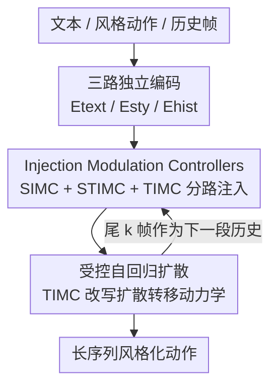

# MoCoDiff: A Controllable Autoregressive Diffusion Model for Expressive Motion Generation

**会议**: CVPR 2026  
**论文**: [CVF Open Access](https://openaccess.thecvf.com/content/CVPR2026/html/Song_MoCoDiff_A_Controllable_Autoregressive_Diffusion_Model_for_Expressive_Motion_Generation_CVPR_2026_paper.html)  
**代码**: https://github.com/Xuehan0530/MoCoDiff-code  
**领域**: 图像生成 / 人体动作生成 / 扩散模型  
**关键词**: 动作生成、风格化、自回归扩散、多条件解耦、长序列一致性

## 一句话总结
针对扩散式人体动作生成里「语义/风格/历史挤在一条条件通路里相互纠缠、导致长序列漂移和风格失控」的问题，MoCoDiff 用三个轻量的「注入调制控制器（IMC）」把文本、风格、历史分路注入冻结骨干，并用一个把历史当作「随时间步变化的纠偏信号、直接改写扩散转移动力学」的 Temporal IMC 驱动受控自回归扩散，在长序列风格化动作上同时拿到最高风格准确率、最低抖动和约 4.8×–一个数量级的推理加速。

## 研究背景与动机

**领域现状**：从文本/风格/场景等高层条件生成人体动作，是角色动画、具身智能、虚拟人的核心问题。近年扩散式方法借助强生成能力提升了动作真实度和多样性，并出现两条长序列路线：单次生成（如 MDM）和自回归分段生成。

**现有痛点**：① **融合式条件（fused-conditioning）**——多数方法把语义、风格、物理、时序信息塞进同一条条件通路，实现简单但异质信号不可避免地纠缠，导致可控性下降、长序列风格漂移、多条件同时满足时行为不一致。② **长时稳定性差**——单次生成模型难保全局一致；自回归框架则在段与段之间累积误差；即便近期自回归扩散把过去动作当上下文，也仍是融合式条件、对「历史如何影响去噪」没有显式控制，时序一致性弱。一句话：非自回归模型扩不到长序列，融合式自回归模型管不住去噪动力学，两者都受困于误差累积和长时漂移。

**核心矛盾**：根因在于**把「该如何调制去噪」和「往里塞什么条件特征」混为一谈**——融合式条件只是扰动特征统计量，从不显式控制历史/风格/语义各自如何作用于扩散转移过程，于是无法在采样时做真正基于反馈的控制。

**本文目标**：在单个模型里同时实现长时一致、细粒度风格控制、灵活多条件引导，且不必为新条件重训骨干。

**切入角度**：把多条件动作生成**重述为「通过条件专属注入机制做时序调制」的问题**——把语义、风格、时序拆成相互独立的调制通路，而不是合并成单一控制流；尤其把「历史」从一个普通输入条件，升级为直接改写扩散转移动力学的控制项。

**核心 idea**：用三路独立的轻量 IMC 解耦注入语义/风格/历史（即插即用、骨干冻结），并让 Temporal IMC 修改扩散转移函数本身，把自回归扩散变成一个带有限历史的「受控马尔可夫过程」，从而主动抑制漂移、强制段间平滑。

## 方法详解

### 整体框架
MoCoDiff 把「内容文本、风格动作、历史信息」三类条件分别编码，再通过 **Injection Modulation Controllers（IMC）** 分路注入冻结的扩散骨干；为生成长序列，用 **Controlled Autoregressive Diffusion** 把整段动作切成有重叠的 chunk 逐段生成，每段都用上一段尾部 $k$ 帧作为历史、经 Temporal IMC 对齐去噪轨迹来保持时序连贯。三个 IMC 分工明确：Semantic IMC（SIMC）给低频、内容对齐的全局轨迹调制；Style IMC（STIMC）注入高频、姿态级的风格残差（节奏、身体曲率、表现力）；Temporal IMC（TIMC）注入历史相关的纠偏信号、改写去噪转移。骨干全程冻结，所有控制器都是轻量可插拔。

### 关键设计

**1. 注入调制控制器 IMC：把语义/风格/历史拆成三条独立通路注入，而非拼成一个条件向量**

直击「融合式条件纠缠」这个根痛点。三类条件先各自独立编码：CLIP 文本编码器 $E_{\text{text}}$ 得语义特征 $F_T$；基于 MotionCLIP 的 $E_{\text{sty}}$ 从参考动作得风格特征 $F_S$；可学习历史编码器 $E_{\text{hist}}$ 把上一段最后 $k$ 帧聚合成紧凑时序状态 $F_H = \phi(W_h\, P(H_{1:k}) + b_h)$（$P(\cdot)$ 为时序池化、$\phi$ 为非线性激活）。IMC 实现为轻量线性 cross-attention（query–key–value 结构）：动作特征出 $Q$、条件特征出 $K,V$，投影前先做一个可学习 **LayerNorm**——作者强调这种「投影前归一化」而非「注意力后归一化」是多条件稳定融合的关键；并且 $Q$ 沿时序维、$K$ 沿条件维分别归一化以稳住线性注意力。三个 IMC 各管一种频段/作用：**SIMC** 低频全局轨迹、**STIMC** 高频姿态级风格残差、**TIMC** 历史纠偏。与只扰动特征统计量的常规条件（如 FiLM/AdaLN/ControlNet）不同，IMC 修改的是扩散转移函数本身，因而能跨时间步重塑去噪轨迹。最终残差式整合为

$$\hat{X}_t = X_t + O^{(t)}_{\text{sem}} + O^{(t)}_{\text{sty}} + M_{\text{hist}}\odot O^{(t)}_{\text{hist}},$$

其中掩码 $M_{\text{hist}}$ 抑制过时特征，只让近期帧参与时序纠偏，从而同时强制语义对齐、风格稳定与基于历史的时序一致。

**2. 受控自回归扩散：把历史当成改写扩散转移的控制项，让自回归变成「受控马尔可夫过程」**

针对「自回归段间误差累积、长时漂移」。与单纯把历史 append 进输入的做法不同，TIMC 注入一个历史相关控制项、直接改写逐步扩散转移：

$$x_{t-1} = f_\theta(x_t, t) + C_t(h_{t-1}),$$

$f_\theta$ 是标准去噪算子，$C_t$ 是由上一段终态 $h_{t-1}$ 导出的时变调制（实现上即 TIMC 的输出 $O^{(t)}_{\text{hist}}$）。这把原本「无记忆的马尔可夫链」变成「带有限历史的受控马尔可夫过程」，使采样时具备真正的反馈控制。长序列生成上，整段动作切成重叠 chunk $\{C_i\}$ 逐段扩散：第一段 $C_1 = D(T_1,S_1)$，之后 $C_i = D(T_i,S_i,F_H)$，历史 $h_i = \text{Tail}_k(C_{i-1})$ 取上一段尾 $k$ 帧、编码后经 TIMC 注入，对齐当前段与前段的运动动力学，从而抑制漂移、强制段间平滑。

**3. 渐进式 rollout 课程 + EMA 历史：缩小「教师强制训练」与「自回归推理」的鸿沟**

自回归模型训练若全程用真值历史（teacher forcing），推理时却要吃自己的预测，两者分布不一致会放大误差。借鉴 DART 的 scheduled rollout，按训练进度 $\tau/T$ 分三段：早期（$\tau\le 0.3T$）用真值历史学稳定的单段预测；中期（$0.3T<\tau\le 0.8T$）以概率 $p_{\text{rollout}}(\tau)=\frac{\tau-0.3T}{0.5T}\in[0,1]$ 渐进地用模型自生成历史替换真值；末期（$\tau>0.8T$）完全 rollout（$p_{\text{rollout}}=1$），让训练忠实模拟自回归推理。当用模型预测当历史时，历史缓冲用 **EMA 模型** 更新：$h^{(i+1)}=[\,h^{(i)},\hat{m}^{(i)}_{\text{EMA}}\,]_{-k:}$，把条件历史与快速变化的参数解耦，进一步抑制 chunk 间误差累积。

### 损失函数 / 训练策略
复合目标 $L = L_{\text{rec}} + \alpha L_{\text{smooth}} + \beta L_{\Delta}$：$L_{\text{rec}}$ 监督扩散预测的重建，$L_{\text{smooth}}$ 惩罚时序抖动，$L_{\Delta}$ 鼓励真实的运动动力学，$\alpha,\beta$ 为权重。训练数据用 HumanML3D + BABEL（文本-动作对，源自 AMASS/HumanAct12），并引入 100Style 仅作风格参考语料（提取风格嵌入、不作标注监督）。单张 RTX 3090、batch 64、训 8k 迭代、约 2 小时；评测时随机把 HumanML3D 文本与 100Style 动作配对生成风格化序列、用 60 帧 transition 段评平滑度。

## 实验关键数据

### 主实验
长序列风格化评测用 5 个指标：风格识别准确率 **SRA**（越高越好）、内容保真的 FID / R-Top-3 / Diversity、过渡平滑的 **PJ（Peak Jerk，局部不连续）** 与 **AUJ（Area Under the Jerk，整体平滑，越低越好）**。基线为公平起见都加了历史/风格特征并重训。

| 方法 | SRA ↑ | FID ↓ | R-Top-3 ↑ | PJ → | AUJ ↓ |
|------|------|------|-----------|------|-------|
| Real Motions | 100.00 | 0.00 | 0.768 | 0.04 | 0.08 |
| AutoMLD+SMooDi | 19.28 | **2.24** | 0.537 | 0.33 | 2.04 |
| ControlNet+FlowMDM | 9.01 | 3.93 | 0.552 | 0.45 | 1.89 |
| CAMDM | 11.82 | 5.48 | 0.315 | 0.71 | 1.99 |
| **MoCoDiff（本文）** | **26.37** | 5.95 | **0.564** | **0.27** | **1.58** |

MoCoDiff 在 SRA、R-Top-3、PJ、AUJ 上全是最优：风格准确率 26.37 大幅领先，抖动指标最低，证明受控自回归 + TIMC 有效抑制长时漂移；FID 5.95 虽不及 SMooDi 变体的 2.24，但后者风格准确率仅 19.28、是以牺牲风格换内容保真。另两张表佐证：单段动作生成 SRA 27.21 vs SMooDi 20.65；效率上 **136.89 FPS**、比最强基线（AutoMLD+MCM LDM）快约 4.8×、比扩散管线快一个数量级以上，单帧 7.31ms、单段 0.72s。长时稳定性上，本文跨长度波动 <5%，而 SMooDi+AutoMLD 超过 20%。

### 消融实验

| 配置 | FID ↓ | R-Top-3 ↑ | SRA ↑ | AUJ ↓ | 说明 |
|------|------|-----------|------|------|------|
| **Ours（完整）** | **5.95** | **0.564** | 26.37 | **1.58** | — |
| w/o ARDiffusion | 6.48 | 0.507 | 25.69 | 2.96 | 去自回归扩散：平滑度暴跌（AUJ 1.58→2.96） |
| w/o IMC | 7.50 | 0.431 | 15.38 | 2.48 | 改用拼接条件：风格准确率崩到 15.38 |
| w/o freezeUnet | 18.42 | 0.281 | 27.15 | 1.85 | 不冻结骨干：FID 飙到 18.42 |
| w/o Encoder-only | 16.56 | 0.273 | 29.46 | 1.79 | 在编码器外注入 IMC：真实度大降 |

风格强度 $\lambda$（CFG）消融：$\lambda=0.5$ 时 FID 最低（1.99）但 SRA 仅 7.82（风格几乎没出来），$\lambda=1.5$ 时 SRA 升到 32.15 但 FID 恶化到 12.84，最终取 $\lambda=1.0$（SRA 27.21、R-Top-3 0.581）求平衡。历史窗口长度呈 U 形权衡：窗口越长 SRA 越低（冗余/噪声时序削弱风格可控性），AUJ 在 5→10 帧下降、再变长又上升，**10 帧最佳**。

### 关键发现
- **IMC 是风格可控性的命门**：去掉 IMC 改用拼接条件后 SRA 从 26.37 崩到 15.38、FID 升到 7.50，直接坐实「融合式条件纠缠 → 风格失控」这一动机。
- **ARDiffusion 主要管平滑而非风格**：去掉它 SRA 只微降（26.37→25.69）但 AUJ 几乎翻倍（1.58→2.96），可视化里过渡明显不自然——说明受控自回归的价值集中在段间连贯。
- **冻结骨干 + 仅编码器注入都不可省**：不冻结骨干 FID 飙到 18.42、R-Top-3 跌到 0.281（ControlNet 式复制 U-Net 引入过强条件、强迫保留早期姿态而破坏过渡）；在编码器外注入则真实度/语义双降，编码器内调制才是可控性与训练稳定的最佳折中。

## 亮点与洞察
- **「历史 = 改写转移动力学的控制项」是最核心的视角转换**：把自回归扩散从「无记忆马尔可夫链」升级成「带有限历史的受控马尔可夫过程」（$x_{t-1}=f_\theta(x_t,t)+C_t(h_{t-1})$），让控制发生在转移函数层面而非仅扰动特征统计量，这也是它比 FiLM/AdaLN/ControlNet 类条件更能压住长时漂移的根本原因。
- **按频段/作用分工的三路 IMC** 是干净的解耦设计：低频语义轨迹（SIMC）+ 高频风格残差（STIMC）+ 历史纠偏（TIMC），即插即用、骨干冻结、推理期可调强度，可迁移到任何「多异质条件挤一条通路」的扩散任务。
- **效率惊人且来路清楚**：136.89 FPS、单段 0.72s，是「冻结骨干 + 轻量线性注意力 IMC + 分段自回归」共同促成，证明强可控不必以重训和慢推理为代价。
- **训练侧两个稳态 trick**：投影前 LayerNorm（而非注意力后）对多条件融合稳定性是关键；rollout 课程的历史用 EMA 模型而非当前参数，把条件历史和快速更新解耦以抑制累积误差。

## 局限与展望
- **超长自回归仍会累积误差**：作者自承很长 rollout 下误差仍会累积；固定大小的历史窗口（10 帧）限制了全局长程依赖建模。
- **冻结骨干换来了稳定但限制了表达力**：在罕见或带噪条件下，冻结骨干会约束生成质量；这是「不重训」便利的代价。
- **依赖参考动作提供风格、缺物理约束**：风格来自 100Style 参考语料，无显式接触/物理先验，长序列脚滑、穿插等物理合理性未被直接约束（作者把物理先验、分层/全局规划生成、非线性自适应 IMC、场景感知合成列为未来方向）。⚠️ 表中 PJ 一列为「越接近真值越好（→）」，本文 0.27 与真值 0.04 仍有差距，宜结合 AUJ 一起看。

## 相关工作与启发
- **vs SMooDi**：SMooDi 是强风格迁移基线（单段 SRA 20.65）；MoCoDiff 单段 27.21、长序列 26.37 且抖动远低，差异在于 SMooDi 仍属融合/单段范式，长时易现不连续与突变，而本文用受控自回归 + 历史纠偏专攻长程一致。
- **vs ControlNet 式条件注入**：消融里用 ControlNet（复制 U-Net 注入同样条件）替换 IMC，全指标下滑、SRA/AUJ 受损最重——因 ControlNet 条件过强，逼模型保留早期帧姿态、破坏自然过渡；IMC 的轻量分路注入 + 编码器内调制更稳。
- **vs DART 等流式自回归**：本文借用 DART 的 scheduled rollout 课程缓解误差累积，但进一步把历史升级为改写转移动力学的控制项（而非普通输入），并配 EMA 历史缓冲，定位上更强调「受控」而非单纯「流式」。

## 评分
- 新颖性: ⭐⭐⭐⭐ 「历史改写扩散转移动力学 + 三路解耦 IMC」视角新颖且自洽，但解耦条件、自回归分段等单点思路在动作生成里有前作
- 实验充分度: ⭐⭐⭐⭐ 长序列/单段/效率/风格强度/历史窗口/组件消融齐全，多基线公平重训；但风格语料较窄、缺大规模人评
- 写作质量: ⭐⭐⭐⭐ 动机—机制—消融对应清晰，公式与图示到位；个别记号（如 PJ 的「→」语义）需读者留心
- 价值: ⭐⭐⭐⭐⭐ 同时拿下风格保真、长时平滑与一个数量级加速，且即插即用不重训，对实时角色动画/虚拟人很有落地价值

<!-- RELATED:START -->

## 相关论文

- [\[CVPR 2026\] Causal Motion Diffusion Models for Autoregressive Motion Generation](causal_motion_diffusion_models_for_autoregressive_motion_generation.md)
- [\[CVPR 2026\] PhyCo: Learning Controllable Physical Priors for Generative Motion](phyco_learning_controllable_physical_priors_for_generative_motion.md)
- [\[CVPR 2026\] ExpPortrait: Expressive Portrait Generation via Personalized Representation](expportrait_expressive_portrait_generation_via_personalized_representation.md)
- [\[ECCV 2024\] MotionLCM: Real-time Controllable Motion Generation via Latent Consistency Model](../../ECCV2024/image_generation/motionlcm_real-time_controllable_motion_generation_via_latent_consistency_model.md)
- [\[ICCV 2025\] MotionStreamer: Streaming Motion Generation via Diffusion-based Autoregressive Model in Causal Latent Space](../../ICCV2025/image_generation/motionstreamer_streaming_motion_generation_via_diffusion-based_autoregressive_mo.md)

<!-- RELATED:END -->
