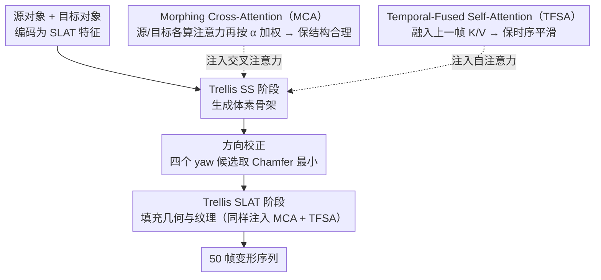

# MorphAny3D: Unleashing the Power of Structured Latent in 3D Morphing

**会议**: CVPR 2026  
**arXiv**: [2601.00204](https://arxiv.org/abs/2601.00204)  
**代码**: [https://xiaokunsun.github.io/MorphAny3D.github.io/](https://xiaokunsun.github.io/MorphAny3D.github.io/)  
**领域**: 图像生成 / 3D视觉  
**关键词**: 3D变形, SLAT, 注意力机制, 无训练, Trellis

## 一句话总结
提出 MorphAny3D，首个基于 Structured Latent（SLAT）表示的无训练 3D 变形框架，通过 Morphing Cross-Attention（MCA）融合源/目标信息保证结构合理、Temporal-Fused Self-Attention（TFSA）增强时序一致性、方向校正策略消除突变，在跨类别 3D 变形中实现了 SOTA 质量。

## 研究背景与动机

**领域现状**：3D 变形（morphing）是动画/影视/游戏的基础技术。传统方法依赖稠密对应关系匹配 + 插值生成中间形状。2D 变形依靠扩散模型已取得长足进步，但 3D 仍困难重重。

**现有痛点**：(a) 基于匹配的方法仅处理几何变形忽略纹理，且跨类别对应不可靠；(b) 2D 变形 + 逐帧 3D 重建破坏时序一致性；(c) 直接在噪声/条件空间插值缺少结构合理性约束。

**核心矛盾**：在 3D 生成器框架内实现平滑、高保真、时序一致的跨类别变形是开放难题。

**本文目标**：如何利用 SLAT 表示的结构化优势实现高质量 3D 变形？

**切入角度**：关键观察——在 Trellis 的注意力机制中直接融合源/目标的 SLAT 特征比在噪声/条件级别插值更能产生合理变形。但朴素 KV 融合在 CA 和 SA 中同时使用会互相干扰。

**核心 idea**：CA 中分别计算源/目标注意力后加权融合（MCA）+ SA 中融合前一帧特征（TFSA）+ 基于统计的方向校正。

## 方法详解

### 整体框架
MorphAny3D 想做的事很直接：给定源对象 $x^{src}$ 和目标对象 $x^{tgt}$，生成一段 $N=50$ 帧的平滑变形序列 $\{x^n\}_{n=0}^{N}$，由 $\alpha^n = n/N$ 线性控制从源到目标的过渡进度。它整个建在预训练的 Trellis Image-to-3D 生成器之上，不引入任何重训练——所有"变形"都发生在 Trellis 推理时的注意力层里。Trellis 内部把一个 3D 对象编码成 Structured Latent（SLAT），并经过两个阶段：先 Sparse Structure（SS）阶段定出体素骨架，再 SLAT 阶段填充几何与纹理细节。MorphAny3D 的做法是在这两个阶段的注意力计算里同时注入源和目标的特征，让生成器自己"插值"出结构合理的中间形态，最后再用一个方向校正环节抹平偶发的姿态突变。核心是把"在哪一层融合"拆开看：交叉注意力（CA）注入 Morphing Cross-Attention（MCA）保结构合理，自注意力（SA）注入 Temporal-Fused Self-Attention（TFSA）保时序平滑，二者各管一摊。

### 关键设计

**1. 把融合放在哪一层：先把 CA 和 SA 拆开看**

直接把源/目标的 SLAT 特征糊在一起喂给生成器并不可行，因为交叉注意力（CA）和自注意力（SA）对融合的反应完全相反。作者先做了一组诊断：在 CA 里融合源/目标的 K、V（KV-Fused CA）能显著拉高结构合理性，拿到最低的 FID，但会在局部留下畸变；在 SA 里融合（KV-Fused SA）则让序列更平滑，拿到最低的 PPL；可一旦两者同时上，合理性反而被破坏。这条观察决定了后面的整篇设计——CA 和 SA 不能用同一套融合策略，必须分头处理：CA 负责结构合理性，SA 负责时序平滑性，各管各的。

**2. Morphing Cross-Attention（MCA）：先各算各的注意力，再加权融合**

KV-Fused CA 之所以会留下局部畸变，是因为它在 patch 级别直接混合两组 DINOv2 条件特征，而源和目标的同一空间位置往往对应着语义不同的部位——比如源的头部 patch 可能被错误地拉去关注目标的背景区域，注意力图一旦语义错位，输出就畸形。MCA 的修法是不在 K/V 上做混合，而是让 query 分别对源条件和目标条件各算一次完整的注意力，再按进度 $\alpha^n$ 加权相加：

$$\text{MCA}(Q^n, K^{src/tgt}, V^{src/tgt}) = (1-\alpha^n)\,\text{Attn}(Q^n, K^{src}, V^{src}) + \alpha^n\,\text{Attn}(Q^n, K^{tgt}, V^{tgt})$$

这样每张注意力图内部的语义对应关系都是自洽的——源的注意力只在源条件里找匹配，目标的只在目标里找，融合发生在两个"各自正确"的输出之间，而不是在还没算注意力的原始特征上。作者用 t-SNE 把中间帧的特征轨迹画出来佐证：MCA 的轨迹稳定平滑地从源点滑向目标点，而 KV-Fused CA 的轨迹混乱、中途断裂。

**3. Temporal-Fused Self-Attention（TFSA）：在 SA 里融的是邻帧，不是终点**

平滑性该交给 SA，但不能照搬 KV-Fused SA 那套混合源/目标特征的做法——那等于把两个"终点"的信息硬塞进每一帧，容易损害合理性。TFSA 换了个融合对象：生成第 $n$ 帧时，把**上一帧**已经生成好的 K、V 融进当前自注意力，

$$\text{TFSA} = (1-\beta)\,\text{Attn}(Q^n, K^n, V^n) + \beta\,\text{Attn}(Q^n, K^{n-1}, V^{n-1}), \quad \beta=0.2$$

差别在于融的是什么：KV-Fused SA 融的是源和目标这两个固定端点，而 TFSA 融的是刚刚生成、已经被验证为合理的邻近中间帧。后者天然继承了相邻帧的连续性，既把序列压平滑，又不会把不属于当前进度的端点信息引进来，保真度更高。

**4. 方向校正策略：突变不是随机的，是 Trellis 的离散姿态先验**

变形过程中偶尔会出现一帧突然整体翻转的"姿态跳变"，看着很突兀。作者统计了 200 条序列，发现这种跳变规律得出奇：(a) 几乎都集中在中点 $\alpha\approx 0.5$ 附近；(b) 跳变方向几乎全是 yaw 轴的 90°、180°、270°；(c) 而 Trellis 单独生成物体时，输出方向本身就在这几个角度上聚集。结论是跳变并非噪声，而是 Trellis 学到的离散姿态先验在中点附近"二选一"时倒向了另一个朝向。既然成因是离散的，校正也就很省事：对 SS 阶段输出的体素 $P^n$ 生成四个 yaw 旋转候选 $\{P^n, P_{90°}^n, P_{180°}^n, P_{270°}^n\}$，挑与上一帧 $P^{n-1}$ Chamfer Distance 最小的那个。这个环节完全非侵入——没有跳变时，未旋转的原版本本身 CD 最小，会被自然选中，不影响正常帧。

## 实验关键数据

### 主实验

| 方法 | FID↓ | PPL↓ | PDV↓ | AS(%)↑ | UP(%)↑ |
|------|------|------|------|--------|--------|
| 3DInterp | 409.1 | 2.55 | 0.0006 | 1.0 | 0.6 |
| DiffMorpher→3D | 208.1 | 6.65 | 0.0021 | 5.0 | 0.8 |
| DirectInterp | 150.9 | 3.72 | 0.0039 | 2.0 | 5.5 |
| MorphFlow | 285.0 | 2.41 | 0.0009 | 0.0 | 1.6 |
| **MorphAny3D** | **112.0** | 2.47 | **0.0006** | **81.0** | **86.7** |

### 消融实验

| 方法 | FID↓ | PPL↓ | PDV↓ |
|------|------|------|------|
| KV-Fused CA | 125.5 | 3.82 | 0.0013 |
| MCA | 112.2 | 3.66 | 0.0010 |
| MCA + TFSA | 113.2 | 2.87 | 0.0007 |
| MCA + TFSA + OC | **112.0** | **2.47** | **0.0006** |

### 关键发现
- 用户偏好测试中 MorphAny3D 获得 86.7%，远超所有方法
- MCA 是合理性的关键（FID 从 125.5 降至 112.2）
- TFSA 是平滑性的关键（PPL 从 3.66 降至 2.87）
- 方向校正进一步压低 PPL 到 2.47（接近匹配类方法 2.41 的下界）
- 可直接迁移到 Hi3DGen 和 Text-to-3D Trellis，证明通用性

## 亮点与洞察
- **注意力输出后融合 vs KV 融合**是核心洞察：前者保持各自语义正确性。这个设计模式可迁移到所有需要多源条件融合的 attention 基生成模型
- **统计驱动的方向校正**：从数据统计推导出校正策略，简单有效且完全无副作用
- **解耦变形**：通过对 SS/SLAT 阶段选择性使用 MCA，可以将全局结构和局部细节的变形解耦，支持双目标变形和风格迁移

## 局限与展望
- 继承 Trellis 的精细结构生成局限
- yaw 对称物体的旋转校正可能失效
- 每帧 30s + 24GB 显存，运行时间较高

## 相关工作与启发
- **vs 3DMorpher**: 基于 3DGS，无法处理复杂几何且不兼容商业 3D 软件；MorphAny3D 基于 SLAT 更通用
- **vs DiffMorpher/FreeMorph**: 2D 先变形再逐帧升 3D，时序不一致；MorphAny3D 直接在 3D 生成框架内操作

## 评分
- 新颖性: ⭐⭐⭐⭐⭐ 首个 SLAT-based 无训练 3D 变形，注意力融合分析深刻
- 实验充分度: ⭐⭐⭐⭐ 定量+用户研究+消融+应用+迁移，非常全面
- 写作质量: ⭐⭐⭐⭐⭐ 分析从观察到验证到设计逻辑链条完整
- 价值: ⭐⭐⭐⭐ 在 3D 内容创作中有直接应用价值

<!-- RELATED:START -->

## 相关论文

- [\[ECCV 2024\] TextDiffuser-2: Unleashing the Power of Language Models for Text Rendering](../../ECCV2024/image_generation/textdiffuser-2_unleashing_the_power_of_language_models_for_text_rendering.md)
- [\[CVPR 2026\] Vinedresser3D: Agentic Text-guided 3D Editing](vinedresser3d_agentic_text-guided_3d_editing.md)
- [\[CVPR 2026\] LumiX: Structured and Coherent Text-to-Intrinsic Generation](lumix_structured_and_coherent_text-to-intrinsic_generation.md)
- [\[CVPR 2026\] EditMGT: Unleashing Potentials of Masked Generative Transformers in Image Editing](editmgt_unleashing_potentials_of_masked_generative_transformers_in_image_editing.md)
- [\[CVPR 2026\] SketchDeco: Training-Free Latent Composition for Precise Sketch Colourisation](sketchdeco_training-free_latent_composition_for_precise_sketch_colourisation.md)

<!-- RELATED:END -->
