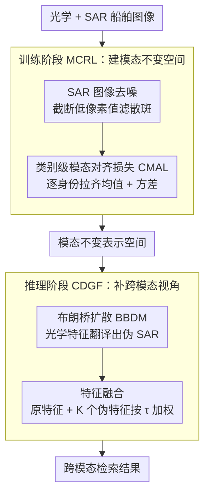

# MOS: Mitigating Optical-SAR Modality Gap for Cross-Modal Ship Re-Identification

**会议**: CVPR 2026  
**arXiv**: [2512.03404](https://arxiv.org/abs/2512.03404)  
**代码**: 即将发布  
**领域**: 图像生成 / 跨模态检索  
**关键词**: 跨模态ReID, 光学-SAR, 船舶识别, 扩散桥模型, 模态对齐

## 一句话总结
提出 MOS 框架解决光学-SAR 跨模态船舶重识别问题，包含两个核心模块：(1) MCRL 通过 SAR 图像去噪和类别级模态对齐损失在训练阶段缩小模态差距；(2) CDGF 利用布朗桥扩散模型在推理阶段从光学图像生成伪 SAR 样本并融合特征，在 HOSS ReID 数据集上 SAR→Optical 的 R1 提升 +16.4%。

## 研究背景与动机

**领域现状**：船舶 ReID 在海洋监控和管理中至关重要。SAR 传感器可全天候全天时成像但含严重散斑噪声。光学-SAR 跨模态 ReID 因模态差距大而极具挑战。仅有两项先驱工作（TransOSS、SMART-Ship）。

**现有痛点**：(a) 光学和 SAR 的成像机理完全不同，导致特征不对齐；(b) SAR 固有散斑噪声严重干扰特征提取；(c) 模型倾向于关注同模态匹配而忽视正确的跨模态匹配——模态差异主导了身份差异。

**核心矛盾**：模态差距和身份判别力之间的冲突——缩小模态差距的同时必须保持身份区分能力。

**本文目标**：从训练和推理两个阶段分别缩小光学-SAR 模态差距。

**切入角度**：观察到 SAR 噪声集中在低像素值区域，且模态分布对齐可分解为均值+方差两个独立分量。

**核心 idea**：训练阶段做 SAR 去噪 + 类别级 Wasserstein 对齐，推理阶段做扩散桥跨模态生成 + 特征融合。

## 方法详解

### 整体框架
MOS 想解决的是一个很具体的麻烦：光学相机和 SAR 雷达拍同一艘船，成像机理天差地别，模型一检索就被模态差异带跑、忘了去比身份。作者的对策是把"缩小模态差距"这件事拆到训练和推理两个阶段分头做。给定数据集 $\mathcal{D} = \{(I_i, y_i, m_i)\}$，每张图带身份标签 $y_i$ 和模态标记 $m_i \in \{opt, sar\}$。训练时走 MCRL 这条线：先把 SAR 图的散斑噪声清掉，再用一个类别级对齐损失把同一身份的光学/SAR 特征往一块拉，学出一个模态不变的表示空间。推理时走 CDGF 这条线：用一个扩散桥模型从光学特征"翻译"出伪 SAR 特征，再和原特征融合，相当于给每个查询补上"另一个模态看到的样子"。两条线一个在源头建共享空间、一个在末端补跨模态视角，互为补充。

### 关键设计

**1. SAR 图像去噪：先把散斑噪声从源头滤掉，别让它污染特征**

SAR 成像的散斑噪声会直接干扰特征提取，是模态差距之外的第二层噪声。作者做了一个反常识的观察——这些噪声并不是均匀铺在整张图上，而是集中在低像素值区域。于是处理方式简单到近乎粗暴：把一张图的所有像素值升序排列，直接截断最低的 $\alpha\%$（认定它们是噪声），剩下的像素再线性重归一化回 $[0,255]$：

$$\hat{p}_k = \frac{255(p_k - p_{min})}{p_{max} - p_{min} + \epsilon}$$

没有学习参数、没有额外网络，但因为它精准命中了噪声的分布位置，消融里这一步就能稳定带来增益。

**2. 类别级模态对齐损失 CMAL：按身份逐类把两个模态的分布拉齐，而不是笼统地对齐全局**

模态差距的本质是同一身份下光学特征和 SAR 特征的分布对不上。CMAL 不去做整体的域对齐，而是细到每个身份 $c$ 单独算：分别求出该身份光学和 SAR 特征的类中心 $\mu_{opt}^c, \mu_{sar}^c$ 与方差 $\text{var}_{opt}^c, \text{var}_{sar}^c$，然后同时压均值差和方差差：

$$\mathcal{L}_{CMAL} = \frac{1}{|C|}\sum_{c\in C}\left(\|\mu_{opt}^c - \mu_{sar}^c\|_2^2 + \|\text{var}_{opt}^c - \text{var}_{sar}^c\|_2^2\right)$$

这个写法不是拍脑袋拼出来的：在对角协方差近似下，它恰好是 Wasserstein-2 距离的一个可计算近似——均值项负责把两个模态的类中心拉到一起，方差项负责对齐类内的分散程度。相比直接算完整 $W_2$ 距离要做的矩阵平方根，这里退化成逐维的均值加方差，计算开销小得多却抓住了分布对齐的两个关键量。它和身份损失、三元组损失一起构成总训练目标：

$$\mathcal{L} = \lambda_{id}\mathcal{L}_{ID} + \lambda_{tri}\mathcal{L}_{Triplet} + \lambda_{cmal}\mathcal{L}_{CMAL}$$

**3. 跨模态生成与特征融合 CDGF：推理时直接造出"另一个模态的视角"再融进来**

光是在训练时对齐特征空间还不够——查询和库里只有单一模态时，跨模态匹配仍然吃亏。CDGF 的思路是干脆在推理阶段生成缺失的那个模态。作者训了一个布朗桥扩散模型（BBDM）专做这件翻译，它的前向过程是

$$q(x_t|x_0,y) = \mathcal{N}\!\left(x_t;\, (1-m_t)x_0 + m_t y,\; \delta_t I\right)$$

其中 $x_0$ 是 SAR 潜特征、$y$ 是光学特征。布朗桥的妙处在于它的两个端点是被钉死的——$t=0$ 对应 SAR、$t=1$ 对应光学，反向过程学着从光学端逐步去噪走回 SAR 端，天然就是一条"从一个模态到另一个模态"的路径，比 CycleGAN 这类无约束翻译更稳。推理时对一个光学查询生成 $K$ 个伪 SAR 特征，再把原光学特征和这 $K$ 个伪特征的均值按 $\tau$ 加权融合并归一化：

$$f_{fused}^i = \frac{(1-\tau)f_{opt}^i + \tau\left(\frac{1}{K}\sum_{k=1}^K f_{pseudo}^{i,k}\right)}{\left\|(1-\tau)f_{opt}^i + \tau\left(\frac{1}{K}\sum_{k=1}^K f_{pseudo}^{i,k}\right)\right\|_2}$$

融合后的特征同时带着"自己模态"和"对方模态"的信息，检索时就不再被单一模态的偏置主导。

### 损失函数 / 训练策略
- Backbone 用 ViT，沿用 TransOSS 基线；身份损失和三元组损失权重 $\lambda_{id} = \lambda_{tri} = 1$。
- BBDM 作为推理时的生成器单独训练，不与主干联合优化。

## 实验关键数据

### HOSS ReID 主实验

| 方法 | 类型 | ALL2ALL mAP/R1 | O→SAR mAP/R1 | SAR→O mAP/R1 |
|------|------|---------------|--------------|--------------|
| TransReID | 单模态ReID | 48.1/60.8 | 27.3/18.5 | 20.9/11.9 |
| DEEN | 跨模态ReID | 43.8/58.5 | 31.3/21.5 | 27.4/22.4 |
| VersReID | 跨模态ReID | 49.3/59.7 | 25.7/13.8 | 27.7/17.9 |
| TransOSS | 光学-SAR | 57.4/65.9 | 48.9/33.8 | 38.7/29.9 |
| **MOS (Ours)** | 光学-SAR | **60.4/68.8** | **51.4/40.0** | **48.7/46.3** |

### 各模块消融

| 配置 | ALL R1 | O→SAR R1 | SAR→O R1 | 说明 |
|------|--------|----------|----------|------|
| 基线 TransOSS | 65.9 | 33.8 | 29.9 | 无增强 |
| + SAR 去噪 | 66.5 | 35.4 | 32.8 | 去噪有效 |
| + CMAL | 67.6 | 38.5 | 40.3 | 模态对齐核心 |
| + CDGF | **68.8** | **40.0** | **46.3** | 生成融合进一步提升 |

### 关键发现
- SAR→Optical 方向提升最大（+16.4% R1），因为 CDGF 为光学查询生成伪 SAR 匹配
- CMAL 是训练阶段的核心：SAR→O R1 从 29.9 → 40.3
- CDGF 的推理增强再贡献 +6.0 分
- SAR 去噪虽然简单但效果一致——低像素截断对散斑噪声有效
- 对通用跨模态方法（CM-NAS、LbA 等）的优势说明光学-SAR 域需要专门方法

## 亮点与洞察
- **Wasserstein 对齐的对角近似**：将完整 $W_2$ 距离的矩阵平方根计算简化为逐维均值+方差对齐，计算高效且效果好，这个简化可迁移到任何跨域对齐场景
- **训练+推理双阶段协同**：MCRL 在训练时建立共享空间，CDGF 在推理时进一步桥接，两者互补
- **布朗桥扩散做跨模态翻译**：利用 BBDM 的端点条件特性自然适配跨模态映射

## 局限与展望
- HOSS 数据集规模较小，能否推广到大规模数据待验证
- 去噪策略过于简单（像素值截断），更先进的 SAR 去噪可能带来更大提升
- CDGF 推理开销：每个查询需要多次扩散采样
- 未讨论多尺度特征融合和困难样本挖掘

## 相关工作与启发
- **vs TransOSS**: MOS 在 TransOSS 基础上加入专门的模态对齐和跨模态生成模块
- **vs 人脸/行人 ReID 方法**: 通用跨模态方法在光学-SAR 域效果差，说明需要领域特定设计
- **vs GAN翻译方法**: BBDM 比 CycleGAN 等更稳定且生成多样化样本

## 评分
- 新颖性: ⭐⭐⭐ Wasserstein 近似和 BBDM 融合有创意，但各组件相对独立
- 实验充分度: ⭐⭐⭐⭐ 多协议评估+详细消融
- 写作质量: ⭐⭐⭐⭐ 理论推导和实验设计清晰
- 价值: ⭐⭐⭐ 领域较窄但在光学-SAR ReID 中有明确贡献

<!-- RELATED:START -->

## 相关论文

- [\[CVPR 2026\] Cross-Modal Emotion Transfer for Emotion Editing in Talking Face Video](cross-modal_emotion_transfer_for_emotion_editing_in_talking_face_video.md)
- [\[AAAI 2026\] Multi-Aspect Cross-modal Quantization for Generative Recommendation](../../AAAI2026/image_generation/multi-aspect_cross-modal_quantization_for_generative_recommendation.md)
- [\[ICLR 2026\] Uni-X: Mitigating Modality Conflict with a Two-End-Separated Architecture for Unified Multimodal Models](../../ICLR2026/image_generation/uni-x_mitigating_modality_conflict_with_a_two-end-separated_architecture_for_uni.md)
- [\[CVPR 2025\] Modeling Thousands of Human Annotators for Generalizable Text-to-Image Person Re-identification](../../CVPR2025/image_generation/modeling_thousands_of_human_annotators_for_generalizable_text-to-image_person_re.md)
- [\[ICCV 2025\] Rethinking Cross-Modal Interaction in Multimodal Diffusion Transformers](../../ICCV2025/image_generation/rethinking_cross-modal_interaction_in_multimodal_diffusion_transformers.md)

<!-- RELATED:END -->
