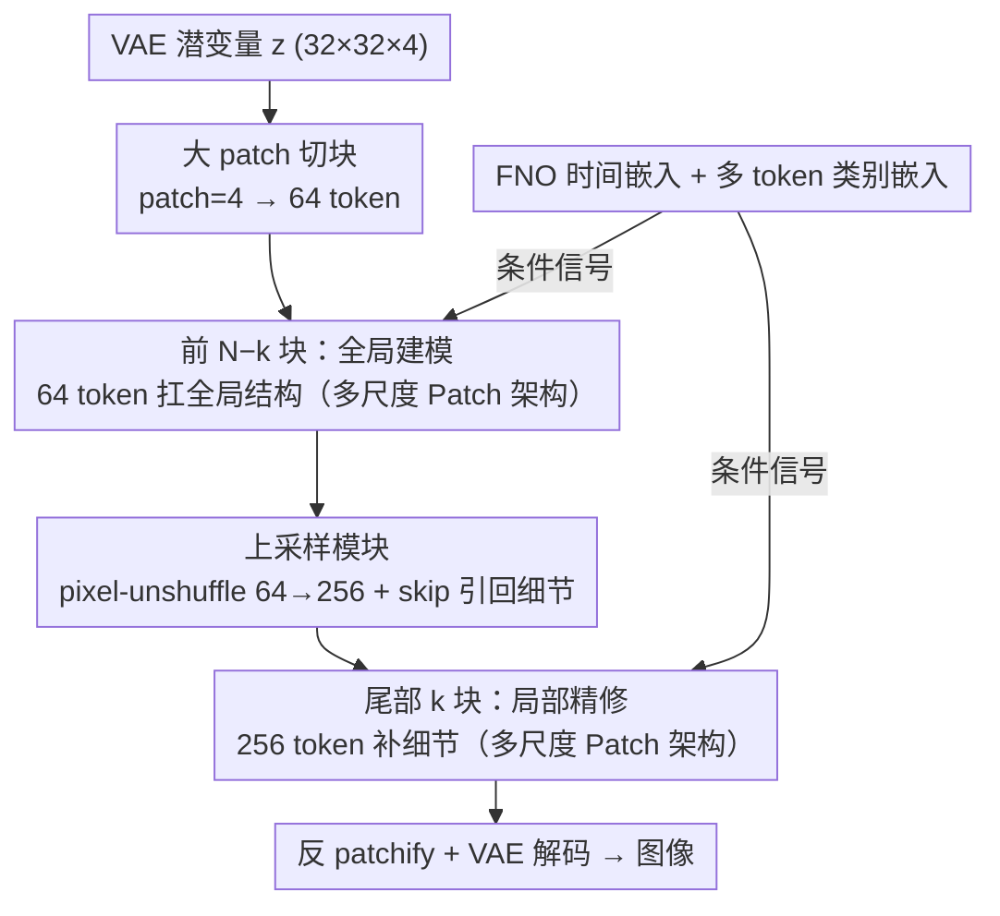

# MPDiT: Multi-Patch Global-to-Local Transformer Architecture for Efficient Flow Matching

**会议**: CVPR 2026  
**arXiv**: [2603.26357](https://arxiv.org/abs/2603.26357)  
**代码**: [https://github.com/quandao10/MPDiT](https://github.com/quandao10/MPDiT)  
**领域**: 扩散模型  
**关键词**: 扩散Transformer, 流匹配, 多尺度patch, 高效架构, 图像生成

## 一句话总结

提出 MPDiT，一个多尺度 patch 的全局到局部扩散 Transformer 架构，前期用大 patch（4×4）处理全局上下文仅需 64 个 token，后期上采样到小 patch（2×2）的 256 个 token 精修局部细节，将 GFLOPs 降低高达 50%，且 XL 模型在 240 epoch 即达到 FID 2.05（cfg）。

## 研究背景与动机

1. **领域现状**：扩散模型/流匹配模型已成为视觉生成的主流范式，Transformer 架构（DiT/SiT）由于出色的可扩展性逐渐取代 UNet 成为主流骨干。但 DiT 的等距设计在每层都处理相同数量的 patch token，计算成本很高。

2. **现有痛点**：训练效率是核心瓶颈。线性注意力（如 SANA、LIT）虽然减少了计算量但性能显著下降。Mamba/SSM 在扩散模型的 token 数量级（<1K）上优势不明显。MaskDiT 在高掩码率时性能急剧恶化（75%掩码率 FID≈100）。

3. **核心矛盾**：MaskDiT 的失败和 DiT-XL/4 的相对成功提供了关键观察——大 patch 的少量 token 虽然缺乏局部细节，但能有效捕获全局结构信息。而 MaskDiT 的随机掩码让每个训练样本只学到部分 token 之间的关系，全局和局部信息都建模不好。

4. **本文目标** 如何在保持生成质量的前提下显著降低扩散 Transformer 的计算量和训练成本？

5. **切入角度**：受全局-局部注意力的启发，但不是在注意力层级实现（效果不好且增益可忽略），而是在整个架构层级实现——前面的层看"粗粒度"全局，后面的层看"细粒度"局部。

6. **核心 idea**：将等距 DiT 改为"先粗后细"的层次化结构——多数 Transformer 块在大 patch（64 token）上高效获取全局语义，少量尾部块在小 patch（256 token）上精修局部细节。

## 方法详解

### 整体框架

MPDiT 想解决的问题很直接：标准 DiT 在每一层都处理同样多的 patch token，计算成本居高不下，但其实绝大部分计算并不需要那么细的粒度。它的做法是把等距的 DiT 改成「先粗后细」的层次结构。输入是 VAE 编码后的潜变量 $z \in \mathbb{R}^{32 \times 32 \times 4}$（ImageNet 256×256），标准 DiT 用 patch size=2 切成 256 个 token，MPDiT 则让前 $N-k$ 个 Transformer 块用 patch size=4 只处理 64 个 token，在低分辨率上把全局结构建模好；随后一个上采样模块把 64 个 token 展开成 256 个，交给最后 $k$ 个块精修局部细节；输出再经反向 patchify 和 VAE 解码成图像。换句话说，多数块在「缩略图」上跑，只有尾部少量块在「全图」上收尾。条件信号（时间步、类别）则通过 FNO 时间嵌入与多 token 类别嵌入注入到所有块。

### 关键设计

**1. 多尺度 Patch 架构：用大 patch 扛全局、小 patch 补细节**

整篇方法的出发点来自一个反差观察——MaskDiT 在 75% 掩码率下 FID≈100，几乎崩掉，而处理 token 数量相近的 DiT-XL/4 却能到 FID≈40。差别在于：随机掩码让每个样本只看到零散的局部关系，全局和局部都没学好；而大 patch 是一种**结构化**的降采样，token 虽少却完整覆盖整张图，能把全局语义建模得很扎实。MPDiT 顺着这个观察走：总共 $N$ 个 Transformer 块，前 $N-k$ 个接收 patch size=4 的 64 个 token。由于自注意力计算量正比于 token 数的平方，这部分开销只有标准 DiT 的 $\frac{1}{16}$；大 patch 唯一的短板是缺局部细节，而这恰好可以靠尾部少量精修块补回来（实验里 $k=4\sim6$ 就够）。因为绝大多数块只在 64 个 token 上跑，MPDiT-XL 的 GFLOPs 从 118.66 降到 59.30，直接砍掉一半。这套层次还能往上叠：面对 512² 这种更高分辨率，可以扩成三级 patch $\{8, 4, 2\}$。

**2. 上采样模块：把 64 个粗 token 干净地展开成 256 个细 token**

大 patch 跑完全局后，需要把 token 数从 64 拉回 256 才能精修，难点在于这次扩展不能破坏前面已经建好的条件关系。模块先把 image token 和 class token 分开，对 image token 做线性投影再用 pixel-unshuffle 实现 4× 空间展开（64→256），经 GELU 后与 class token 重新拼接，最后用 LayerNorm + 线性层把 class–image 的关系重新对齐。之所以要这一步对齐，是因为前面的块是在 64 个 token 的尺度上学到的 class–image 交互，token 数量一变两者就会错位，必须有个线性层来重建。另一个关键是一路 skip connection：它从原始 patch size=2 的嵌入直接加到上采样结果上，把大 patch 阶段丢掉的细粒度空间信息重新引回来。消融里这个设计的选择很敏感——线性投影（默认）FID=24.74，换成 ConvTranspose 直接掉到 29.45。

**3. FNO 时间嵌入 + 多 Token 类别嵌入：把条件信号喂得更足**

这两点都在解决「条件信号太单薄」的问题。FNO 时间嵌入针对传统正弦+MLP 表达力有限：它把标量时间步 $t$ 加到一个 32 点的 1D 均匀网格上构成一段 1D 信号，经线性层升到 32 通道，再过 3 个 MixedFNO 块（SpectralConv1D 与 Conv1D 混合）学习平滑的时间结构，最后全局平均池化 + 线性投影。这个设计借鉴 Neural Operator，与流匹配本身是 ODE/SDE 连续动态的直觉吻合，实测带来约 4 点 FID 提升（3 个 MixedFNO 块最优，2 个略差、4 个反而不稳）。多 Token 类别嵌入则针对单个 class token 信息过度压缩的问题：每个类别改用 $m=16$ 个可学习 token 表示，作为前缀拼到 image token 前，替代原来的 AdaIN 调制——更分布式的语义让收敛快了约 7 点 FID，而 $m=32$ 几乎不再有额外收益，说明 16 个 token 已基本编码完类别语义。

### 损失函数 / 训练策略

- 使用标准流匹配目标：$L_{FM} = \|f_\theta(z_t, t, c) - (n - z)\|_2^2$
- AdaIN 参数跨所有 Transformer 块共享（参数从 130M 降到约 90M，FID 仅上升 0.4）
- 训练设配：8×A100-40GB，固定学习率 $2 \times 10^{-4}$，batch size 1024，EMA 0.9999
- 采样使用 250 步 Euler 求解器

## 实验关键数据

### 主实验

| 模型 | Epochs | GFLOPs | FID↓ (non-cfg) | FID↓ (cfg) | IS↑ (cfg) |
|------|--------|--------|----------------|------------|-----------|
| DiT-XL/2 | 1400 | 118.66 | 9.62 | 2.27 | 278.24 |
| SiT-XL/2 | 1400 | 118.66 | 9.35 | 2.15 | 258.09 |
| DiG-XL/2 | 240 | 89.40 | 8.60 | 2.07 | 278.95 |
| DiCo-XL | 80 | 87.30 | 11.67 | - | - |
| **MPDiT-XL** | **240** | **59.30** | **7.36** | **2.05** | **278.73** |

### 消融实验

| 组件 | Params(M) | GFLOPs | FID↓ |
|------|-----------|--------|------|
| DiT-B/2 baseline | 130.0 | 23.0 | 34.84 |
| + Shared AdaIN | 90.3 | 22.9 | 35.31 |
| + Multi-token Class (m=16) | 101.9 | 24.3 | 28.56 |
| + FNO Time Embedding | 101.2 | 24.3 | 24.52 |
| + MPDiT (k=6) | 104.8 | 16.6 | **24.74** |

| k 值 (XL) | GFLOPs | FID↓ |
|-----------|--------|------|
| k=4 | 53.2 | 11.11 |
| k=6 (默认) | 59.3 | 9.92 |
| k=8 | 65.4 | 9.73 |

| Class Token 数 m | FID↓ |
|-------------------|------|
| m=1 | 32.31 |
| m=4 | 30.91 |
| m=8 | 28.12 |
| m=16 (默认) | 24.74 |
| m=32 | 24.47 |

### 关键发现

- **k=6 是最优平衡点**：仅 6 个精修块即可在效率和质量间取得最佳折中。k=4 太少导致 FID 明显上升（XL: 11.11 vs 9.92），k=8 改善极小但 GFLOPs 增加 10%
- **多 token 类别嵌入收益巨大**：从 m=1 到 m=16，FID 从 32.31 降到 24.74（降 7.5 点！），且 m=32 几乎不再有提升，说明 16 个 token 已充分编码类别语义
- **FNO 时间嵌入稳定提升 4 点 FID**：3 个 MixedFNO 块是最优（2 个略差，4 个反而不稳定）
- **上采样模块设计关键**：Linear+Linear（默认）FID=24.74 vs ConvTranspose=29.45，选对上采样方式影响很大
- **训练吞吐量翻倍**：MPDiT-XL 的采样速度是 DiT-XL/2 的 2 倍以上

## 亮点与洞察

- **"先粗后细"的架构设计**简洁而有效：与 MaskDiT 的失败对比特别有说服力——有结构的降采样（大patch）远优于随机的降采样（掩码）。这个洞察可以迁移到任何需要减少 token 数量的 Transformer 架构
- **FNO 时间嵌入**是一个有趣的尝试：用 Neural Operator 的思路来建模扩散过程中的连续时间动态，既新颖又有直觉上的合理性（流匹配本身就是 ODE/SDE 问题）
- **Shared AdaIN 的发现**有实用价值：直接共享时间/类别调制层可以减少 30% 参数、FID 仅上升 0.4，这在资源受限场景下非常实用

## 局限与展望

- 仅在 ImageNet 256×256 上验证，缺乏文本到图像或更高分辨率的实验
- 三级 patch 层次（用于 512²）只是提出了思路但没有实验验证
- 上采样模块的设计比较简单（线性投影），更复杂的设计可能进一步提升效果
- FNO 时间嵌入中维度 128 不稳定的原因未深入分析
- 与 REPA 等表示对齐方法的结合未探索，可能带来进一步加速

## 相关工作与启发

- **vs DiT/SiT**：标准等距设计，每层 256 tokens。MPDiT 通过分层 patch 将大部分计算压缩到 64 tokens，GFLOPs 减半但 FID 更优
- **vs MaskDiT**：同样是减少处理 token 数量的思路，但 MaskDiT 的随机掩码在高比例时严重失效（75% mask → FID≈100），而 MPDiT 的结构化降采样效果好得多
- **vs DiCo/DiC**：卷积重构的扩散模型，GFLOPs 相近但 MPDiT 在相同训练 epoch 下 FID 更优，说明 Transformer 在全局建模上仍有优势
- **vs SANA/LIT**：线性注意力方案需要从预训练全注意力模型初始化，MPDiT 可以从头训练

## 评分

- 新颖性: ⭐⭐⭐⭐ 多尺度 patch 的思路并非全新（灵感来自全局-局部注意力），但在扩散 Transformer 中的应用和效果验证有价值
- 实验充分度: ⭐⭐⭐⭐ ImageNet 上的消融非常详尽，但缺乏其他领域/分辨率的验证
- 写作质量: ⭐⭐⭐⭐ 动机推导清晰，与 MaskDiT 的对比分析有说服力
- 价值: ⭐⭐⭐⭐ 50% GFLOPs 减少且质量不降，对扩散模型训练效率有实际推动

<!-- RELATED:START -->

## 相关论文

- [\[CVPR 2026\] DDiT: Dynamic Patch Scheduling for Efficient Diffusion Transformers](ddit_dynamic_patch_scheduling_for_efficient_diffusion_transformers.md)
- [\[CVPR 2026\] Flow Matching for Multimodal Distributions](flow_matching_for_multimodal_distributions.md)
- [\[CVPR 2026\] Memory-Efficient Fine-Tuning Diffusion Transformers via Dynamic Patch Sampling and Block Skipping](memory-efficient_fine-tuning_diffusion_transformers_via_dynamic_patch_sampling_a.md)
- [\[CVPR 2026\] Spatiotemporal Pyramid Flow Matching for Climate Emulation](spatiotemporal_pyramid_flow_matching_for_climate_emulation.md)
- [\[CVPR 2026\] When Local Rules Create Global Order: Self-Organized Representation Learning for Latent Diffusion Models](when_local_rules_create_global_order_self-organized_representation_learning_for_.md)

<!-- RELATED:END -->
