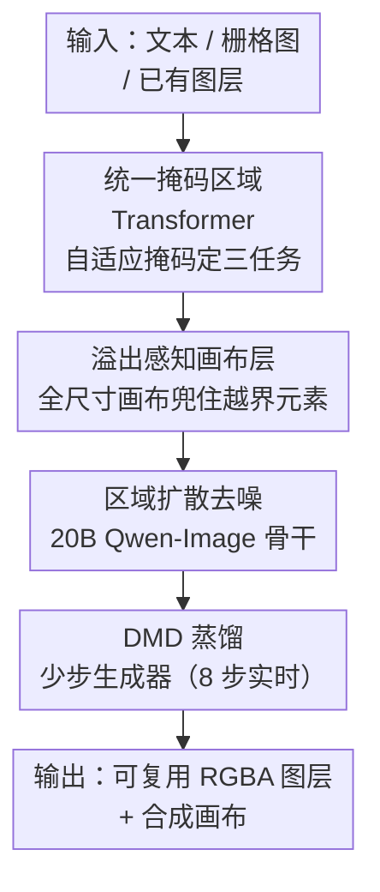

# MRT: Masked Region Transformer for Layered Image Generation and Editing at Scale

**会议**: CVPR 2026  
**arXiv**: [2605.27235](https://arxiv.org/abs/2605.27235)  
**代码**: 无（Canva Research，未公开）  
**领域**: 扩散模型 / 图像生成 / 分层图像编辑  
**关键词**: 分层图像生成、透明图层、掩码区域扩散、溢出图层、扩散蒸馏

## 一句话总结
MRT 把「文生图层 / 图生图层 / 图层生图层」三类分层图像任务统一进同一个 20B 掩码区域扩散 Transformer，靠「自适应掩码」决定每个图层从干净 latent 还是噪声出发，再用一个「溢出感知画布层」生成越过画布边界的完整可复用 RGBA 图层；在 10M 设计数据上训练后，分层质量全面超过 ART 与并发的 Qwen-Image-Layered，且推理快 $10\sim100\times$、激活显存省 $50\%\sim90\%$。

## 研究背景与动机
**领域现状**：文生图（text-to-image）这几年靠大规模扩散 Transformer、整流流匹配、分布匹配蒸馏已经做得非常好。但「分层图像生成」——即把视觉内容拆成一层层可单独复用、编辑、重组的透明 RGBA 图层（类似自然语言里按词编辑）——却严重落后，规模化探索几乎是空白。

**现有痛点**：作者把落后归因于两点。其一，缺少能和 LAION-5B 比肩的大规模高质量分层数据集；其二，现有分层方法（ART、PrismLayer 等）大多只在 LoRA 上微调、用不上最强开源文生图模型的先验。更要命的是一个被忽视的工程现实：现有方法只在「可见画布范围内」生成前景图层，凡是超出背景边界的元素（比如一个被画布裁掉一半的装饰图形）都会被截断、变成不可编辑的残片——而作者发现自家训练集里 **超过 60%** 的样本都含这种溢出图层。

**核心矛盾**：分层生成的三个子能力（从文本生成一套图层、把一张栅格图拆成图层、在已有图层上增删/重风格化）此前都是各做各的、各搭一套模型；而真正实用的分层编辑还要求每个图层「完整、可任意挪位、可复用」，这和「只在可见区域生成」的做法直接冲突。

**本文目标**：(1) 用一个统一框架同时吃下文生图层 / 图生图层 / 图层生图层三任务；(2) 让生成的图层即使越过画布边界也保持完整；(3) 把多步扩散压成实时少步。

**切入角度**：三个任务的差别本质上只是「哪些图层是已知条件、哪些要生成」。作者由此提出用一套「掩码」机制——把已知部分当作不加噪的干净 token（条件），只对要生成的图层加噪、加扩散监督——就能在同一个区域扩散 Transformer 里用切换掩码的方式覆盖全部三任务。

**核心 idea**：用「选择性 token 掩码 + 全尺寸溢出画布层」把分层生成/编辑统一成一个掩码区域扩散 Transformer，并蒸馏成 8 步实时生成器。

## 方法详解

### 整体框架
MRT 以开源最大文生图模型 Qwen-Image（约 20B、60 层、hidden 3584、24 头）为骨干，做全参微调。它把一张多层透明图像表示为 $\{\mathbf{I}_{\text{canvas}}, \mathbf{I}_{\text{bg}}, \{\mathbf{I}_{\text{fg}}^{i}\}_{i=1}^{K}\}$：一个全透明的全尺寸画布层、一个半透明 RGBA 背景层、$K$ 个前景层。所有层先按预定义版面合成到画布上，再用 WAN-2.1-VAE 编码器对各前景层的「区域裁剪」表示、背景层、合成全图分别编码，最后让一个 20B 区域扩散 Transformer 对这些 token 做联合全注意力。

三任务的统一靠「掩码」实现：把已知条件设为不加噪的干净掩码 token $\mathbf{z}_{\text{mask}}$，只对待生成图层 $\mathbf{z}_0$ 加噪并施加流匹配监督，掩码 token 与噪声 token 之间做全注意力，让模型自适应学到它们的关系。下游再用 DMD 蒸馏成 8 步实时生成器。整体流向如下：

### 关键设计

**1. 统一掩码区域 Transformer：用一套掩码切换吃下三类分层任务**

痛点是文生图层、图生图层、图层生图层此前各搭一套模型，既费资源又难共享先验。MRT 的观察是：三者差别只在「哪些图层已知、哪些要生成」。于是引入选择性掩码——已知内容设为不加噪的干净掩码 token $\mathbf{z}_{\text{mask}}$，只对目标图层 $\mathbf{z}_0$ 注入噪声并施加扩散监督。流匹配在 $t\in[0,1]$ 上沿直线插值 $\mathbf{z}_t=(1-t)\mathbf{z}_0+t\epsilon$，模型预测速度场 $\hat{\mathbf{v}}=f_\theta(\mathbf{z}_t,t,\mathbf{c})$，目标速度为 $\mathbf{z}_0-\epsilon$，损失 $\mathcal{L}_{\text{flow}}=\mathbb{E}\big[\|\mathbf{v}_t-f_\theta(\mathbf{z}_t,t,\mathbf{c})\|^2\big]$。三任务只是换掩码：

- **文生图层**：无已有图层，$\mathbf{z}_{\text{mask}}=\varnothing$，对 $[\mathbf{z}_{\text{composed}};\mathbf{z}_{\text{bg}};\{\mathbf{z}_{\text{fg}}^i\}]$ 全部加噪（含合成图 $\mathbf{z}_{\text{composed}}$ 以保图层一致性）。
- **图生图层**：把待分解的栅格图编码成 $\mathbf{z}_{\text{composed}}$ 设为干净掩码 token，只对 $[\mathbf{z}_{\text{bg}};\{\mathbf{z}_{\text{fg}}^i\}]$ 加噪，配合自动版面检测器或人工标注给出的图层区域，模型同时干「分割出各层 alpha」和「补全被遮挡区域」两件事。这里还配了**图层分组增强**：训练时随机把相邻/重叠图层合并成组，缓解图层粒度本身的歧义、提升对域外噪声版面的鲁棒。
- **图层生图层**：保留已有图层 latent 当掩码 token，只对要新增/重风格化的图层加噪。重风格化时还把参考外观 latent $\mathbf{z}_{\text{cond}}^i$ 作为额外条件 token 附上（也设为掩码、不作预测目标），并加一个可学习的「条件 token 嵌入」、复制对应原图层的 RoPE 位置编码，让条件 token 和目标图层共享空间位置线索。

它有效是因为：掩码把「条件 vs 生成」解耦成纯粹的注意力可见性问题，一套权重就能在推理时按任务自由配置，省去三套模型，还能让三任务在训练中互相借力

**2. 溢出感知画布层：让越过画布边界的图层也保持完整可复用**

痛点是此前方法只在可见画布区域生成前景，凡越界元素被截断成残片、无法复用；而作者数据里 60%+ 样本都有这种溢出元素。MRT 的解法是显式引入一个**全尺寸画布层** $\mathbf{I}_{\text{canvas}}$：它按构造完全透明、定义整张设计的最大尺寸，能容纳所有越界元素；区域扩散就在这个全尺寸画布上进行，把背景当成一个「特殊的透明前景层」处理，并对部分越过背景区域的图层做封装。

这样每个前景层都拿到「完整版」的像素（数据集里本就有 ground-truth 完整图层，故可监督），从而能在画布上任意重定位、复用，而不会在背景边界被裁。值得注意：图生图层推理时要求用户提供带溢出层的设计不现实，所以该任务退化为只用可见画布内像素的 latent——溢出能力主要服务文生图层与图层编辑

**3. DMD 蒸馏的少步实时生成器：把多步扩散压成 8 步**

20B 多步扩散直接推理太慢，难以实时交互。MRT 用改进版分布匹配蒸馏（DMD）把多步教师 $f_{\theta_T}$ 压成少步学生 $f_{\theta_S}$，目标是最小化教师/学生转移分布间的 KL 散度 $\mathcal{L}_{\mathrm{DMD}}=\mathbb{E}\big[D_{\mathrm{KL}}(f_{\theta_T}(\mathbf{z}_{t-1}|\mathbf{z}_t)\,\|\,f_{\theta_S}(\mathbf{z}_{t-1}|\mathbf{z}_t))\big]$。推理时学生用 $T_S\ll T_T$ 步近似教师的多步轨迹，配合 CacheDiT、低精度、多 GPU 序列并行，把约 20 层的 1K 图像分解压到 4×H100 下 $\sim3$ 秒、单卡 H100 $\sim6$ 秒，质量几乎无损

### 损失函数 / 训练策略
主目标是流匹配 MSE 损失 $\mathcal{L}_{\text{flow}}$（式 2），蒸馏阶段换成 DMD 的 KL 目标 $\mathcal{L}_{\mathrm{DMD}}$（式 3）。系统级训练分两阶段：先在 10M 全量数据上 $512\times512$ 训 $\sim$70k 步建立分层分解能力，再 $1024\times1024$ 训 $\sim$20k 步升分辨率，64×H200、全局 batch 1024、AdamW、学习率 $1\times10^{-4}$、全参微调（FSDP2）。消融用 0.5M 子集、512 分辨率、4000 步、8×H200。

## 实验关键数据

### 主实验
图生图层 vs 并发的 Qwen-Image-Layered（100 张域外创意设计测试集，按图层数分组，数值越高越好）：

| 指标 | 图层数 | MRT (本文) | Qwen-Image-Layered |
|------|--------|------------|--------------------|
| PSNR$_\text{merged}$ ↑ | [4,8) | **27.34** | 25.81 |
| PSNR$_\text{merged}$ ↑ | [8,16) | **25.91** | 23.06 |
| PSNR$_\text{merged}$ ↑ | [16,32) | **25.72** | 22.18 |
| SSIM$_\text{merged}$ ↑ | [4,8) | **0.9034** | 0.8706 |
| SSIM$_\text{merged}$ ↑ | [8,16) | **0.8762** | 0.8319 |
| SSIM$_\text{merged}$ ↑ | [16,32) | **0.8485** | 0.8065 |

人类盲评（图生图层，apple-to-apple）胜率：图层质量 **79.5%**、内容完整性 **68.9%**、分解粒度 **82.6%**。文生图层任务上用户研究也一致更偏好 MRT 而非 ART（指令遵循、整体美学、图层质量三项全胜）。

效率对比（Fig. 18，单卡 100 样本）：约 20 层时 MRT 维持近常数延迟（$\sim5$s），Qwen-Image-Layered 随层数线性增长，最高 **108.5×** 加速；峰值显存随层数从 **10.5× 降到 23.6×**；论文给出图生图层激活显存省 **50%$\sim$90%**、整体推理快 **10$\sim$100×**。

### 消融实验

模型 & 数据规模（文生图层 FID，0.5M 子集）：

| 配置 | FID$_\text{merged}$ ↓ | 说明 |
|------|----------------------|------|
| FLUX.1 [dev] (13B) | 17.79 | 小模型 |
| Qwen-Image (20B) | 16.15 | 仅扩模型 −1.64 |
| Qwen-Image (20B) + 10M 数据 | **15.63** | 再扩数据 −0.52 |

多任务联合训练（Table 3，不同任务混合比）：

| 配置 | 任务混比 | FID$_\text{merged}$ ↓ | PSNR$_\text{merged}$ ↑ | SSIM$_\text{merged}$ ↑ |
|------|----------|----------------------|------------------------|------------------------|
| T2L | 100/0/0 | 16.15 | 22.75 | 0.8711 |
| T2L+I2L | 80/20/0 | **15.68** | **23.06** | **0.8924** |
| T2L+I2L+L2L | 70/15/15 | 17.06 | 21.97 | 0.8606 |

文本条件（Table 4，I2L）：加文本条件后 PSNR$_\text{merged}$ 21.27→21.65、PSNR$_\text{layer}$ 26.03→27.24。图层合并增强（Table 5）：加增强后 PSNR$_\text{merged}$ 21.65→21.97、SSIM$_\text{merged}$ 0.8805→0.8864（但 PSNR$_\text{layer}$ 略降 27.24→26.96）。溢出数据消融（Table 2）：加溢出数据后 PSNR$_\text{merged}$ 21.81→22.75、SSIM 0.8543→0.8711，但 FID 反而 15.68→16.15 略升 ⚠️（论文未深究该 FID 回退，以原文为准）。

### 关键发现
- **模型容量和数据规模都重要**：FLUX 13B→Qwen 20B 让 FID 降 1.64，再把数据扩到 10M 又降 0.52，二者都是质量的必要条件。
- **加图生图层任务反而提升整体**：T2L+I2L 在 FID 和 SSIM 上都优于纯 T2L，说明分解任务能反哺生成；但三任务全开（含 L2L）质量指标回退，作者仍保留它是为了换取图层编辑能力。
- **越界质量随图层数差距拉大**：图层越多（[16,32)），MRT 对 Qwen-Image-Layered 的领先越明显（PSNR 25.72 vs 22.18），印证区域扩散在「多图层」场景的可扩展性优势。

## 亮点与洞察
- **「掩码即任务」的极简统一**：把三类看似不同的分层任务归约成「哪些 token 加噪」的一个开关，是非常优雅的设计——同一套 20B 权重靠切换掩码就覆盖生成/分解/编辑，省去多模型维护。这种「用注意力可见性编码任务」的思路可迁移到任何「条件可变」的生成任务。
- **把工程现实变成核心创新**：60%+ 样本含溢出图层这一观察，直接催生了「全尺寸透明画布层」，把背景当特殊前景层处理——这是从产品可用性（图层要能任意挪位复用）倒推出的架构决策，很接地气。
- **区域裁剪 token 带来天然的效率红利**：每个图层只用其实际区域的 token，而非像 Qwen-Image-Layered 那样每层都用全分辨率 token，所以层数越多越省（最高 108.5× 加速、23.6× 省显存）——这个「按实际面积分配算力」的观念可推广到任何多区域生成。

## 局限与展望
- 作者承认图生图层仍有四类硬骨头：(i) 对真实照片泛化有限；(ii) 图层粒度本身病态、缺明确 ground-truth 切分；(iii) 被遮挡图层补全难（尤其半透明/复杂混合）；(iv) 严重遮挡下的背景修补。失败主因是版面检测器给不准被遮挡图层的 amodal 框，以及模型上下文线索不足。
- 自己发现的局限：溢出能力在图生图层推理时实际被关掉（用户难提供带溢出层的输入），所以「完整可复用图层」主要兑现在文生图层与编辑场景；溢出数据消融里 FID 反升也提示「完整图层」与「合成分布」之间存在张力，论文未充分解释。
- 代码与数据均未公开（in-house 授权数据 + 商业平台），复现门槛高；20B 全参微调需 64×H200，非学术友好。

## 相关工作与启发
- **vs ART**：MRT 沿用 ART 的区域扩散范式做骨架，但把单一任务扩成三任务统一、并新增原生溢出图层支持和少步蒸馏；数据规模比近期工作大一个数量级（10M）。
- **vs Qwen-Image-Layered（并发）**：后者每层都用全分辨率 token 建模，层数一多延迟线性暴涨；MRT 用区域裁剪 token，质量更高（PSNR/SSIM 全组领先）、推理快 10$\sim$100×、激活显存省 50%$\sim$90%。
- **vs LayerDiffuse / COLE 等顺序生成**：它们逐层串行生成，MRT 走「同时生成 + 全注意力」一次出多层，更易保跨层一致性。
- **vs GPT-Image-1（作者搭的图层编辑 baseline）**：GPT-Image-1 只能逐层迭代插入、延迟高且易跨层不一致；MRT 单次并行预测多层、天然建模层间关系。

## 评分
- 新颖性: ⭐⭐⭐⭐⭐ 「掩码即任务」统一三类分层任务 + 溢出感知画布层，两个点都切中此前空白。
- 实验充分度: ⭐⭐⭐⭐ 三任务对比 + 多组消融 + 效率曲线齐全，但多处依赖用户研究、部分指标（FID 回退）未深究。
- 写作质量: ⭐⭐⭐⭐ 框架和掩码机制讲得清晰，公式完整；图表编号在 OCR 下略乱。
- 价值: ⭐⭐⭐⭐⭐ 把分层生成/编辑推到 20B + 10M 规模并显著超商业系统，对设计类生成产品有直接落地意义。

<!-- RELATED:START -->

## 相关论文

- [\[CVPR 2026\] EditMGT: Unleashing Potentials of Masked Generative Transformers in Image Editing](editmgt_unleashing_potentials_of_masked_generative_transformers_in_image_editing.md)
- [\[CVPR 2026\] SpotEdit: Selective Region Editing in Diffusion Transformers](spotedit_selective_region_editing_in_diffusion_transformers.md)
- [\[CVPR 2026\] From Scale to Speed: Adaptive Test-Time Scaling for Image Editing](from_scale_to_speed_adaptive_test-time_scaling_for_image_editing.md)
- [\[CVPR 2026\] Cycle-Consistent Tuning for Layered Image Decomposition](cycle-consistent_tuning_for_layered_image_decomposition.md)
- [\[CVPR 2026\] Qwen-Image-Layered: Towards Inherent Editability via Layer Decomposition](qwen-image-layered_towards_inherent_editability_via_layer_decomposition.md)

<!-- RELATED:END -->
