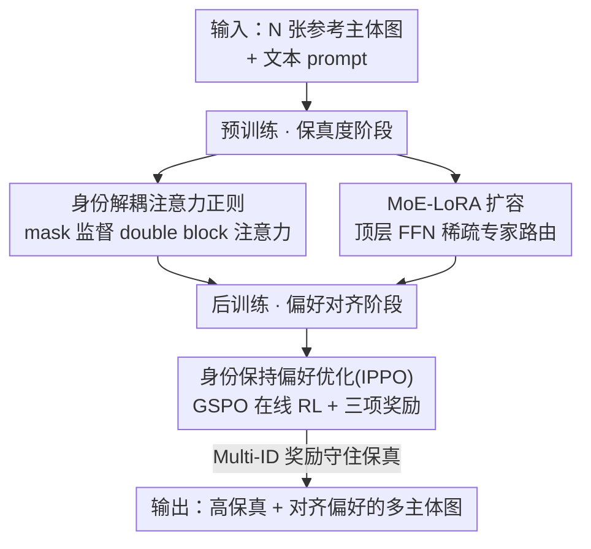

# MultiCrafter: High-Fidelity Multi-Subject Generation via Disentangled Attention and Identity-Aware Preference Alignment

**会议**: CVPR 2026  
**论文**: [CVF Open Access](https://openaccess.thecvf.com/content/CVPR2026/html/Wu_MultiCrafter_High-Fidelity_Multi-Subject_Generation_via_Disentangled_Attention_and_Identity-Aware_Preference_CVPR_2026_paper.html)  
**领域**: 图像生成 / 多主体定制  
**关键词**: 多主体生成, 注意力解耦, 身份保持, 偏好对齐, MoE-LoRA

## 一句话总结
MultiCrafter 把"多主体定制生成"拆成两个互不打架的训练阶段——预训练用显式位置监督把每个主体的注意力"框"到正确空间区域以根治属性串扰、用 MoE-LoRA 撑起复杂布局的容量，后训练再用一套以匈牙利匹配打分的在线强化学习把美学和文本对齐拉满，从而在主体保真度上大幅领先现有 In-Context-Learning（ICL）方法。

## 研究背景与动机

**领域现状**：随着 DiT（Diffusion Transformer）和 Flux 这类文生图模型成熟，个性化生成需求暴涨。其中"多主体生成"——给定多张参考主体图（多人、多物体），要求在一张图里同时还原它们——是最有价值也最难的子任务。目前主流是 In-Context-Learning（ICL）路线，代表作 UNO、OmniGen，把每个参考主体编码成 latent token 拼进序列，靠 DiT 的注意力机制做定制。

**现有痛点**：ICL 方法常常翻车，最典型的是"属性泄漏"（attribute leakage）——当两个主体属性相近（比如两个同性别的人）时，生成的脸会互相串味，甚至生成多张"平均脸"，主体保真度崩盘。作者把注意力图可视化后定位到根因，称之为"注意力出血"（attention bleeding）：DiT 的 double block 里，不同主体各自的注意力响应区域纠缠在一起、没有分开。

**核心矛盾**：作者认为问题出在"训练范式高度耦合"。多主体生成本质要同时满足两个性质截然不同的目标——(i) 多主体的高保真度，(ii) 对齐人类偏好（美学质量、语义/文本对齐）。而现有方法只用一个间接的重建损失，在单一阶段里硬塞这两个目标。重建损失既解不开主体特征与空间位置之间的纠缠（伤保真度），又和人类多维偏好之间存在严重的"代理目标错配"（proxy-objective mismatch，重建 loss 根本不直接对齐美学/文本）。一个损失被迫在两个目标之间找折中，结果两头都次优。

**本文目标**：把这个复合任务拆开，让模型分别在不同阶段专注于"主体保真度"和"人类偏好对齐"两件事。

**切入角度**：作者通过可视化得到一个关键判据——要想高保真，double block 中对应某个主体的注意力峰值响应，必须始终落在该主体在生成图里的空间区域上。既然如此，与其指望重建 loss 间接学到这件事，不如在训练时直接、显式地监督注意力的空间分布。

**核心 idea**：分而治之（divide-and-conquer）。预训练阶段用显式位置监督把注意力"对齐"到正确区域解决保真度；后训练阶段用一套身份保持的在线 RL 直接对齐人类偏好，且保证不破坏第一阶段已经拿到的保真度。

## 方法详解

### 整体框架
MultiCrafter 基于 Flux（Flow Matching + DiT）搭建，输入是 N 张不同主体的参考图 + 一段文本 prompt，输出是把这些主体按 prompt 组合到一张图里的结果。整条管线分成上下两段、各管一件事：

- **预训练（保真度阶段）**：在常规 Flow Matching 重建损失之外，加一项 **Identity-Disentangled Attention Regularization（身份解耦注意力正则）**，用预标注的主体 mask 显式监督每个主体在 double block 里的注意力图，强行把不同主体的注意力分开；同时因为单个 LoRA 容量不够覆盖五花八门的空间布局，把 FFN 层换成 **MoE-LoRA** 扩容。这一阶段的位置监督只在训练时生效，推理时不需要用户额外输入布局。
- **后训练（偏好对齐阶段）**：在已保真的模型上做 **Identity-Preserving Preference Optimization（IPPO，身份保持偏好优化）**——一套基于 MixGRPO 滑窗、用更稳的 GSPO（序列级策略比）做更新的在线强化学习，奖励由"美学 + 文本对齐 + 主体保真度"三项组成，其中主体保真度用**匈牙利匹配**的 Multi-ID Alignment Reward 精确计算，防止模型靠属性泄漏刷分。

### 关键设计

**1. 身份解耦注意力正则：用 mask 直接把每个主体的注意力"钉"到它该在的位置**

这一项针对的就是"注意力出血/属性泄漏"。作者先观察到两点：double block 比 single block 更决定参考主体的空间布局；只用重建损失训练会让不同主体的注意力场纠缠。于是推出判据——主体的注意力峰值必须对齐它在生成图中的空间区域。做法是：把第 $i$ 个参考主体的 latent 特征切 patch、加位置编码得到 1D token 序列 $z_{r'}^{i} \in \mathbb{R}^{l \times c}$，在第 $k$ 个 double block 里和当前噪声 latent token 算注意力图 $m_k^i = \mathrm{Softmax}(Q_{k,i} K_k^{\top} / \sqrt{d})$；把某主体在所有 $N$ 个 double block 的注意力图聚合、平均、归一化得到 $\hat{M}_i$，再和预标注的真值 mask $M_i$ 用分割里常用的 Dice loss 拉近：

$$L_{attn} = \sum_{i=1}^{N}\left(1 - \frac{2\sum_j (\hat{M}_{i,j}\cdot M_{i,j}) + \epsilon}{\sum_j \hat{M}_{i,j} + \sum_j M_{i,j} + \epsilon}\right)$$

最终预训练损失为 $L = L_{diff} + \lambda \cdot L_{attn}$。它有效是因为这是**直接、显式**地把"主体 ↔ 空间区域"的对应关系作为监督信号注入注意力，而不是寄望重建 loss 间接学；位置监督只在训练时用，推理零额外开销。消融里它把 Face-Sim 从 0.1474 直接拉到 0.4983，是保真度的最大功臣。

**2. MoE-LoRA：给"千变万化的空间布局"补足模型容量**

注意力正则虽然管用，但它要求模型掌握由不同 prompt × 不同主体组合出的、极其多样的空间布局。作者发现单个 LoRA 容量不够，会出现某些布局根本生成不出来（论文举例"泰迪熊骑摩托车"这种组合场景失败）。于是借鉴 MoE-LoRA 在多任务微调里的成功经验，把 Flux 输出端 FFN 层换成 MoE-LoRA（其余层仍用普通 LoRA 保参数效率）。给定 FFN 输入 $h$，轻量门控网络算 $p = \mathrm{Softmax}(\mathrm{TopK}(W_g \cdot h, k))$，只保留 top-$k$ 个专家的 logit、其余置 $-\infty$ 实现稀疏激活（实现里 4 个专家激活 1 个）；每个专家是独立 LoRA $W_A^i, W_B^i$，输出为

$$h_{out} = \mathrm{FFN}(h) + \sum_{i=1}^{N_e} p_i \cdot \frac{\alpha}{r} W_B^i W_A^i h$$

专家分工不手工指定、让模型隐式学。它有效是因为多样布局本质是个"多任务"问题，稀疏专家按需路由能在不显著增参的前提下扩出容量，消融里它在保真度全面提升的同时还顺带改善了文本对齐。

**3. 身份保持偏好优化（IPPO）：用匈牙利匹配奖励的在线 RL，对齐偏好又不丢保真**

后训练要补的是美学和文本对齐，但难点在于"别把第一阶段辛苦换来的保真度又搞坏"。作者在 MixGRPO 的滑窗框架上做 RL，但发现标准 GRPO 的 token 级策略比在训练 MoE 模型时会因专家路由抖动而不稳，于是换成更稳的 GSPO——把策略比改成滑窗 $S$ 内去噪步上的**序列级**比值：

$$s_i(\theta) = \exp\left(\frac{1}{|S|}\sum_{t\in S}\log\frac{\pi_\theta(x_{t+1}\mid x_t, c, Z)}{\pi_{\theta_{old}}(x_{t+1}\mid x_t, c, Z)}\right)$$

优化目标是带 clip 的 $J(\theta) = \mathbb{E}\big[\frac{1}{N}\sum_i \min(s_i(\theta)A_i,\ \mathrm{clip}(s_i(\theta), 1-\beta, 1+\beta)A_i)\big]$。复合奖励 $R = w_{text}R_{text} + w_{aes}R_{aes} + w_{id}R_{id}$ 分别取 CLIP 文本对齐、HPSv2 美学、以及关键的主体保真度。$R_{id}$ 是这里的核心创新——**Multi-ID Alignment Reward**：对人脸，先用人脸检测器抽参考图与生成图的 embedding，构造成对余弦相似度矩阵 $C$，再用匈牙利算法求解最优指派 $\max_X \sum_{i,j} C_{ij}X_{ij}$，约束每张脸至多匹配一次（$\sum_j X_{ij}\le 1,\ \sum_i X_{ij}\le 1$）。这个"至多匹配一次"的约束是防 reward hacking 的关键：它堵死了模型用属性泄漏生成多张"平均脸"去骗高分的路子。对物体则用 Florence-2 + SAM2 定位、再算 DINOv2 embedding 的余弦相似度。

### 损失函数 / 训练策略
预训练目标 $L = L_{diff} + \lambda L_{attn}$；后训练用 GSPO 目标式（10），优势 $A_i$ 按组内归一化（式 3）计算、奖励用复合式（11）。实现上：生成图 512×512、参考图 320×320、LoRA rank $r=512$；MoE-LoRA 配 4 专家激活 1 个；RL 采样步 16、窗口 $w=2$、移窗间隔 $\tau=50$、步幅 $s=1$。

## 实验关键数据

### 主实验
在多人（multi-human）和多物体（multi-object）两个基准上对比 SOTA。多人组指标为 CLIP-T / Face-Sim / DINO-I / CLIP-I / AES，多物体组为 CLIP-T / DINO-I / CLIP-I / AES / AVG。下表摘录最能说明问题的保真度相关项：

| 设置 | 方法 | CLIP-T | Face-Sim | DINO-I | CLIP-I |
|------|------|--------|----------|--------|--------|
| 多人 | UNO | 0.2645 | 0.1474 | 0.5972 | 0.6489 |
| 多人 | XVerse | 0.2591 | 0.4117 | 0.7665 | 0.8027 |
| 多人 | **Ours** | **0.2753** | **0.5284** | **0.8294** | **0.8524** |

| 设置 | 方法 | CLIP-T | DINO-I | CLIP-I | AVG |
|------|------|--------|--------|--------|-----|
| 多物体 | UNO | 0.3259 | 0.7374 | 0.8392 | 0.4582 |
| 多物体 | XVerse | 0.2981 | 0.7449 | 0.8456 | 0.5153 |
| 多物体 | **Ours** | **0.3380** | **0.7824** | **0.8608** | **0.5592** |

主体保真度（Face-Sim、DINO-I、CLIP-I）领先尤为明显：多人 Face-Sim 从次优 XVerse 的 0.4117 跳到 0.5284，CLIP-I 从 0.8027 到 0.8294；同时文本对齐 CLIP-T 仍取得最高，两个基准总体分都第一。

### 消融实验
以 UNO（Flux + 高度耦合目标）为基线，在多人基准上逐项叠加：

| $L_{attn}$ | MoE-LoRA | IPPO | CLIP-T | Face-Sim | DINO-I | CLIP-I | AES | Overall |
|:---:|:---:|:---:|--------|----------|--------|--------|-----|---------|
| ✗ | ✗ | ✗ | 0.2645 | 0.1474 | 0.5972 | 0.6489 | 0.2954 | 0.3907 |
| ✓ | ✗ | ✗ | 0.2637 | 0.4983 | 0.7953 | 0.8032 | 0.2653 | 0.5252 |
| ✓ | ✓ | ✗ | 0.2674 | 0.5154 | 0.8107 | 0.8480 | 0.2661 | 0.5415 |
| ✓ | ✓ | ✓ | 0.2753 | 0.5284 | 0.8294 | 0.8524 | 0.2915 | 0.5554 |

### 关键发现
- **注意力正则贡献最大**：单加 $L_{attn}$ 就把 Face-Sim 从 0.1474 拉到 0.4983（Overall 0.3907 → 0.5252），主体保真度全面跃升——印证"属性泄漏=注意力纠缠"的根因判断。代价是单 LoRA 下文本对齐略降、某些复杂布局生成失败。
- **MoE-LoRA 补容量**：在 $L_{attn}$ 基础上把保真度再推一截（CLIP-I 0.8032 → 0.8480），同时回补文本对齐（CLIP-T 0.2637 → 0.2674），并修好了此前生不出的组合场景。
- **IPPO 拉偏好且守保真**：最后一步把 CLIP-T 提到 0.2753、AES 从 0.2661 回升到 0.2915，且 Face-Sim/DINO-I 不降反升——说明匈牙利匹配奖励确实让 RL 在优化美学/文本时没有牺牲保真度。
- 作者坦言多人场景 AES 偏低主要受训练数据质量所限，而高质量开源多物体数据上的竞争力佐证了框架本身有效。

## 亮点与洞察
- **把"诊断"做成"监督信号"**：作者没有停在"ICL 不行"的抱怨，而是可视化注意力图、定位到 double block 的注意力出血，再把这个诊断直接转化为可监督的 Dice loss——从现象到机制到损失项一气呵成，是很漂亮的因果闭环。
- **Multi-ID Alignment Reward 的"至多匹配一次"约束很关键**：用匈牙利匹配 + 一对一约束精准防住了"生成一堆平均脸骗高保真奖励"的 reward hacking，这是把 RL 用于多主体生成时最容易被忽视、却最致命的坑。这个 trick 可迁移到任何"多实例都要对得上参考"的奖励设计里。
- **"解耦训练目标"是可复用的方法论**：当一个任务里两个目标性质冲突、又被塞进同一个损失时，先分阶段、各用最贴合的监督/奖励，往往比硬调权重更有效。预训练管"硬约束的保真"、后训练管"软偏好的对齐"，分工清晰。
- **MoE-LoRA 把"多样空间布局"当多任务处理**的视角也很值得借鉴——容量不够时与其堆大 LoRA，不如稀疏专家按需分工。

## 局限与展望
- **依赖预标注 mask 与外部工具链**：注意力正则需要训练数据的主体 mask、物体奖励依赖 Florence-2 + SAM2 + DINOv2、人脸依赖人脸检测器——数据构建和奖励计算的工程成本高，且性能受这些现成工具的精度上限制约。
- **数据质量直接限制美学上限**：作者自己承认多人场景 AES 偏低源于训练数据质量，说明方法虽好但仍被数据卡脖子；多人数据稀缺也是该方向的共性瓶颈。
- **两阶段 + RL 训练较重**：MoE-LoRA + 滑窗在线 RL 的训练管线复杂，超参（窗口、移窗间隔、奖励权重）较多，复现门槛不低。
- **可扩展方向**：把位置监督做成更弱标注（如自动伪 mask）以减少标注依赖；探索奖励权重的自适应调度；验证主体数量进一步增多（>3 人/物）时匈牙利匹配奖励的稳定性。

## 相关工作与启发
- **vs UNO / OmniGen（ICL 路线）**：它们在单阶段用一个重建损失同时追保真和偏好，导致注意力出血与代理目标错配；MultiCrafter 把任务解耦成两阶段、各用专门的显式监督/奖励，主体保真度（Face-Sim 0.1474 → 0.5284）大幅反超。
- **vs XVerse / DreamO 等近期定制方法**：它们保真度已不错但仍在单一训练范式内；本文优势在于显式注意力监督 + 偏好阶段的身份保持 RL，在保真和文本对齐上同时拿到最高分。
- **vs Flow-GRPO / DanceGRPO / MixGRPO（文生图 RL）**：这些把 ODE 转 SDE 引入随机性做 GRPO，但只停留在基础文生图任务、且 token 级策略比在 MoE 上不稳；本文换成序列级 GSPO 并首次把在线 RL 用到多主体定制，还配了防 hacking 的 Multi-ID 奖励。
- **vs 需要用户输入布局的可控生成**：本文的位置监督只在训练时用，推理无需用户提供额外布局/框，降低使用门槛。

## 评分
- 新颖性: ⭐⭐⭐⭐ 把"注意力诊断→显式监督"和"匈牙利匹配身份奖励的在线 RL"结合到多主体定制上，组合新颖、动机扎实。
- 实验充分度: ⭐⭐⭐⭐ 多人/多物体双基准、对比 7+ 方法、三项逐步消融清晰；但部分细节（如数据构建、reward 分析）放在补充材料。
- 写作质量: ⭐⭐⭐⭐ 从现象到机制到损失的论证链条清楚，图示到位；个别公式排版与措辞稍显仓促。
- 价值: ⭐⭐⭐⭐ "解耦目标 + 防 hacking 奖励"的思路对多实例定制生成有较强可迁移性，主体保真度提升幅度实用。

<!-- RELATED:START -->

## 相关论文

- [\[CVPR 2026\] Correspondence-Attention Alignment for Multi-View Diffusion Models](correspondence-attention_alignment_for_multi-view_diffusion_models.md)
- [\[CVPR 2026\] PSR: Scaling Multi-Subject Personalized Image Generation with Pairwise Subject-Consistency Rewards](psr_scaling_multi-subject_personalized_image_generation_with_pairwise_subject-co.md)
- [\[CVPR 2026\] DiT360: High-Fidelity Panoramic Image Generation via Hybrid Training](dit360_high-fidelity_panoramic_image_generation_via_hybrid_training.md)
- [\[CVPR 2026\] Scaling Multi-Identity Consistency for Image Customization via Multi-to-Multi Matching Paradigm](scaling_multi-identity_consistency_for_image_customization_via_multi-to-multi_ma.md)
- [\[CVPR 2026\] Garments2Look: A Multi-Reference Dataset for High-Fidelity Outfit-Level Virtual Try-On with Clothing and Accessories](garments2look_a_multi-reference_dataset_for_high-fidelity_outfit-level_virtual_t.md)

<!-- RELATED:END -->
