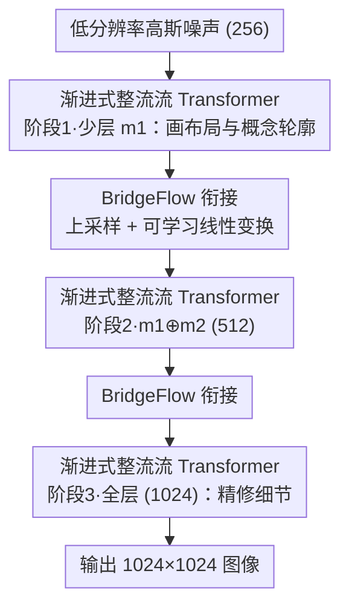

# NAMI: Efficient Image Generation via Bridged Progressive Rectified Flow Transformers

**会议**: CVPR 2026  
**论文**: [CVF Open Access](https://openaccess.thecvf.com/content/CVPR2026/html/Ma_NAMI_Efficient_Image_Generation_via_Bridged_Progressive_Rectified_Flow_Transformers_CVPR_2026_paper.html)  
**代码**: 未提及  
**领域**: 扩散模型 / 图像生成  
**关键词**: 整流流、渐进式生成、多分辨率训练、推理加速、DiT

## 一句话总结
NAMI 把文生图的整流流（rectified flow）按分辨率切成多个时间窗，低分辨率阶段只用少量 Transformer 层快速画布局、高分辨率阶段才逐步堆满层数精修细节，并用一个可学习的 BridgeFlow 模块衔接相邻阶段的分布，在 2B 参数规模下把 1024×1024 图像的推理时间砍掉 64%，质量仍与同规模 SOTA 持平。

## 研究背景与动机

**领域现状**：以 SD3、FLUX 为代表的文生图模型用整流流 + MM-DiT 架构拿下了当前最好的生成质量。整流流把噪声和数据用一条直线连接，训练和推理都比传统扩散更高效；MM-DiT 则把文本和图像 token 拼在一起做联合注意力。

**现有痛点**：质量上去了，但参数量和算力开销也跟着暴涨——FLUX 高达 12B 参数，生成一张高分辨率图要在所有去噪步、所有 token、所有模型层上做满负荷计算，推理延迟和成本都高到难以商用。已有的提速思路（VAE 高倍下采样、减少输入 token、线性注意力）几乎都以牺牲生成质量为代价。

**核心矛盾**：现有方法在所有采样阶段做**统一**的去噪，完全没有利用图像生成本身"先粗后细"的内在结构。作者观察到：扩散生成的早期只是在摆放粗糙的概念布局和物体轮廓，这一步既可以在**低分辨率**下快速完成，也只需要**模型的一部分参数**就够了；真正吃算力的细节增强发生在后期。把分辨率和模型容量都"一刀切"地拉满，是巨大的冗余。

**本文目标**：在不掉质量的前提下，从时间、空间、架构三个维度同时拆解生成过程，让早期布局阶段跑得又快又省。

**切入角度**：把整条整流流按分辨率分段（金字塔式），低分辨率段配少层模型、高分辨率段配多层模型，形成"时间分段 + 空间级联"的渐进式结构；难点在于如何让相邻分段之间的概率分布平滑衔接，避免跳变带来质量损失。

**核心 idea**：用一个可学习的 BridgeFlow 模块替代金字塔流里那套不可学习的重加噪衔接，把"渐进式整流流 Transformer + 多分辨率联合训练"组合成一个端到端高效框架。

## 方法详解

### 整体框架
NAMI 把一次文生图的去噪轨迹切成 $K$ 个分辨率阶段（实际取 $K=3$，分辨率 256→512→1024），整条整流流也对应切成 $K$ 个时间窗 $[t_{k-1}, t_k]$。每个阶段配一个由 MM-DiT 块堆出来的模块 $m_k$，且阶段的模型是**嵌套累加**的：第 $k$ 阶段用的网络是 $\theta_k = \{m_1 \oplus \cdots \oplus m_k\}$——也就是分辨率越高、参与计算的层越多。推理时从最低分辨率的噪声出发，逐阶段往上走；阶段之间通过上采样 + BridgeFlow 模块把上一段的终点对齐成下一段的起点。训练侧则用多分辨率联合策略，让不同分辨率的数据同时参与，加速收敛。

> 多分辨率联合训练是训练期策略、NAMI-1K 是评测基准，二者不在上面这条推理管线里，单独作为关键设计 3、4 讲。

### 关键设计

**1. 渐进式整流流 Transformer：把"先粗后细"同时落到时间、分辨率和模型容量三个轴上**

这一设计直接回应"统一去噪太冗余"的痛点。作者把整条流按金字塔方式切成 $K$ 个时间窗，相邻窗之间用上采样/下采样连接。在第 $k$ 个时间窗内，起点 $\hat{x}_{s_k} = \text{BridgeFlow}(\text{Up}(\text{Down}(x_{t_{k-1}}, 2^{k+1})))$ 由上一阶段终点上采样得到，终点 $\hat{x}_{e_k} = \text{Down}(x_{t_k}, 2^{k})$ 由数据下采样加噪得到，窗内仍走线性插值 $\hat{x}_t = t'\hat{x}_{e_k} + (1-t')\hat{x}_{s_k}$，其中 $t' = (t - t_{k-1})/(t_k - t_{k-1})$ 是窗内归一化时间。关键的"空间级联"体现在模型上：第 $k$ 阶段只用前 $k$ 个模块 $\theta_k = m_1 \oplus \cdots \oplus m_k$，低分辨率阶段层数少、token 少，算得飞快；分辨率每升一级才把更多层加进来。整体优化目标按时间窗求和：

$$\min_{\theta_k} \sum_{k=1}^{K} \mathbb{E}\Big[\int_{t_{k-1}}^{t_k} \big\|(\hat{x}_{s_k} - \hat{x}_{e_k}) - v_{\theta_k}(\hat{x}_t, t)\big\|^2 \, dt\Big]$$

和 MatryoshkaDM、Pyramid Flow 这类多尺度方法相比，它们要么只在像素空间用嵌套 UNet、要么只做时间金字塔，都没解决 DiT 的**参数冗余**；NAMI 直接让不同尺度阶段用不同大小的子模型，把空间和容量一起省下来。

**2. BridgeFlow：用可学习线性变换替代不可学习的重加噪，平滑衔接阶段边界**

阶段切开后，相邻分辨率段的概率路径在跳跃点（jump point）会断裂。Pyramid Flow 的做法是把跳跃点当作高斯分布匹配，靠重缩放 + 重加噪来过渡——但这个过程**没有可学习参数**、鲁棒性差，而且重加噪的时间复杂度正比于 token 长度，在高分辨率下又慢又拖质量。BridgeFlow 改成数据驱动的对齐：对每个阶段的终点先上采样匹配分辨率，再做一次线性变换 $\hat{x}_{s_k} = W \cdot \text{Up}(\hat{x}_{e_{k-1}}) + B$，把它对齐到下一阶段起点的分布。每个 BridgeFlow 模块用 MSE 损失按流分段单独预训练（学习率 1e-3，约 10k 步收敛）。消融显示它在 256 分辨率下推理仅 0.05s、FID 8.93，比 Pyramid Flow（0.12s / FID 9.82）又快又好，而换成更复杂的 MLP 或 Pixel Shuffle + CNN 都不再带来提升——说明这里一个轻量线性层就是质量/速度的最佳折中。

**3. 多分辨率联合训练：同时喂多分辨率数据，避免高分辨率微调时的灾难性遗忘**

传统多尺度方法是"先在低分辨率训、再单独到高分辨率微调"，这样容易遗忘低分辨率学到的语义。NAMI 反过来，让多个分辨率的数据在**同一批次内同时**参与训练（见原文 Algorithm 1）：每个时间窗采样满足分辨率要求的数据，用 $\text{Down}(\cdot)$ 降到对应尺度算起止点和损失，不同阶段的损失按训练进程动态加权后联合反传。这样模块间能共享知识，也防止高分辨率微调时遗忘。训练还借鉴 SD3 用 logit-normal 采样、以 0.1 概率随机丢 prompt 来支持 CFG。实测中，作者在不同训练阶段动态调整三种分辨率的采样比例（4:2:1 → 2:4:1 → 1:2:4），逐步把重心从低分辨率挪到高分辨率。

**4. NAMI-1K 基准：弥补现有评测 prompt 单一、分布偏置的人类偏好评测集**

GenEval、DPG-Benchmark 等现有基准 caption 数量有限、长度和主题分布偏置严重（GenEval 多在 10 词内、DPG 多在 50–80 词）。作者构建了 NAMI-1K：1000 条 prompt，含从 GenEval/LumiereSet 选的 360 条短 prompt、社区收集的 320 条人写 prompt、Cogvlm2 生成的 320 条长 prompt，长度覆盖到 120 词、主题更均衡。评测由 5 名标注员交叉打分，覆盖相关性、连贯性、美学、真实性四个维度（各 0–100 分），按权重 0.3/0.3/0.2/0.2 加权成总分。

### 损失函数 / 训练策略
核心训练目标即上文的分窗整流流损失 $\sum_k \int \|(\hat{x}_{s_k}-\hat{x}_{e_k}) - v_{\theta_k}\|^2$；BridgeFlow 用 MSE 单独预训练。NAMI-2B 含 22 层、2048 宽、16 头，三阶段层比 9:7:6；NAMI-0.6B 为 12 层、层比 5:4:3。训练集约 1 亿张（LAION + GRIT-20M + 10 万高质量内部数据，语义与美学过滤）；分阶段调学习率 1e-4 → 5e-5。

## 实验关键数据

### 主实验
在 GenEval（短 prompt 文图对齐）上，NAMI-2B 在同参数量档位取得领先的综合排名：

| 模型(参数) | Overall | Single | Two | Count | Color | Pos | Color Attr |
|------------|---------|--------|-----|-------|-------|-----|-----------|
| SD3-medium (2B) | 0.62 | 0.98 | 0.74 | 0.63 | 0.67 | 0.34 | 0.36 |
| Sana (1.6B) | 0.66 | 0.99 | 0.77 | 0.62 | 0.88 | 0.21 | 0.47 |
| Hunyuan-DiT (1.5B) | 0.63 | 0.97 | 0.77 | 0.71 | 0.88 | 0.13 | 0.30 |
| **NAMI-2B (2B)** | **0.65** | 0.99 | 0.78 | 0.64 | 0.82 | 0.20 | 0.45 |
| FLUX-dev (12B) | 0.67 | 0.99 | 0.81 | 0.79 | 0.74 | 0.20 | 0.47 |

> 注：Overall 为 GenEval 各子项平均；Single/Two=单/双物体生成正确率，Count=计数，Color=配色，Pos=空间位置，Color Attr=颜色归属。NAMI-2B 综合分 0.65，超过同档 SD3-medium，逼近大它 6 倍的 FLUX-dev。

人类偏好评测（NAMI-1K，越高越好）中，NAMI-2B 在同参数量模型里综合分最高：

| 模型(参数) | 相关性 | 连贯性 | 美学 | 真实性 | 总分 |
|------------|--------|--------|------|--------|------|
| SD3-medium (2B) | 75.74 | 65.90 | 61.64 | 75.74 | 69.97 |
| Infinity (2B) | 76.39 | 65.25 | 61.97 | 74.43 | 69.77 |
| SANA (1.6B) | 75.41 | 62.30 | 60.00 | 72.46 | 67.80 |
| **NAMI-2B (2B)** | **76.07** | 66.89 | 62.30 | **76.72** | **70.69** |
| Flux-dev (12B) | 83.93 | 83.28 | 84.26 | 90.16 | 85.05 |

效率上，1024 分辨率下相比同规模 FLUX-based 基线（30 步统一采样，8.47s），NAMI-2B 整体仅 2.98s，降低 64.82%：

| 方法 | 256 | 512 | 1024 | 整体 | 降幅 |
|------|-----|-----|------|------|------|
| Baseline | - | - | 8.47 | 8.47 | - |
| NAMI-2B | 0.27 | 0.45 | 2.21 | 2.98 | 64.82% |

### 消融实验
| 配置 | 关键指标 | 说明 |
|------|---------|------|
| 完整 NAMI | FID 8.93 / CLIP 25.57 | 流分段 + 模型分块全开 |
| 仅流分段 (W NAMI only flow) | 收敛更快但推理省得少 | 模型不分块，分辨率级联缺空间省算 |
| FLUX-base 统一流 | FID 9.76 / CLIP 25.20 | 无分段基线，512 下差距更明显 |
| BridgeFlow vs Pyramid Flow | 0.05s/FID 8.93 vs 0.12s/FID 9.82 | 衔接模块对比，BridgeFlow 又快又好 |

训练效率上，NAMI 吞吐 274 img/s、8×A100 用 156 GPU 小时、峰值显存 55G，均优于 FLUX-based 基线（241 img/s / 176 小时 / 67.6G），且 FID 更低（8.93 vs 9.76）。

### 关键发现
- **推理提速来源拆解**：1024 分辨率下，单做流分段就省 53.01% 推理时间，再叠加模型分块额外省 11.81%，合计约 64%。可见省时主力是"低分辨率段少算 token"，模型分块是锦上添花。
- **衔接模块越简单越好**：BridgeFlow 一个可学习线性层即达最佳质量/速度折中，换成 3 层 MLP 或 Pixel Shuffle + CNN 都不再提升，说明阶段边界的分布对齐不需要重型结构。
- **层数分配有甜区**：低分辨率阶段层太少会掉点，但层数加到一定程度后性能饱和、继续加只是冗余；时间窗均匀划分（1:1:1）已足够好，过度倾斜某一段反而掉精度。

## 亮点与洞察
- **把"先粗后细"同时投到三个轴**：时间分段、空间分辨率级联、模型容量嵌套三者协同，是这篇最让人"啊哈"的地方——别人只省一个维度，它一次省三个，且彼此正交、可与线性注意力等手段叠加。
- **用一个线性层解决跳点对齐**：BridgeFlow 把 Pyramid Flow 那套不可学习、随 token 长度变慢的重加噪，换成 $W\cdot\text{Up}(x)+B$ 的数据驱动对齐，既快又稳——这个"用最轻结构换最大收益"的判断很值得迁移到任何多阶段生成的衔接问题。
- **多分辨率联合训练防遗忘**：相比"先低后高再微调"，同批次混多分辨率训练让模块间共享知识，是缓解高分辨率微调遗忘的实用 trick，可迁移到视频/3D 等多尺度生成。

## 局限与展望
- **质量仍落后超大模型**：NAMI-2B 在人类评测上明显不及 12B 的 FLUX-dev（70.69 vs 85.05），加速主要在同参数量档位才显出优势，绝对质量上限受限于 2B 规模。
- **阶段/层比是手调超参**：层数比、时间窗比都靠经验设定（论文建议以均分为基线再调），缺乏自动搜索，换数据集或分辨率可能要重新调。⚠️ 各阶段最优配置的可迁移性未充分验证。
- **BridgeFlow 需单独预训练**：衔接模块要先用 MSE 预训练再接主模型，增加了一道训练流程；端到端联合优化是否可行论文未深入。
- **评测仍偏人工**：NAMI-1K 靠 5 名标注员交叉打分，规模与一致性受限，缺少大规模自动化偏好模型的交叉验证。

## 相关工作与启发
- **vs Pyramid Flow**: 都做时间金字塔分段，但 Pyramid Flow 用不可学习的重加噪衔接跳点，慢且不稳；NAMI 用可学习 BridgeFlow 对齐分布，并进一步引入模型空间分块，省算更彻底。
- **vs MatryoshkaDM**: Matryoshka 用嵌套 UNet 在像素空间训不同尺度，没解决 DiT 的参数冗余；NAMI 在潜空间用不同大小子模型做空间级联，直接削减高分辨率阶段不必要的层。
- **vs SANA / MicroDiT / CLEAR**: 这些靠高倍 VAE 下采样、token 掩码或局部注意力提速，往往以牺牲质量为代价；NAMI 走"分解生成过程"路线，与它们正交，可并行集成。

## 评分
- 新颖性: ⭐⭐⭐⭐ 三轴协同分解 + 可学习 BridgeFlow 衔接是清晰的新组合，但单点（金字塔流、多尺度）均有前作
- 实验充分度: ⭐⭐⭐⭐ 多基准 + 人类评测 + 组件/层比/时窗多组消融，但缺与更多 2B 级 SOTA 的全面对比
- 写作质量: ⭐⭐⭐⭐ 方法与消融叙述清晰，公式和算法完整，部分符号略密
- 价值: ⭐⭐⭐⭐ 1024 分辨率推理省 64% 且质量不掉，对文生图工程落地有实际意义

<!-- RELATED:START -->

## 相关论文

- [\[CVPR 2026\] Probabilistic Precipitation Nowcasting with Rectified Flow Transformers](probabilistic_precipitation_nowcasting_with_rectified_flow_transformers.md)
- [\[CVPR 2026\] DDiT: Dynamic Patch Scheduling for Efficient Diffusion Transformers](ddit_dynamic_patch_scheduling_for_efficient_diffusion_transformers.md)
- [\[CVPR 2026\] From Sketch to Fresco: Efficient Diffusion Transformer with Progressive Resolution](from_sketch_to_fresco_efficient_diffusion_transformer_with_progressive_resolutio.md)
- [\[CVPR 2026\] RecTok: Reconstruction Distillation along Rectified Flow](rectok_reconstruction_distillation_along_rectified_flow.md)
- [\[NeurIPS 2025\] Efficient Rectified Flow for Image Fusion](../../NeurIPS2025/image_generation/efficient_rectified_flow_for_image_fusion.md)

<!-- RELATED:END -->
