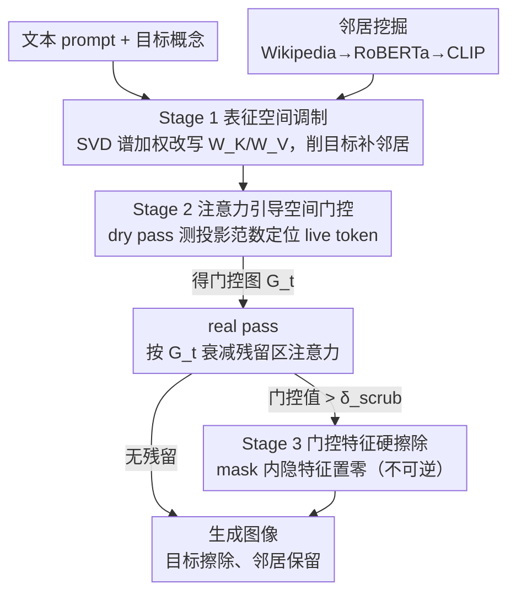

# Neighbor-Aware Localized Concept Erasure in Text-to-Image Diffusion Models

**会议**: CVPR 2026  
**arXiv**: [2603.25994](https://arxiv.org/abs/2603.25994)  
**代码**: [https://github.com/alirezafarashah/NLCE](https://github.com/alirezafarashah/NLCE)  
**领域**: 图像生成 / AI安全  
**关键词**: 概念擦除, 扩散模型, 邻居保留, 训练无关, 局部擦除

## 一句话总结

提出 NLCE，一个 training-free 的三阶段概念擦除框架，通过谱加权表征调制、注意力引导空间门控和门控特征清理三步实现目标概念的精确局部擦除，同时显式保留语义邻近概念，在 Oxford Flowers、Stanford Dogs、名人身份和敏感内容擦除任务上均优于现有方法。

## 研究背景与动机

1. **领域现状**：T2I 扩散模型的概念擦除方法分为 training-based（ESD、MACE、SPM 等需要微调）和 training-free（UCE、RECE、GLoCE 等仅推理时修改）两大类。局部擦除方法（GLoCE）试图仅在目标区域进行编辑。
2. **现有痛点**：**邻居间隙（Neighbor Gap）**——擦除一个细粒度概念时，语义相近的概念也被意外削弱。例如擦除某个狗品种时，其他品种的生成质量也会下降。
3. **核心矛盾**：概念表征在嵌入空间中高度纠缠，简单的投影/抑制操作无法精确区分目标和邻居。
4. **本文目标** 在不训练的情况下，精确擦除目标概念的同时保留邻近概念的语义完整性。
5. **切入角度**：三阶段渐进式擦除——先在表征空间做谱加权调制削弱目标+增强邻居，再用注意力定位残留，最后硬擦除清理。
6. **核心 idea**：显式建模和保护"概念邻域"结构，实现精准而非粗暴的概念移除。

## 方法详解

### 整体框架

NLCE 要解决的是细粒度场景下「擦掉一个概念却殃及邻居」的问题，做法是把擦除拆成由粗到精的三道工序，全程不动模型权重、只在推理时介入 UNet 的 cross-attention。第一道工序在嵌入空间动手，改写 Key/Value 的投影矩阵，从源头削弱目标概念、顺手把邻居的表征补回来；但全局改投影难免有漏网的残留，于是第二道工序在每个去噪步用注意力把「画面里还残留目标影子的位置」框出来；第三道工序再在这些框出来的位置上做不可逆的硬清理。三道工序处理的空间一层比一层小：从整张嵌入 → 一张空间门控图 → 二值 mask 内的若干像素。

### 关键设计

**1. Stage 1 表征空间调制：在嵌入层面削目标、补邻居**

第一道工序对应「邻居间隙」最根本的来源——目标和邻居在嵌入空间里纠缠，单纯压制目标方向会连带压到邻居。NLCE 先对目标概念的嵌入做 SVD，拿到正交基 $U_{F_c}$，再按奇异值的重要性给每个方向配一个权重 $\lambda_i$，组成谱加权投影 $P_{F_c} = U_{F_c}\Lambda_{F_c}U_{F_c}^T$——越重要的语义方向压得越狠，而不是所有方向一刀切。对邻居概念同样构造一个投影 $P_{\mathcal{N}_c}$，用来把被误伤的邻居信息加回去。两者合成最终算子

$$P_c = (I - \beta P_{F_c}) + \gamma P_{\mathcal{N}_c} P_{F_c}$$

其中 $\beta$ 控制抑制目标的力度、$\gamma$ 控制补偿邻居的力度，算子全局作用到 $W_K, W_V$ 上。这里的邻居不是凭空指定的：先用 Wikipedia 检索候选，再用 RoBERTa 的「具体度」过滤掉太抽象的词，最后用 CLIP 视觉相似度排序，挑出真正在视觉上接近目标的概念。相比 GLoCE 那种只挂在局部的 gated low-rank adapter（间接注意力路径里的概念重激活可能漏掉），全局改投影覆盖得更彻底。

**2. Stage 2 注意力引导空间门控：把残留的影子在画面上定位出来**

Stage 1 是全局操作，仍可能在画面某些区域留下目标概念的痕迹，Stage 2 的任务就是把「哪里还有影子」精确指出来。它在每个去噪步做两次前向：第一次是 dry pass，从 DownBlock-2 取注意力图，逐个 token 检查它在目标子空间上的投影范数 $s_j = \|P_{F_c}x_j\|_2$，超过阈值 $\delta_{\text{token}}$ 的就判定为仍在「发光」的 live token；把这些 live token 的注意力按空间位置加总，就得到一张门控图 $G_t(x,y)$，亮的地方就是目标概念残留的地方。第二次是 real pass，在门控区域里对这些 live token 的注意力做衰减：

$$A^\ell(x,y,j) \leftarrow (1-G_t)\cdot A^\ell(x,y,j)$$

门控图越亮的位置压得越多。这一步把全局抑制升级成了「按画面位置定点压制」，避免在本来就没有目标的区域瞎使劲。

**3. Stage 3 门控特征硬擦除：在定位出来的区域做不可逆清零**

前两步都是投影式、衰减式的「软」抑制，理论上还能被后续计算恢复出来，对名人身份、敏感内容这类必须保证严格安全的场景不够放心。Stage 3 把 Stage 2 的门控图上采样到各 UNet 层的分辨率，用阈值 $\delta_{\text{scrub}}$ 二值化成 mask，在 mask=1 的位置直接把隐特征置零

$$h_t^\ell(x,y) \leftarrow \mathbf{0}$$

这是不可逆的硬擦除——既然这些位置已经被前两步认定为「确实还有目标」，就索性把信号彻底抹掉，用安全性兜底。代价是置零可能在局部留下视觉瑕疵，所以它只在 Stage 2 圈定的小范围里动手，而不是全图乱抹。

### 一个完整示例：擦除某个狗品种

以擦除 "Bluetick" 这个犬种为例走一遍。Stage 1 先把 Bluetick 嵌入做 SVD，按谱加权压低它的主要语义方向，同时用 Wikipedia+RoBERTa+CLIP 挑出的邻居（如其他猎犬品种）的投影把邻居表征补回去，改写后的 $W_K, W_V$ 让生成结果整体已经偏离 Bluetick。但生成时画面里狗的头部区域仍带一点 Bluetick 的斑点特征——Stage 2 在 dry pass 里发现该区域的 token 投影范数超过 $\delta_{\text{token}}$，把它标成 live token 并在门控图上点亮，real pass 中对这片区域的注意力按门控强度衰减。若衰减后仍有残留（门控值高过 $\delta_{\text{scrub}}$），Stage 3 把这片区域的隐特征直接清零。最终 Bluetick 的判别准确率降到 0%，而其他猎犬品种因为邻居补偿基本不受影响。

### 损失函数 / 训练策略

全程无训练，所有操作都发生在推理时。关键超参数有四个：$\beta, \gamma \in [0,1]$ 分别调目标抑制和邻居增强的强度，$\delta_{\text{token}}$ 是 live token 的检测阈值，$\delta_{\text{scrub}}$ 是硬擦除的门控阈值。多概念擦除时按 prompt 检测当前激活了哪些概念，把对应算子连乘组合：$P_{\text{multi}} = \prod_{c\in\mathcal{A}} P_c$。

## 实验关键数据

### 主实验

**Oxford Flowers / Stanford Dogs 细粒度擦除**：

| 方法 | Alpine Sea Holly Acc_t↓/Acc_r↑/Ho↑ | Bluetick Acc_t↓/Acc_r↑/Ho↑ |
|------|-----------------------------------|---------------------------|
| GLoCE | 32.0/78.91/73.05 | 28.0/73.59/72.79 |
| RECE | 0.0/64.85/78.68 | 0.0/73.33/84.62 |
| **NLCE** | **0.0/82.06/90.15** | **0.0/75.91/86.31** |

**名人身份擦除**：

| 方法 | Anna Kendrick Acc_t↓/Ho↑ | Elon Musk Acc_t↓/Ho↑ |
|------|--------------------------|----------------------|
| SLD | 0.0/96.55 | 3.33/94.28 |
| GLoCE | 1.33/96.63 | 0.67/97.29 |
| **NLCE** | **0.0/96.91** | **0.0/96.55** |

### 消融实验

Stage 逐步添加的效果（从论文 Figure 9 提取）：

| 配置 | 效果趋势 |
|------|---------|
| 仅 Stage 1 | 基本擦除，但可能有残留 |
| Stage 1+2 | 擦除更彻底，空间精准 |
| Stage 1+2+3 | 完全擦除，无残留 |

不同数据集对三阶段的依赖程度不同：简单场景 Stage 1 已足够，复杂场景需完整 pipeline。

### 关键发现

- NLCE 在所有细粒度数据集上获得最高 Acc_r 和 Ho，说明邻居保留效果最好
- GLoCE 的 Acc_t 依然较高（如 32%），说明轻量编辑不够彻底；NLCE 几乎全部降到 0%
- 在 I2P 敏感内容擦除中 NLCE 检测到的裸露内容最少，同时 CLIP Score 29.70 保持较高
- 多概念同时擦除（10 个品种）时 NLCE 仍保持高 Acc_r，而 MACE/UCE/RECE 等的保留准确率崩溃
- KID 值普遍最低，说明视觉质量保持最好

## 亮点与洞察

- **"邻居间隙"问题的发现和形式化**很好地解释了为什么现有方法在细粒度场景下失败。这一洞察对概念擦除领域有普遍意义
- **三阶段渐进式擦除设计**把概念擦除从"一刀切"变成了"精确手术"：先在表征空间削弱，再在注意力空间定位，最后在特征空间清除。每个阶段的设计目标清晰
- **邻居挖掘管线**（Wikipedia 检索 → RoBERTa 具体度过滤 → CLIP 视觉排序）是一套实用的语义邻域构建方法，可复用于其他需要概念边界划定的任务

## 局限与展望

- 每步去噪做两次前向（dry pass + real pass），推理时间翻倍
- 邻居挖掘依赖外部资源（Wikipedia、RoBERTa），对罕见概念可能检索不到合适邻居
- 硬擦除（置零）可能在某些情况下导致局部视觉瑕疵
- $\beta, \gamma$ 需要根据擦除强度需求手动调节，不同场景最优值不同

## 相关工作与启发

- **vs GLoCE**: 同为局部擦除方法，GLoCE 用 gated low-rank adapter 但不显式保护邻居。NLCE 在 neighbor 保留上显著更好（Acc_r 差距 3-7%），且 Acc_t 更低
- **vs RECE**: 擦除彻底但邻居遗忘严重（Acc_r 经常比 NLCE 低 10-15%），因为没有邻居保护机制
- **vs AdaVD**: 谱抑制方法但无空间局部化和邻居增强，在多概念场景下不够稳健

## 评分

- 新颖性: ⭐⭐⭐⭐ 邻居感知的概念擦除是很好的问题抽象，三阶段设计合理；但各阶段技术本身（SVD投影、注意力门控）并不新
- 实验充分度: ⭐⭐⭐⭐⭐ 覆盖细粒度/名人/敏感内容/艺术风格四大场景，多概念扩展，消融完整
- 写作质量: ⭐⭐⭐⭐ 问题引入清晰，但三阶段描述偏重符号，实际算法流程可以更直观
- 价值: ⭐⭐⭐⭐ 对 T2I 模型的安全部署有直接意义，特别是细粒度概念管控场景

<!-- RELATED:START -->

## 相关论文

- [\[CVPR 2026\] Beyond Text Prompts: Precise Concept Erasure through Text–Image Collaboration](beyond_text_prompts_precise_concept_erasure_through_text-image_collaboration.md)
- [\[CVPR 2026\] Closed-Form Concept Erasure via Double Projections](closed-form_concept_erasure_via_double_projections.md)
- [\[CVPR 2026\] GrOCE: Graph-Guided Online Concept Erasure for Text-to-Image Diffusion Models](groce_graph-guided_online_concept_erasure_for_text-to-image_diffusion_models.md)
- [\[CVPR 2026\] Prototype-Guided Concept Erasure in Diffusion Models](prototype-guided_concept_erasure_in_diffusion_models.md)
- [\[CVPR 2026\] Erasing Thousands of Concepts: Towards Scalable and Practical Concept Erasure for Text-to-Image Diffusion Models](erasing_thousands_of_concepts_towards_scalable_and_practical_concept_erasure_for.md)

<!-- RELATED:END -->
