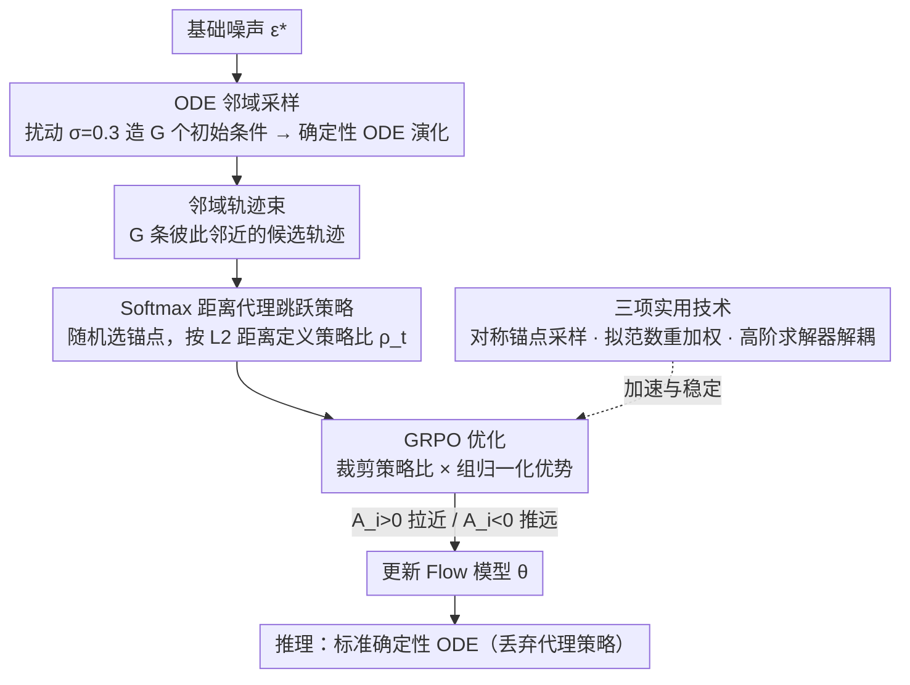

# Neighbor GRPO: Contrastive ODE Policy Optimization Aligns Flow Models

**会议**: CVPR 2026  
**arXiv**: [2511.16955](https://arxiv.org/abs/2511.16955)  
**代码**: 无  
**领域**: 图像生成  
**关键词**: GRPO, Flow Matching, 人类偏好对齐, 对比学习, ODE采样

## 一句话总结
重新解释 SDE-based GRPO 为距离优化/对比学习，提出 Neighbor GRPO——完全绕过 SDE 转换，通过扰动 ODE 初始噪声构建邻域候选轨迹 + softmax 距离代理策略实现策略梯度优化，保留确定性 ODE 采样的所有优势。

## 研究背景与动机
GRPO 在对齐图像/视频生成模型与人类偏好上表现出色，但应用于 Flow Matching 模型时存在根本冲突：

**GRPO 需要随机性探索**：策略梯度方法依赖随机性来探索策略空间

**Flow Matching 的优势在于确定性 ODE 采样**：高效、支持高阶求解器

现有方法（Flow-GRPO、DanceGRPO）通过将 ODE 转换为等价 SDE 引入随机性，但牺牲了 ODE 的核心优势：
- **SDE 限于一阶求解器**：无法利用 DPM-Solver++ 等高阶求解器加速
- **信用分配低效**：终端奖励需分配到所有时间步的噪声注入上
- MixGRPO、BranchGRPO 部分缓解但仍受 SDE 框架约束

## 方法详解

### 整体框架

这篇论文想解决 GRPO 和 Flow Matching 的根本冲突：GRPO 靠随机性探索策略空间，而 Flow Matching 的价值恰恰在于确定性 ODE 采样（高效、可用高阶求解器）。现有做法（Flow-GRPO、DanceGRPO）把 ODE 转成等价 SDE 来硬塞随机性，却因此被锁死在一阶求解器、信用分配也低效。Neighbor GRPO 的突破口是一个重新解释：把 SDE-based GRPO 看成**距离优化/对比学习**——ODE 样本是锚点、SDE 样本是候选，优化本质就是拉近高奖励候选、推远低奖励候选。既然如此，干脆完全绕过 SDE，直接在 ODE 邻域里做：扰动初始噪声生成一组候选轨迹，选一条当锚点，再用一个 softmax 距离代理策略把“拉近/推远”严格纳入 GRPO 框架，推理时则回到标准确定性 ODE。

### 关键设计

**1. ODE 邻域采样：不靠 SDE 也能造出一组可比较的候选**

GRPO 需要一组有差异的样本来比较奖励，但纯确定性 ODE 从固定噪声出发只会得到一条轨迹。Neighbor GRPO 改在初始噪声上做文章：给定基础噪声 $\epsilon^*$，构造 $G$ 个扰动初始条件 $\epsilon^{(i)} = \sqrt{1-\sigma^2}\epsilon^* + \sigma\delta^{(i)},\ \delta^{(i)} \sim \mathcal{N}(0, I)$，其中 $\sigma \in (0,1)$ 控制扰动强度（最优 $\sigma=0.3$，太小探索不足、太大就跳出邻域）。这些初始条件各自经确定性 ODE 演化，得到一束彼此邻近的轨迹，构成局部解邻域——随机性被挪到了起点，演化过程仍是干净的 ODE。

**2. Softmax 距离代理跳跃策略：让策略比和梯度在 ODE 上可计算**

绕过 SDE 后，GRPO 需要的策略比 $\rho_t$ 没有现成定义。论文据此设计一个训练专用的代理策略：$\pi_\theta(x_t^{(i)} \mid \{s_t\}) = \frac{\exp(-\|x_t^{(i)} - x_t^{(\theta)}\|_2^2)}{\sum_{k=1}^{G}\exp(-\|x_t^{(k)} - x_t^{(\theta)}\|_2^2)}$，其中锚点 $x_t^{(\theta)}$ 从候选中随机选取并贡献梯度。直觉上，采样轨迹在每一步都可能“跳”到邻居，跳的概率由 softmax 距离决定；优化动力学也很清晰——优势 $A_i > 0$ 时梯度减小距离（拉近）、$A_i < 0$ 时增大距离（推远），完全对应对比学习。这个代理只在训练时存在，推理时丢掉、用标准确定性 ODE，因此完整保留了 ODE 的全部优势。

**3. 三项实用技术：把邻域结构和高阶求解器的红利吃满**

邻域采样还附带几个可利用的结构。其一是**对称锚点采样**：由 Johnson-Lindenstrauss 引理，邻域样本几乎等距，任何候选都能当锚点，于是每次迭代只需对 $B < G$ 个锚点做前向/反向（$G=12$ 时省下约 12 倍梯度计算）。其二是**组内拟范数优势重加权**：用 $L_p$ 范数（$p<2$）替代标准 $L_2$ 归一化 $A'_i = A_i / (\sum|A_k|^p)^{1/p}$，当优势信号平坦时自动降权，防止 reward hacking（$p=0.8$ 最优）。其三是**高阶求解器解耦**：数据收集用 DPM++ 采样、策略更新用单步 DDIM 算代理策略，这正是 SDE 框架做不到、而纯 ODE 才能享受的加速。

### 损失函数 / 训练策略

GRPO 目标用裁剪策略比 + 组归一化优势：

$$\mathcal{J}(\theta) = \mathbb{E}_{s,t,i}\left[\min\left(A_i\rho_t^{(i)}, A_i\lceil\rho_t^{(i)}\rfloor\right)\right]$$

- 基模型：FLUX.1-dev（Swin 骨干）
- 奖励：HPSv2.1 + Pick Score + ImageReward（等权多奖励训练）
- AdamW，lr=1e-5，300 次迭代，32×H800 GPU
- 每轮约 4 小时；8-step DPM++ 配置下每迭代仅 45s，约为 DanceGRPO/MixGRPO 237s 的 1/5

## 实验关键数据

### 主实验

| 方法 | Solver | NFE_old | NFE_θ ↓ | s/Iter ↓ | HPSv2.1 ↑ | Pick ↑ | ImgRwd ↑ | CLIP ↑ | Unified ↑ | Aes ↑ |
|------|--------|---------|---------|----------|-----------|--------|----------|--------|-----------|-------|
| FLUX.1-dev | - | - | - | - | 0.310 | 0.227 | 1.131 | **0.389** | 3.211 | 6.108 |
| DanceGRPO | DDIM | 25 | 14 | 237.9 | **0.371** | 0.231 | 1.306 | 0.364 | 3.156 | 6.552 |
| MixGRPO | DDIM | 25 | 14 | 237.7 | 0.366 | 0.235 | 1.604 | 0.382 | 3.257 | 6.623 |
| **Ours** | DPM++ | 8 | **1.33** | **45.1** | 0.366 | 0.234 | 1.640 | **0.391** | **3.334** | 6.621 |

8-step DPM++ 配置下，训练速度提升 5.3 倍（45s vs 238s/iter），域外指标全面最优。

### 消融实验

| 参数 | 最优值 | 说明 |
|------|--------|------|
| 扰动强度 $\sigma$ | 0.3 | 太小探索不足，太大非邻域 |
| 锚点数 $B$ | 4 | $B=2$ 已有竞争力，$B=4$ 最佳平衡 |
| 拟范数 $p$ | 0.8 | $p=2$ 为标准 GRPO，$p=0.8$ 域外最优 |

### 关键发现
- Neighbor GRPO 收敛更快：50 次迭代即达 HPSv2.1 > 0.35（DanceGRPO 需更多）
- 人类评估：相比 DanceGRPO 和 MixGRPO 分别获得 72% 和 61% 的偏好率
- 避免 reward hacking：不出现网格伪影和颜色不均匀等问题
- 长期训练稳定性优于 MixGRPO

## 亮点与洞察
1. **理论洞察深刻**：将 SDE-based GRPO 重释为对比学习，揭示其本质是距离优化，为全 ODE 方案提供理论基础
2. **完全保留 ODE 优势**：无需 SDE 转换，兼容高阶求解器，信用分配更直接
3. **对称锚点采样**利用 J-L 引理的几何性质，巧妙减少计算量至 $B/G$ 倍
4. **拟范数重加权**简洁有效地解决 reward flattening，一个超参数即可调控

## 局限与展望
- 仅在 FLUX.1-dev 上验证，对其他 Flow Matching 模型（如 SD3）的适用性待确认
- 多奖励训练的权重目前采用等权，可探索自适应加权
- 代理策略的理论保证依赖邻域足够紧（$\sigma$ 足够小），极端设置下的行为未充分分析
- 可扩展到视频生成（当前仅图像）

## 相关工作与启发
- 与 DanceGRPO、Flow-GRPO 同源但范式革新：从 SDE 依赖转向全 ODE 训练
- MixGRPO 的混合采样是折中方案，Neighbor GRPO 更彻底
- 对比学习视角可能适用于其他需要 stochasticity 的确定性模型优化场景
- 拟范数重加权可推广到其他 GRPO 变体

## 评分
- 新颖性: ⭐⭐⭐⭐⭐ 理论洞察+方法创新均有重要贡献，完全绕过 SDE
- 实验充分度: ⭐⭐⭐⭐ 多指标评估+消融充分+人类评估，但仅一个基模型
- 写作质量: ⭐⭐⭐⭐⭐ 理论推导清晰，图示直观，从洞察到方法逻辑流畅
- 价值: ⭐⭐⭐⭐⭐ 训练效率提升 5 倍+质量更优，对 RLHF 视觉生成有重要推动

<!-- RELATED:START -->

## 相关论文

- [\[CVPR 2026\] GRPO-Guard: Mitigating Implicit Over-Optimization in Flow Matching via Regulated Clipping](grpo-guard_mitigating_implicit_over-optimization_in_flow_matching_via_regulated_.md)
- [\[CVPR 2026\] Fine-Grained GRPO for Precise Preference Alignment in Flow Models](fine-grained_grpo_for_precise_preference_alignment_in_flow_models.md)
- [\[CVPR 2026\] VeCoR — Velocity Contrastive Regularization for Flow Matching](vecor_--_velocity_contrastive_regularization_for_flow_matching.md)
- [\[CVPR 2026\] Stepwise-Flow-GRPO：给流匹配模型的去噪步逐步分配信用](stepwise_credit_assignment_for_grpo_on_flow-matching_models.md)
- [\[ICML 2026\] Principled RL for Flow Matching Emerges from the Chunk-level Policy Optimization](../../ICML2026/image_generation/principled_rl_for_flow_matching_emerges_from_the_chunk-level_policy_optimization.md)

<!-- RELATED:END -->
