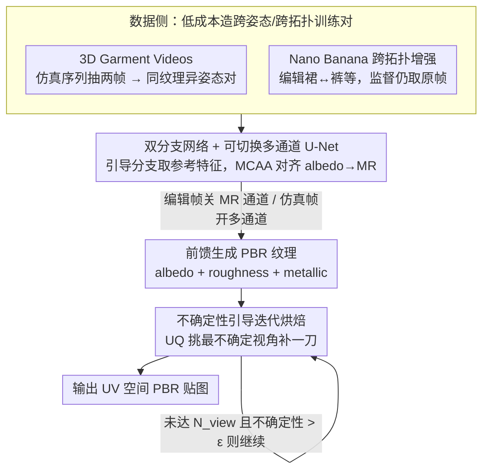

# NI-Tex: Non-isometric Image-based Garment Texture Generation

**会议**: CVPR 2026  
**arXiv**: [2511.18765](https://arxiv.org/abs/2511.18765)  
**代码**: [有](https://github.com/SII-Hui/NI-Tex)  
**领域**: 3D视觉  
**关键词**: 服装纹理生成, PBR材质, 非等距变形, 不确定性引导烘焙, 跨拓扑增强  

## 一句话总结

提出NI-Tex框架，通过构建3D Garment Videos数据集、基于图像编辑的跨拓扑增强以及不确定性引导的迭代烘焙算法，首次以前馈架构实现了非等距条件下从单图到3D服装PBR纹理的高质量生成。

## 研究背景与动机

现有工业级3D服装网格已覆盖大多数真实世界的服装几何形状，但纹理多样性仍然有限。为获取更逼真的纹理，生成式方法常从大量真实图像中提取PBR（基于物理的渲染）纹理并投射回服装网格。然而，现有的图像条件纹理生成方法面临两个核心限制：

**拓扑一致性要求**：大多数方法要求输入图像与目标3D网格之间具有严格的拓扑一致性，例如Hunyuan3D和Meshy在图像-网格拓扑不匹配时生成质量严重下降

**网格变形依赖**：部分方法（如Pix2Surf、Cloth2Tex）依赖精确的网格变形来匹配图像姿态，但变形过程引入累积误差，灵活性受限

实际应用中，用户提供的图像与目标网格之间经常存在显著的拓扑差异（如从裙子图像生成长裤网格纹理）和几何差异（不同姿态、不同体型），这使得现有方法在非等距场景下难以胜任。本文的核心切入点是：将非等距问题转化为数据增强问题，利用图像编辑模型制造跨拓扑训练对，再用物理仿真数据覆盖跨姿态场景。

## 方法详解

### 整体框架

NI-Tex要解决的事情，是给定一张随手拍的服装图像和一个目标3D服装网格，直接吐出可用于渲染的PBR纹理——难点在于这张图和这个网格往往不是同一件衣服（裙子图配长裤网格）、也不是同一个姿态。它的总思路是把这个"非等距"难题拆成两步绕过去：先在**数据侧**用物理仿真和图像编辑造出大量"跨姿态、跨拓扑"的训练对，让前馈网络在训练时就见过这些差异；再在**网络侧**用一个双分支结构把参考图的纹理身份对齐到目标几何上；最后在**推理侧**用一个不确定性模型把烘焙时漏掉、烘坏的视角逐个补回来。

形式上，输入是一张RGB图像 $I \in \mathbb{R}^{H \times W \times 3}$ 加一个目标服装网格，输出是UV空间下的albedo（$C=3$）、roughness（$C=1$）和metallic（$C=1$）三张贴图。

### 关键设计

**1. 3D Garment Videos：用物理仿真序列免费造出跨姿态训练对**

输入图和目标网格姿态不同，是逼真度的第一个坎——Pix2Surf、Cloth2Tex这类方法靠精确网格变形去对齐姿态，但变形会累积误差。NI-Tex换了个思路：从BEDLAM的物理仿真里取出每段运动序列的逐帧服装几何 $V = \{M_1, M_2, \ldots, M_n\}$，同一序列所有帧共享同一张albedo贴图，再给每帧补上PBR属性（$\text{roughness} \sim \mathcal{U}(0,1)$，$\text{metallic}=0$）。训练时从一个序列里随机抽两帧：一帧当**条件帧**（取某个光照视角的渲染图当作输入prompt，并用10个视角的法线和位置图作几何约束），另一帧当**监督帧**（用它10个视角的PBR属性作监督）。由于同序列不同帧纹理一致、姿态不同，这两帧天然就是一对"换了姿态但该是同样纹理"的训练样本，完全不需要人工配对标注；帧两两组合还把数十万帧放大成数百亿级训练对，同时随机切换点光/面光/环境光增加光照多样性。

**2. 基于Nano Banana的跨拓扑增强：把"图像-网格拓扑不匹配"变成一道图像编辑题**

姿态之外更难的是拓扑差异——Hunyuan3D、Meshy一旦图像和网格拓扑不一致就严重掉质量。NI-Tex的办法是直接用图像编辑模型Nano Banana把现成数据"改拓扑"：从3D Garment Videos里采样渲染视图，让Nano Banana把长裤改成短裤、裙子改成长裤等，再用改完的图替换原条件图，而监督依旧来自原始监督帧——这等于让模型在"输入是被改过拓扑的衣服、目标纹理却仍是原衣服"的样本上学习，本质是把Nano Banana保持纹理身份的能力蒸馏进纹理生成网络。编辑输入特意用带光照的渲染图而非albedo图，以缩小和推理时真实照片的域差距。为防止蒸馏到错误信号，编辑要满足三条语义约束：编辑全身服装时上下衣纹理不能漂移或互换（类别一致性）、分层穿搭里外衣纹理要和内衣区分开（内外层一致性）、允许偶尔多生成一点人体区域以促使模型聚焦服装材质本身。这条增强总共产出约50K张编辑图。

**3. 双分支生成网络与可切换多通道U-Net：让一个前馈网络同时吃下"干净帧"和"不干净的编辑帧"**

前馈生成需要把参考图的纹理对齐到目标几何上，NI-Tex为此用了双分支结构：引导分支从输入图像提层次化特征，生成分支接收多视角法线和位置图来产出纹理，两者通过**多通道对齐注意力（MCAA）**耦合——先算albedo分支对参考特征的注意力

$$\text{Attn}_{albedo} = \text{Softmax}\left(\frac{Q_{albedo} K_{ref}^T}{\sqrt{d}}\right) \cdot V_{ref}$$

再把它注入MR（metallic-roughness）潜表示，让MR在空间和几何上跟着albedo对齐：

$$z_{MR}^{new} = z_{MR} + \text{Attn}_{albedo}$$

但设计2造出的Nano Banana编辑图有个副作用——它们的MR属性不可靠。如果照搬MR监督就会污染训练，所以这里做成**可切换U-Net**：碰到编辑图就关掉MR通道、只走单通道注意力（只用可信的albedo监督），碰到正常仿真帧才打开完整的多通道对齐注意力。一个开关就把"几何多样但MR不可信"的编辑数据和"MR可信"的仿真数据安全地塞进同一个网络。

**4. 不确定性引导的迭代烘焙：让模型自己指出哪个视角烘坏了再补一刀**

把多视角纹理烘焙回mesh时，固定的6个正交视图会因自遮挡漏掉区域、并在接缝处留下模糊和空洞。NI-Tex训练一个UQ模型（ResNet-50骨干）来逐像素预测纹理的不确定性，相当于给烘焙结果配了个"质检员"。它的训练标签靠一套误差模拟流程造出来：对GT网格渲10个视角，用Nano Banana随机编辑某个视角，再让纹理生成模型重建，优化latent code使前后视角逼近GT

$$\min_{\boldsymbol{z}} \| \Gamma^{\text{front}}(\boldsymbol{z}) - T_{\text{gt}}^{\text{front}} \|^2 + \| \Gamma^{\text{back}}(\boldsymbol{z}) - T_{\text{gt}}^{\text{back}} \|^2$$

随后收集所有视角的预测-GT对，用SSIM算出逐像素不确定性标签来监督UQ：

$$\sum_{p_i} \| \text{UQ}(p_i) - y^{\text{SSIM, GT}}(p_i) \|_2^2$$

有了UQ，烘焙就变成一个闭环：每轮从候选视角里挑平均不确定性最高的那个重新推理补纹理，直到达到最大视角数 $N_{view}$ 或最新视角的不确定性已低于阈值 $\epsilon$ 才停。举个具体的运行画面：一条长裤先用前后等视角初烘，UQ立刻把高亮打在自遮挡的裆部和侧缝，系统就专门针对该视角重生成、融合；下一轮若另一侧缝仍偏高就再补一刀，直到所有候选视角都"质检通过"为止。最终每个纹素由所有相关视角按不确定性和视角权重联合融合而成

$$t_i^{\star} = \frac{\sum_j (1 - \text{UQ}(p_{ij})) c_j p_{ij}}{\sum_j (1 - \text{UQ}(p_{ij})) c_j + \epsilon_1}$$

其中权重 $c_j$ 让前后主视角取1，其余视角随距离衰减为0.5、0.25、0.125、0.1——既让正面纹理主导，又让侧后补充视角只在它确实更可信时才被采纳。

### 损失函数/训练策略

多通道优化阶段（albedo + MR联合监督）：

$$\mathcal{L}_1 = \mathbb{E}_{\epsilon \sim \mathcal{N}(0,1), t} \left[ \| \epsilon - \epsilon_t^{MR} \|_2^2 + \| \epsilon - \epsilon_t^{Albedo} \|_2^2 \right]$$

单通道优化阶段（仅albedo监督，用于Nano Banana编辑样本）：

$$\mathcal{L}_2 = \mathbb{E}_{\epsilon \sim \mathcal{N}(0,1), t} \left[ \alpha \cdot \| \epsilon - \epsilon_t^{Albedo} \|_2^2 \right]$$

两种损失交替优化，平衡因子 $\alpha = 2$ 用于平滑训练损失曲线。**MR校正（MR Rectification）**：由于跨帧MR值不一致，从条件帧MR图中采样代表性前景像素，替换监督帧MR图中所有前景像素值，实现一致的跨帧MR监督。

训练基于Stable Diffusion 2.1，8×H200 GPU训练约10天，batch size=2，分辨率512×512。数据规模：100K Objaverse + 90K TexVerse（通用3D数据）+ 150K BEDLAM（服装仿真）+ 50K编辑图像（跨拓扑）。为防MR过拟合于均匀值，额外引入Objaverse/TexVerse数据做交叉混合训练。

## 实验关键数据

### 主实验

| 方法 | KID ↓ | FID ↓ |
|------|-------|-------|
| Paint3D | 0.0695 | 293.45 |
| Hyper3D OmniCraft | 0.0471 | 285.45 |
| Hunyuan3D | 0.0528 | 272.34 |
| Meshy 6 Preview | 0.0383 | 246.39 |
| **NI-Tex (Ours)** | **0.0364** | **0.0364** |

实验设置：10个工业/生成网格 × 10个图像prompt × 多视角渲染 × 42随机种子。NI-Tex在KID和FID上均为最优，KID比次优Meshy低5.0%，FID降低3.6%。

### 烘焙策略对比

| 烘焙策略 | 网格覆盖 | 伪影处理 | PSNR |
|----------|----------|----------|------|
| 6正交视图 | 大量自遮挡缺失 | 无 | 基线 |
| Coverage-based视角选择 | 改善但仍有小区域缺失 | 无 | 中等 |
| **UQ迭代烘焙 (Ours)** | **完全覆盖** | **主动修复模糊/空洞** | **最高** |

### 关键发现

1. **跨拓扑鲁棒性**：NI-Tex在图像-网格拓扑差异显著时（如裙子→长裤）仍能生成高质量纹理，而Hunyuan3D和Meshy出现严重的纹理扭曲甚至生成失败
2. **野外图像适应性**：在DeepFashion2真实图像（经SAM2掩码）上，NI-Tex能有效捕获正确的纹理信息，包括logo和精细图案
3. **跨姿态一致性**：在4D-Dress数据集上验证，同一人不同姿态下纹理生成一致性良好
4. **UQ烘焙优于覆盖率烘焙**：不确定性引导的视角选择能捕获传统覆盖率方法遗漏的中间烘焙伪影（模糊、接缝、空洞等），在最差视角上PSNR显著更高
5. **工业+生成mesh通用**：在Hunyuan3D生成的含更多褶皱的mesh上也能稳定工作，保留logo、花纹等细节

## 亮点与洞察

- **图像编辑工具作为数据增强引擎**：将非等距问题转化为图像编辑问题，用Nano Banana从已有3D资产低成本制造跨拓扑训练对，这一策略可迁移到任何需要几何多样性的3D生成任务
- **组合式数据扩展**：3D Garment Videos通过帧对组合将数据量从数十万级扩展到数百亿级，是一种极高效的数据增强范式
- **可切换架构设计务实**：针对编辑图像MR不一致的问题，设计可切换U-Net而非强行统一监督，体现工程上的务实思路
- **不确定性闭环**：UQ模型不仅用于评估质量，还直接驱动视角选择和融合权重，形成完整的质量检测-修复闭环
- **从蒸馏视角理解跨拓扑增强**：本质上是将Nano Banana的纹理身份一致性能力蒸馏到纹理生成模型中

## 局限性

- 对**复杂刚性变形**的泛化能力有限，因为缺乏一般物体的物理仿真数据，目前主要适用于服装类柔性物体
- 依赖Nano Banana等外部图像编辑模型的质量，编辑失败会引入训练噪声
- 训练成本较高（8×H200 GPU训练约10天），推理需迭代烘焙多轮
- 定量评估主要依赖KID/FID，缺乏针对纹理一致性和PBR材质准确性的专用评估指标
- MR Rectification假设每件服装MR属性全局均匀，对复杂多材质服装可能不适用

## 评分

| 维度 | 评分 | 理由 |
|------|------|------|
| 新颖性 | ⭐⭐⭐⭐ | 首次以前馈架构解决非等距纹理生成，图像编辑驱动的跨拓扑增强思路新颖；但骨干网络借用Hunyuan3D，UQ部分借鉴AVS |
| 实验 | ⭐⭐⭐⭐ | 对比多个商业模型（Hyper3D、Meshy、Hunyuan3D），覆盖工业/生成mesh两类场景，烘焙策略有定量消融；但定量指标仅KID/FID |
| 写作 | ⭐⭐⭐⭐ | 框架图清晰完善，问题定义明确，跨拓扑/跨姿态的区分和处理逻辑连贯；附录补充详实 |
| 价值 | ⭐⭐⭐⭐⭐ | 直接面向工业级3D服装设计需求，生成PBR材质可用于实际渲染管线，代码将开源，实用价值高 |

<!-- RELATED:START -->

## 相关论文

- [\[ECCV 2024\] GarmentAligner: Text-to-Garment Generation via Retrieval-augmented Multi-level Corrections](../../ECCV2024/image_generation/garmentaligner_text-to-garment_generation_via_retrieval-augmented_multi-level_co.md)
- [\[CVPR 2026\] Agentic Retoucher for Text-To-Image Generation](agentic_retoucher_for_texttoimage_generation.md)
- [\[NeurIPS 2025\] Track, Inpaint, Resplat: Subject-driven 3D and 4D Generation with Progressive Texture Infilling](../../NeurIPS2025/image_generation/track_inpaint_resplat_subject-driven_3d_and_4d_generation_with_progressive_textu.md)
- [\[CVPR 2026\] Resolving the Identity Crisis in Text-to-Image Generation](resolving_the_identity_crisis_in_text-to-image_generation.md)
- [\[CVPR 2026\] Image Generation as a Visual Planner for Robotic Manipulation](image_generation_as_a_visual_planner_for_robotic_manipulation.md)

<!-- RELATED:END -->
