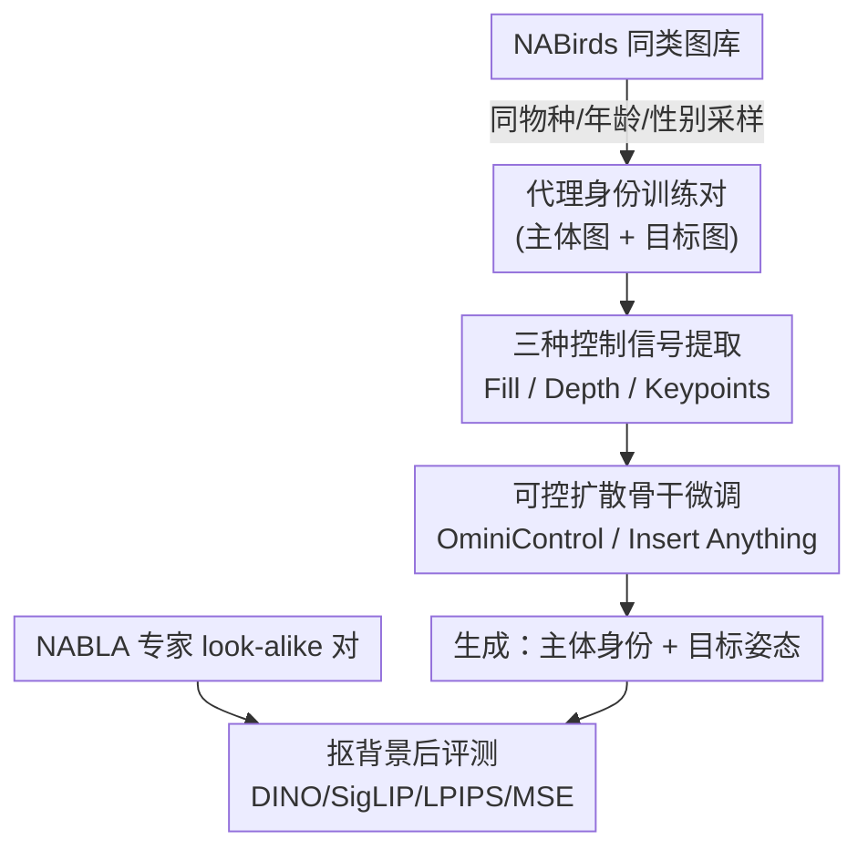

# Not All Birds Look The Same: Identity-Preserving Generation For Birds

**会议**: CVPR 2026  
**论文**: [CVF Open Access](https://openaccess.thecvf.com/content/CVPR2026/html/Sun_Not_All_Birds_Look_The_Same_Identity-Preserving_Generation_For_Birds_CVPR_2026_paper.html)  
**代码**: https://github.com/cvl-umass/nabla  
**领域**: 扩散模型 / 身份保持生成  
**关键词**: 身份保持生成、细粒度类别、鸟类、代理身份、可控扩散

## 一句话总结
针对细粒度鸟类缺乏"同一只鸟多视角"数据的困境，本文用 NABirds 的专家标注构建了 4759 对"长得像同一只"的鸟类图像对作为评测基准（NABLA），并提出用"同物种 / 同年龄 / 同性别 / 同繁殖期"作为身份代理来训练 OminiControl / Insert Anything 等可控扩散模型，在 MSE 上比基线降低约 41%，且能泛化到未见过的物种。

## 研究背景与动机
**领域现状**：可控图像生成这两年从文生图走向了"身份保持生成"——给一张参考图，模型就能在新姿态 / 新视角 / 新背景下重画同一个对象。Insert Anything、OminiControl、AnyDoor 这类零样本方法已经能做虚拟试衣、商品换背景，不再需要针对每个对象单独微调。

**现有痛点**：这些方法服务的是"刚体 + 人脸"——T 恤、鞋子、人脸这些形变有限、训练数据（视频 / 多视角拍摄 / 合成）相对好拿的类别。一旦换到**非刚体、细粒度**的自然类别（鸟类是典型），它们就失灵了：作者在 Figure 2 里展示基线频繁改掉了对象的辨识特征（脸颊斑点数量、胸前花纹）或没对上目标姿态。根本卡点是**拿不到"同一只个体的多张图"作训练数据**——鸟会飞会游会站，姿态范围极大，野外几乎不可能拍到同一只鸟的多视角高清照。

**核心矛盾**：身份保持训练需要"同一身份、不同姿态"的成对数据，但鸟类领域要么有真身份却低质（iNaturalist 公民科学照片有运动模糊、多只鸟混入），要么高质却没身份标注（NABirds 是分类数据集，同类内部个体差异很大）。高质量与真身份在鸟类上**二者不可兼得**。

**本文目标**：（1）造一个能可靠衡量"鸟类身份保持生成"好坏的评测基准；（2）在没有真·同身份训练数据的前提下，把现有可控扩散模型训得真的能保身份。

**切入角度**：作者借用细粒度类别天然的**分类学层级结构**——同一物种 / 同年龄 / 同性别 / 同季节羽色的两只鸟，外观高度相似，可以当作"近似同一身份"的代理。评测端则请鸟类专家从 NABirds 同类图片里**手工挑出真正长得像的成对图**，逼近真身份数据。

**核心 idea**：用"分类学层级当身份代理"来绕开"无同身份数据"这一硬约束——训练时采样同类对、评测时用专家校验的 look-alike 对，让模型学会保持细粒度辨识特征。

## 方法详解

### 整体框架
整套工作分两条线：**数据/基准**和**训练范式**。数据线上，作者构建了三套评测集（NABLA 专家 look-alike 对、iNat-Seen、iNat-Unseen 真身份对）并定义了四个评测指标；训练线上，他们把"同类采样"作为身份代理，喂给现成的可控扩散骨干（OminiControl / Insert Anything），支持 Fill（修复）、Depth（深度）、Keypoints（关键点）三种姿态控制模式。

一次生成的数据流是：从**目标图**抽取控制信号（mask+背景 / 深度图 / 关键点骨架）+ 可选的背景 caption，再把**主体图**（要保身份的那只鸟）和控制信号一起送进扩散模型，生成"主体的身份 + 目标的姿态"的新图；评测时把生成图和目标图都用主体 mask 抠掉背景，再算 DINOv2 / SigLIP / LPIPS / MSE。

### 关键设计

**1. NABLA 基准：用专家校验的 look-alike 对逼近"真身份"评测**

痛点是鸟类没有规模化、高质量的"同一只个体多图"数据，没法评测身份保持。作者请一小组鸟类专家在 NABirds 测试集上做标注：给一张鸟图，从**同类**里挑出"个体看起来一样"的另一张，每类挑 5–10 对、图片不重复（个体差异太大的类挑不满）。最终得到 **4759 对、覆盖 401 个物种**的 NABLA，既保住了 NABirds 单主体、高清的图像质量，又比"同类随机配对"更接近真身份。它不完美（专家也只能凭外观判断），但模拟了当前根本不存在的规模化同身份数据。为验证 NABLA 靠不靠谱，作者还从 iNaturalist 下载了**真·同观测**的成对图（同一次观测=同一只个体）：677 对来自 NABirds 内物种（iNat-Seen）、396 对来自外部物种（iNat-Unseen），用来检验"在 NABLA 上的分数"能不能预测"在真身份上的分数"。

**2. 代理身份训练：用分类学层级（物种/年龄/性别/繁殖期）替代真身份**

这是本文真正让模型变好的核心动作。既然拿不到真·同身份训练对，作者在 NABirds 训练集上每步**随机采样同一"类"的两张图**——这个"类"的粒度随物种而变，可能是物种级，也可能细到性别级、繁殖期级（如雄/雌绿头鸭、繁殖期/非繁殖期雪鹀）。两张图里随机指定一张为主体、一张为目标，从目标图抽控制信号和 caption，用主体+控制训练生成模型。这种采样会产生"粗对"，偶尔配错（两只其实不是一只），但作者认为**平均意义上是合理的身份代理**。直觉上这招有效的原因是：同物种/同性别/同繁殖期的鸟在那些**用于物种识别的判别性细节**（翼斑、喉色、眼后纹）上高度一致，模型被迫学会复制这些细节而非泛泛地"画一只鸟"；实验也证明它能从 NABirds 的物种泛化到**完全未见过的物种**，说明学到的是"细粒度身份保持"这件事本身，而不是死记某些物种。

**3. 三种姿态控制模式 + 背景 caption 补偿歧义**

为了让"目标姿态"可指定，作者在同一框架下实现三种控制：**Fill** 把任务变成 inpainting——控制图是"抠掉主体后的目标图"，mask 由 SAM2（NABirds 用 box 提示）/ Grounded-SAM-2（iNat 用文本 "bird"）得到；**Depth** 用 Video-Depth-Anything 出目标图深度图，对鸟的姿态控制比 mask 更强（mask 容易留姿态歧义）；**Keypoints** 用 NABirds 自带的 11 个关键点（喙、左眼、腹等）画成彩色骨架图（iNat 没有关键点，故 iNat 上不评测此模式）。由于 Depth / Keypoint 模式下背景信息缺失会带来歧义，作者用 Qwen2.5-VL 生成长/短两版**背景 caption** 补给 OminiControl（它本就需要文本提示）。

**4. 双骨干微调：Insert Anything 拼图 + OminiControl token 拼接**

训练沿用两套现成架构。**Insert Anything**：把主体图和抠掉主体的背景图拼成一张"双联画（diptych）"面板，在 FLUX.1-Fill 骨干上用 LoRA 微调，并沿用其对象任务里的 mask 增广（贝塞尔曲线形状 + bounding box 随机增广）。**OminiControl**：把主体和条件的隐 token 直接拼到带噪隐 token 后面送进 DiT，控制图用空间感知编码、主体图不用；每种控制模式单独训练，并在两个骨干 FLUX.1-Schnell（Om-S）和 FLUX.1-Kontext（Om-K）上分别跑。训练用 1024×1024 输入输出、4 张 A100/H100、10000 步、约 3 天。注意作者**没有改扩散 loss**，这也解释了后面"Fill 反而略胜 Depth"的反直觉现象。

### 一个例子：把两只相似鸟摆成同一姿态
取一只 Townsend's Warbler 作主体，一只 Hooded Warbler 的图作目标。系统从目标图抽出深度图（或关键点骨架），连同主体图送进 Om-K，生成一张"长着 Townsend's 翼斑与喉色、却摆成 Hooded 那个姿态"的鸟。把它和另一只也重摆到同一标准姿态后并排，物种间的判别差异（眼后是否有白、喉部黄色范围）就一目了然——这正是论文主打的"机器教学 / 科学可视化"应用：用生成对齐姿态，方便对比近似物种。

## 实验关键数据

### 主实验
四个指标：DINOv2 特征相似度↑、SigLIP 特征相似度↑（衡量类级特征与姿态保持）、LPIPS↓、MSE↓（衡量整体相似度）。下表为 Fill（inpainting）模式在三套评测集上的代表结果（`*` 为未微调基线）：

| 控制 / 模型 | 数据集 | DINO↑ | SigLIP↑ | LPIPS↓ | MSE↓ |
|------|------|------|------|------|------|
| Om-S*（基线） | NABLA | 0.41 | 0.84 | 0.087 | 77.1 |
| Om-S（微调） | NABLA | 0.57 | 0.91 | 0.063 | 54.7 |
| Om-K（最佳） | NABLA | 0.78 | 0.94 | 0.060 | 51.0 |
| Ins-A*（基线） | NABLA | 0.75 | 0.92 | 0.069 | 62.9 |
| Ins-A（微调） | NABLA | 0.77 | 0.94 | 0.063 | 55.0 |
| Om-K（最佳） | iNat-Unseen | 0.78 | 0.94 | 0.029 | 46.9 |

微调把 Om-S 在 NABLA 上的 MSE 从 77.1 降到 54.7（约 29%），最佳 Om-K 降到 51.0；摘要所述的 **41% MSE 降幅**为整体最佳配置相对基线的口径（⚠️ 不同控制模式 / 骨干的基线起点不同，具体降幅以原文 Table 1 为准）。

### 消融 / 分析

| 配置对比 | 关键发现 | 说明 |
|------|---------|------|
| NABLA vs iNat-Seen 分数相关性 | DINO R²=0.986、MSE R²=0.963、SigLIP R²=0.983、LPIPS R²=0.955 | NABLA 上的表现几乎一对一预测真身份对的表现，证明该代理基准有效 |
| Fill vs Depth 控制 | 最佳 Fill（Om-K MSE 51.0）略优于最佳 Depth（Om-K MSE 57.0） | 反直觉：mask 对姿态约束更弱却赢了 |
| seen vs unseen 物种 | iNat-Seen 与 iNat-Unseen 提升幅度相近 | 训练学到的是"鸟类身份保持"本身，能泛化到未见物种 |
| Om-K vs Ins-A | 微调 Om-K 与 Ins-A 全面超过强基线 Insert Anything | Om-K 在 inpainting 上略胜，且保留混合控制的灵活性 |

### 关键发现
- **代理身份足以训练、却不足以评测**：用同类对训练能显著提升真身份保持，但代理对本身存在错配，因此评测必须靠专家校验的 NABLA / 真身份的 iNat，而非训练用的粗对。
- **Fill 略胜 Depth 的反直觉**：作者归因于训练时**没改扩散 loss**——未指定的背景区域可能干扰深度控制；而 inpainting 直接给定背景，反而更稳。
- **泛化是最大亮点**：在 NABirds 物种上训练，却能改进从未见过的 iNat-Unseen 物种，说明方法学到的是可迁移的细粒度身份保持能力。

## 亮点与洞察
- **用分类学结构当身份代理**：这是绕过"无同身份数据"硬约束的巧妙一招——细粒度类别的层级（物种/性别/繁殖期）天然提供了"近似同一身份"的免费监督，思路可迁移到其它细粒度域（鱼类、植物、昆虫）。
- **先验证代理基准再用它下结论**：作者没有直接拿 NABLA 当真理，而是用 iNat 真身份对做相关性回归（R² 普遍 >0.95），先证明"NABLA 分数能预测真身份分数"再展开实验，方法论上很扎实。
- **把生成当"对比工具"而非"内容创作"**：重摆姿态以并排比较近似物种，指向科学可视化 / 机器教学这一被忽视的生成式应用方向。

## 局限与展望
- **代理身份有错配**：同类采样会产生"其实不是一只"的训练对（作者自己在 Figure 3、A9 里承认），对精度要求极高的科学场景仍不够。
- **未改扩散 loss**：背景未约束带来的歧义（Fill vs Depth 反直觉）说明还有优化空间——若在 loss 层面显式约束前景/背景，深度控制本可更强。
- **关键点模式覆盖有限**：iNat 数据无关键点标注，该控制模式无法在真身份数据上评测，泛化性证据不全。
- **专家标注难扩展**：NABLA 依赖少量鸟类专家手挑，4759 对的规模已是人力上限，难以扩到更多物种或其它类别。

## 相关工作与启发
- **vs DreamBooth / Textual Inversion**：它们靠少量主体图微调模型或 token，针对单个对象、需逐对象训练；本文走零样本路线（单参考图推理时即用），且专攻细粒度鸟类的身份保持。
- **vs Insert Anything / OminiControl（直接用作骨干）**：原版在刚体 / 人脸上训练，在鸟类上失身份；本文不改架构，而是换用"代理身份数据 + 鸟类专属控制（depth/keypoint/caption）"重新微调，把同样的骨干在细粒度域救活。
- **vs 类条件细粒度生成（如 DIFFusion）**：类条件生成有层级/分类学信息，但缺姿态控制和身份保持，且对未见物种、异常/暗淡个体泛化差；本文的实例级身份保持 + 姿态控制正好补上这一块。
- **vs 多视角鸟类数据集 / 鸟类 3D 重建**：前者要么低质（运动模糊、多主体）要么物种单一（笼养），后者评测靠相机姿态/mask 等代理任务；本文用专家 look-alike + iNat 真身份对，给"鸟类身份保持生成"提供了首个可靠基准。

## 评分
- 新颖性: ⭐⭐⭐⭐ 把分类学层级当身份代理、并先验证代理基准再下结论，是细粒度生成里少见的扎实思路（骨干本身是现成的）。
- 实验充分度: ⭐⭐⭐⭐ 三套评测集 × 三种控制 × 两个骨干，且用 R²>0.95 的相关性验证基准有效性，覆盖 seen/unseen 物种。
- 写作质量: ⭐⭐⭐⭐ 动机与数据困境讲得清楚，图例对比直观；部分降幅口径（41%）需对照表格确认。
- 价值: ⭐⭐⭐⭐ 填补细粒度鸟类身份保持生成的数据/基准空白，并打开科学可视化 / 机器教学的应用面，数据与代码开源。

<!-- RELATED:START -->

## 相关论文

- [\[CVPR 2026\] Resolving the Identity Crisis in Text-to-Image Generation](resolving_the_identity_crisis_in_text-to-image_generation.md)
- [\[CVPR 2026\] FlowFixer: Towards Detail-Preserving Subject-Driven Generation](flowfixer_towards_detail-preserving_subject-driven_generation.md)
- [\[CVPR 2025\] Not All Parameters Matter: Masking Diffusion Models for Enhancing Generation Ability](../../CVPR2025/image_generation/not_all_parameters_matter_masking_diffusion_models_for_enhancing_generation_abil.md)
- [\[CVPR 2026\] Say Cheese! Detail-Preserving Portrait Collection Generation via Natural Language Edits](say_cheese_detail-preserving_portrait_collection_generation_via_natural_language.md)
- [\[CVPR 2026\] MultiCrafter: High-Fidelity Multi-Subject Generation via Disentangled Attention and Identity-Aware Preference Alignment](multicrafter_high-fidelity_multi-subject_generation_via_disentangled_attention_a.md)

<!-- RELATED:END -->
