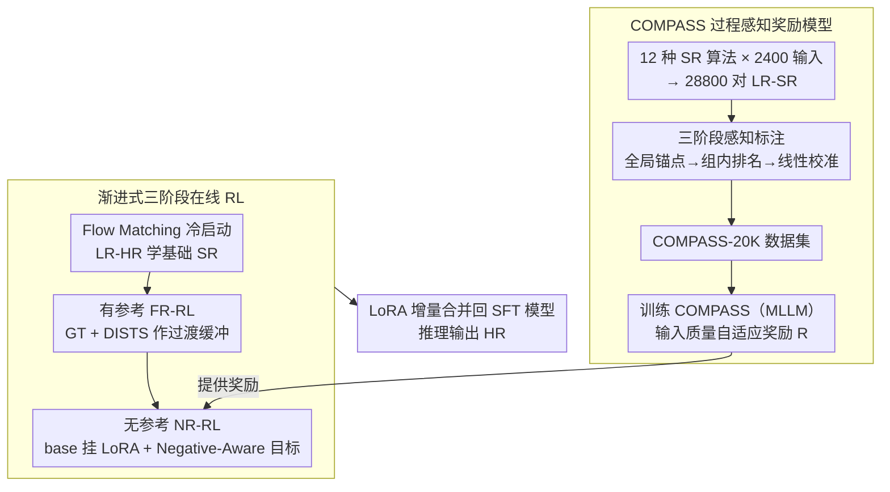

# OARS: Process-Aware Online Alignment for Generative Real-World Image Super-Resolution

**会议**: CVPR 2026  
**arXiv**: [2603.12811](https://arxiv.org/abs/2603.12811)  
**代码**: 无  
**领域**: Image Generation / Image Super-Resolution  
**关键词**: Real-World Super-Resolution, RLHF, reward model, Online RL, Flow Matching, MLLM, Image Quality Assessment

## 一句话总结

提出 OARS 框架，通过基于 MLLM 的过程感知奖励模型 COMPASS 和渐进式在线强化学习（冷启动→有参考 RL→无参考 RL），首次系统解决生成式真实世界图像超分辨率中的人类偏好对齐问题，在保持保真度的同时显著提升感知质量。

## 研究背景与动机

### 问题定义

真实世界图像超分辨率（Real-ISR）旨在从经历了复杂未知退化的低分辨率（LR）图像中恢复高保真、感知质量良好的高分辨率（HR）图像。扩散模型虽然带来了感知质量的飞跃，但标准的监督微调（SFT）存在两个根本性局限：（1）难以泛化到未知的真实退化；（2）缺少直接优化机制将生成内容与人类审美偏好对齐，常导致幻觉或过度平滑。

### 现有方法的不足

将 RLHF 应用于 Real-ISR 面临两大瓶颈：

**奖励设计困境**：全参考（FR）指标需要不可用的 GT；无参考（NR）指标缺乏区分生成式 SR 输出微妙差异的细粒度敏感性。简单地将 FR 和 NR 通过静态线性加权组合忽略了退化严重度的差异——对高质量输入可能增强不足，而对低质量输入可能过度锐化。

**离线 RL 的伪多样性**：DP2O-SR 等离线方法通过对同一 SFT 模型采用不同噪声种子采样来构造偏好对，但在 SR 任务的强空间约束下，这些噪声变化退化为随机纹理幻觉而非真正的结构多样性，优化在狭窄候选池上进行导致探索坍缩。

### 核心思路

论文提出两个关键创新：（1）**过程感知、质量自适应奖励模型**——评估 LR→SR 的转换过程而非静态输出；（2）**在线探索策略**——打破伪多样性瓶颈。

## 方法详解

### 整体框架

OARS 要解决的是生成式 Real-ISR 一直绕不开的难题：扩散模型把感知质量拉了上来，但标准监督微调（SFT）既泛化不到未知的真实退化，又没有任何机制把输出往人类审美上对齐，结果常常是幻觉或过度平滑。OARS 想把 RLHF 真正搬进 SR，而要做成这件事，必须先解决两个卡点——奖励怎么设计、探索怎么做。

整条流水线由两大件拼成。前半是奖励模型 **COMPASS**：用 12 种 SR 算法在 2400 张输入上跑出近 3 万对 LR-SR，经三阶段标注构成 COMPASS-20K 数据集，再训练出一个基于 MLLM、会评估"这次 LR→SR 转换好不好"的过程感知奖励。后半是 **渐进式在线 RL**：从 Flow Matching 冷启动起步，经有 GT 参考的 FR-RL 作过渡，最后在无参考的真实 LQ 数据上以 COMPASS 为奖励做 NR-RL；推理时把学到的 LoRA 合并回 SFT 模型即可。

### 关键设计

**1. COMPASS：评估 LR→SR 的转换过程，而不是静态输出**

奖励设计在 SR 里本身就是个两难——全参考（FR）指标要 GT，可真实场景根本拿不到；无参考（NR）指标又分不出生成式 SR 之间那点微妙差别；把 FR 和 NR 做静态线性加权，则忽略了退化严重度的差异，对本就高质的输入可能增强不足、对低质输入又容易过度锐化。COMPASS 换了个视角：不给孤立的 SR 图打绝对分，而是评估"从这张 LR 出发，这次增强真正带来了多少感知收益、又保住了多少原始内容"。它训练在 COMPASS-20K 上——800 张 DIV2K 合成 LR（Real-ESRGAN 风格退化）加 1600 张覆盖噪声、压缩、失焦与运动模糊的真实 LQ，过 12 种主流算法（DiffBIR、OSEDiff、SeeSR 等）得到 28800 对 LR-SR，每对标注保真度、感知增益与文本描述。

**2. 三阶段感知标注流水线：让标签既全局可比、又组内可细分**

要训出好奖励，标签得同时满足两个互相矛盾的要求：跨图全局可比（不同 LR 的分数能放在同一把尺子上量），又能在同一 LR 的多个 SR 输出之间分出细粒度高下。论文用三步拆解这对矛盾——先用 Q-Insight 给 LR 和每张 SR 独立打全局锚点分，再对同一 LR 的所有 SR 做穷举配对比较得到组内排名，最后做一次线性校准把组内排名对齐回全局尺度。

| 阶段 | 内容 | 产出 |
|------|------|------|
| Stage 1: Global Anchor Scoring | 用 Q-Insight 对 LR 和 SR 独立打分 $Q_{LR}, Q_{SR} \in [1,5]$ | 全局可比的质量锚点 |
| Stage 2: Intra-Group Ranking | 训练配对比较模型（基于 DiffIQA），对同一 LR 的所有 SR 穷举配对比较 | 组内相对排名 $r \in [0,1]$ |
| Stage 3: Rank-Guided Calibration | 逐组线性校准 $\hat{Q}_{SR} = \alpha^* \cdot r + \beta^*$，保排名同时对齐全局尺度 | 校准后的 SR 质量分 |

全局锚点提供可比性，组内排名提供细粒度，线性校准把两者缝合到一起。这一步在消融里单独贡献了 +2.7% 的偏好预测准确率，是整个奖励模型里最值钱的环节。

**3. 输入质量自适应奖励：按退化程度动态门控保真-感知平衡**

有了校准后的 $Q_{LR}$、$Q_{SR}$ 和保真度 $F$，COMPASS 把最终奖励写成：

$$R = F \cdot Q_{LR} + F^{Q_{LR}/\gamma} \cdot \Delta Q,\quad \Delta Q = Q_{SR} - Q_{LR},\ \gamma = 7$$

第一项 $F \cdot Q_{LR}$ 衡量对输入原始质量的保持，第二项才是感知增益，关键在它的系数 $F^{Q_{LR}/\gamma}$ 被输入质量门控了。输入质量高时指数 $Q_{LR}/\gamma$ 变大，奖励对保真度下降变得高度敏感，逼模型保守增强；输入质量低时这层约束松开，允许更激进的感知改善。举个直观的对照：一张本就清晰的图（$Q_{LR}$ 高），$F$ 稍掉一点就会被 $F^{Q_{LR}/\gamma}$ 大幅压低收益，逼模型别乱改；一张糊得厉害的图（$Q_{LR}$ 低），同样的 $F$ 损失换来的惩罚轻得多，于是模型敢放手去补细节——这正是人类审美的直觉。$\gamma=7$ 在消融里是甜点，5 和 9 都更差。

**4. 渐进式三阶段在线 RL：用 base-model 探索破除离线伪多样性**

离线方法（如 DP2O-SR）靠对同一 SFT 模型换噪声种子采样来造偏好对，但在 SR 的强空间约束下，换种子只换来随机纹理幻觉而非真正的结构多样性，候选池太窄、探索很快坍缩。OARS 改走在线三阶段：Stage 1 用 Flow Matching 在大规模 LR-HR 上冷启动学基本 SR 能力；Stage 2 是有 GT 的 FR-RL，作为 SFT 与无参考优化之间的缓冲（直接上 RL 容易不稳、容易 reward hacking），其保真度直接用 DISTS 对 GT 算、不依赖学出来的奖励模型；Stage 3 在无 GT 的真实 LQ 上继续，奖励完全交给 COMPASS，最终把 LoRA 增量 $\Delta_{NR}$ 合并回 SFT 模型。三阶段里还有个反直觉但关键的选择：RL 不在 SFT 权重上做，而是在 base model 上挂 LoRA 更新——base 与 SFT 参数分布接近、合并更稳，base 采样随机性更高、更利于探索，而且不直接动 SFT 权重也更难被 reward hacking。消融印证了这点：在 SFT 上做 RL 会让 PSNR 从 22.71 一路掉到 21.31，而在 base 上做 LoRA 只轻微下降、NR 指标反而涨得更多。

**5. Negative-Aware 目标：既把好样本拉近、又把坏样本推远**

RL 阶段的目标函数显式构造了正、负两个策略方向：

$$v_\theta^+(x_t, t) = (1-\lambda)v_{old} + \lambda v_\theta,\qquad v_\theta^-(x_t, t) = (1+\lambda)v_{old} - \lambda v_\theta$$

再按组内奖励归一化后的最优概率 $r$ 加权两者的 Flow Matching 误差：

$$\mathcal{L}_{RL}(\theta) = \mathbb{E}\big[\, r\,\|v_\theta^+ - v\|_2^2 + (1-r)\,\|v_\theta^- - v\|_2^2 \,\big]$$

$r$ 越高的样本越往正策略方向拉、越低的越往负策略方向推，比只奖励好样本多了一路"远离坏样本"的梯度。组内奖励还要先过方差过滤：均值高（>0.9）说明整组都差不多好、方差低（<0.05）说明组内没区分度，这种组提供不了有效监督，会被直接丢弃以免模糊信号污染训练。

### 损失函数 / 训练策略

冷启动阶段的 Flow Matching SFT 目标为

$$\mathcal{L}_{SFT}(\theta) = \mathbb{E}\big[\|v - v_\theta(x_t, t \mid x_{LR}, c)\|_2^2\big]$$

base model 用 Qwen-Image-Edit-2509，LoRA rank=32、alpha=64；训练采样 6 步、推理 40 步；每张 LR 采样 K=24 个候选组，组过滤阈值为均值 >0.9 且方差 <0.05 时丢弃（近似相同的样本无区分价值）。

## 实验关键数据

### 主实验：三大数据集上的 SR 性能（Table 2，RealSR 子集）

| 方法 | PSNR↑ | SSIM↑ | LPIPS↓ | DISTS↓ | LIQE↑ | MUSIQ↑ | MANIQA↑ | Q-Insight↑ | TOPIQ↑ |
|------|-------|-------|--------|--------|-------|--------|---------|------------|--------|
| DiffBIR | 23.20 | 0.6346 | 0.3350 | 0.2162 | 3.553 | 65.25 | 0.462 | 3.530 | 0.603 |
| SeeSR | 24.34 | 0.7187 | 0.2754 | 0.2134 | 3.394 | 65.53 | 0.486 | 3.285 | 0.625 |
| OSEDiff | 23.07 | 0.6850 | 0.2941 | 0.2109 | 4.068 | 68.95 | 0.488 | 3.712 | 0.644 |
| UARE | 21.38 | 0.6464 | 0.3095 | 0.2344 | 4.066 | 69.67 | 0.526 | 3.664 | 0.680 |
| Qwen-SFT | 22.71 | 0.6462 | 0.3100 | 0.2203 | 3.815 | 68.57 | 0.490 | 3.545 | 0.640 |
| **OARS** | **22.36** | **0.6481** | **0.3095** | **0.2244** | **4.305** | **71.41** | **0.528** | **3.701** | **0.680** |

**关键发现**：OARS 在所有 NR 指标上一致取得最优或次优，同时 FR 指标（PSNR/SSIM/LPIPS/DISTS）相比 Qwen-SFT 基本无退化。相比感知导向方法（PURE、UARE），OARS 在 FR 指标上更优，表明奖励设计与 RL 策略有效平衡了保真度与感知增强。

### 消融实验：奖励模型各组件（Table 3）

| Case | Score Calibration | Explicit Fidelity | Quality-Adaptive γ | Accuracy |
|------|:-:|:-:|:-:|------|
| 1 | ✗ | ✗ | ✗ | 78.8% |
| 2 | ✓ | ✗ | ✗ | 81.5% |
| 3 | ✓ | ✓ | ✗ | 82.3% |
| 4 | ✓ | ✓ | γ=5 | 82.7% |
| 5 | ✓ | ✓ | **γ=7** | **83.1%** |
| 6 | ✓ | ✓ | γ=9 | 82.8% |

三阶段校准提升 +2.7%，显式保真度建模 +0.8%，质量自适应 γ 进一步带来 +0.8%。

### 消融实验：RL 阶段与初始化策略（Table 5，RealSR）

| 方法 | RL Stage | 初始化 | PSNR↑ | LIQE↑ | MUSIQ↑ | TOPIQ↑ |
|------|----------|--------|-------|-------|--------|--------|
| Qwen-SFT | - | - | 22.71 | 3.815 | 68.57 | 0.640 |
| Case 1 | stage1 | base | 22.52 | 4.235 | 71.02 | 0.674 |
| Case 2 | stage1+2 | **base** | **22.36** | **4.305** | **71.41** | **0.680** |
| Case 3 | stage1 | sft | 22.15 | 4.078 | 70.60 | 0.676 |
| Case 4 | stage1+2 | sft | 21.31 | 4.094 | 70.56 | 0.677 |

**关键发现**：在 SFT 模型上做 RL（Case 3-4）FR 指标持续下降，尤其 stage1+2 后 PSNR 从 22.71 降至 21.31。而在 base model 上做 LoRA 优化（Case 1-2）则更稳健，PSNR 仅轻微下降，NR 指标提升更显著。这验证了浅层 LoRA 在 base model 上的在线探索策略的优越性。

### 其他关键发现

- **用户研究**：27 名专家评估，OARS 获得 47.62% 投票率，远超第二名 DP2O-SR（27.68%）
- **SRIQA-Bench 偏好准确率**：COMPASS 达到 83.1% All-Acc，超越所有 GT-Ref 和 GT-Free 基线
- **泛化性验证**：将 OARS 应用于 Flux 骨干网络同样有效，MANIQA 从 0.469 提升到 0.504
- **与 Flow-GRPO 对比**：前向过程 RL（DiffusionNFT 范式）比轨迹级 RL 更高效（5-10× 更快），且在 SR 的强约束场景下更稳定

## 亮点与洞察

1. **过程导向评估范式**：将 SR 评估从"输出为中心"转变为"过程感知"，评估 LR→SR 的转换过程而非静态输出。这一观念转变使得保真度和感知增益可以被统一建模。

2. **三阶段标注流水线**：巧妙解决了"全局可比性 vs 组内细粒度区分"的矛盾——全局锚点提供可比性，组内排名提供细粒度，线性校准实现统一。

3. **浅层 LoRA 的双重作用**：在 base model 上做 LoRA 不仅提供了更高的采样随机性用于在线探索，还因为避免直接修改 SFT 权重而降低了 reward hacking 风险。推理时再合并回 SFT 模型，设计极其优雅。

4. **输入质量自适应门控**：$F^{Q_{LR}/\gamma}$ 的设计使奖励函数能根据退化程度自动调整保真度-感知的平衡点，高质量输入保守增强、低质量输入允许更大改善，非常符合直觉。

## 局限性与可改进方向

1. **计算开销**：需要 8×H20 GPU 训练 RL + 8×A100 部署奖励服务器，资源门槛极高
2. **多阶段训练复杂度**：三阶段渐进式训练（SFT→FR-RL→NR-RL）增加了工程复杂度和超参调优空间
3. **奖励模型泛化性**：COMPASS 在 SRIQA-Bench 上验证，但该 benchmark 规模较小（100 张 LR），在更多样化分布上的泛化性待验证
4. **缺少对 degradation-aware 的显式建模**：虽然通过 $Q_{LR}$ 隐式感知退化程度，但未显式建模退化类型，对特定退化模式（如严重压缩伪影）的处理可能非最优
5. **仅验证 4× SR**：未验证其他放大倍数和不同分辨率范围的适用性

## 相关工作与启发

- **DiffusionNFT**（前向过程 RL）和 **Flow-GRPO**（轨迹级 RL）：两种 RL 范式对比表明，对于强条件约束的生成任务，前向过程 RL 更高效稳定
- **DP2O-SR**（离线 DPO）：本文清晰论证了离线方法在 SR 任务中伪多样性问题的本质原因
- **Q-Insight**：被用作全局质量锚点和基础比较模型，展示了 MLLM-based IQA 的潜力
- **DiffIQA/SRIQA-Bench**：提供了 SR 质量评估的 benchmark，但其配对标注不完整，本文的三阶段流水线是对此的重要补充
- **启发**：过程感知奖励的思想可推广到其他图像增强任务（去噪、去雾、HDR 等），输入质量自适应机制可推广到任何需要平衡保真度和增强效果的场景

## 评分

| 维度 | 分数 (1-5) | 说明 |
|------|:---:|------|
| 创新性 | 4.5 | 过程感知奖励和渐进式在线 RL 的组合是本领域首次系统尝试 |
| 技术深度 | 4.5 | 三阶段标注、自适应奖励公式、浅层 LoRA 探索策略均有清晰动机和理论支撑 |
| 实验充分性 | 4.5 | 三数据集 + 多指标 + 用户研究 + 丰富消融 + 多骨干验证 |
| 写作质量 | 4.0 | 结构清晰，但部分公式与设计的直觉解释可更充分 |
| 实用价值 | 3.5 | 方法有效但资源门槛极高，实际部署成本限制了应用范围 |
| **总分** | **4.2** | 在生成式 SR 的 RLHF 方向上做出系统性贡献，工作完成度极高 |

<!-- RELATED:START -->

## 相关论文

- [\[CVPR 2026\] VOSR: A Vision-Only Generative Model for Image Super-Resolution](vosr_a_vision_only_generative_model_for_image_super_resolution.md)
- [\[CVPR 2026\] FRAMER: Frequency-Aligned Self-Distillation with Adaptive Modulation Leveraging Diffusion Priors for Real-World Image Super-Resolution](framer_frequency-aligned_self-distillation_with_adaptive_modulation_leveraging_d.md)
- [\[AAAI 2026\] Mixture of Ranks with Degradation-Aware Routing for One-Step Real-World Image Super-Resolution](../../AAAI2026/image_generation/mixture_of_ranks_with_degradation-aware_routing_for_one-step_real-world_image_su.md)
- [\[AAAI 2026\] Continuous Degradation Modeling via Latent Flow Matching for Real-World Super-Resolution](../../AAAI2026/image_generation/continuous_degradation_modeling_via_latent_flow_matching_for_real-world_super-re.md)
- [\[ICLR 2026\] DiffusionNFT: Online Diffusion Reinforcement with Forward Process](../../ICLR2026/image_generation/diffusionnft_online_diffusion_reinforcement_with_forward_process.md)

<!-- RELATED:END -->
