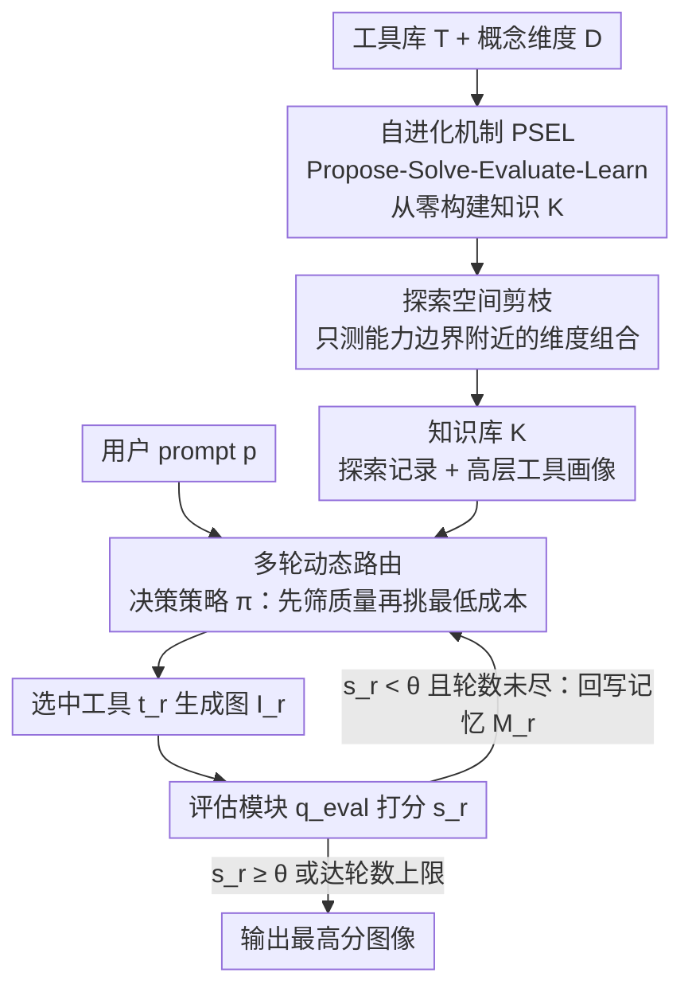

# OctoT2I: A Self-Evolving Agentic Text-to-Image Router

**会议**: CVPR 2026  
**论文**: [CVF Open Access](https://openaccess.thecvf.com/content/CVPR2026/html/Jiang_OctoT2I_A_Self-Evolving_Agentic_Text-to-Image_Router_CVPR_2026_paper.html)  
**代码**: https://github.com/JaxJiang2642081986/OctoT2I  
**领域**: 扩散模型 / Agent / 图像生成  
**关键词**: 智能体路由, 文生图, 自进化, 推理效率, 工具选择

## 一句话总结
OctoT2I 把"给定 prompt 该用哪个文生图模型"重构成"在满足质量阈值前提下挑成本最小的工具"的约束优化问题，用一个能多轮决策的路由智能体，配合一套**无需人工标注、从零自建**的工具知识库（PSEL 自进化循环），在 GenEval 上拿到 0.96 的综合分，同时相比最强基线 Flow-GRPO 提速 90.3%、能效提升 56.6%。

## 研究背景与动机

**领域现状**：文生图（T2I）模型一边往大走（SD3 8B、Playground v3 24B、Flow-GRPO 这类靠 RL 后训练冲性能），一边往小走（SD-Turbo 单步生成、SANA 消费级显卡跑高分辨率）。模型越来越多、能力越来越分化，已经形成一个多模型并存的生态。

**现有痛点**：单模型继续缩放的边际收益在递减，而普通用户根本没有专业知识去为某条具体 prompt 挑最合适的模型。于是"用一个 LLM 当控制器、调度多个现成 T2I 工具"的 agentic T2I 思路出现了，但现有 agentic 方法有三个硬伤：(1) **知识来源贵**——要么依赖人手写的工具先验（GenArtist），覆盖度和粒度决定上限；要么训 LLM 去拟合海量人工标注（DiffAgent、ChatGen），标注与训练成本高、扩展性差，且天花板被人类监督锁死；(2) **决策机制僵**——大多只用一个固定工具跑一轮，Idea2Img 虽然多轮但用的生成工具始终不变；(3) **完全忽略效率**——推理延迟和算力成本被无视，交互式场景下体验差、部署不可持续。

**核心矛盾**：T2I 路由本质是"质量"和"成本"的权衡，但现有 agentic 工作只盯质量、把成本当空气，而且它们获取"哪个工具擅长什么"这件事的方式（人工先验/人工标注）既贵又封顶。

**本文目标**：把 agentic T2I 重新定义为**生成质量与推理效率的联合优化**，并解决"工具知识怎么不靠人工、低成本地拿到"。

**切入角度**：作者观察到，每个工具其实有自己清晰的"能力边界"（fastest-but-fails-counting 的 SD-Turbo vs slow-but-capable 的 Flow-GRPO），如果让智能体**自己跟工具反复交互、量化测出这条边界**，就能摆脱对人类先验的依赖。

**核心 idea**：用一个有状态、多轮的路由智能体（reason-act-reflect 闭环）做"在质量约束下挑成本最小工具"的决策，其底层知识由一套自进化的"Propose–Solve–Evaluate–Learn"循环从零自建。

## 方法详解

### 整体框架
OctoT2I 由两条相互咬合的链路组成。**离线的自进化链路**先把空的知识库 $K$ 喂满：智能体自己定义一组正交的"概念维度"（颜色、计数、位置等），再对每个工具跑 PSEL 循环，在"探索空间剪枝"引导下只测能力边界附近的任务，最终沉淀出"prompt 探索记录 + 高层工具画像"两层知识。**在线的推理链路**则在每条用户 prompt 上跑多轮路由：决策策略 $\pi$ 查知识 $K$ 与本轮工作记忆 $M_{r-1}$，先筛掉估计质量不达标的工具，再在达标工具里挑估计成本最低的，生成图后由评估模块打分、回写记忆，分数达阈值 $\theta$ 或轮数用尽就输出最优图。

### 关键设计

**1. 把路由重构成"质量约束下的成本最小化"**

现有 agentic 方法只追质量、对成本视而不见，这正是它们推理慢、不可部署的根因。OctoT2I 直接把目标写成约束优化：给定用户可接受的质量阈值 $\theta$，理想工具是所有"质量达标"的工具里成本最低的那个，即 $t^*(p) = \arg\min_{t_i \in T} c(t_i) \ \text{s.t.}\ q(I,p) \ge \theta$。问题在于智能体事先并不知道每个工具的真实质量函数 $q(\cdot)$ 和成本函数 $c(\cdot)$，只能从历史数据估计 $\hat q$、$\hat c$ 并容忍估计误差。这个公式把"挑模型"从模糊的偏好问题变成了可量化、可优化的决策问题，也让"效率"第一次成为 T2I 路由的一等目标。

**2. 多轮动态路由：知识+记忆+评估的 reason-act-reflect 闭环**

把 Eq.(1) 落地成一个"filter-then-select"的可执行过程。决策策略 $\pi$ 由一个带显式思维链模板 $p_{\text{decision}}$ 的 LLM 实现：第 $r$ 轮先查长期知识 $K$ 与本轮工作记忆 $M_{r-1}$，对每个工具估计质量 $\hat q$，挑出达标的可行集 $\hat q(t_i(p),p)\ge\theta$；再从可行集中取估计成本 $\hat c$ 最低者，即 $t_r=\arg\min_{t_i\in T,\hat q\ge\theta}\hat c(t_i)$。选中工具生成 $I_r=t_r(p)$，评估模块给分 $s_r=q_{\text{eval}}(I_r,p)$，把 $(t_r,I_r,s_r)$ 连同"目前最好结果" $(I_{\text{best}},s_{\text{best}})$ 一起写进记忆 $M_r$，作为下一轮上下文。分数达 $\theta$ 或轮数到 $R$ 即终止并返回最高分图。和"固定一个工具跑一轮"或"多轮但工具不变"的旧方案相比，它能在轮间根据真实反馈换工具，是真正的有状态自适应路由。评估函数受 VQA-Score 启发：用 MLLM 回答"图文是否对齐"的 yes/no，但不取离散文本回答，而是抽 yes/no 两个 token 的原始 logit 做 softmax 得到连续分 $s_r$，提供细粒度反馈。

**3. 自进化机制：PSEL 循环从零构建工具知识**

这是替代"人工先验/人工标注"的核心。知识库 $K$ 初始为空，智能体先用 prompt $p_{\text{define}}$ 自主生成 $N_D$ 个基础且正交的概念维度 $D$（如颜色、位置、计数、文化），完整探索空间定义为去掉空集的幂集 $C_{\text{explore}}=2^D\setminus\{\emptyset\}$，并按组合复杂度由简到繁（$|\tau|$ 从 1 到 $N_D$）推进。对每个工具跑 PSEL 四步：**Propose** 把维度组合 $\tau$ 实例化成 $N_p$ 条具体 prompt $P_\tau$（维护历史只产新 prompt 保多样）；**Solve** 用当前工具对每条 prompt 独立跑 $N_{\text{sol}}$ 次得候选图；**Evaluate** 用 $q_{\text{eval}}$ 打分并用 Pass@1 估"单次输出达阈值"的概率 $\text{Pass@1}(p_\tau,t_i)=\frac{1}{N_{\text{sol}}}\sum_n \mathbb{I}(s_{\tau,n}\ge\theta)$；**Learn** 把结果沉成两层知识——细粒度的"prompt 探索记录"（含 Pass@1 成功率，供决策时检索相似案例）和抽象的"高层工具画像"（含平均推理成本 + 工具长短板的语义描述，供对新 prompt 自上而下推理）。整个过程纯自交互、零外部数据，因此能突破手写先验的覆盖天花板。

**4. 探索空间剪枝：只测能力边界附近的任务**

幂集 $C_{\text{explore}}$ 随维度数指数爆炸，暴力遍历不可行；而作者的目标也不是做一个面面俱到的静态基准，而是高效地探到每个工具的**能力前沿**。剪枝策略遵循"递归前提原则"：一个复杂组合 $\tau$ 只有当智能体根据已有知识判定该工具已掌握它的**所有更简单子任务**（$\forall \tau'\subset\tau,\tau'\neq\emptyset$）时才值得探索——"掌握"的判据是该工具在 $\tau'$ 对应 prompt 上的历史平均 Pass@1 超过 $\theta$。这样每个工具都拿到一份个性化、动态的探索计划，算力集中在能力边界上。消融显示该策略把探索的 prompt 数从 1270 压到 370、自进化总时间从 6857s 降到 2329s，而最终 Overall 分纹丝不动（0.96）。

### 损失函数 / 训练策略
路由控制器是 Qwen2-0.5B，通过对 GPT-4.1 的**策略蒸馏**得到，因此推理端只需跑一个 0.5B 小模型。关键超参：轮数上限 $R=4$、质量阈值 $\theta=0.8$、概念维度数 $N_D=7$、每组合 prompt 数 $N_p=10$、每 prompt 重复生成 $N_{\text{sol}}=5$。工具库含 5 个 T2I 模型（Flow-GRPO、SDXL-Turbo、SD-Turbo、SANA1.5、SANA-Sprint），评估模块在 GenEval/T2I-CompBench++ 上用 NVILA-Lite-2B-Verifier、WISE 上用 GPT-4o。全部实验在 4 张 RTX 3090 上完成。

## 实验关键数据

### 主实验
在 GenEval 上，OctoT2I 的 Overall 达 0.96，超过所有非 agentic 与 agentic 方法；在更难的组合基准 T2I-CompBench++ 上平均分 0.6618，同样领先。

| 基准 | 指标 | OctoT2I | Flow-GRPO(最强非agentic) | 最强 agentic 基线 |
|------|------|---------|--------------------------|-------------------|
| GenEval | Overall↑ | **0.96** | 0.93 | 0.67 (Idea2Img) |
| GenEval | Counting↑ | **0.95** | 0.88 | 0.68 (Idea2Img) |
| GenEval | Position↑ | **1.00** | 0.95 | 0.29 (GenArtist) |
| T2I-CompBench++ | Average↑ | **0.6618** | 0.6332 | 0.5060 (Idea2Img) |
| T2I-CompBench++ | Numeracy↑ | **0.7508** | 0.6752 | 0.5240 (Idea2Img) |

效率上优势更夸张（括号为相对 OctoT2I 的倍数，越低越好）：

| 方法 | 平均耗时(s)↓ | CO2e(g)↓ | kWh·PUE↓ |
|------|-------------|----------|----------|
| Idea2Img | 453.22 (45.2×) | 12033 (21.5×) | 27.79 (21.6×) |
| GenArtist | 117.29 (11.7×) | 4404 (7.87×) | 10.17 (7.89×) |
| Flow-GRPO | 19.07 (1.90×) | 879 (1.57×) | 2.02 (1.57×) |
| **OctoT2I** | **10.02 (1.00×)** | **559.5 (1.00×)** | **1.29 (1.00×)** |

相对 Flow-GRPO，推理提速 90.3%、能效提升 56.6%；相对 Idea2Img/GenArtist 快约 45×/11×。

### 消融实验
| 配置 | 关键指标 | 说明 |
|------|---------|------|
| 自进化知识 (Ours) | GenEval Overall 0.96 | 完整方法 |
| 换成 GPT 内部知识 | 掉到 0.85 | 只靠预训练知识、无外部库，掉 0.11 |
| 换成手写先验 | 掉到 0.93 | 模仿 GenArtist 的人工描述，掉 0.03 |
| w/ 决策策略 (Ours) | T2I-CompBench++ Avg 0.6618 | 完整方法 |
| w/o 决策策略(随机选) | 掉到 0.5379 | 去掉知识驱动决策、改随机，相对掉约 0.23 |
| w/ 探索剪枝 (Ours) | Overall 0.96 / 探索 370 prompt / 2329s | 完整方法 |
| w/o 探索剪枝 | Overall 0.96 / 1270 prompt / 6857s | 不剪枝，质量不变但成本×3 |

### 关键发现
- **自进化知识比人工先验更值**：自进化把 GenEval 推到 0.96，比 GPT 内部知识高 0.11、比手写先验高 0.03，说明"让智能体自己测出工具边界"确实比人写的描述更可靠。
- **决策策略是性能命门**：把知识驱动决策换成随机选工具，T2I-CompBench++ 平均分从 0.6618 崩到 0.5379——多轮试错本身不够，必须有知识引导。
- **剪枝是纯赚的效率优化**：去掉剪枝后质量完全不变（都是 0.96），但探索 prompt 数和自进化耗时都涨了约 3 倍，说明剪枝精准地把算力省在了能力边界外的无效探索上。
- **阈值 $\theta$ 是质量-效率旋钮**：消融显示 $\theta$ 越高质量略升但平均耗时上升，作者取 0.8 做平衡。

## 亮点与洞察
- **把"挑模型"形式化为约束优化**：$\arg\min c$ s.t. $q\ge\theta$ 这一句把模糊的"哪个模型好"变成可优化目标，并第一次把推理效率抬成 T2I 路由的一等公民——这个 framing 本身就很可迁移（任何"多工具择一"场景都能套）。
- **从零自建工具知识的 PSEL 闭环**：用"由简到繁的概念维度幂集 + 递归前提剪枝"系统性地探测能力边界，绕开了人工标注的成本与天花板，是本文最"啊哈"的部分。
- **连续分评估信号**：不取 MLLM 的 yes/no 文本，而抽两个 token 的 logit 做 softmax，把离散判断变成细粒度反馈，这个 trick 可直接搬到任何用 MLLM 当 verifier 的流程里。
- **小模型当控制器**：把 GPT-4.1 蒸馏进 Qwen2-0.5B，推理端只跑 0.5B，是它能做到 10s/图的工程基础。

## 局限与展望
- 知识与剪枝都强依赖评估函数 $q_{\text{eval}}$ 的可靠性，若 MLLM 打分有偏，能力边界会被测歪，进而误导路由（作者未做评估器噪声的鲁棒性分析）。⚠️
- 工具库只有 5 个模型、概念维度 $N_D=7$，当工具数和维度数变大时，即便有剪枝，自进化成本是否仍可控、画像是否会过时，论文未充分讨论。
- 阈值 $\theta$、轮数 $R$ 等关键超参是手工设定的全局常量，没有按 prompt 难度自适应——简单 prompt 可能浪费轮数，极难 prompt 可能轮数不够。
- 改进方向：让评估器与路由策略联合训练以抵抗打分噪声；把 $\theta/R$ 做成随 prompt 难度自适应；探索工具库在线增删时知识库的增量更新。

## 相关工作与启发
- **vs Idea2Img**: 它能多轮但生成工具固定、且只用 LLM 做验证与改写 prompt，本文是真正多轮换工具的动态路由，且显式优化效率，速度快约 45×。
- **vs GenArtist / ChatGen**: 前者靠人手写工具先验、后者训 LLM 拟合人工标注，知识获取贵且封顶；本文用自进化从零自建知识，GenEval 0.96 vs 0.49/0.44，且更省算力。
- **vs Flow-GRPO（最强单模型）**: 它靠 RL 后训练把单模型冲到 0.93，但推理重；本文不训生成模型、只智能调度现成工具，质量更高（0.96）且提速 90.3%。

## 评分
- 新颖性: ⭐⭐⭐⭐⭐ 把 T2I 路由重构为质量-效率约束优化 + 自进化从零建知识，framing 与机制都新。
- 实验充分度: ⭐⭐⭐⭐ 三大基准 + 效率/能耗 + 三组消融较完整，但工具库偏小、评估器鲁棒性未测。
- 写作质量: ⭐⭐⭐⭐ 问题定义清晰、图文对照好，PSEL 各阶段交代到位。
- 价值: ⭐⭐⭐⭐⭐ 在多模型生态下给"自动挑模型"提供了低成本可落地方案，效率收益显著。

<!-- RELATED:START -->

## 相关论文

- [\[CVPR 2026\] Agentic Retoucher for Text-To-Image Generation](agentic_retoucher_for_texttoimage_generation.md)
- [\[CVPR 2026\] Self-Evaluation Unlocks Any-Step Text-to-Image Generation](self-evaluation_unlocks_any-step_text-to-image_generation.md)
- [\[CVPR 2026\] Vinedresser3D: Agentic Text-guided 3D Editing](vinedresser3d_agentic_text-guided_3d_editing.md)
- [\[CVPR 2026\] OSPO: Object-Centric Self-Improving Preference Optimization for Text-to-Image Generation](ospo_object-centric_self-improving_preference_optimization_for_text-to-image_gen.md)
- [\[CVPR 2026\] SOLACE: Improving Text-to-Image Generation with Intrinsic Self-Confidence Rewards](solace_self_confidence_rewards_t2i.md)

<!-- RELATED:END -->
