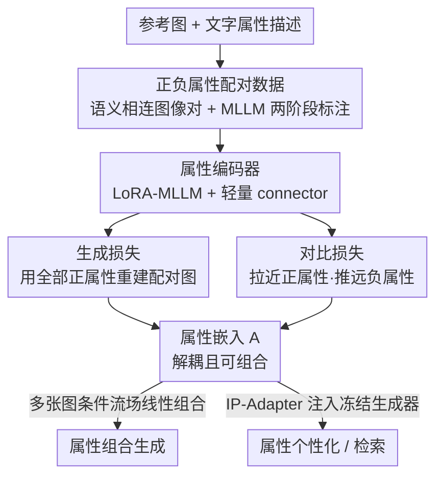

# Omni-Attribute: Open-vocabulary Attribute Encoder for Visual Concept Personalization

**会议**: CVPR 2026  
**arXiv**: [2512.10955](https://arxiv.org/abs/2512.10955)  
**代码**: https://snap-research.github.io/omni-attribute (项目页)  
**领域**: 扩散模型 / 图像个性化  
**关键词**: 属性解耦, 开放词表编码器, 视觉概念个性化, 对比学习, 可组合生成

## 一句话总结
针对现有个性化方法用通用图像编码器（CLIP/DINOv2/VAE）提取的整体嵌入"什么都纠缠在一起"、容易把光照、衣着等无关信息一起搬过去（copy-and-paste 伪影）的问题，Omni-Attribute 让编码器同时吃「图像 + 一段文字属性描述」，专门学习只编码指定属性（身份/表情/光照/风格…）的开放词表嵌入；通过「正负属性配对数据 + 生成损失与对比损失双目标训练」，在属性检索、个性化、多属性组合三个任务上都取得 SOTA。

## 研究背景与动机
**领域现状**：视觉概念个性化（把参考图的某个属性迁到新语境，如"按这张照片生成我的狗"）目前主流做法是 encoder-based：先用一个通用图像编码器（CLIP、DINOv2、VAE）把参考图压成 holistic 嵌入，再用 IP-Adapter 之类的模块把这个嵌入注入冻结的生成器去条件化合成。

**现有痛点**：通用编码器把图像里所有视觉信息（身份、表情、姿态、背景、光照、相机角度、艺术风格…）压进**一个**纠缠的表示里。当你只想迁移"身份"时，编码器会顺手把参考图的光照、衣着一起带过去——也就是论文反复强调的 "copy-and-paste" 伪影和信息泄漏。图像编辑类模型（OmniGen2、FLUX-Kontext、Qwen-Image-Edit）虽然更像参考图，但同样无法把目标属性单独剥出来。

**核心矛盾**：问题出在**编码器侧**而非生成器侧——既然嵌入本身就把所有属性糊在一起，下游再怎么调都难以单独控制某一个属性。而少数尝试属性解耦的工作（Token-Verse、Mod-Adapter、OADis、DeCLIP）要么受限于 AdaLN 的简单仿射调制、要么只能处理**固定闭集**的属性，不支持开放词表。

**本文目标**：直接在编码器侧学"属性级"表示——要求嵌入 (i) 忠实且**排他地**只编码指定属性的信息，(ii) **抑制**其余无关视觉信息，并且属性是**开放词表**（任意一句文字描述都能指）。

**核心 idea**：把属性表示学习建模成一个**双目标优化**问题，并**数据与模型联合设计**：数据上构造"语义相连图像对 + 正/负属性标注"明确告诉编码器该保留什么、该抑制什么；模型上让一个 MLLM 同时吃图像和文字属性，用「生成损失保真 + 对比损失解耦」两个互补损失训出可解耦、可组合的属性嵌入。

## 方法详解

### 整体框架
Omni-Attribute 由一个**属性编码器 $\mathcal{E}$** 和一个**图像解码器 $\mathcal{D}$** 组成。输入是「一张参考图 $I_r$ + 一段文字属性描述」，编码器输出一串只关于该属性的嵌入 $\bm{A}=[\bm{a}_1,\ldots,\bm{a}_l]$，解码器再把这串嵌入注入冻结的生成器，在新 prompt $c$ 指定的语境里合成出来——全程前馈，无需测试时优化。

要让编码器学会"只编码指定属性"，必须有监督信号告诉它"哪些信息该留、哪些该丢"。因此整条管线分三块：(1) **数据侧**先用 MLLM 给语义相连的图像对打上正/负属性标注，构造出监督；(2) **训练侧**用一个参考图重建它的配对图（生成损失）+ 在正负属性嵌入间施加吸引/排斥（对比损失）双目标联合优化；(3) **模型侧**编码器是 LoRA 微调的 MLLM + 轻量 connector，解码器是冻结生成器 + 可训 IP-Adapter。训练好后，多张图各自的属性嵌入还能通过"条件流场线性组合"拼进同一张图（属性组合）。

### 关键设计

**1. 正/负属性配对标注：用监督告诉编码器"留什么、丢什么"**

属性级表示的最大难点是"监督信号从哪来"——单看一张图根本无法定义"身份"该编码进什么、把光照排除掉什么。本文的做法是构造**语义相连的图像对** $(I_x, I_y)$，并给每对图标两类属性：**正属性** $\{a_1^+,\ldots,a_m^+\}$ 描述两张图**共享**的语义（如都是同一只动物），**负属性** $\{a_1^-,\ldots,a_n^-\}$ 描述两张图**不同**的特征（如背景/姿态不同）。这种成对结构等于显式告诉编码器：正属性是该跨两图保留的信息，负属性是该被抑制、不该混进来的信息。右侧词云显示标注属性极其丰富多样，这正是"开放词表"的来源——属性不是固定闭集，而是任意自然语言短语。

标注质量与成本之间存在矛盾：高质量标注需要强 VLM 理解 + 又长又细的指令 prompt，大规模推理代价高。作者用**两阶段标注**化解：第一阶段用 72B 参数 MLLM + 详细指令 prompt（并借鉴 Chain-of-Thought 显式让模型逐条描述每个正/负属性的细粒度异同）产出一个高质量子集；第二阶段在该子集上**微调一个 32B MLLM 当专用标注器**，让它内化任务推理与结构化输出格式，从而**不再需要那段长指令**就能高质量标注，输入 token 长度降 $3.1\times$、单样本标注延迟降 $6.3\times$。

**2. 生成损失：保证属性嵌入"信息够全、细节够细"**

光有解耦不够，嵌入还得**装得下足够信息**去重建出高保真细节。给一对图，随机指定一张为参考图 $I_r$、另一张为真值 $I_g$，生成损失要求：从 $I_r$ 配上**全部正属性**抽出的嵌入，经解码器在真值的文字 prompt $c_g$ 下能重建出 $I_g$：

$$\mathcal{L}_{\mathrm{gen}}=\phi(I^{*},I_g),\quad I^{*}=\mathcal{D}\big(\mathcal{E}(I_r,\{a_1^+,\ldots,a_m^+\}),c_g\big)$$

其中 $\phi$ 是图像间的相似/距离函数（如 $\mathrm{L}_2$ 或 flow-matching loss）。这里一个关键经验：训练时必须喂**全部**正属性——作者发现只要训练中漏掉任意一个正属性，编码器就会退化成"把整张图都编进去"，反而引发 copy-and-paste 伪影，而不是聚焦到指定属性上。用配对图的"共享属性 → 重建另一张图"这个设置，巧妙地把"该编码的恰好是跨两图共享的那部分信息"这个约束注入了进去。

**3. 对比损失：在正负属性间施加吸引/排斥，逼出可判别的属性空间**

要真正解耦，还得让"正属性嵌入彼此靠近、负/不同属性嵌入彼此远离"。采样一个正属性 $a_i^+$ 和一个负属性 $a_j^-$，做 InfoNCE 式对比：

$$\mathcal{L}_{\mathrm{con}}=-\log\frac{\psi(a_i^+,a_i^+)}{\psi(a_i^+,a_i^+)+\psi(a_i^+,a_j^-)+\psi(a_j^-,a_i^+)+\psi(a_j^-,a_j^-)}$$

相似度 $\psi(a_x,a_y)=\mathrm{sim}\big(\mathrm{pool}(\mathcal{E}(I_x,a_x)),\,\mathrm{pool}(\mathcal{E}(I_y,a_y))\big)$，其中 $\mathrm{sim}(u,v)=\exp\big(\frac{1}{\tau}\frac{u\cdot v}{\|u\|\|v\|}\big)$，$\tau$ 为温度，$\mathrm{pool}$ 是对 $l$ 个 token 做平均池化 $\mathrm{pool}(\bm{A})=\sum_{i=1}^l \bm{a}_i/l$。妙处在于：分子是同一正属性在配对两图上的嵌入相似度（该高），分母把它和负属性嵌入拉开——即便所有嵌入都来自**同一对图** $(I_x,I_y)$，也强制"按属性"而非"按图像"聚类，从而产出一个真正按属性可判别的嵌入空间。消融显示去掉这个损失，模型会忽略属性条件、对任何属性都编出几乎相同的嵌入（$\Delta$ 趋近 0）。

总目标为两者加权：$\mathcal{L}=\lambda_{\mathrm{gen}}\cdot\mathcal{L}_{\mathrm{gen}}+\lambda_{\mathrm{con}}\cdot\mathcal{L}_{\mathrm{con}}$，用 $\lambda_{\mathrm{gen}},\lambda_{\mathrm{con}}$ 在重建保真与属性解耦之间权衡。

**4. 模型架构：LoRA-MLLM 编码器 + 冻结生成器，外加可组合的条件流场**

编码器需同时满足"能联合处理图文输入"和"有强视觉-语言先验"两点，因此 backbone 选 MLLM。关键经验是**用 LoRA 微调而非全参微调**：全参微调会引发知识遗忘、在评测集上反而掉点，LoRA 能更好保住预训练表示。backbone 后接一个轻量可训 connector 适配解耦任务；编码器吃「属性描述 + 图像」的多模态 prompt，输出 $l$ 个 token 当属性嵌入。解码器是**冻结的图像生成器** + 前置**可训 IP-Adapter** 做个性化（对比损失分支则在 token 上平均池化得到 1-D 表示）。

属性**组合**借鉴 Composable Diffusion，把 classifier-free guidance 推广到多条件。给 $N$ 张参考图各自的图-属性对，先算每对的条件流场（条件预测减无条件预测）：

$$\Delta_{(I_i,a_i)}=\mathcal{D}(\mathcal{E}(I_i,a_i),\varnothing)-\mathcal{D}(\varnothing,\varnothing)$$

再线性叠加得到最终速度场：$v^{*}=\mathcal{D}(\varnothing,c)+\sum_{i=1}^{N} w_i\cdot\Delta_{(I_i,a_i)}$，$w_i$ 控制每个属性条件的强度，$c$ 为整体 prompt（对 $c$ 的 CFG 按 InstructPix2Pix 处理）。正因为属性嵌入是解耦的，这种线性叠加才能把不同图的属性干净地拼进一张图。

### 损失函数 / 训练策略
最终目标 $\mathcal{L}=\lambda_{\mathrm{gen}}\mathcal{L}_{\mathrm{gen}}+\lambda_{\mathrm{con}}\mathcal{L}_{\mathrm{con}}$。编码器 MLLM 用 LoRA 微调 + 轻量 connector；解码器为冻结生成器 + 可训 IP-Adapter。最终设置（消融表 [i]）：connector 用 8 层 self-attention + 1 层 linear，$\lambda_{\mathrm{con}}=0.01$、$\tau=0.1$。对比损失的超参（权重、温度）对结果影响极大、且依赖数据集。

## 实验关键数据

### 主实验
评测构造了 15 个参考属性的开放词表个性化 benchmark（分**具体物体**与**抽象概念**两类），每属性 5 图 × 5 个刻意排除该属性内容的 prompt，交叉配对得 25 样本/属性，共 375 样本。用 GPT-4o（DreamBench++ 协议，0–10 打分归一化到 [0,1]）+ 10 人用户研究（共 11.25K 条评分）评测，指标为属性保真、文本保真、图像自然度三项。

| 对比组 | 代表方法 | 结论 |
|--------|----------|------|
| 通用图像编码器 | CLIP / DINOv2 | 不支持属性输入，抽象概念个性化几乎失败 |
| 多模态编码器 | Qwen-VL | 能吃属性输入，但缺架构改造与属性级对比学习，适配差 |
| 图像编辑模型 | OmniGen2 / FLUX-Kontext / Qwen-Image-Edit | 更像参考图但无法解耦目标属性，明显 copy-and-paste 伪影 + 文本对齐弱 |
| **本文** | **Omni-Attribute** | 在图像自然度与文本/属性双重对齐间取得**最佳平衡**，抽象概念上优势尤其明显 |

MLLM 自动评测与人工评测结论一致：Omni-Attribute 一致超越所有 baseline。此外在 CelebA（17.7k 图）属性检索、Animal Dataset（60 图）t-SNE 可视化上也验证了同一组图在不同属性条件下能聚成不同且有意义的簇。

### 消融实验
消融以 1K 验证对衡量「正/负属性嵌入余弦相似度之差 $\Delta_{(\mathrm{pos},\mathrm{neg})}$」（越大越解耦）+ 个性化四项分数（Text-F / Attr-F / Natural / Average）。

| 配置 | 关键设置 | $\Delta_{(\mathrm{pos,neg})}$↑ | Attr-F↑ | Average↑ |
|------|---------|------|------|------|
| [a] | Frozen MLLM + 1 Linear，无 $\mathcal{L}_{\mathrm{con}}$ | 0.003 | 0.479 | 0.745 |
| [c] | LoRA + 8 SA+1 Linear，无 $\mathcal{L}_{\mathrm{con}}$ | -0.002 | 0.651 | 0.774 |
| [d] | Full 微调 + 8 SA+1 Linear，无 $\mathcal{L}_{\mathrm{con}}$ | -0.003 | 0.600 | 0.747 |
| [e] | LoRA，$\lambda_{\mathrm{con}}{=}0.01,\tau{=}0.5$ | 0.738 | 0.513 | 0.761 |
| [h] | LoRA，$\lambda_{\mathrm{con}}{=}0.001,\tau{=}0.1$ | 0.502 | 0.640 | 0.778 |
| **[i] 最终** | LoRA，$\lambda_{\mathrm{con}}{=}0.01,\tau{=}0.1$ | 0.608 | 0.641 | **0.789** |

### 关键发现
- **对比损失是属性级表示的必需品**：所有不带 $\mathcal{L}_{\mathrm{con}}$ 的配置（[a-d]）$\Delta$ 都趋近 0——模型直接忽略属性条件、对什么属性都编出几乎相同的嵌入。
- **更多可训参数提保真，但要用 LoRA**：[c] 比 [a-b] 增大可训参数显著提升属性保真，但略降文本保真与自然度；而 [d] 全参微调会知识遗忘、整体掉点——故选 LoRA。
- **对比损失超参在"保真 vs 解耦"间权衡**：$\lambda_{\mathrm{con}}$ 或 $\tau$ 越大（[e]、[g]）嵌入越可判别（$\Delta$ 越大），但属性保真下降，反之亦然；最终 [i] 取折中达到最高平均分。

## 亮点与洞察
- **把"解耦"前移到编码器侧**：以往都在生成器侧调控、嵌入本身已纠缠；本文直接训出"只编码指定属性"的嵌入，从根上消除 copy-and-paste，思路干净且可迁移到任何 encoder-based 个性化框架。
- **正/负属性配对标注 = 巧妙的监督设计**：用"语义相连图像对的共享/差异属性"把"该留/该丢"显式写进数据，把一个本来无监督的解耦问题转成有监督——这是全文最关键的"啊哈"点。
- **两阶段 MLLM 蒸馏标注**：先大模型 + CoT 长 prompt 产高质量子集，再微调小模型当免-prompt 专用标注器，token 降 $3.1\times$、延迟降 $6.3\times$，是大规模高质量标注的实用范式。
- **解耦带来"免费"的可组合性**：因为嵌入按属性解耦，多张图的条件流场可直接线性叠加拼成一张图，这种组合能力可迁移到多概念个性化、可控生成等任务。
- **"全部正属性必须一起喂"的反直觉发现**：训练漏掉任一正属性就退化成编码整图——揭示了配对监督要完整才能逼出聚焦。

## 局限与展望
- **不适合图像编辑类任务**：属性嵌入只抓一两个指定属性，而编辑需要保持大部分内容不变、只改少量属性，二者目标相反。
- **强相关属性难解耦**：如身份与发型常纠缠——想迁梵高的身份却连发型一起搬过去，仍有信息泄漏；作者提出可增大发型数据采样权重缓解，但"某些属性是否可能被完全解耦（发型是否本就属于身份的一部分）"仍是开放问题。
- **对对比学习超参敏感**：温度等超参对嵌入质量影响巨大且依赖数据集（与既有对比学习研究一致），调参成本高、可复现性需注意。
- 评测主要依赖 GPT-4o 打分 + 10 人用户研究，benchmark 仅 15 属性 / 375 样本，规模偏小，自动指标本身也可能有偏。

## 相关工作与启发
- **vs IP-Adapter / Qwen-Image-Edit（通用编码器个性化）**：它们注入 CLIP/VAE 等 holistic 嵌入，多属性纠缠导致信息泄漏；本文在编码器侧学属性级嵌入，合成更干净可控。
- **vs Token-Verse / Mod-Adapter（DiT 调制空间解耦）**：它们靠 AdaLN 仿射调制、且 per-token 调制难处理短语级概念；本文不限于仿射变换，且属性可为任意短语。
- **vs OADis / DeCLIP（文本引导对比解耦）**：它们只能处理固定闭集属性；本文支持**开放词表**，任意自然语言属性都能编码。
- **vs Break-A-Scene / ConceptExpress（掩码式概念分离）**：它们依赖空间可分的 mask、只能切空间上分离的元素；本文解耦的是跨像素混合的抽象属性（光照、风格等）。

## 评分
- 新颖性: ⭐⭐⭐⭐⭐ 首个开放词表"图文联合"属性编码器，把解耦前移到编码器侧 + 正负属性配对监督，角度新颖。
- 实验充分度: ⭐⭐⭐⭐ 覆盖检索/个性化/组合三任务 + MLLM 与人工双评 + 系统消融，但 benchmark 规模偏小。
- 写作质量: ⭐⭐⭐⭐⭐ 动机—数据—损失—架构逻辑清晰，图示与公式到位。
- 价值: ⭐⭐⭐⭐⭐ 干净解决 copy-and-paste 顽疾，思路可直接迁移到主流个性化框架，实用价值高。

<!-- RELATED:START -->

## 相关论文

- [\[CVPR 2026\] SHOE: Semantic HOI Open-Vocabulary Evaluation Metric](shoe_semantic_hoi_open-vocabulary_evaluation_metric.md)
- [\[CVPR 2026\] TokenLight: Precise Lighting Control in Images using Attribute Tokens](tokenlight_precise_lighting_control_in_images_using_attribute_tokens.md)
- [\[CVPR 2026\] All-in-One Slider for Attribute Manipulation in Diffusion Models](all_in_one_slider_attribute_manipulation.md)
- [\[CVPR 2026\] Attribute-Preserving Pseudo-Labeling for Diffusion-Based Face Swapping](attribute-preserving_pseudo-labeling_for_diffusion-based_face_swapping.md)
- [\[CVPR 2026\] APPLE: Attribute-Preserving Pseudo-Labeling for Diffusion-Based Face Swapping](apple_attribute-preserving_pseudo-labeling_for_diffusion-based_face_swapping.md)

<!-- RELATED:END -->
