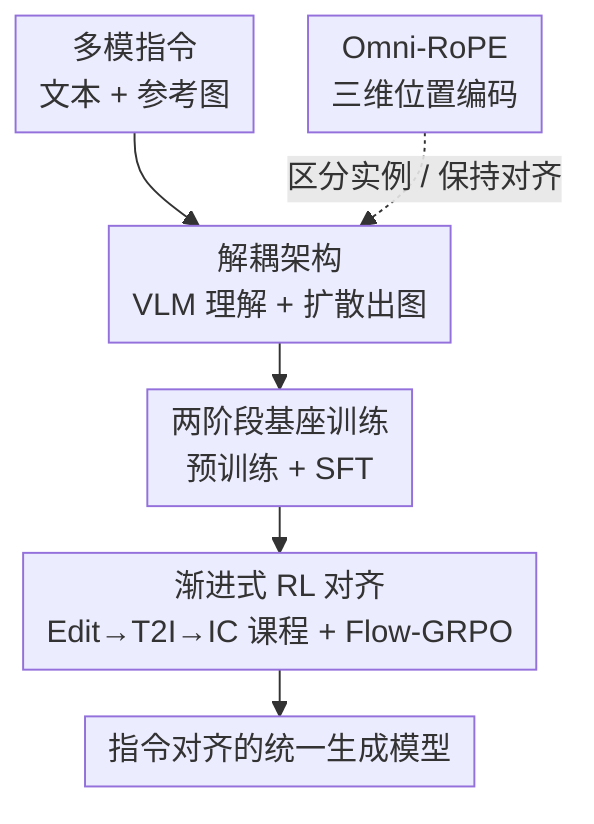

# OmniGen2: Towards Instruction-Aligned Multimodal Generation

**会议**: CVPR 2026  
**论文**: [CVF Open Access](https://openaccess.thecvf.com/content/CVPR2026/html/Wu_OmniGen2_Towards_Instruction-Aligned_Multimodal_Generation_CVPR_2026_paper.html)  
**代码**: https://github.com/VectorSpaceLab/OmniGen2  
**领域**: 图像生成 / 统一多模态生成 / 指令对齐  
**关键词**: 统一多模态生成、指令对齐、解耦架构、Omni-RoPE、渐进式强化学习

## 一句话总结
OmniGen2 用「解耦 VLM + 扩散」的统一架构（VLM 理解、扩散出图，靠 VLM 变长隐状态 + VAE 特征作条件）配上 Omni-RoPE 位置编码与一套「先建强基座、再渐进式 RL 对齐」的两阶段训练，让一个模型在文生图、图像编辑、上下文生成上都能精准跟随复杂指令，GenEval 拿到 0.95。

## 研究背景与动机

**领域现状**：过去一年多模态图像生成进展飞快，GPT-Image-1、Flux、Qwen-Image、Seedream、NanoBanana 等已能做风格化、文字渲染、上下文生成、知识驱动生成，朝通用生成智能迈进。要把这些能力用好，关键是**多模态指令对齐**——保证可控性、语义一致与生成质量。

**现有痛点**：开源生成模型作为「基座」普遍有缺陷——要么专才（超出训练范围就不会）、要么被过度优化到某种审美偏好上、丧失「可塑性」（plasticity）。而指令对齐又要求基座对多模态语义和任务意图有深刻理解。数据侧同样吃紧：现有编辑/上下文数据要么靠 inpainting 模型生成（任务覆盖窄）、要么从网上检索（量小质低）。

**核心矛盾**：构建一个「简单、通用、灵活、没被过训」的基座 vs. 做一套「奖励信号明确、跨任务一致」的对齐，这两件事互相牵制——基座过训会丢可塑性，对齐时多任务联合训练又容易互相干扰、负迁移。

**本文目标**：① 先建一个不过训、通用的强基座模型；② 设计一套不会让任务互相打架的对齐流程；③ 补上上下文生成缺乏标准 benchmark 的空白。

**切入角度**：架构上不去魔改 VLM，而是把扩散解码器**条件化在 VLM 的变长隐状态**上（而非 MetaQuery 那样压成固定长度 query，会有信息瓶颈）；对齐上不一次性联合训练，而是用**渐进式课程 + 在线 RL**逐任务对齐。

**核心 idea**：解耦「理解（VLM）」与「生成（扩散）」两条通路、用变长隐状态当桥，再用精心编排的渐进式 GRPO 课程把指令跟随能力对齐上来。

## 方法详解

### 整体框架
OmniGen2 的核心是一个两阶段设计：先用大规模数据建一个有世界知识的基座，再用渐进式、基于奖励的对齐流程把它对齐到复杂指令上。基座由三件套构成——(1) 解耦的统一生成架构，(2) Omni-RoPE 高效上下文位置编码，(3) 一套从广博知识到细粒度指令跟随的多阶段训练与对齐课程。

推理时数据这样流：VLM（自回归 Transformer，由 Qwen2.5-VL-3B 初始化）先处理多模态输入上下文；当它生成特殊 token `<|img|>` 时触发出图，对应的 VLM 隐状态被抽出来喂给扩散解码器当**高层语义条件**；同时用 Flux-VAE 编码参考图提供**低层视觉细节**（编辑任务尤其需要）；这些条件信号（VLM 隐状态、VAE 特征、带噪 latent）先过一个轻量两层 Transformer refiner 对齐，再进扩散 Transformer（随机初始化、约 4B、Lumina-Image 2.0 式参数共享骨干）出图。训练则分基座（预训练→SFT）与渐进式 RL 对齐两段。

### 关键设计

**1. 解耦架构：VLM 管理解、扩散管出图，用变长隐状态当桥**

统一多模态模型既要懂又要画，硬塞进一个网络容易互相拖累。OmniGen2 用两条**解耦**的 Transformer 通路：自回归 Transformer（VLM，Qwen2.5-VL-3B）提供世界知识与多模指令理解，扩散 Transformer（随机初始化）专做高保真合成。桥接方式是关键——它**直接用 VLM 最后一层的变长隐状态**当条件，且只取文本 token 对应的隐状态（视觉细节交给 VAE），避免了 MetaQuery 把指令压成固定长度 query 带来的信息瓶颈。再加一路 Flux-VAE 低层特征保证编辑时细粒度像素一致。这套设计不改 VLM 结构、保住其指令理解力；训练大部分时间 VLM 冻结、只优化出图，比 Mogao、BAGEL 这类全开训练更高效。扩散骨干沿用 Lumina-Image 2.0 的参数共享设计（语言与视觉共享语义表示，跨模态对齐更自然），条件信号进核心 block 前由轻量 refiner 对齐。

**2. Omni-RoPE：把「图像身份」与「图内空间布局」解耦的三维位置编码**

多图编辑/上下文生成里，常规位置编码既分不清「这是第几张图」、又难在编辑前后保持空间对齐。Omni-RoPE 把 RoPE 扩到统一多模态设定：第 $k$ 张图里坐标 $(h,w)$ 的 token 被赋予三维位置标识 $\text{PosID}_k(h,w)=(\Delta_I^{(k)}, h, w)$，其中 $\Delta_I^{(k)}$ 是该图所有 token 共享的**实例身份**、用来区分不同图或模态，$(h,w)$ 是从 $(0,0)$ 起算的**图内局部 2D 坐标**。这个分解的妙处：因为空间坐标在每张图内都从 $(0,0)$ 局部计算，输入图和输出图里**对应位置的 patch 拿到完全相同的嵌入**，天然保住空间对齐与编辑一致性；而 $\Delta_I$ 又给「区分视觉实例」开了显式通道，对多图上下文生成至关重要（文本 token 则退化为标准 1D 索引）。toy 重建实验里它收敛最快、终损最低（见下表），再加图像索引嵌入还能进一步降终损。

**3. 两阶段基座训练：分辨率课程预训练 + SFT，先建强基座不过训**

基座用「从零预训练 + 监督微调」两阶段建。预训练走**分辨率课程** $256^2\to512^2\to1024^2$：每个分辨率先用 T2I 任务建立强文-图对齐，再引入编辑/上下文的混合任务数据扩能力；优化目标是 Rectified Flow，用 FlashAttention2 处理变长上下文。SFT 在 $1024^2$ 上做，用精选数据 + 蒸馏自闭源模型的数据，提升高层推理与构图、指令跟随与视觉保真。数据侧自建了多条规模化构造管线——尤其用**视频源**抽取一致主体的上下文/编辑三元组（VLM 做主体检测/分割/语义过滤），并构造 interleaved 与 reflection 数据培养时序推理与自我纠错。两阶段后模型获得初步指令跟随与通用生成能力，为后续对齐打底。

**4. 渐进式 RL 对齐：按课程逐任务上 Flow-GRPO，避免任务互相干扰**

对齐不用单一联合训练，而用**渐进式课程**做在线 RL，避免任务互相干扰、负迁移。定义任务序列 $S=\langle T_1,\dots,T_N\rangle$，每个任务 $T=(\tau,\delta,R)$ 含类型 $\tau\in\{\text{T2I},\text{Edit},\text{IC}\}$、实例 $\delta$、奖励 $R$。奖励按任务选：Edit 用学习型奖励 EditScore、IC 用 Qwen2.5-VL-72B 打分、T2I 用可验证奖励 GenEval（与 Edit/IC 重叠大）。刻意排除审美奖励（如 HPSv3，易 reward hacking）和缺乏协同的专才任务（如 OCR）。最终是三阶段课程 $\langle T_1,T_2,T_3\rangle=\langle$Edit, T2I(GenEval), IC$\rangle$，用 Flow-GRPO 训练。**编排顺序很关键**：消融显示 Edit→GenEval→IC 优于 Edit→IC→GenEval（GEdit Overall 7.21 vs 7.06），且「先编辑」一致优于「先 T2I」——作者推测富监督的编辑任务能为后续学习打更稳的底。

### 一个例子：Omni-RoPE 的 toy 验证
让一个随机初始化模型从多张随机采样输入图里重建第 $k$ 张图，以此隔离位置编码的影响，看到达高保真（loss < 0.014）所需步数：

| 位置编码 | $\text{PosID}_k(h,w)$ | 到达目标步数 ↓ | 终损 ↓ |
|----------|-----------------------|----------------|--------|
| Lumina-Image-2.0 | $(0, h+\Delta h, w+\Delta w)$ | ~2,500 | 0.017 |
| Qwen2-VL | $(\Delta_I, h+\Delta_I, w+\Delta_I)$ | ~1,200 | 0.005 |
| **Omni-RoPE** | $(\Delta_I, h, w)$ | **~800** | **0.003** |
| + 图像索引嵌入 | — | ~800 | **0.002** |

可见把实例身份与局部空间坐标解耦后，跨视觉实例的对齐更强、收敛更快、终损更低。

## 实验关键数据

OmniGen2 参数为 3B（理解）+ 4B（生成），跨理解、T2I、编辑、上下文生成四类任务全面评估。视觉理解由 Qwen2.5-VL-3B 提供：MMBench 79.1、MMMU 53.1、MM-Vet 61.8。

### 主实验（统一能力对比，节选 Table 2/3/4）

| 模型 | 参数 | GenEval ↑ | ImgEdit-Bench ↑ | GEdit-EN ↑ | OmniContext 平均 ↑ |
|------|------|-----------|-----------------|-----------|---------------------|
| BAGEL | 7B+7B | 0.82/0.88† | 3.20 | 6.52 | 5.73 |
| UniWorld-V1 | 7B+12B | 0.84† | 3.26 | 4.85 | — |
| Qwen-Image-Edit-2509 | 7B+20B | — | 4.41 | 7.54 | 7.69 |
| Gemini 2.5 Flash Image | — | 0.55 | 4.28 | 7.10 | 7.84 |
| GPT-4o | — | — | — | — | **8.80** |
| **OmniGen2** | 3B+4B | **0.95** | 3.69 | 7.21 | 7.95 |

> †：使用 LLM 改写器的结果。OmniGen2 在 GenEval 上 0.95 超过 BAGEL(0.88)、UniWorld(0.84) 乃至专做 T2I 的 Qwen-Image；OmniContext 平均 7.95 超过所有开源模型，仅次于闭源 GPT-4o(8.80)。Emu-Edit 上 OmniGen2 取得最高 CLIP-Out 0.311（编辑应用最到位）与最高 DINO 0.876（非编辑区保持最好）。

### 消融实验（Table 5，验证任务选择与编排）

| 配置 | 关键指标 | 说明 |
|------|---------|------|
| 完整课程 Edit→GenEval→IC | GEdit Overall 7.21 | 最终方案 |
| 改顺序 Edit→IC→GenEval | GEdit Overall 7.06 | 仅换编排即掉点 |
| + OCR 联合训练 | GEdit 6.28→6.13 | 技能不重叠→负迁移 |
| Edit & GenEval 协同 | GenEval 0.95 vs 单任务 0.94 | 技能重叠→正协同 |
| + HPSv3 审美奖励 | PQ 飙到 8.22 但 SC/IC 崩 | reward hacking |

### 关键发现
- **任务选择决定成败**：技能不重叠的任务（OCR）会负迁移；技能重叠（指令跟随）的任务（Edit & GenEval）能超过各自单任务 baseline。
- **审美奖励有毒**：HPSv3 把感知质量 PQ 刷到 8.22，却让语义一致 SC 与上下文 IC 崩溃，是典型 reward hacking。
- **编排顺序也重要**：先编辑后 T2I 一致更好，富监督的编辑任务为后续打底。
- **准确性奖励是关键**：Edit only 的 IC 分（7.71）反而高于 IC only（7.38），因为 EditScore 强化了指令跟随。

## 亮点与洞察
- **变长隐状态当桥避开信息瓶颈**：相比 MetaQuery 的固定 query，直接条件化在 VLM 变长隐状态上更不丢信息，且只取文本 token 隐状态、视觉交给 VAE，分工干净。
- **Omni-RoPE 的「身份/空间解耦」很巧**：让输入输出对应 patch 拿到相同嵌入，天然保编辑对齐，又给多图区分开了显式通道，几乎零成本提速提质。
- **把对齐当课程而非联合训练**：渐进式 RL + 精挑奖励，把「多任务互相打架」转成「跨任务正迁移」，且明确点出审美奖励的 reward hacking 风险，对做生成 RLHF 很有借鉴。
- **OmniContext benchmark**：补上上下文生成缺标准评测的空白（Character/Object/Scene × SINGLE/MULTIPLE/SCENE，GPT-4.1 给 PF/SC/Overall 并附理由）。

## 局限与展望
- **闭源仍领先上下文生成**：OmniContext 上 GPT-4o（8.80）明显高于 OmniGen2（7.95），主体一致与提示跟随仍有差距。
- **奖励模型依赖**：Edit/IC 缺可验证奖励，只能靠 EditScore、Qwen2.5-VL-72B 这类学习型奖励，奖励质量上限会传导到对齐效果。
- **数据管线复杂**：视频抽取 + 多模型标注的构造管线工程量大、复现门槛高。
- **审美维度被刻意回避**：为避 reward hacking 排除了 HPSv3 等审美奖励，意味着纯审美偏好对齐这条路在本框架里暂时绕开了。

## 相关工作与启发
- **vs MetaQuery**：MetaQuery 把指令压成固定长度 query、有信息瓶颈；OmniGen2 用 VLM 变长隐状态当条件，避免瓶颈——概念相近但执行不同。
- **vs BAGEL / Mogao**：它们大部分训练把 VLM 也一起开训、更贵；OmniGen2 训练时大多冻结 VLM、只优化出图，更高效，且 GenEval(0.95 vs 0.88)、编辑等多项领先 BAGEL。
- **vs OmniGen（一代）**：一代 3.8B 单一架构；二代解耦 VLM+扩散、加 Omni-RoPE 与渐进式 RL，GenEval 0.68→0.95、各任务全面提升。
- **vs Qwen-Image-Edit-2509**：后者参数大得多（7B+20B）且 GEdit 略高(7.54 vs 7.21)，但 OmniGen2 以 3B+4B 的小体量在 GenEval 与 OmniContext 上反超，性价比突出。

## 评分
- 新颖性: ⭐⭐⭐⭐ 解耦架构 + Omni-RoPE + 渐进式 RL 课程组合清晰，但各组件多在已有思路（VLM 条件扩散、RoPE、GRPO）上演进。
- 实验充分度: ⭐⭐⭐⭐⭐ 覆盖理解/T2I/编辑/上下文四类、多 benchmark，外加 OmniContext 与细致的对齐消融，很全面。
- 写作质量: ⭐⭐⭐⭐⭐ 动机—架构—训练—对齐链路顺畅，消融把「为什么这么编排」讲得透。
- 价值: ⭐⭐⭐⭐⭐ 模型/代码/数据/benchmark 全开源，小体量打出强指令跟随，社区可直接用。

<!-- RELATED:START -->

## 相关论文

- [\[CVPR 2026\] DreamOmni2: Multimodal Instruction-based Generation and Editing](dreamomni2_multimodal_instruction-based_generation_and_editing.md)
- [\[ICLR 2026\] EditReward: A Human-Aligned Reward Model for Instruction-Guided Image Editing](../../ICLR2026/image_generation/editreward_a_human-aligned_reward_model_for_instruction-guided_image_editing.md)
- [\[CVPR 2026\] ChangeBridge: Spatiotemporal Image Generation with Multimodal Controls for Remote Sensing](changebridge_spatiotemporal_image_generation_with_multimodal_controls_for_remote.md)
- [\[CVPR 2026\] PhotoFramer: Multi-modal Image Composition Instruction](photoframer_multi-modal_image_composition_instruction.md)
- [\[CVPR 2026\] DiT-IC: Aligned Diffusion Transformer for Efficient Image Compression](ditic_aligned_diffusion_transformer_for_efficient.md)

<!-- RELATED:END -->
