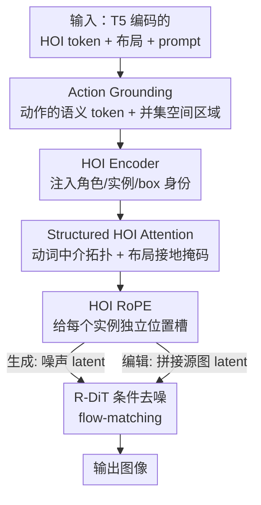

# OneHOI: Unifying Human-Object Interaction Generation and Editing

**会议**: CVPR 2026  
**论文**: [CVF Open Access](https://openaccess.thecvf.com/content/CVPR2026/html/Hoe_OneHOI_Unifying_Human-Object_Interaction_Generation_and_Editing_CVPR_2026_paper.html)  
**代码**: https://jiuntian.github.io/OneHOI/ (项目页/数据集)  
**领域**: 扩散模型 / 可控图像生成与编辑  
**关键词**: 人物交互, 扩散 Transformer, 可控生成, 图像编辑, 注意力掩码

## 一句话总结
OneHOI 用一个扩散 Transformer（R-DiT）把「人-物交互（HOI）图像生成」和「HOI 图像编辑」统一成同一个条件去噪过程，通过 HOI 编码器、动词中介的结构化注意力和 HOI 专用 RoPE 显式建模交互结构，在编辑、布局可控生成和首次提出的多 HOI 编辑任务上都拿到 SOTA。

## 研究背景与动机
**领域现状**：人-物交互通常被表示成 `<人, 动作, 物>` 三元组。生成侧此前分裂成两个互不相通的家族：一类是 **HOI 生成**（如 InteractDiffusion），从三元组 + 空间布局合成场景；另一类是 **HOI 编辑**（如 HOIEdit、InteractEdit），用文本改写已有图像里的交互。

**现有痛点**：生成家族只能吃「纯 HOI 三元组 + 布局」，没法把 HOI 和「只有物体、没有交互」的实体混在一起，也不接受任意形状的布局；编辑家族则无法把「姿态」和「物理接触」解耦重组，更扩展不到一张图里有多个交互的场景，缺乏精细空间控制，依赖模型隐式先验而非显式结构建模。

**核心矛盾**：底座 DiT（扩散 Transformer）虽然画质高、全局推理强，但它**把场景当成一堆相互独立的物体**，根本不建模物体之间「怎么交互」，于是产出视觉细节丰富、但关系上很空洞的图——能把人和滑板都画对位置，却画不出「人骑在滑板上」这个关系。

**本文目标**：把生成与编辑收进一个框架，同时解决「混合条件、任意形状掩码、多 HOI、无布局/有布局」全谱系控制。

**切入角度**：作者认为生成和编辑其实是**同一个条件去噪过程的两个视角**——生成阶段学到的广义交互语义（姿态、接触点）恰好能补上纯编辑模型缺的结构知识，联合训练会产生协同增益（synergy）。于是把扩散从「排列像素」重新定义为「实现关系」。

**核心 idea**：在标准布局可控 DiT 基线（Eligen）上加四个显式建模交互结构的模块，构成 Relational DiT（R-DiT），让模型「对关系而非区域」推理，并用一个带模态 dropout 的联合训练把生成与编辑塞进一个去噪器。

## 方法详解

### 整体框架
给定全局文本 prompt $P$、一组结构化交互 $\{\langle s, o, a\rangle_n\}_{n=1}^{N}$（或只给物体 $\{\langle o\rangle_n\}$）以及可选布局 $B=\{b^s_n, b^o_n\}$，OneHOI 输出一张实现所有指定目标的图。所有三元组先经 T5 编码成 HOI token $H=\bigcup_{n}\{S_n, A_n, O_n\}$（分别是主体、物体、动作 token）。**生成**时直接在 latent 空间采噪声 $I_1$ 跑条件去噪；**编辑**时把源图编码成 latent $I_2$ 与噪声 $I_1$ 拼接，用同一个去噪器、换上新的交互目标即可——这就是「生成与编辑共用一条去噪管线」的落地方式。

骨干是改造自 Flux.1 Kontext 的 MM-DiT，用 LoRA 微调。R-DiT 在布局可控基线上叠加四个逐级加深关系理解的组件：**Action Grounding** 给动作本身补语义与空间锚点 → **HOI Encoder** 注入细粒度的角色/实例身份 → **Structured HOI Attention** 用动词中介的注意力拓扑 + 布局约束强制交互结构 → **HOI RoPE** 在多交互场景里把各实例的位置身份分开。

### 关键设计

**1. Action Grounding：把「动作」也接地，而不只接地物体**

标准布局可控模型只把主体 $S_n$、物体 $O_n$ 接地到区域 $R^s_n$、$R^o_n$，对「动作」本身既无语义也无空间感知。OneHOI 补两条动作专属线索：一是为每个动作标签（如 "feed"）单独编一个 T5 语义动作 token $A_n$，二是给动作一个空间区域 $R^a_n$。这里的关键是**怎么定义动作区域**：前作 InteractDiffusion 用「between」算子（主体框与物体框相交，不相交时取一个跨越二者的矩形），但作者通过注意力热力图发现这条带子常常对不上动作 token 真正关注的位置（要么太窄、要么偏位）。OneHOI 改用**主体与物体区域的并集** $R^a_n = R^s_n \cup R^o_n$。并集既贴合 DiT 的自然注意力分布，又对「重叠/分离」两种主客体关系都稳健，给后面的结构化注意力提供了一个可靠的接地目标。

**2. HOI Encoder：给每个 token 打上「谁是谁、属于哪个交互」的身份证**

多 HOI 场景里，模型容易角色混淆或张冠李戴——给 `<person1, chase, dog>` 和 `<person2, hold, cat>`，它可能画成「person1 抱 cat」（接错交互）或「dog 追 person1」（角色反了）。光给 $S_n, O_n, A_n$ token 不够，模型得明确知道每个 token 扮演什么角色、属于哪个交互实例。HOI Encoder 为每个角色 $r\in\{s,o,a\}$、实例 $n$ 构造三路旁路信号：可学习的角色嵌入 $e_{\text{role}}(r)\in\mathbb{R}^{64}$、实例索引的固定正弦嵌入 $e_{\text{inst}}(n)\in\mathbb{R}^{64}$、角色 box 的 Fourier 嵌入 $e_{\text{box}}(b^r_n)\in\mathbb{R}^{256}$，再与归一化后的 token 拼接、经小 MLP 投影，最后用门控残差注回：

$$\tilde{h}^r_n = \mathrm{MLP}\big([\mathrm{LN}(h^r_n);\, e_{\text{box}}(b^r_n);\, e_{\text{role}}(r);\, e_{\text{inst}}(n)]\big),\quad \tilde{h}^r_n = h^r_n + \tanh(\omega)\cdot \tilde{h}^r_n$$

其中 $\omega$ 是可学习门控，让条件信息平滑「淡入」以稳定训练。这样每个 HOI token 都带上了细粒度身份，多交互之间不再串味。

**3. Structured HOI Attention：用动词把交互拓扑「焊」进注意力里**

标准布局条件把主体和物体当独立实体，能摆对位置却抓不住交互结构，于是出现「位置对、关系错」的图（如该「握住」却没握上）。OneHOI 的核心洞察是**动作是定义交互结构的中心**，于是用掩码强制一条动词中介的注意力拓扑：在同一实例内**切断主体↔物体的直连**，只允许 $S_n\!\to\!A_n$、$O_n\!\to\!A_n$，让关系信息**必须流经动作 token**；跨实例的 HOI 连接（$n\neq m$）全部禁用。对 HOI↔图像的接地，当有布局时用掩码 $M^{HI}$ 把每个 HOI query 限制在自己的区域内（$S_n$ 只看 $R^s_n$、$O_n$ 只看 $R^o_n$、$A_n$ 只看 $R^a_n$），无布局时放开全部连接。最终注意力把 HOI↔HOI 拓扑、HOI↔图像接地、以及标准的 prompt↔image / image↔image 连接聚合进掩码 $M$：

$$\mathrm{Attn}(Q,K,V,M) = \mathrm{softmax}\!\Big(\tfrac{QK^\top}{\sqrt{d}} + M\Big)V$$

$M_{qk}=0$ 表示允许，否则赋一个大负值（等效屏蔽）。这把「交互该怎么连」从隐式先验变成显式的注意力约束。

**4. HOI RoPE：给每个交互实例一个独立的位置「车位」防串扰**

同时处理多个 HOI 会发生「cross-talk」——一个实例的特征泄漏去影响另一个，导致交互混合或属性互换（还是 person1 抱了 cat 那类）。HOI RoPE 是一套专门的位置索引方案，作用在注意力里所有 HOI token 的 $Q,K$ 上。图像流沿用 3D RoPE，而属于同一实例 $n$ 的所有 HOI token 被赋一个与图像网格、与其他实例都不同的位置索引：

$$z_{\text{HOI}}(n) = (0,\, T+n,\, T+n),\quad T=\max(H,W)$$

这等于在 RoPE 空间里给每个交互分配一个唯一「车位」，逐层施加后显著降低多 HOI 场景里实例间的相互干扰。

### 损失函数 / 训练策略
联合训练在生成与编辑之间交替 batch，用标准扩散 flow-matching 目标优化。关键是**模态 dropout**：训练时随机丢弃布局（$p_{\text{layout}}=0.25$）、HOI 标签（$p_{\text{hoi}}=0.25$，三元组退化为只有物体）、全局文本 prompt（$p_{\text{txt}}=0.30$），但保证至少留一种模态。结构化注意力掩码始终一致施加，丢掉布局时默认退回无约束注意力。这套 dropout 让一个模型在「有布局/无布局/任意掩码/混合条件」全谱系输入下都稳健工作。骨干用 LoRA 训 10K 步，batch size 16，AdamW（8-bit）。

## 实验关键数据

### 主实验

**布局无关 HOI 编辑（IEBench，表 1）**：OneHOI 在「编辑成功度-身份保持」（Editability-Identity）和「HOI 可编辑度」上都最强，并同时拿下最好的画质指标。

| 方法 | Editability-Identity | HOI Editability | PickScore | HPS | ImageReward |
|------|------|------|------|------|------|
| InteractEdit | 0.573 | 0.514 | 21.08 | 0.2640 | 0.1630 |
| Qwen Image Edit | 0.580 | 0.460 | 20.81 | 0.2585 | 0.0748 |
| **OneHOI (Ours)** | **0.638** | **0.596** | **21.26** | **0.2805** | **0.4713** |
| 相对提升 | +10.0% | +16.0% | +0.85% | +6.25% | +189% |
| Nano Banana（闭源） | 0.623 | 0.530 | 20.97 | 0.2544 | 0.1810 |

注意 OneHOI 甚至**超过闭源的 Nano Banana**；ImageReward 的 +189% 因为强基线该项还是负值，绝对差距才显得放大。

**布局可控 HOI 编辑 + HOI 生成（表 2、表 3）**：单 HOI 编辑用 InteractEdit+InteractDiffusion 拼成基线，多 HOI 编辑是本文首次提出的任务（无可比基线）；生成任务在 HICO-DET 2000 个目标上评。

| 任务 / 方法 | EI / HOI Acc. | Spatial | HOI Editability | ImageReward |
|------|------|------|------|------|
| 单 HOI 编辑 · 基线 | 0.559 | 0.749 | 0.520 | −0.3072 |
| 单 HOI 编辑 · **Ours** | **0.638** | **0.822** | **0.570** | **0.2897** |
| 多 HOI 编辑 · **Ours**（首个基线） | 0.435 | 0.675 | 0.329 | 0.1954 |
| HOI 生成 · InteractDiffusion | 0.4505 | 0.5768 | — | −0.3194 |
| HOI 生成 · **Ours** | **0.4528** | **0.6104** | — | **0.5224** |

生成任务里 OneHOI 在 Spatial（+5.8%）、HOI 准确率（+0.5%）、ImageReward（+33.2%）全面领先——说明「统一编辑与生成」不仅没拖累生成，反而把它做得更好。

### 消融实验
从强基线 BL（Eligen）出发做**加法式消融**，逐个叠加四个组件（表 4，HOI 生成 + 多 HOI 编辑）：

| 配置 | HOI Acc.（生成） | IR（生成） | EI（多 HOI 编辑） | IR（多 HOI 编辑） |
|------|------|------|------|------|
| BL（Eligen） | 0.3061 | 0.3921 | — | — |
| + AG | 0.4138 | 0.3156 | 0.423 | 0.1118 |
| + Enc | 0.4254 | 0.4602 | 0.422 | 0.1306 |
| + Attn | 0.4504 | 0.4861 | 0.433 | 0.1944 |
| + HRoPE（Full） | 0.4528 | 0.5224 | 0.435 | 0.2046 |

### 关键发现
- **Action Grounding 是「从 0 到 1」的那一步**：仅加 AG 就把 HOI 准确率从 0.306 拉到 0.414，因为它第一次给了纯物体模型缺失的「交互基础认知」。
- **Structured HOI Attention 主攻正确性**：加 Attn 时 HOI Acc. 和 EI 同步跳升，印证「动词中介拓扑 + 布局约束」是把关系画对的关键。
- **HOI Encoder / HRoPE 主攻画质**：Enc 和 HRoPE 主要拉动 ImageReward（角色线索让姿态更合理、RoPE 解开实例让多动作不纠缠）。
- **组件互补可视化**：在「holding + petting bird」这种双动作 prompt 上，只有四件套全开（第 4 档）才同时画对「握住」和「抚摸」两个动作；少 HRoPE 时两动作会纠缠成一个。

## 亮点与洞察
- **把「生成 ↔ 编辑」证成同一去噪过程的两个视角**，并用实验证明二者有协同效应（生成先验增强编辑鲁棒性、反之亦然），这是统一框架最有说服力的论证，而非简单多任务拼接。
- **用注意力掩码把「交互语法」硬编码进 DiT**：切断 S↔O 直连、强制信息流经动作 token，这个「动词中介」思路把抽象的关系结构变成了可执行的注意力约束，迁移性强——任何需要建模实体间显式关系（不只是 HOI）的可控生成都能借用。
- **并集动作区域优于 between 算子**这一观察来自注意力热力图的实证分析，是个小而扎实的设计改进。
- **HOI-Edit-44K 数据集**用双重自动校验（PViC 检测 HOI 正确性 + DINOv2 余弦相似度 >0.75 保身份）过滤掉约 90% 候选，这套「合成-检测-保身份」的数据构建管线可复用到其他配对编辑数据稀缺的任务。
- **首次实现多 HOI 编辑**，并自建 MultiHOIEdit 基准，为后续工作立了第一个可比标杆。

## 局限与展望
- 多 HOI 编辑的绝对分数仍明显低于单 HOI（EI 0.435 vs 0.638，HOI Editability 0.329 vs 0.570），说明「一张图同时改多个交互」远未解决，是难度真实存在的硬骨头。
- HOI 正确性、空间分数、数据集校验全部依赖 PViC 这一个 HOI 检测器，评测与数据构建都被它的检测能力上限所约束，检测器的系统性偏差会传导进结果。
- ImageReward 等指标的「相对提升」在基线为负值时会被放大（+189%），看绝对差距更稳妥。
- 方法绑定 Flux.1 Kontext / Eligen 这一特定 MM-DiT 生态，换骨干时这些注意力掩码与 RoPE 方案需要重新适配。
- 数据合成大量依赖 Flux.1 与 InteractEdit 生成源，过滤后仍可能继承底层生成模型的分布偏好。

## 相关工作与启发
- **vs InteractDiffusion**：它从三元组 + 布局做 HOI 生成，但用「between」算子定义动作区域、且只管生成不管编辑、扩展不到多 HOI；OneHOI 改用并集区域、统一生成与编辑、并支持多 HOI，在生成任务上 Spatial/HOI 都反超它。
- **vs HOIEdit / InteractEdit**：纯编辑家族无法解耦姿态与接触、扩展不到多交互、依赖隐式先验；OneHOI 借生成阶段学到的接触/姿态语义 + 显式结构化注意力，把编辑做得既保身份又改对关系。
- **vs Eligen / GLIGEN / MIGC（物体级可控生成）**：它们能精确摆放实体却画不出「关系」（人和手机都在但没在打字）；OneHOI 的动词中介注意力专治这种「位置对、关系空」。
- **vs Flux.1 Kontext / Qwen Image Edit（通用编辑大模型）**：通用编辑器缺乏显式 HOI 知识，常把姿态原样保留或接触画错；OneHOI 在 HOI 编辑上全面超过它们，甚至压过闭源 Nano Banana。

## 评分
- 新颖性: ⭐⭐⭐⭐⭐ 首次把 HOI 生成与编辑统一进一个去噪器，并首创多 HOI 编辑任务，四个模块各有针对性设计。
- 实验充分度: ⭐⭐⭐⭐ 覆盖三类任务、多个基准与强基线，加法式消融清晰；但评测高度依赖单一 HOI 检测器、部分相对提升受负基线放大。
- 写作质量: ⭐⭐⭐⭐ 动机推导（生成-编辑协同）讲得透，注意力掩码与 RoPE 的图示到位；公式排版受 CVF 抽取影响略有符号噪声。
- 价值: ⭐⭐⭐⭐⭐ 统一框架 + 可复用的「动词中介注意力」思路 + 公开 HOI-Edit-44K 数据集与新基准，对关系可控生成方向有实打实推动。

<!-- RELATED:START -->

## 相关论文

- [\[CVPR 2026\] ViHOI: Human-Object Interaction Synthesis with Visual Priors](vihoi_human-object_interaction_synthesis_with_visual_priors.md)
- [\[CVPR 2026\] HP-Edit: A Human-Preference Post-Training Framework for Image Editing](hp-edit_a_human-preference_post-training_framework_for_image_editing.md)
- [\[CVPR 2026\] Refaçade: Editing Object with Given Reference Texture](refacade_editing_object_with_given_reference_texture.md)
- [\[CVPR 2026\] EgoFlow: Gradient-Guided Flow Matching for Egocentric 6DoF Object Motion Generation](egoflow_gradient-guided_flow_matching_for_egocentric_6dof_object_motion_generati.md)
- [\[CVPR 2026\] Cross-Axis Feature Fusion with Joint-Wise Motion Difference Prediction for Text-Based 3D Human Motion Editing](cross-axis_feature_fusion_with_joint-wise_motion_difference_prediction_for_text-.md)

<!-- RELATED:END -->
