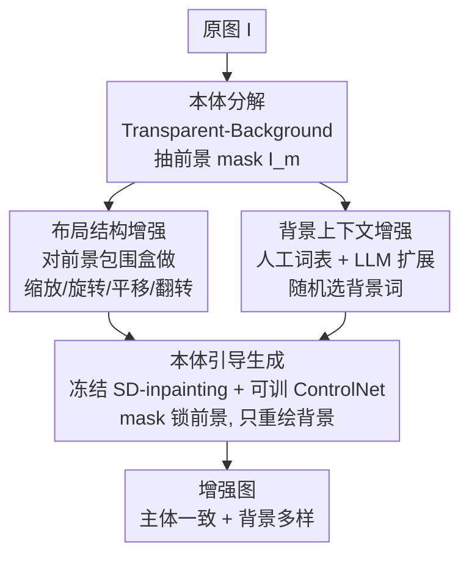

# OntoAug: Rethinking Generative Data Augmentation via Ontology Guidance

**会议**: CVPR 2026  
**论文**: [CVF Open Access](https://openaccess.thecvf.com/content/CVPR2026/html/Wang_OntoAug_Rethinking_Generative_Data_Augmentation_via_Ontology_Guidance_CVPR_2026_paper.html)  
**代码**: 无  
**领域**: 扩散模型 / 生成式数据增强  
**关键词**: 数据增强, 扩散模型, 前景-背景解耦, 本体一致性, 细粒度分类

## 一句话总结
OntoAug 把一张图显式拆成"本体前景"和"附带背景"两部分——用前景 mask 约束扩散模型只重绘背景、同时对前景做布局级几何变换并配上多样化背景词，从而在保持类别语义稳定的前提下大幅提升增强样本的多样性，在细粒度分类、少样本、WSOL 和 VLM 推理上全面领先。

## 研究背景与动机
**领域现状**：数据增强是提升图像识别的标配。早期方法（Mixup、CutMix 及其变体）靠像素插值或区域替换造样本；近两年随扩散模型崛起，生成式增强（DiffuseMix、SaSPA、Diff-Mix、De-DA 等）成为主流，能合成高质量、语义合理的新图。

**现有痛点**：现有生成式增强大多把图像当作**整体**来处理，没有意识到判别信息分布是**不均匀**的——分类任务里前景主体携带的类别信号远比背景丰富。整体处理会带来三类典型失败（论文用 Q1/Q2/Q3 概括）：Diff-Mix 的跨类扩散常改掉主体的颜色纹理，产生偏离原类别的反事实样本（破坏 **Q1 主体语义一致性**）；DiffuseMix 用固定文本提示、SaSPA 用边缘约束，生成空间被压缩，样本只是风格变化（限制 **Q2 背景多样性**）；De-DA 把前景像素直接覆盖到跨类背景上，边界语义不连贯（破坏 **Q3 整体协调性**）。

**核心矛盾**：多样性与语义保真之间存在 trade-off——增大上下文变化往往会改变主体身份，而保守地保留原图结构又限制了多样性。现有方法在 Q1/Q2/Q3 三者间顾此失彼。

**切入角度**：作者借鉴人类感知的本体论原理——类别识别主要依赖主体的**稳定本质**，而对背景、环境的变化天然容忍，只要整体协调即可。一张"跑车"图里跑车本身是本体（ontological part），道路则是附带部分（incidental part）。

**核心 idea**：显式区分图像的**本体前景**与**附带背景**——用前景 mask 作为硬约束让扩散模型只重绘背景区域、对前景只做布局级几何变换，从而同时锁住 Q1、放开 Q2、并因生成式 inpainting 保证 Q3。

## 方法详解
### 整体框架
OntoAug 的目标：在保留前景主体的同时引入多样的背景上下文。整条流水线分两个阶段——**本体分解**（把图切成前景/背景）与**本体引导生成**（前景做布局变换、背景换词、再交给扩散模型 inpainting 出最终图）。输入是一张原图 $I$，输出是一批主体一致、背景多样、整体协调的增强图（每张原图默认生成 4 张）。

### 关键设计

**1. 本体分解：把判别信号和环境信号物理切开**

针对"整体处理忽略判别信息不均匀分布"这个痛点，OntoAug 第一步就把图像 $I$ 分成两个不重叠的部分：$I = I_{onto} \cup I_{incid}$，$I_{onto} \cap I_{incid} = \emptyset$。其中 $I_{onto}$ 是承载类别核心语义的本体部分（如跑车本身），$I_{incid}$ 是反映环境/背景的附带部分（如道路）。实现上用 Transparent-Background 分割模型 $S(\cdot)$ 抽出前景 mask $I_m = S(I)$，标记出最能代表类别语义的像素区域。这个分割模块是可替换的——可以换成显著性方法、SAM 系或 Grounded-SAM 等文本引导模型。这一步是后续"前景锁死、背景放开"的前提：有了 mask，才能在生成时把约束精确施加到前景上。

**2. 布局结构增强：只动前景的"摆放方式"，不动它的"长相"**

与其他方法改前景风格或直接编辑前景不同，OntoAug 对本体部分**只做布局级变化**，从而在制造空间多样性的同时严格保住主体身份。具体地，先在 mask 和原图上定位前景的最小包围矩形 $O_I, O_{I_m} = \text{MinBBox}(I_m)$——用最小包围盒是为了约束后续变换，防止前景超出图像边界、丢失结构。随后在布局模块 $LM(\cdot)$ 中对 $O_{I_m}$ 和 $O_I$ **同步**施加四种几何操作：缩放 (L1)、旋转 (L2)、平移 (L3)、水平翻转 (L4)，得到 $O_{I_m}', O_I' = LM(O_{I_m}, O_I)$。随机组合这些操作就能模拟自然场景中前景物体的多样空间布局，而前景的纹理、颜色等本质细节完全不变——这正是它和"改前景风格"类方法的根本区别。

**3. 背景上下文增强：用结构化背景词表把多样性放到背景上**

背景被定义为图像的附带部分（与类别无关），是多样性的主要来源。作者先人工构造一个丰富的背景词表 $V_{bg}$：借助大型视觉语言模型从 Stanford Cars、Aircraft、CUB 等数据集中提取代表性背景词，覆盖自然环境、交通场景、人类活动等类型；并刻意排除可能出现在前景里的词（如 "bridge"），优先纯描述背景的词（如 "sky"），避免干扰主体。在此基础上再用 LLM（实现里是 DeepSeek-V3）对种子词做语义扩展，形成更全面的词表。生成时从 $V_{bg}$ 随机抽一个背景词，按模板 "An image of \<Class\> with the background of \<Background word\>" 构造文本提示去引导背景生成——这直接回应了 Q2，比 DiffuseMix 的固定提示有更大的语义组合空间。

**4. 本体引导生成：用 mask 把前景"焊死"，只让扩散在背景上工作**

这是把前两步成果落地的生成模块。OntoAug 沿用 PBG 的生成范式，以**冻结的 Stable Diffusion v2-inpainting** 作生成骨干，并接一个**可训练的 ControlNet**，额外输入 mask 和前景图，使模型在条件于前景布局的同时去推理周围场景。布局变换后的 $O_{I_m}'$、$O_I'$ 连同随机选中的背景词一起喂进扩散模型，引导去噪**仅在背景区域**进行——mask 在整个去噪过程中作为强约束保持前景内容不变。因为背景是由扩散 inpainting 自然"补"出来的而非像素硬贴，前景与背景的边界天然协调（回应 Q3），避免了 De-DA 那种像素覆盖导致的边界语义断裂。三者合力，OntoAug 同时改善了主体稳定性、背景多样性和场景协调性。

## 实验关键数据

### 主实验
细粒度分类（ResNet-50 从头训 300 epoch，Top-1 准确率 %）：

| 数据集 | 本文 OntoAug | 之前最好 | 提升 |
|--------|------|----------|------|
| CUB | **84.62** | Diff-Mix 81.62 | +3.00 |
| Stanford Cars | **94.29** | De-DA 93.04 | +1.25 |
| Aircraft | **87.91** | Diff-Mix 85.84 | +2.07 |

跨任务泛化（均为各任务最佳）：ViT-B/16 上 CUB/Cars/Aircraft 达 90.78/95.67/86.23（平均 +1.86）；CUB 10-shot 少样本平均 67.55%，比第二名高 13.88%；WSOL 在 IoU30/50/70 上 92.94/60.54/12.68，均超 CAM 基线与各增强法；Waterbirds 跨分布平均 74.82%，比 De-DA 高 1.75%；VLM 推理（Qwen2.5-VL-3B + GRPO，CUB 8-shot）达 66.24%，优于所有对比增强。

### 消融实验
布局策略逐项叠加（在"背景增强"基线 81.53% 上，CUB）：

| 配置 | CUB | 说明 |
|------|-----|------|
| baseline（仅背景增强） | 81.53 | 不做布局变换 |
| +L1 缩放 | 83.91 | 单项 +2.38 |
| +L1~L4 全部 | **84.62** | 四种几何操作全开，最佳 |

整体协调策略消融（Figure 5，ResNet-50 / CUB）：

| 实验 | 布局 / 背景 | 准确率 | 结论 |
|------|------------|--------|------|
| A | 原始 / 原始 | 65.50 | 无任何增强 |
| C | 增强 / Places 真实背景 | 77.17 | 换真实图背景 |
| E | 增强 / 生成背景 | **84.62** | 完整模型 |

### 关键发现
- **前景布局贡献显著**：A→B、D→E 的对比表明，引入前景布局变换能大幅提升性能；四种几何操作中缩放(L1, +2.38)和翻转(L4, +2.22)增益最大。
- **生成背景 > 真实背景**：实验 E（扩散生成背景，84.62）明显优于实验 C（直接用 Places 真实背景，77.17），说明扩散 inpainting 带来的前景-背景协调性比"拼真实图"更有价值。
- **越缺数据越受益**：10-shot 上 OntoAug 平均增益高达 +35.76（相对 Vanilla），远超第二名，说明高质量多样化样本对数据稀缺场景帮助最大。
- **更丰富的背景词更鲁棒**：OntoAug（完整词表 74.82）优于 OntoAug*（仅栖息地相关词 73.48），证明背景提示多样性能提升对背景偏移的鲁棒性。

## 亮点与洞察
- **把"本体论"翻译成可执行的工程约束**：人类"认主体、容背景"的直觉，被落成"mask 锁前景 + 扩散只改背景"的硬约束，思路简单却直接命中 Q1/Q2/Q3 的三难。
- **前景做几何、背景做语义的分工很巧**：前景只允许布局级变换（缩放/旋转/平移/翻转），背景才允许语义级重绘——既保住判别信号又把多样性放到不影响类别的地方，是个可复用的解耦范式。
- **inpainting 天然解决边界协调**：用扩散 inpainting 补背景而非像素硬贴，免费拿到前景-背景的协调过渡，避开了 De-DA 的边界断裂问题。
- 该框架可迁移到任何"主体稳定、上下文可变"的增强场景（如医学影像保病灶换背景、检测保目标换场景）。

## 局限与展望
- **依赖分割质量**：前景 mask 由 Transparent-Background 给出，分割失败（前景/背景纠缠、半透明、细小结构）会直接污染后续约束；作者虽说模块可替换但未量化分割误差的传播影响。⚠️ 论文未给这部分敏感性分析。
- **"本体=前景"的假设有边界**：当类别语义其实依赖上下文（如靠环境判别的场景分类、关系识别）时，"锁前景、放背景"的前提就不成立。
- **生成成本**：每张图生成 4 张增强样本且需扩散去噪，相比 Mixup/CutMix 这类零成本增强开销大，文中未报告时间/算力代价对比。
- **背景词表的构造依赖人工 + LLM**，跨领域迁移到全新数据集时词表是否仍合适需重新验证。

## 相关工作与启发
- **vs Diff-Mix**：Diff-Mix 做跨类扩散混合来丰富类别边界，但常改掉主体颜色纹理产生反事实样本、需 CLIP 后过滤；OntoAug 用 mask 锁死前景，主体语义稳定，无需后过滤。
- **vs DiffuseMix**：DiffuseMix 靠固定文本提示 + 风格叠加，多样性局限于外观风格；OntoAug 用结构化背景词表 + LLM 扩展，多样性来自语义层面的背景组合。
- **vs SaSPA**：SaSPA 用边缘条件保语义但严重压缩生成空间；OntoAug 用 mask 约束前景却放开背景，兼顾保真与多样。
- **vs De-DA**：De-DA 解耦前景编辑与背景复用，但把前景像素直接覆盖到背景上导致边界语义断裂；OntoAug 用扩散 inpainting 重绘背景，边界天然协调。

## 评分
- 新颖性: ⭐⭐⭐⭐ 把本体论视角落成"前景几何 + 背景语义"的解耦增强范式，角度清晰但本体/附带划分本质是前景-背景解耦的延伸。
- 实验充分度: ⭐⭐⭐⭐⭐ 覆盖细粒度分类、迁移、ViT、少样本、WSOL、跨分布、VLM 推理七类任务，消融到位。
- 写作质量: ⭐⭐⭐⭐ Q1/Q2/Q3 三问把动机讲得很清楚，图示直观。
- 价值: ⭐⭐⭐⭐ 即插即用、跨任务稳定涨点，尤其少样本场景增益巨大，实用性强。

<!-- RELATED:START -->

## 相关论文

- [\[NeurIPS 2025\] UtilGen: Utility-Centric Generative Data Augmentation with Dual-Level Task Adaptation](../../NeurIPS2025/image_generation/utilgen_utility-centric_generative_data_augmentation_with_dual-level_task_adapta.md)
- [\[CVPR 2026\] Transition Models: Rethinking the Generative Learning Objective](transition_models_rethinking_the_generative_learning_objective.md)
- [\[ICLR 2026\] Pseudo-Nonlinear Data Augmentation: A Constrained Energy Minimization Viewpoint](../../ICLR2026/image_generation/pseudo-nonlinear_data_augmentation_a_constrained_energy_minimization_viewpoint.md)
- [\[CVPR 2026\] AHS: Adaptive Head Synthesis via Synthetic Data Augmentations](ahs_adaptive_head_synthesis.md)
- [\[NeurIPS 2025\] Non-Asymptotic Analysis of Data Augmentation for Precision Matrix Estimation](../../NeurIPS2025/image_generation/non-asymptotic_analysis_of_data_augmentation_for_precision_matrix_estimation.md)

<!-- RELATED:END -->
