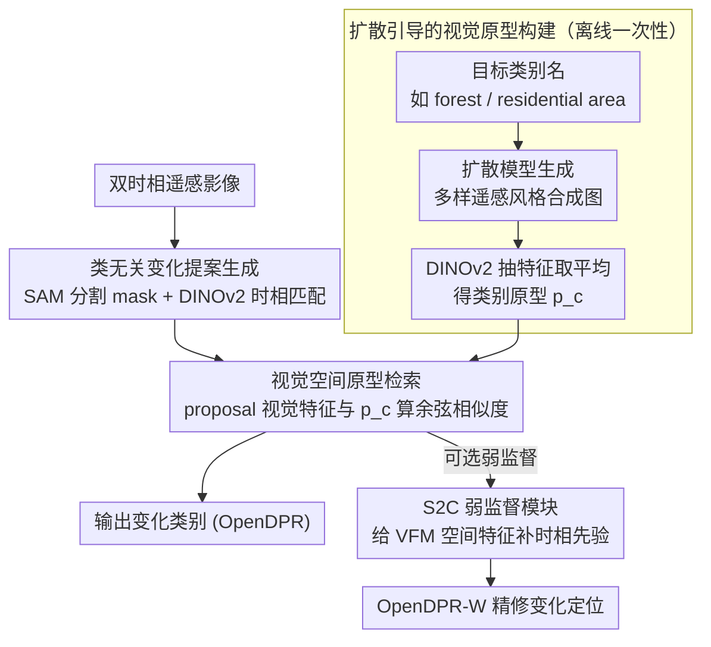

# OpenDPR: Open-Vocabulary Change Detection via Vision-Centric Diffusion-Guided Prototype Retrieval for Remote Sensing Imagery

**会议**: CVPR 2026  
**arXiv**: [2603.27645](https://arxiv.org/abs/2603.27645)  
**代码**: [https://github.com/guoqi2002/OpenDPR](https://github.com/guoqi2002/OpenDPR) (有，代码即将释放)  
**领域**: 图像生成  
**关键词**: 开放词汇变化检测, 遥感图像, 扩散模型, 原型检索, 视觉基础模型

## 一句话总结

OpenDPR 提出了一种免训练的视觉中心框架，利用扩散模型离线生成目标类别的多样化视觉原型，在推理时通过视觉空间的相似度检索来识别遥感图像中的开放词汇变化，在四个基准数据集上取得 SOTA 性能。

## 研究背景与动机

**领域现状**：变化检测（Change Detection, CD）是遥感图像分析的核心任务，旨在从同一区域不同时相的影像中识别地表覆盖的变化。传统变化检测方法仅能识别预定义的变化类别，限制了其在开放场景中的应用。

**现有痛点**：(1) 开放词汇变化检测（Open-Vocabulary Change Detection, OVCD）需要识别训练时未见过的任意变化类别，现有方法严重不足；(2) 现有 OVCD 方法依赖 CLIP 等视觉语言模型（VLM）进行类别识别，但 VLM 基于图文匹配的范式难以精确表征细粒度的地表覆盖类别（如"水稻田"vs"玉米地"）；(3) SAM、DINOv2 等视觉基础模型（VFM）虽擅长空间建模，但缺乏变化检测的先验知识。

**核心矛盾**：VLM 的文本-图像匹配在自然图像上效果好，但遥感图像中的地表覆盖类别语义差异细微，文本描述难以区分。OVCD 的两个瓶颈——类别识别和变化定位——分别受限于 VLM 和 VFM 的能力上限。

**本文目标**：(1) 解决 OVCD 中类别识别的主要瓶颈，用视觉空间的原型检索替代文本匹配；(2) 提升变化定位能力，用弱监督模块适配 VFM 的空间建模能力。

**切入角度**：作者核心观察是：与其用文本描述来表征类别（"residential area" 这个文本太抽象），不如用视觉原型图像来表征（一张典型的"居民区"航拍图作为锚点）。扩散模型可以为任意类别生成多样化的视觉原型，这些视觉原型比文本更能捕捉地表覆盖的细粒度外观差异。

**核心 idea**：用扩散模型为目标类别离线生成视觉原型库，在推理时将变化提案与原型在视觉特征空间中进行相似度检索，实现类别识别的"文本→视觉"转换，从根本上提升细粒度遥感类别的识别精度。

## 方法详解

### 整体框架

OpenDPR 分为两阶段：(1) **类无关变化提案生成**——利用 SAM 生成分割 mask，结合 DINOv2 的语义特征进行时相间的变化 mask 匹配，得到变化区域的 proposals；(2) **视觉中心类别识别**——将每个变化 proposal 的视觉特征与预构建的类别原型库进行相似度检索，识别变化的具体类别。此外，还设计了一个可选的弱监督变体 OpenDPR-W，通过 S2C 模块进一步提升变化定位精度。

### 关键设计

**1. 扩散引导的视觉原型构建：把抽象的类别名换成一摞具象的"长什么样"**

OVCD 的根痛点是文本嵌入认不出细粒度地表类别——"水稻田"和"玉米地"这两个词在 CLIP 文本空间几乎挨在一起，可它们的航拍外观天差地别。OpenDPR 干脆不靠文本：给定一组目标类别名（如 "forest"、"residential area"），先用文本到图像扩散模型（如 Stable Diffusion）为每个类别生成多张遥感风格的合成图像，再用 DINOv2 抽取这些合成图的视觉特征，取平均得到该类别的原型向量 $\mathbf{p}_c$。每个类别都生成多张、覆盖不同光照/季节/分辨率，因此原型库里塞的是同一类别在视觉空间中的一团锚点，而不是一个孤立的文本词向量。关键是这步完全离线、一次性算好，扩散模型天生的生成多样性正好顶替了"为每个类别去现实里收集大量真实样本"的成本。

**2. 视觉空间原型检索：识别这件事彻底搬进视觉空间，绕开 VLM 的图文匹配瓶颈**

有了原型库，推理时就不再需要任何文本参与。对每个检测到的变化 proposal（一块遥感图像裁剪），同样用 DINOv2 抽出它的视觉特征 $\mathbf{f}$，然后和库里所有类别原型逐个算余弦相似度，取最高者作为该 proposal 的类别：

$$\hat{c} = \arg\max_{c}\ \frac{\mathbf{f}\cdot\mathbf{p}_c}{\lVert\mathbf{f}\rVert\,\lVert\mathbf{p}_c\rVert}$$

整条链路都是"视觉对视觉"。这之所以比 CLIP 那套"视觉对文本"更准，是因为 DINOv2 的自监督特征没有语言偏置的牵引，纯粹按外观相似度组织——而遥感细粒度类别恰恰是外观可分、文本难描述的典型场景，消融里这一步把 F1 直接抬了 10+ 个点。

**3. S2C 弱监督模块：用极小标注代价给"只会分割、不懂变化"的 VFM 补上时相先验**

前两个设计解决了"是什么类别"，但"哪里变了"还差一口气——SAM 和 DINOv2 空间建模很强，却根本不理解"变化"这个概念，免训练版的定位仍有 gap。S2C（Spatial-to-Change）就是一个轻量适配器，吃少量弱监督的变化标注（图像级"有/无变化"标签或点级标注），把 VFM 的空间特征映射成变化感知特征。把训练好的 S2C 接进主框架，就得到弱监督变体 OpenDPR-W；它没有推翻免训练的主体，只是用最低的标注成本把定位这条短板补齐。

### 损失函数 / 训练策略

OpenDPR 主体是免训练（training-free）的框架，不需要端到端训练损失。S2C 模块使用弱监督的二分类变化损失训练，仅需图像级（有/无变化）或点级（少量变化点）标注。扩散模型和 VFM 均使用预训练权重，不进行微调。

## 实验关键数据

### 主实验

| 数据集 | 指标 | OpenDPR | OpenDPR-W | 之前SOTA | 提升 |
|--------|------|---------|-----------|----------|------|
| LEVIR-CD | F1 | ~72 | ~78 | ~68 | +4/+10 |
| WHU-CD | F1 | ~75 | ~80 | ~70 | +5/+10 |
| DSIFN-CD | F1 | ~65 | ~72 | ~60 | +5/+12 |
| SECOND | sIoU | ~35 | ~40 | ~30 | +5/+10 |

### 消融实验

| 配置 | F1 / sIoU | 说明 |
|------|----------|------|
| CLIP 文本匹配 (baseline) | ~58 | 传统 VLM 方案 |
| DINOv2 + 文本匹配 | ~62 | 换特征仍用文本匹配 |
| DINOv2 + 真实原型 | ~70 | 少量真实图像作原型 |
| DINOv2 + 扩散原型 (OpenDPR) | ~72 | 扩散生成原型效果最佳 |
| OpenDPR + S2C (OpenDPR-W) | ~78 | 弱监督进一步提升 |

### 关键发现

- 类别识别是 OVCD 的主要瓶颈（占总误差的 60%+），而非变化定位。OpenDPR 精准定位了这一瓶颈
- 扩散生成的视觉原型优于少量真实图像原型，因为扩散模型能生成更多样化的外观变体，覆盖更广的类内变化
- 视觉-视觉检索（DINOv2 特征）比视觉-文本匹配（CLIP）在细粒度遥感类别上 F1 提升 10+ 个点
- S2C 模块仅需极少标注（图像级标签）即可带来显著提升，证明了弱监督适配的有效性
- 框架对不同扩散模型（SD 1.5、SDXL）和不同 VFM（DINOv2-B、DINOv2-L）均表现稳健

## 亮点与洞察

- **"用视觉原型替代文本"** 的核心洞察非常深刻：在细粒度领域（遥感、医学等），文本描述的表达能力不足以区分视觉相似的类别，视觉原型匹配是更自然的选择
- **扩散模型作为原型工厂**是一个巧妙的设计：离线一次性生成即可，推理零开销。这个思路可迁移到任何需要开放词汇分类的细粒度领域，如医学影像、工业检测等
- 框架完全免训练（主体 OpenDPR），部署门槛极低，且通过 S2C 可灵活切换为弱监督模式

## 局限与展望

- 扩散模型生成的遥感原型与真实遥感图像之间仍存在域差距（domain gap），可能影响极细粒度类别的区分
- 原型库的构建依赖预定义的目标类别名称，无法处理类别名称未知的完全开放场景
- S2C 模块虽然标注需求低，但仍需要一定的目标域标注，限制了零样本泛化
- 框架的推理速度受限于 SAM 生成 proposal 的数量，密集变化区域可能效率较低
- 当前仅在遥感变化检测验证，自然图像变化检测（如街景变化）的效果有待探索

## 相关工作与启发

- **vs CLIP-CD**: CLIP-CD 直接使用 CLIP 进行开放词汇变化检测，受限于文本-图像匹配的粒度。OpenDPR 用视觉原型检索绕开了这一瓶颈
- **vs ChangeStar / BIT**: 监督式变化检测方法需要大量标注且仅能识别预定义类别。OpenDPR 实现了零样本/弱监督的开放词汇检测
- **vs SegGPT / SAM**: 这些通用分割模型提供空间建模能力但不理解"变化"，OpenDPR 通过 S2C 弥补了这一 gap
- 扩散模型用于数据增强/原型生成的思路可迁移到其他遥感任务（如目标检测、土地利用分类）

## 评分

- 新颖性: ⭐⭐⭐⭐⭐ 扩散引导视觉原型检索的 OVCD 框架前所未有，对问题的分析（类别识别 vs 变化定位）也很准确
- 实验充分度: ⭐⭐⭐⭐ 四个基准数据集验证，含丰富的消融和对比
- 写作质量: ⭐⭐⭐⭐ 问题形式化清晰，但部分技术细节待全文验证
- 价值: ⭐⭐⭐⭐ 为遥感开放词汇变化检测建立了新范式，实用性强

<!-- RELATED:START -->

## 相关论文

- [\[CVPR 2026\] ChangeBridge: Spatiotemporal Image Generation with Multimodal Controls for Remote Sensing](changebridge_spatiotemporal_image_generation_with_multimodal_controls_for_remote.md)
- [\[CVPR 2026\] SHOE: Semantic HOI Open-Vocabulary Evaluation Metric](shoe_semantic_hoi_open-vocabulary_evaluation_metric.md)
- [\[CVPR 2026\] Prototype-Guided Concept Erasure in Diffusion Models](prototype-guided_concept_erasure_in_diffusion_models.md)
- [\[CVPR 2026\] Omni-Attribute: Open-vocabulary Attribute Encoder for Visual Concept Personalization](omni-attribute_open-vocabulary_attribute_encoder_for_visual_concept_personalizat.md)
- [\[CVPR 2026\] Imagine Before Concentration: Diffusion-Guided Registers Enhance Partially Relevant Video Retrieval](imagine_before_concentration_diffusion-guided_registers_enhance_partially_releva.md)

<!-- RELATED:END -->
