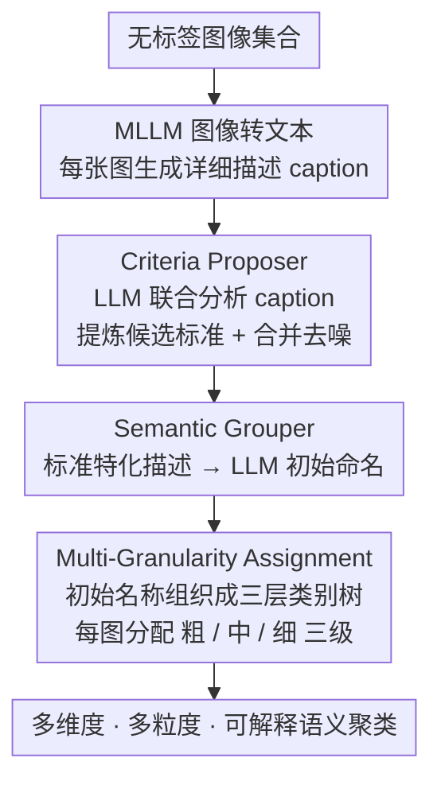

# Organizing Unstructured Image Collections using Natural Language

**会议**: CVPR 2026 Findings  
**arXiv**: [2410.05217](https://arxiv.org/abs/2410.05217)  
**代码**: [https://oatmealliu.github.io/xcluster.html](https://oatmealliu.github.io/xcluster.html)  
**领域**: 图像生成  
**关键词**: 开放式语义多聚类, 图像组织, 自然语言, 大语言模型, 多粒度聚类

## 一句话总结

本文定义了开放式语义多聚类（OpenSMC）新任务，并提出 X-Cluster 框架，利用 MLLM 将图像转为文本后通过 LLM 自动发现聚类标准和语义子结构，无需任何人类先验输入即可将大规模无标签图像集组织为多维度、多粒度、可解释的语义聚类。

## 研究背景与动机

**领域现状**：图像聚类是机器学习的基础任务。深度聚类（DC）方法生成单一划分，多聚类（MC）方法可生成多个划分但需预设聚类标准和数量。近期的文本条件多聚类（TCMC）方法利用 MLLM 生成语义聚类，但需要用户预先定义聚类标准。

**现有痛点**：(1) 现有方法产出的聚类结果不可解释——只有索引标号，没有人类可读的类别名称；(2) DC 和 MC 方法的聚类结果受模型归纳偏置和超参数影响，而非数据本身的语义；(3) TCMC 方法假设用户已知有意义的聚类标准，但对大规模复杂数据集，用户往往不知道哪些维度是有意义的。

**核心矛盾**：理想的图像组织应该自动从数据中发现多个有意义的聚类维度（如"活动"、"地点"、"情绪"），并自动命名每个聚类。但没有现成的视觉模型能可靠地同时处理大量图像并进行这种高层语义推理。

**本文目标**：定义 OpenSMC 任务——给定无标签图像集合，自动发现多个聚类标准、每个标准下的聚类数量和名称、以及图像的聚类分配，所有输出均以自然语言表达，且不需要任何人类先验。

**切入角度**：作者观察到，虽然没有视觉模型能直接在大规模图像集上做语义推理，但 LLM 在文本领域有强大的主题发现和总结能力。如果将图像"翻译"为文本，就可以借助 LLM 从大量文本描述中发现聚类标准。

**核心 idea**：将图像转为文本代理（caption/tag），利用 LLM 在文本空间中发现聚类标准，再回到视觉空间进行图像聚类分配——文本是连接视觉感知和语义推理的桥梁。

## 方法详解

### 整体框架

X-Cluster 要解决的是 OpenSMC：给一堆没有标签的图，既不知道该按什么维度分，也不知道每个维度分几类、叫什么名字，全部要系统自己想出来。难点在于没有现成的视觉模型能一次"看完"几千张图并做高层语义归纳，而 LLM 在纯文本上恰好擅长发现主题。X-Cluster 的整条思路就是"绕道文本"：先用 MLLM 把每张图翻译成文字，让 LLM 在文本空间里发现聚类标准，再回到视觉空间给每张图分配类别。

具体拆成两个免训练阶段。第一阶段 **Criteria Proposer** 通读整个图像集合，吐出若干聚类标准（如 "Activity"、"Location"、"Mood"）；第二阶段 **Semantic Grouper** 针对每一个标准，把图像组织成有名字的语义聚类（如 Activity 下的 "Surfing"、"Skateboarding"），并进一步用多粒度机制给出粗/中/细三种粒度。两个阶段都各有 Caption-based、Tag-based、Image-based 三种变体，作者实测下来 Caption-based 最强，下文以它为主线。

### 关键设计

**1. Criteria Proposer：让 LLM 在文本里"看出"该按哪些维度分类**

无标签图像集合的核心难题是连"分类轴"都没有——视觉模型只会给索引号，说不清这堆图为什么该按"活动"还是"地点"分。X-Cluster 先用 MLLM（LLaVA-NeXT-7B）给每张图写一段详细描述 $e_n = \text{MLLM}(x_n)$，把图像问题转成文本问题；再把所有 caption 随机打乱后按 400 条一组喂给 LLM（Llama-3.1-8B）联合分析，让它从大量描述里提炼出反复出现的共性主题当作候选标准 $\tilde{\mathcal{R}} = \text{LLM}(\{e_n\})$。最后做一遍 Criteria Refinement，让 LLM 合并语义重叠的标准（如 "Outdoor" 和 "Open space" 其实是一回事）并剔除噪声标准。之所以用 caption 而非 tag，是因为整句描述携带的语义上下文更丰富，能让 LLM 想到更全的维度——在 Hard 标准集上 caption 方案的 TPR 比 tag 方案高 32.2 个百分点。

**2. Semantic Grouper：把每个标准落到具名、可读的聚类上**

光有标准还不够，还得在每个标准下把图分进具体类别并起好名字。Grouper 先用 MLLM 生成"标准特化"的描述 $e_n^l = \text{MLLM}(x_n, R_l)$，让模型只盯着与当前标准 $R_l$ 相关的视觉内容（看 Activity 时就别管背景颜色）；再让 LLM 为每段描述初始命名 $s_n^l = \text{LLM}(e_n^l, R_l)$，汇成初始名称集 $\mathcal{S}_{\text{init}}^l$。关键在于初始命名极度发散——光 Activity 一个标准就能冒出 203 个名字，直接拿来用等于没分类，所以这些零散名称还要紧接着被精炼、组织成可读的类别体系（如何精炼、如何兼顾不同粒度，正是下一步多粒度机制要做的事）。

**3. Multi-Granularity Assignment：用粗/中/细三层粒度兜住"未知的标注粒度"**

OpenSMC 里 ground-truth 到底分多细是未知的——用户可能想要 "Outdoor" 这种粗类，也可能想要 "Tennis Court" 这种细类。X-Cluster 的做法是不赌单一粒度，而是把 Initial Naming 得到的名称交给 LLM 组织成一棵三层类别树（Multi-granularity Cluster Refinement），再让每张图在粗/中/细三级各分配一个类别（Final Assignment）。例如 Location 标准下，同一张图会同时落到粗粒度 "Outdoor"、中粒度 "Recreation"、细粒度 "Tennis Court"。这样只要用户偏好的粒度落在三层之一，系统就能对上；实验也验证多粒度精炼比 Flat refinement 的一致性更好。

### 一个完整示例

以 "Location" 标准、一张网球场照片为例走一遍后半程：MLLM 先写出标准特化描述——"a person playing tennis on an outdoor hard court surrounded by fences"；LLM 据此初始命名为 "Tennis Court"。把全集的初始名称汇总后，Activity 这类标准会爆出 203 个名字，Grouper 让 LLM 把它们收敛成一棵三层树：粗粒度合并到 12 个大类（如 "Outdoor"），中粒度细分出 "Recreation"，细粒度保留 "Tennis Court"。最终这张图在三个粒度级分别被标为 Outdoor / Recreation / Tennis Court——无论用户想要的是"室内外"还是"具体场地"，都能在某一层命中。

### 损失函数 / 训练策略

X-Cluster 完全免训练，不做任何微调。所有组件（LLaVA-NeXT-7B、Llama-3.1-8B、BLIP-2、CLIP ViT-L/14）都用预训练权重，整个系统靠精心设计的结构化 prompt 驱动，每个 prompt 包含 System Prompt、Input Explanation、Goal Explanation、Task Instruction、Output Instruction 等组件。

## 实验关键数据

### 主实验（与 TCMC 方法对比）

| 方法 | 先验 | COCO-4c CAcc/SAcc | Food-4c CAcc/SAcc | Avg CAcc/SAcc |
|------|------|----------|----------|----------|
| IC\|TC† | 标准+类数 | 48.9/53.2 | 50.5/61.7 | 62.0/57.4 |
| SSD-LLM† | 标准+类数 | 41.6/52.1 | 47.5/55.5 | 58.6/53.6 |
| MMaP† | 标准+类数 | 33.9/- | 43.8/- | 48.2/- |
| X-Cluster (Ours) | **无** | 51.2/48.4 | 48.1/64.9 | 61.8/62.3 |

*† 使用了 ground-truth 标准和聚类数量*

### 消融实验——多粒度精炼

| 配置 | Avg CAcc | Avg SAcc | 说明 |
|------|---------|---------|------|
| Initial Names | 37.1 | 49.3 | 直接用初始名称 |
| Flat Refinement | 46.1 | 50.5 | 单层精炼 |
| Multi-Granularity | 61.8 | 62.3 | 多粒度精炼（本文） |

### 关键发现

- X-Cluster 在不使用任何先验的情况下，CAcc 与使用 ground-truth 标准和聚类数量的 TCMC 方法可比，SAcc 甚至更高（62.3 vs 57.4），证明了自动发现标准的可行性
- Caption-based Proposer 在 Hard 标准集上 TPR 达到 75.1%，远超 Tag-based（42.9%）和 Image-based（36.2%），因为 caption 包含更丰富的语义上下文
- Caption-based Grouper 在 15 个测试标准中有 10 个排名第一（按 HM 评价），平均 CAcc 59.9% 接近 CLIP zero-shot oracle 的 58.1%
- 多粒度精炼带来了巨大的 CAcc 提升（37.1→61.8），说明粒度一致的类别名称对聚类至关重要
- 图像数量实验显示：复杂数据集（COCO-4c）需要大量图像才能发现全面的标准，而简单数据集（Card-2c）甚至单张图像就足够

## 亮点与洞察

- **定义了 OpenSMC 这一全新任务**，明确了与 DC、MC、TCMC 的区别边界，具有开创性意义
- **文本作为推理代理**的核心思想非常优雅：利用 LLM 的文本推理能力弥补视觉模型无法在大规模图像集上全局推理的短板。这个"视觉→文本→推理→视觉"的范式具有广泛迁移价值
- 实际应用展示令人印象深刻：(1) 发现 T2I 模型（DALL·E3、SDXL）中的新型偏见（如 CEO 与"Dark hair"的关联），超越了传统的性别/种族偏见分析；(2) 分析社交媒体图像流行度的视觉因素
- 框架完全基于开源模型（LLaVA-NeXT-7B、Llama-3.1-8B），可本地部署，保护数据隐私

## 局限与展望

- 计算开销较大：COCO-4c（5000 张图）在 4 x A100 上需 7.6 小时，主要瓶颈在逐图 captioning
- MLLM 的 caption 质量直接影响系统性能，caption 中的遗漏/幻觉可能导致标准发现不全或聚类错误
- 对细粒度类别（如鸟类品种、车型）表现较弱，需结合 FineR 等专用方法
- 聚类结果的语义名称可能与 ground-truth 不完全对齐（如 "Joyful" vs "Happy"），导致 SAcc 存在系统性折扣
- 当前仅支持图像数据，论文讨论了扩展到音频（Whisper）、表格（TabT5）、蛋白质结构等其他模态的可能性

## 相关工作与启发

- **vs IC|TC**: IC|TC 需要用户指定聚类标准和数量，X-Cluster 完全自动发现标准、数量和名称
- **vs SSD-LLM**: SSD-LLM 需要数据集的"主类别"作为输入（如 "Food"），X-Cluster 无需任何先验
- **vs MMaP / MSub**: 学习型多聚类方法需要训练并且聚类结果不可解释。X-Cluster 免训练且输出自然语言标签
- **vs Topic Discovery (NLP)**: 类似 NLP 中的主题模型，但在视觉上更难，因为图像语义是隐式的。X-Cluster 的"视觉→文本→推理"范式桥接了这一 gap
- 本文的多粒度聚类思路可启发其他无监督学习任务，如层次化图像检索、数据集审计

## 评分

- 新颖性: ⭐⭐⭐⭐⭐ 定义了全新任务 OpenSMC，框架设计思路新颖且优雅
- 实验充分度: ⭐⭐⭐⭐⭐ 六个基准+两个新基准+三个应用+丰富的消融和附录分析
- 写作质量: ⭐⭐⭐⭐⭐ 任务定义清晰，方法逻辑严密，supplementary 内容极其充实（60+ 页）
- 价值: ⭐⭐⭐⭐⭐ 对数据集审计、偏见发现、社交媒体分析等实际应用有直接价值

<!-- RELATED:START -->

## 相关论文

- [\[CVPR 2026\] Say Cheese! Detail-Preserving Portrait Collection Generation via Natural Language Edits](say_cheese_detail-preserving_portrait_collection_generation_via_natural_language.md)
- [\[CVPR 2026\] Match-and-Fuse: Consistent Generation from Unstructured Image Sets](match-and-fuse_consistent_generation_from_unstructured_image_sets.md)
- [\[ICCV 2025\] Describe, Don't Dictate: Semantic Image Editing with Natural Language Intent](../../ICCV2025/image_generation/describe_dont_dictate_semantic_image_editing_with_natural_language_intent.md)
- [\[NeurIPS 2025\] SAO-Instruct: Free-form Audio Editing using Natural Language Instructions](../../NeurIPS2025/image_generation/sao-instruct_free-form_audio_editing_using_natural_language_instructions.md)
- [\[ECCV 2024\] NL2Contact: Natural Language Guided 3D Hand-Object Contact Modeling with Diffusion Model](../../ECCV2024/image_generation/nl2contact_natural_language_guided_3d_hand-object_contact_modeling_with_diffusio.md)

<!-- RELATED:END -->
