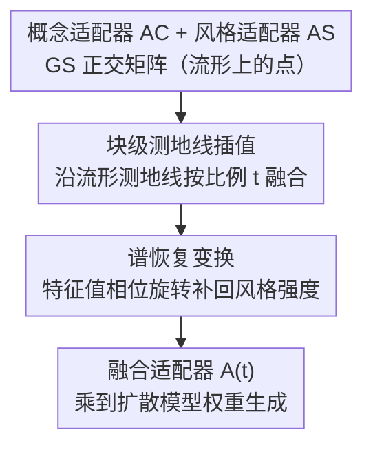

# OrthoFuse: Training-free Riemannian Fusion of Orthogonal Style-Concept Adapters for Diffusion Models

**会议**: CVPR 2026  
**论文**: [CVF Open Access](https://openaccess.thecvf.com/content/CVPR2026/html/Aliev_OrthoFuse_Training-free_Riemannian_Fusion_of_Orthogonal_Style-Concept_Adapters_for_Diffusion_CVPR_2026_paper.html)  
**代码**: https://github.com/ControlGenAI/OrthoFuse （有）  
**领域**: 图像生成 / 扩散模型 / 参数高效微调  
**关键词**: 正交微调, 适配器融合, 黎曼流形, 测地线, 风格-概念生成  

## 一句话总结
首个面向**乘性正交适配器**（OFT）的免训练融合方法：把 Group-and-Shuffle（GS）正交矩阵当成黎曼流形上的点，用块级测地线插值把"概念适配器"和"风格适配器"合成一个，再加一道谱恢复变换补回被插值压扁的特征值，从而在不重新训练的情况下把指定主体和指定艺术风格融到一张图里。

## 研究背景与动机
**领域现状**：扩散模型的主体驱动生成（subject-driven）和风格化（stylization）通常各自用一小撮图像微调出一个适配器（LoRA 或正交适配器）。LoRA 的合并已被大量研究（ZipLoRA、K-LoRA、MoLe、B-LoRA 等），方式从简单加权平均到可学习门控不等。

**现有痛点**：(1) 一个真实且未解决的需求是"既要用户指定的**主体**、又要用户指定的**艺术风格**"，即把两个独立训练的适配器合成一个；(2) LoRA 的加性低秩更新会扭曲神经元关系、破坏生成语义，且不同 LoRA 之间存在**尺度不一致**，融合时需要额外处理量级差异；(3) 近期提出的乘性正交适配器（OFT）训练更稳、不易过拟合，且**按设计就保持层的谱范数与 Frobenius 范数**——天然适合无量级顾虑地融合，但**至今没有任何工作研究正交适配器怎么合并**。

**核心矛盾**：正交适配器的天然优势（保范数、可无缝融合）没人利用；而把"合并"naively 做成对角块逐块线性插值，会因为 GS 正交流形结构复杂而不对、也会损害生成质量。

**本文目标**：(1) 给 GS 正交矩阵建立几何结构，推出两点间测地线的高效近似公式，实现闭式、免训练的适配器融合；(2) 解决融合后特征值"被压向 1"导致风格变弱的问题。

**切入角度**：作者注意到 GS 正交矩阵集合其实构成一个**黎曼流形**，于是"融合两个适配器"就等价于"在流形上沿测地线从一个点走到另一个点"，融合比例就是测地线参数 $t$。

**核心 idea**：用"流形上的块级测地线插值 + 谱恢复"替代"参数空间的线性平均/门控学习"，得到首个针对乘性正交适配器的免训练合并方法。

## 方法详解

### 整体框架
OrthoFuse 的输入是两个独立训练好的 GS 正交适配器——概念适配器 $A_C$ 和风格适配器 $A_S$（都形如 $A = P^\top L P R$，$L,R$ 为块对角正交块），输出是一个仍属于同一 GS 正交类、按比例 $t\in[0,1]$ 混合了两者特征的融合适配器 $A(t)$，直接乘到扩散模型权重上（$W' = A(t)W$）即可生成。理论基石是作者证明的 **Theorem 2：GS 正交矩阵集合构成光滑流形**，这让"沿测地线连接两点"成为可能。整条管线只有两步纯线性代数操作、零训练：先做**块级测地线插值**得到中间适配器，再做**谱恢复变换**把被插值压向 1 的特征值相位旋转回去，恢复风格强度。

### 关键设计

**1. GS 正交适配器的黎曼流形结构：把"合并适配器"变成"流形上走测地线"**

这是全文的理论支点，回应"naive 逐块线性插值不对"的痛点。作者证明（Theorem 2）GS$(P_L,P,P_R)$ 正交矩阵集合构成光滑流形，于是融合两个适配器 $A_C,A_S$ 就等价于在流形上找一条连接它们的可解释曲线，曲线参数 $t$ 直接控制概念与风格的混合比例。严格的局部最短测地线计算代价高，但关键经验观察是：正交微调得到的对角块都**接近单位阵**（[21] 也报告过），因此**块级测地线插值能精确近似流形上的真实局部最短测地线**。这把一个看似要解黎曼优化的问题，化简成对每个小正交块独立做闭式运算——既正确又高效。

**2. 块级测地线插值：对每对正交块做闭式测地线融合**

针对 GS 正交矩阵由独立正交块拼成的结构，融合逐块进行。对一对对应块 $B_C, B_S \in SO(n)$，其测地线融合为

$$B(t) = B_C \exp\!\big(t \cdot \log(B_S^\top B_C)\big).$$

实际计算时利用正交矩阵总可对角化：对 $B_S^\top B_C = U\Lambda U^\top$ 做特征分解，则 $B(t) = B_C U \exp(t\log\Lambda)U^\top$，退化为只对特征值做标量函数 + GPU 友好的矩阵乘。$t=0$ 时退回纯概念适配器、$t=1$ 时退回纯风格适配器，中间值给出概念保持与风格强度之间的连续过渡。逐块运算还规避了特征分解的立方时间瓶颈（块小），是整套算法高效（可秒级完成）的关键。

**3. 谱恢复变换：把被插值压扁的特征值相位旋转回去，找回风格强度**

作者经验发现：融合会把结果矩阵的特征值**拉得更靠近 1**（见原文 Fig.2），而正交适配器的特征值控制其"旋转强度"，特征值趋近单位意味着层趋近恒等变换、风格被削弱。为此提出谱恢复：在复单位圆上旋转特征值相位，即对相位乘一个标量因子。形式上 $B_{rotated}(t) = \exp(\varphi(t)\log(B(t)))$，相位乘子 $\varphi(t)$ 满足 $\varphi(0)=\varphi(1)=1$（保证边界还原原始适配器）、$\varphi(1/2)=\varphi_0$，经消融取二阶多项式 $\varphi(t) = 1 + 4t(1-t)$（$\varphi_0=2$）。但每个 $t$ 都重新对角化代价高，作者用两个近似（命题 1 用 $\log(B)\approx (B-B^\top)/2$、命题 2 用 Padé 一阶近似指数）推出硬件友好的闭式 Cayley 形式：

$$B_{OrthoFuse}(t) = \Big(I - \tfrac{\varphi(t)}{4}(B(t)-B(t)^\top)\Big)^{-1}\Big(I + \tfrac{\varphi(t)}{4}(B(t)-B(t)^\top)\Big),$$

在 $B(t)\to I$ 时以 $O(\|B(t)-I\|_2^2)$ 的误差逼近 $B_{rotated}(t)$。⚠️ 此处近似阶数与误差界以原文命题 1–3 为准。这一步专治"测地线插值后风格变淡"，是 OrthoFuse 在风格保真上拉开差距的直接原因。

### 一个完整示例
取一个 DreamBooth 概念（如 "sks dog"）训出概念适配器 $A_C$，取一张风格参考图训出风格适配器 $A_S$（均 32 块、SDXL 基座）。融合时：对每对对应正交块 $(B_C^{(i)}, B_S^{(i)})$ 先做块级测地线插值 $\tilde B^{(i)}(t)$（式 12），再对其做特征值旋转 $B^{(i)}(t)$（式 13），拼回得融合适配器 $A(t)$。取 $t=0.6$ 时，生成图既保留了 dog 的身份语义、又稳定地呈现目标艺术风格；$t\to 0$ 偏向纯概念（几乎无风格）、$t\to 1$ 偏向纯风格（丢身份）。整套合并 1 秒内完成、无需任何训练。

## 实验关键数据

### 主实验
SDXL 基座，6 个 DreamBooth 概念 × 12 个 StyleDrop/K-LoRA 风格 = 72 组，每组生成 10 张评测。指标：Style Sim（与风格参考图的 CLIP 相似度，衡量风格保真）、CLIP/DINO（与原概念的语义一致性）、几何平均（综合风格-概念权衡）。

| 方法 | 类型 | Style Sim↑ | CLIP↑ | DINO↑ | Geo.Mean(Style,CLIP)↑ | 合并耗时 |
|------|------|-----------|-------|-------|------|------|
| Joint training | 训练式 | 0.48 | **0.79** | **0.67** | 0.62 | 1.5 小时 |
| ZipLoRA r=64 | 训练式 | 0.49 | 0.76 | 0.64 | 0.61 | 4 分钟 |
| K-LoRA r=64 | 免训练 | 0.49 | 0.76 | 0.56 | 0.61 | < 1 秒 |
| **OrthoFuse** | 免训练 | **0.61** | 0.68 | 0.51 | **0.64** | **< 1 秒** |

OrthoFuse 拿到最高风格相似度（0.61，显著领先所有基线）和最高综合几何平均（0.64）；概念保持（CLIP/DINO）略低于最佳基线，作者解释这是预期的——强风格化必然让生成偏离原概念图。Joint 训练式概念保持最好但常忽略风格（Style Sim 仅 0.48）且每对都要重训。

### 用户研究 / 消融
65 名参与者、1460 次成对比较（OrthoFuse vs K-LoRA / ZipLoRA）：

| 问题 | Ours vs K-LoRA | Ours vs ZipLoRA |
|------|------|------|
| 概念保持 (Q1) | 48% vs 52% | 54% vs 46% |
| 风格迁移 (Q2) | **77% vs 23%** | **83% vs 17%** |
| 总体偏好 (Q3) | **67% vs 33%** | **76% vs 24%** |

融合参数 $t$ 消融：$t=0$ 纯概念无风格、$t=1$ 纯风格丢身份，$t=0.6$ 给出最均衡的权衡（默认值）。谱恢复（特征值旋转）相比仅测地线插值显著提升风格保真（原文 Fig.2 / Appendix F）。

### 关键发现
- **谱恢复是风格保真的关键**：仅做测地线插值会把特征值压向 1、风格变淡；加上特征值相位旋转才能把风格强度补回来。
- **风格-概念存在固有 trade-off**：OrthoFuse 在风格迁移上压倒性胜出（用户研究 77%–83%），但概念保持与 K-LoRA 基本持平（48% vs 52%），说明它把权衡推向了"更强风格"一侧。
- **免训练且秒级**：与训练式 Joint（1.5 小时/对）、ZipLoRA（4 分钟）相比，OrthoFuse 与 K-LoRA 同为 < 1 秒，却风格保真更高。
- **块大小/秩对齐**：rank-32 LoRA 约等于 64 块正交适配器（参数量级相当），实验用 32 块、$t=0.6$ 默认配置。

## 亮点与洞察
- **把"合并适配器"重述成"流形上走测地线"**是最优雅的视角切换：一旦证明 GS 正交矩阵构成黎曼流形，融合就有了闭式、可解释、按比例可控的解，且免训练。这种"给参数集合赋几何结构再做插值"的思路可迁移到其他结构化参数（如其他正交/酉参数化）的合并。
- **利用正交适配器保范数的天然优势**绕开了 LoRA 融合最头疼的尺度不一致问题——不同适配器量级不用对齐就能直接融。
- **谱恢复 + Cayley/Padé 近似**把一个需要逐 $t$ 对角化的昂贵操作压成硬件友好的闭式逆，工程上很务实，最终能秒级出适配器。
- 最"啊哈"的点：融合会无意中把特征值压向 1（趋近恒等），作者抓住这个谱层面的现象并用相位旋转主动反制，把"为什么风格变淡"和"怎么补回来"一次说清。

## 局限与展望
- 作者承认：概念保持与风格保真之间仍有 trade-off，OrthoFuse 偏向风格、概念保持略逊最佳基线。
- 方法依赖一个关键经验假设——正交微调的对角块接近单位阵，才使块级插值能近似真实测地线；⚠️ 若适配器偏离单位阵较远，该近似与谱恢复的误差界（依赖 $B\to I$）可能失效。
- 自己发现的局限：只在 SDXL（FLUX 在附录）上、subject-style 两类任务上验证，是否能扩展到更多任务/更多适配器同时融合未充分探索；只融两个适配器，多适配器同时融合的几何形式（多点重心）未给出。
- 改进思路：把融合参数 $t$ 做成层级/区域自适应而非全局常量；探索流形上多点 Fréchet 均值以支持 >2 个适配器的融合。

## 相关工作与启发
- **vs ZipLoRA / K-LoRA / MoLe（LoRA 合并）**: 它们针对加性低秩 LoRA，靠可学习门控、列向混合系数或权重统计选择；ZipLoRA/MoLe 还需额外优化。OrthoFuse 面向乘性正交适配器、在参数空间闭式融合，避开 LoRA 的尺度不一致，风格迁移更强且免训练。
- **vs Joint Orthogonal Training**: 直接同时训一个概念+风格的正交适配器，概念保持最好但常忽略风格、且每对都要重训 1.5 小时；OrthoFuse 复用已训好的单适配器、秒级融合。
- **vs StyleAligned / StyleDrop / RB-Modulation（表示级/推理时控制）**: 它们在推理时调内部表示或反向扩散动力学来做风格控制；OrthoFuse 直接在权重参数空间利用正交流形几何做闭式融合，不改生成过程。

## 评分
- 新颖性: ⭐⭐⭐⭐⭐ 首个面向乘性正交适配器的免训练融合，把 GS 正交矩阵建模为黎曼流形并给出测地线闭式融合，视角新颖
- 实验充分度: ⭐⭐⭐⭐ 72 组定量 + 用户研究 + 消融较扎实，但仅 SDXL 主验、只融两个适配器、规模偏小
- 写作质量: ⭐⭐⭐⭐ 理论推导（流形/测地线/谱恢复）清晰且有命题支撑；部分近似细节需查附录
- 价值: ⭐⭐⭐⭐ 秒级、免训练、保范数的适配器融合，对个性化生成实用；受限于风格-概念固有权衡与近似假设

<!-- RELATED:START -->

## 相关论文

- [\[CVPR 2026\] CRAFT-LoRA: Content-Style Personalization via Rank-Constrained Adaptation and Training-Free Fusion](craft-lora_content-style_personalization_via_rank-constrained_adaptation_and_tra.md)
- [\[ICML 2026\] Orthogonal Concept Erasure for Diffusion Models](../../ICML2026/image_generation/orthogonal_concept_erasure_for_diffusion_models.md)
- [\[CVPR 2026\] A Training-Free Style-Personalization via SVD-Based Feature Decomposition](a_training-free_style-personalization_via_svd-based_feature_decomposition.md)
- [\[CVPR 2026\] Efficient and Training-Free Single-Image Diffusion Models](efficient_and_training-free_single-image_diffusion_models.md)
- [\[CVPR 2026\] HAM: A Training-Free Style Transfer Approach via Heterogeneous Attention Modulation for Diffusion Models](ham_a_training-free_style_transfer_approach_via_heterogeneous_attention_modulati.md)

<!-- RELATED:END -->
