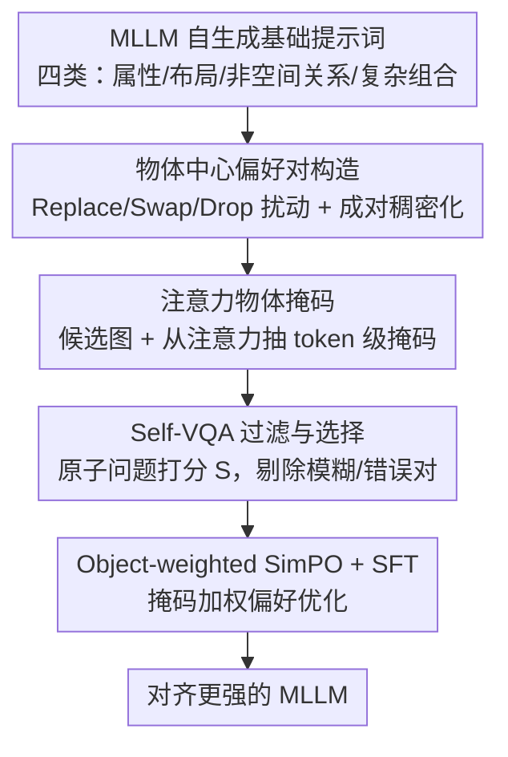

# OSPO: Object-Centric Self-Improving Preference Optimization for Text-to-Image Generation

**会议**: CVPR 2026  
**论文**: [CVF Open Access](https://openaccess.thecvf.com/content/CVPR2026/html/Oh_OSPO_Object-Centric_Self-Improving_Preference_Optimization_for_Text-to-Image_Generation_CVPR_2026_paper.html)  
**代码**: https://ku-agi.github.io/OSPO/ （项目页）  
**领域**: 图像生成 / 扩散模型 / 偏好优化  
**关键词**: 文生图, 自我改进偏好优化, 物体级对齐, 多模态大模型, 物体幻觉

## 一句话总结
OSPO 让统一多模态大模型（Unified MLLM）自己造一批"全局语义相同、只在物体细节上有差异"的偏好图像对，再用注意力得到的物体掩码加权 SimPO 损失去训练，在不依赖任何外部数据或模型的前提下显著提升了文生图的细粒度物体级对齐、压住了物体幻觉。

## 研究背景与动机
**领域现状**：统一多模态大模型把图像理解和生成塞进同一套参数，理论上可以"自评自改"。为了提升文生图的对齐，主流做法是用 DPO / PPO / GRPO 这类基于反馈的后训练。

**现有痛点**：这些方法有两个老毛病。一是**成本高**——DPO 需要大量人工或更强模型标注的偏好对，给图像收集这种数据远比文本贵；PPO/GRPO 不要预收集偏好对，但训练时要同时跑多个模型，开销大。二是**off-policy 偏置**——DPO 的偏好对分布和模型自身输出不一致，PPO/GRPO 又依赖在外部数据上训出来的奖励模型，分布失配导致训练不稳。

**核心矛盾**：为绕开外部依赖，近期出现了"自我改进"框架（如 SILMM），让模型自己生成训练数据和奖励信号。但它们普遍用 **Best-of-N 采样**：同一个提示词生成多张候选，挑最高分和最低分凑偏好对。作者在 16,000 条 Janus-Pro-7B 自生成数据上做了诊断，发现一个系统性失败模式——**偏好模糊对（Preference-Ambiguous Pair）**：两张图的提示词保真度其实难分高下，却被强行打上"优/劣"标签；更糟的是**偏好错误对（Preference-False Pair）**，两张图在所有语义单元上要么都对、要么都错，Best-of-N 仍硬塞进一个矛盾的监督信号。这种噪声在所有提示类别里都很普遍。

**本文目标**：在纯自我改进（不碰任何外部数据/模型）的约束下，把"物体级"对齐贯穿到数据生成、偏好判定、优化损失的每一个环节，专门治物体幻觉。

**切入角度**：把每个物体当成**独立的对齐单元**（object-centric），而不是整张图笼统打分——这样偏好信号能精确定位到"哪个物体的颜色/形状/空间关系错了"。

**核心 idea**：用"成对扰动+稠密化"主动造出只在物体细节上有差异的偏好对（取代 Best-of-N），再用注意力物体掩码把偏好优化的梯度聚焦到物体相关的视觉 token 上。

## 方法详解

### 整体框架
OSPO 是一个五阶段、完全自给自足的自我改进偏好优化框架，输入只有模型自己，输出是一个细粒度对齐更强的 MLLM。流程是：模型先用上下文学习造一批基础提示词，然后对每个提示词做**成对扰动+联合稠密化**，得到"背景一致、物体细节不同"的两条提示词；据此生成一对候选图，同时从注意力里抽出**物体掩码**；接着用 **Self-VQA** 把图像分解成原子语义问题逐一打分，过滤掉模糊/错误对并选出最干净的一对；最后用**物体加权 SimPO + SFT** 联合损失做偏好优化。前四阶段都在为"造一对干净、差异定位在物体上的偏好对"服务，第五阶段才是真正吃掉这对数据的优化。

### 关键设计

**1. 物体中心偏好对构造：用成对扰动+稠密化取代 Best-of-N**

这一步直接针对"偏好模糊/错误对"的痛点。OSPO 不再对同一提示词采 N 张图挑最优最劣，而是为每条基础提示词 $x$ **主动构造**一条扰动版 $\tilde{x}$，让"优/劣"差异从一开始就被精确写进提示词。扰动借鉴 SugarCrepe/WinoGround，有三种策略：**Replace**（把某物体/属性换成原本没有的，制造新的组合）、**Swap**（交换物体或属性的位置，改变关系绑定）、**Drop**（删掉某物体/属性，制造语义模糊）。默认每条原始提示生成 $N=3$ 条扰动，配成 $(x,\tilde{x}_1),\dots,(x,\tilde{x}_N)$。随后对每一对做**联合稠密化（Densification）**——给两条提示同时补上下文细节，使生成的两张图共享全局背景、只在物体级语义上有别。这样得到的偏好对天然"只差在物体细节"，偏好信号清晰，从源头消除了 Best-of-N 的模糊噪声。

**2. 注意力物体掩码：免分割模型地定位物体 token**

要做"物体加权"，先得知道哪些视觉 token 属于物体。OSPO 不引入额外的分割模型，而是直接复用 MLLM 内部的注意力：取某个表示物体的文本 token 对所有视觉 token 的注意力分布，从中间层里抽（掐掉最早和最晚各 $k=5$ 层以避开不稳定激活和过度平滑），跨注意力头和层做平均，reshape 成与图像网格对齐的二维空间注意力图，再用 OTSU 自适应阈值二值化成前景掩码 $m$。对原始提示里描述的每个物体重复这一过程并取并集，得到整张图的单一物体掩码 $M$。这套做法的好处是几乎零额外成本——纯粹利用模型已有的内部交互，不需要再训练或调用 SAM 这类外部模块。

**3. Self-VQA 过滤与选择：用原子问题打分剔除噪声对**

偏好优化对数据质量极敏感，所以即便造出了差异定位的对，仍要再过滤一道。OSPO 把每条基础提示 $x$ 分解成一组二元 Yes/No 原子问题 $Q(x)=\{q_1,\dots,q_K\}$，让 MLLM 对每张候选图回答，并把对齐分定义为 Yes/No 概率的平均边际：$s_k(y)=p(\text{yes}\mid y,q_k)-p(\text{no}\mid y,q_k)$，$S(y)=\frac{1}{K}\sum_{k=1}^{K}s_k(y)$。过滤规则有两条：若优选图 $y_w$ 的总分低于阈值 $S(y_w)<\tau$（默认 $\tau=0.6$）则丢弃整对；若劣选图 $y_\ell$ 在**每个**问题上都 $s_k(y_\ell)>0$（说明它其实也都对），同样丢弃。前者保证"优选确实够好"，后者专门干掉偏好错误对。过滤后从存活的对里挑 $S$ 最高的那一对作为最终训练三元组 $(x,\hat{y}_w,\hat{y}_\ell)$。

**4. Object-weighted SimPO + SFT：把梯度压到物体相关 token 上**

标准 SimPO 把奖励在所有 token 上平均，对图像而言会被大量与目标物体无关的 token 稀释掉训练信号。OSPO 用物体掩码给 token 级奖励加空间权重 $w_t=1+\alpha\,m_t$（$m_t\in[0,1]$，$\alpha$ 控制对物体 token 的强调，默认 $\alpha=1$），得到物体加权 SimPO 损失：

$$\mathcal{L}_{\text{Obj-SimPO}}=-\mathbb{E}_{(x,y_w,y_\ell)}\Big[\log\sigma\big(\tfrac{\beta}{|y_w|}\textstyle\sum_t (w_w)_t\log\pi_\theta((y_w)_t)-\tfrac{\beta}{|y_\ell|}\textstyle\sum_t (w_\ell)_t\log\pi_\theta((y_\ell)_t)-\gamma\big)\Big]$$

默认 $\beta=5,\gamma=2.5$。但只靠 token 级偏好奖励管不住物体的形状、几何、布局这类需要全局一致性的结构信息，所以再加一条 SFT 损失，以优选图为锚点 $\mathcal{L}_{\text{SFT}}=-\mathbb{E}_{(x,y_w)}[\frac{1}{|y_w|}\sum_t\log\pi_\theta((y_w)_t)]$，对整条视觉 token 序列做一致监督、稳住全局连贯性。最终目标 $\mathcal{L}_{\text{OSPO}}=\mathcal{L}_{\text{Obj-SimPO}}+\lambda\mathcal{L}_{\text{SFT}}$（默认 $\lambda=2$）。消融显示这两项尤其改善了空间对齐（布局/位置类别）。

### 损失函数 / 训练策略
最终损失即上式 $\mathcal{L}_{\text{OSPO}}=\mathcal{L}_{\text{Obj-SimPO}}+\lambda\mathcal{L}_{\text{SFT}}$。骨干用 Janus-Pro-1B/7B，训练数据是过滤后约 20,000 样本，覆盖属性、布局、非空间关系、复杂组合四类；八卡 A100(80GB)。

## 实验关键数据

### 主实验
在 T2I-CompBench++ 上，OSPO 在 1B 和 7B 两个规模上都全面超过自我改进基线 SILMM、SUDER，甚至超过专门做生成的扩散模型；属性类别提升最显著。

| 模型(7B) | Color↑ | Shape↑ | Texture↑ | Spatial-2D↑ | Complex↑ |
|----------|--------|--------|----------|-------------|----------|
| Janus-Pro | 0.5215 | 0.3272 | 0.4050 | 0.1654 | 0.3868 |
| + SILMM | 0.7394 | 0.4325 | 0.5796 | 0.2105 | 0.3725 |
| + SUDER | 0.7824 | 0.5786 | 0.7292 | 0.2524 | 0.3858 |
| **+ OSPO** | **0.8567** | **0.6386** | **0.7727** | **0.3562** | **0.4147** |

在 DPGBench / GenEval 上，OSPO-7B 在基于 Janus-Pro 的自我改进方法里拿到最高总分，整体仅与最优差微小差距；GenEval 唯一明显落后的是 Count 类别——作者指出这是 MLLM 的已知弱点，而 SUDER 在该类领先主要靠用了外部 COCO 图文对提供的计数监督，超出了纯自我改进框架能用的范围。

### 消融实验
损失组件消融（T2I-CompBench++ 属性/布局，GenEval 总分/位置，Janus-Pro-7B）：

| 配置 | 属性↑ | 布局↑ | GenEval总分↑ | 位置↑ |
|------|-------|-------|--------------|-------|
| Janus-Pro-7B | 0.418 | 0.292 | 0.796 | 0.570 |
| 仅 SimPO | 0.779 | 0.416 | 0.785 | 0.778 |
| 仅 Obj-SimPO | 0.776 | 0.428 | 0.794 | 0.795 |
| Obj-SimPO + SFT (**OSPO**) | 0.756 | **0.447** | **0.831** | **0.828** |

数据构造消融（含/不含稠密化下，过滤 Filtering 与选择 Selection 的作用，属性/GenEval 总分）：

| 配置 | 过滤 | 选择 | T2I++↑ | GenEval↑ |
|------|------|------|--------|----------|
| OSPO w/ 稠密化 | ✗ | ✗ | 0.716 | 0.813 |
| OSPO w/ 稠密化 | ✓ | ✓ | **0.756** | **0.831** |
| OSPO w/o 稠密化 | ✗ | ✗ | 0.618 | 0.816 |
| OSPO w/o 稠密化 | ✓ | ✓ | 0.641 | 0.823 |

### 关键发现
- **物体加权是关键**：从"仅 SimPO"换到"仅 Obj-SimPO"，布局/位置类（空间对齐）明显提升，说明把梯度聚焦到物体 token 确实有效；再叠 SFT 进一步稳住全局结构，位置分从 0.778 一路升到 0.828。
- **稠密化是数据质量的地基**：有稠密化时过滤+选择能把属性分从 0.716 提到 0.756；没稠密化时过滤+选择的作用反而更突出（0.618→0.641），说明当生成图语义保真度不足时，过滤选择更吃重地在抗噪。
- **数据效率高**：即便用很小的数据集，OSPO 也能比基线大幅提升；候选对数 $N$ 适中即可，过多收益趋于饱和。
- **更省算力**：因为解耦了源提示、生成更小的定向候选集，OSPO 比 SILMM 性能更高且更省时；相比依赖多奖励模型 GRPO 的 T2I-R1/FocusDiff，在远低算力下达到可比性能。

## 亮点与洞察
- **"主动造差异"取代"被动挑差异"**：Best-of-N 是在已生成的随机样本里事后找优劣，差异不可控；OSPO 把差异通过 Replace/Swap/Drop 提前写进提示词，从根上保证了偏好信号清晰——这个数据构造范式可迁移到任何"自评自改"的生成任务。
- **白嫖注意力做掩码**：不引入分割模型，直接从 MLLM 自身注意力抽物体掩码，几乎零成本就拿到了 token 级的空间监督信号，是统一 MLLM"理解能力反哺生成"的一个干净示范。
- **物体加权 SimPO 的视角**：指出图像 token 里大量与目标物体无关的 token 会稀释偏好奖励，用掩码加权把梯度压到物体相关 token，这个"token 级奖励应该按语义重要性加权"的思路对其他模态偏好优化也有启发。

## 局限与展望
- **Count 仍是短板**：纯自我改进框架拿不到外部计数监督，GenEval 计数类落后于用了 COCO 的 SUDER；如何在不破坏"零外部依赖"前提下补上计数能力是开放问题。
- **依赖 MLLM 自评可靠性**：Self-VQA 打分、注意力掩码都建立在"模型的视觉理解足够准"的假设上；若骨干理解能力弱，过滤和掩码都会失真，框架收益会打折。⚠️ 注意力掩码抽取的层选择（掐掉首尾各 $k$ 层）等细节以原文附录为准。
- **扰动策略的覆盖面**：Replace/Swap/Drop 主要覆盖属性、关系、存在性，对更复杂的数值、纹理细节扰动覆盖有限。

## 相关工作与启发
- **vs SILMM**：SILMM 是首个 T2I 自我改进框架，但物体级目标只体现在偏好判定一个环节，且用 Best-of-N 采样；OSPO 把物体中心贯穿生成、判定、优化全流程，并用成对扰动取代 Best-of-N，对齐更准、还更省时。
- **vs SUDER**：SUDER 联合训生成与字幕，但没把细粒度对齐作为显式目标，且 GenEval 计数靠外部 COCO 数据；OSPO 坚持零外部依赖，在多数类别上反超，仅计数类因无外部监督落后。
- **vs DPO / GRPO**：传统偏好优化要么需大量外部标注对（DPO），要么需多奖励模型在线训练（GRPO），都带 off-policy 偏置；OSPO 全程 on-policy 自生成，绕开了分布失配和高成本。

## 评分
- 新颖性: ⭐⭐⭐⭐ "主动造差异+注意力掩码+物体加权"三件套组合得很扎实，但每一件都建立在已有思路上
- 实验充分度: ⭐⭐⭐⭐ 三大基准 + 两个规模 + 损失/数据/算力多维消融，较全面
- 写作质量: ⭐⭐⭐⭐ 动机（偏好模糊对诊断）讲得清楚，五阶段结构分明
- 价值: ⭐⭐⭐⭐ 给"零外部依赖的细粒度 T2I 对齐"提供了一套可复用、低成本的方案

<!-- RELATED:START -->

## 相关论文

- [\[CVPR 2026\] SOLACE: Improving Text-to-Image Generation with Intrinsic Self-Confidence Rewards](solace_self_confidence_rewards_t2i.md)
- [\[CVPR 2026\] Self-Evaluation Unlocks Any-Step Text-to-Image Generation](self-evaluation_unlocks_any-step_text-to-image_generation.md)
- [\[CVPR 2026\] Compositional Text-to-Image Generation Via Region-aware Bimodal Direct Preference Optimization](compositional_text-to-image_generation_via_region-aware_bimodal_direct_preferenc.md)
- [\[CVPR 2026\] OctoT2I: A Self-Evolving Agentic Text-to-Image Router](octot2i_a_self-evolving_agentic_text-to-image_router.md)
- [\[CVPR 2026\] Curriculum Group Policy Optimization: Adaptive Sampling for Unleashing the Potential of Text-to-Image Generation](curriculum_group_policy_optimization_adaptive_sampling_for_unleashing_the_potent.md)

<!-- RELATED:END -->
