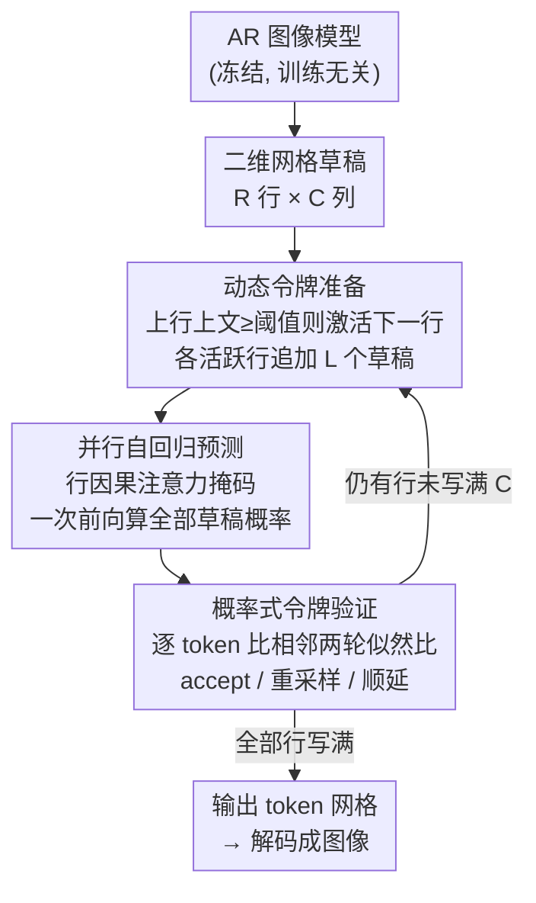

# Parallel Jacobi Decoding for Fast Autoregressive Image Generation

**会议**: CVPR 2026  
**arXiv**: [2606.05703](https://arxiv.org/abs/2606.05703)  
**代码**: https://boyaliao.github.io/PJD/ (项目页)  
**领域**: 自回归图像生成 / 推理加速  
**关键词**: Jacobi 解码、并行解码、训练无关加速、空间局部性、自回归图像生成

## 一句话总结
针对自回归（AR）图像生成"逐 token 串行、推理极慢"的瓶颈，本文提出训练无关的 **Parallel Jacobi Decoding（PJD）**，把原来在一维序列上展开的 Jacobi 草稿改成沿图像二维网格"按行并行"展开，并配一个行因果注意力掩码抑制误差累积，在 Lumina-mGPT / LlamaGen 上实现 4.8×–6.4× 加速且画质几乎不掉。

## 研究背景与动机
**领域现状**：自回归图像生成（LlamaGen、Lumina-mGPT、Chameleon 等）把图像先用 VQ tokenizer 编码成离散 token 网格、再按光栅顺序展平成一维序列 $\mathbf{x}=(x_1,\dots,x_L)$，用 transformer 逐 token 预测 $p_\theta(\mathbf{x})=\prod_i p_\theta(x_i\mid x_{1:i-1})$。画质已可与扩散模型媲美，且天然统一了语言与视觉的建模框架。

**现有痛点**：每次前向只产生一个 token，一张图常需几百上千次串行迭代（如 Lumina-mGPT 生成 768×768 要 2357 步、~197 秒），对实时应用而言慢到无法接受。扩散模型那套加速技巧（蒸馏、求解器等）因生成机制根本不同无法照搬。

**核心矛盾**：从 LLM 借来的两类加速里，投机解码（speculative decoding）要额外训练一个 draft 模型；Jacobi 解码虽免训练、靠固定点迭代并行 refine 一段候选 token，但**加速很快饱和**——把候选窗口拉长后，靠后的 token 不可避免要 attend 越来越多"还没收敛的不确定候选"，导致 refine 更难、收敛更慢。作者指出这个饱和的根因在于 Jacobi 解码**只在一维序列上展开**。

**切入角度**：作者可视化 Lumina-mGPT / LlamaGen 的注意力图（Figure 2）发现，与文本"每个 token 跨全局长程依赖"不同，图像 token 的注意力高度集中在**对角线及其邻近带**——每个 token 主要 attend 自己所在行和上几行的邻近区域，呈现强空间局部性。既然依赖是局部的，一维展开就浪费了图像的二维结构。

**核心 idea**：把 Jacobi 草稿从一维序列扩展到**二维空间**——当某一行积累了足够上文后，就在下一行初始化草稿 token，让多行在同一次迭代里并行 refine。由于每个 token 只 attend 已生成的邻近 token，这种局部化 refine 保住了 AR 依赖结构、压住了长程误差传播，从而每轮能 accept 更多 token、收敛更快更稳，且全程**不需要任何额外训练**。

## 方法详解

### 整体框架
PJD 是套在现成 AR 图像模型外的训练无关解码器，不改权重、只改"草稿怎么铺、注意力怎么遮、token 怎么验收"。它把待生成的 token 看成一张 $R\times C$ 的二维网格（$R$ 行、每行 $C$ 个 token），用一个"沿对角线斜着推进的前沿"代替原来一行行串行的光栅扫描：当第 $i$ 行已生成的 token 数达到阈值，就激活第 $i+1$ 行开始并行解码，于是同一时刻往往有多行同时处于"活跃 refine"状态。

每一次 PJD 迭代走三个阶段：**① 动态令牌准备**根据各行已生成的上文，决定激活哪些新行、给每个活跃行追加多长的草稿；**② 并行自回归预测**用一次前向、配行因果注意力掩码，同时算出所有草稿 token 的条件概率；**③ 概率式令牌验证**逐行逐 token 判断草稿是否"收敛"，accept 稳定的、对 reject 的重采样或顺延到下一轮。三阶段循环直到所有行写满 $C$ 个 token。

### 关键设计

**1. 从一维到二维：按行并行的草稿展开**

这是 PJD 的立身之本，直接针对"一维 Jacobi 加速饱和"的痛点。传统 Jacobi 在一维序列上一次性铺一段长草稿 $\mathbf{y}^{(0)}=(y^{(0)}_{t+1},\dots,y^{(0)}_{t+W})$，靠后的草稿要 attend 前面一长串尚未收敛的草稿，误差顺着一维链条层层放大。PJD 改成在二维网格上**增量铺草稿**：不在一行里盲目拉长，而是让"已生成前沿"沿对角线斜着推进，使多行同时活跃、每行各自只铺很短的一小段草稿并行 refine。由于注意力本就高度局部（Figure 2 的对角带），每个草稿 token 主要看的是**已 commit 的邻近 token**而非一长串不确定草稿，refine 难度大幅下降。其直接收益是每轮能 accept 的 token 变多、收敛更稳，且加速比随分辨率升高而增大（图越大、可并行的行越多，2D 并行红利越足）。

**2. 动态令牌准备：用上文计数控制何时激活下一行**

要让二维并行不乱套，关键是"什么时候才允许下一行开始猜"。PJD 借用 ZipAR 的思路，用**上一行已生成 token 数**（称为 Context Token Count $c_i^{(k-1)}$）来度量空间上文是否充分：只有当第 $i$ 行积累的 token 数达到预定义阈值 $T_{\mathrm{ctx}}$，第 $i+1$ 行才被激活进入 Jacobi 解码，

$$O_k=\{\,i+1 \mid c_i^{(k-1)}\ge T_{\mathrm{ctx}},\; i+1\notin O_{<k}\,\}.$$

对每个新激活的行 $i+1$，本轮追加的草稿长度取窗口上限 $W$ 与"上下行已生成差额"的较小值：$L_{i+1}^{(k)}=\min\!\big(W,\,c_i^{(k-1)}-c_{i+1}^{(k-1)}\big)$，保证下行不会超过上行的可用上文。首次激活某行时还会插一个初始化 token（Lumina-mGPT 用其行尾 EOL token，LlamaGen 用上一行末尾最近的 token）。这套"上文够了才激活"的规则让解码前沿**沿对角线斜推**，既避免过早激活破坏空间连贯，又能在合适时机最大化并行度。论文还把阈值换算成与分辨率无关的 **Context Coverage Ratio**（如固定 0.25 表示上一行生成 25% 后即激活下一行），在不同分辨率下对应 $c$=8/12/16。

**3. 行因果注意力掩码：在一次前向里隔离并发草稿**

多行同时活跃时，若让不同行的草稿互相可见，未收敛的草稿会彼此污染。PJD 设计**行因果注意力掩码**（Figure 4）：当前行的草稿 token **不能 attend 其它行的草稿**，但保留对上方所有 **已 commit token** 以及本行自身在前位置的可见性。这样一次前向就能并行算出所有草稿的条件概率，既维持了自回归的因果顺序、保住跨行的有效上文，又避免并发草稿之间的相互干扰——本质是用掩码把"二维并行"约束回"对每个 token 而言仍是合法 AR 条件"的安全区。

**4. 概率式令牌验证：用似然比判稳定，兼容随机采样**

图像生成靠 top-k 采样的随机性维持多样性，所以 LLM 里"两轮 token 完全相同才 accept"的确定性收敛准则在这里失效。PJD 改用**概率式收敛准则**：对每个 token $x_{ij}$，比较它在相邻两轮的条件似然 $p_\theta^{(k)}(x_{ij})$ 与 $p_\theta^{(k-1)}(x_{ij})$，抽 $u\sim U[0,1]$，当

$$u\le\min\!\Big(1,\;\frac{p_\theta^{(k)}(x_{ij})}{p_\theta^{(k-1)}(x_{ij})}\Big)$$

时 accept。这个随机规则偏好"似然在两轮间保持稳定"的 token，又对采样噪声宽容。验收按行从左到右进行：对最顶部活跃行，若首个 token 没通过，就从一个**只强调本轮新增概率质量**的校准分布重采样

$$x_{ij}^{(k)}\sim\frac{\max\!\big(0,\,p_\theta^{(k)}(x_{ij})-p_\theta^{(k-1)}(x_{ij})\big)}{\sum_{x'}\max\!\big(0,\,p_\theta^{(k)}(x')-p_\theta^{(k-1)}(x')\big)},$$

重采样后该行验收终止，**保证每轮至少敲定一个新 token**（防止死循环）。对后续行用同样的逐 token 检验，一旦某 token 被 reject，它及该行其后所有 token 全部顺延到下一轮，且被 reject 的 token 用当前模型预测更新成下一轮的草稿，避免用陈旧草稿继续 refine。整套验证检查的是**分布稳定性而非 token 完全相同**，因此天然兼容随机采样、并保证每轮都能稳定推进。

### 损失函数 / 训练策略
**无训练**。PJD 是纯推理期解码算法，不引入任何可学习参数、不微调底层 AR 模型，可直接套在现成的 Lumina-mGPT / LlamaGen 上。唯一的"超参"是 Context Token Count $c$（或等价的 Coverage Ratio）与草稿窗口 $W$，通过它们在加速比与画质间权衡。

## 实验关键数据

### 主实验
两个 AR 文生图模型（Lumina-mGPT 7B@768×768、LlamaGen-XL 7B@512×512），在 MS-COCO（随机 5000 caption）与 PartiPrompt（1632 prompt）上评测；效率看 Latency / Step，画质看 FID / CLIP-Score / IS。对比 Vanilla AR、SJD、GSD。

MS-COCO 主结果（节选自 Table 1，加速比相对 Vanilla AR）：

| 模型 | 方法 | Latency↓ | Step↓ | 加速(Latency/Step) | FID↓ | CLIP↑ | IS↑ |
|------|------|----------|-------|------|------|-------|-----|
| Lumina-mGPT | Vanilla AR | 197.16s | 2357 | 1.00× / 1.00× | 30.79 | 31.31 | 32.81 |
| Lumina-mGPT | SJD | 52.97s | 1056 | 3.72× / 2.23× | 30.87 | 31.65 | 32.94 |
| Lumina-mGPT | GSD | 34.36s | 698 | 5.74× / 3.38× | 33.41 | 31.46 | 31.48 |
| Lumina-mGPT | **Ours (c=16)** | 32.91s | 476 | **5.99× / 4.95×** | 31.94 | 31.55 | 31.54 |
| Lumina-mGPT | **Ours (c=11)** | 24.78s | 371 | **7.96× / 6.35×** | 32.38 | 31.53 | 31.23 |
| LlamaGen-XL | Vanilla AR | 49.58s | 1024 | 1.00× / 1.00× | 45.02 | 28.59 | 22.11 |
| LlamaGen-XL | GSD | 19.31s | 383 | 2.57× / 2.67× | 47.13 | 28.12 | 20.89 |
| LlamaGen-XL | **Ours (c=6)** | 11.84s | 213 | **4.19× / 4.81×** | 45.12 | 28.67 | 22.07 |

关键点：在相近甚至更好的 FID/CLIP/IS 下，PJD 的 step 压缩显著优于 SJD 与 GSD；c 越小加速越猛、画质略降，c 越大画质越好、加速回落。PartiPrompt（Table 2）结论一致，Lumina-mGPT 上 step 加速达 6.44×–7.27×。

### 消融实验
| 配置 | 关键指标 | 说明 |
|------|---------|------|
| Context Token Count $c\in\{4,6,9,11,16,32\}$ | $c$↑ → FID↓ 但 step 压缩↓ | 上文越多画质越好、并行红利越小，速度-保真 trade-off |
| top-k $\in$ {…,1000,2000} | 各 k 下均 ≈6× 加速；k=1000 时 FID=30.28 最佳 | 加速对采样预算鲁棒，中等 k 兼顾多样性与保真 |
| CFG scale 扫描 | 全程 >6× step 压缩，CFG↑ → FID↓ | 高 CFG 提画质而不损效率 |
| 分辨率 512/768/1024（固定 Coverage=0.25） | 1024×1024 时 step 压缩达 6.9× | 分辨率越高 PJD 优势越明显，验证 2D 并行红利 |

### 关键发现
- **Context Token Count 是核心旋钮**：它控制"下一行何时开始猜"，直接决定速度-保真权衡——上文给得越足画质越稳但并行度越低。
- **加速比随分辨率单调增大**：512→1024 时 step 压缩从 ~4.8× 升到 6.9×，正是因为图越大、可同时活跃的行越多，二维并行才真正发力，这与一维 Jacobi"越长越饱和"形成鲜明对比。
- **对采样设置鲁棒**：在各 top-k 与 CFG 下都稳定保持 6× 量级加速，说明概率式验证准则没有被采样随机性带偏。

## 亮点与洞察
- **把"加速饱和"归因到维度错配**：作者用注意力可视化把"图像注意力是局部对角带"这一观察，转译成"一维 Jacobi 展开方向选错了"的诊断，再顺势给出二维并行的解药——问题定位干净利落，是全文最"啊哈"的地方。
- **训练无关、即插即用**：不动权重、不训 draft 模型，只改草稿铺设/掩码/验收三件事，就能套在任意光栅序 AR 图像模型上，落地成本极低。
- **行因果掩码是"安全阀"**：在追求并行的同时用掩码把每个 token 约束回合法 AR 条件，这种"放开并行但守住因果"的思路可迁移到其它结构化并行解码（如视频、3D token 网格）。
- **概率式验收兼容随机采样**：用相邻两轮似然比代替"token 严格相等"，巧妙绕过了 top-k 采样让确定性 Jacobi 失效的问题，并保证每轮至少敲定一个 token、不会卡死。

## 局限性 / 可改进方向
- **强依赖光栅序 + 强空间局部性**：方法建立在"图像注意力沿行局部"的前提上，对乱序生成（如 ARPG 的随机序）或局部性较弱的 token 化方案，二维按行展开未必成立。
- **画质并非严格无损**：小 $c$ 时 FID 会略升（如 Lumina-mGPT c=9 时 FID 32.98 vs Vanilla 30.79），追求极限加速会以可感知的保真度为代价，需按场景调 $c$。
- **超参需逐模型/逐分辨率调**：$c$、$W$、初始化 token 选择对不同模型（Lumina-mGPT 用 EOL、LlamaGen 用行末 token）都要单独适配，缺一个自适应选 $c$ 的机制。
- **未与 KV-cache 压缩等正交加速联合**：PJD 走的是"减少串行步数"这条线，论文未探讨与 KV 压缩/量化叠加能否进一步提速。

## 相关工作与启发
- **vs SJD（Speculative Jacobi Decoding）**：SJD 把概率式收敛准则引入一维 Jacobi 让其兼容采样，PJD 直接沿用了这套概率验收，但把展开维度从一维换成二维——二者在画质相当时 PJD 的 step 压缩明显更高（Lumina-mGPT 6.35× vs 2.23×）。
- **vs GSD（Grouped Speculative Decoding）**：GSD 靠"成组验证候选 token"在一维上提效，仍受一维误差传播约束；PJD 用空间并行换来更高加速且 FID 更稳，GSD 在 LlamaGen 上甚至有掉点（FID 47.13）。
- **vs ZipAR / PAR / LPD**：这些工作也利用图像空间局部性做并行生成（ZipAR 同为训练无关），PJD 借用了 ZipAR 的"上文计数"激活思路，但把它嵌进 Jacobi 的迭代 refine + 概率验收框架，得到的是"可收敛、可验收"的并行解码而非一次性并行预测。
- **vs 投机解码（Medusa/Speculative Sampling）**：投机解码需训练或挂载 draft 模型，PJD 完全免训练、无额外模型，部署更轻。

## 评分
- 新颖性: ⭐⭐⭐⭐ 把"图像注意力局部性"转化为"二维 Jacobi 展开"的诊断+解法清晰且有说服力，虽部分组件（概率验收、上文激活）借自前作。
- 实验充分度: ⭐⭐⭐⭐ 两模型两数据集 + 分辨率/采样/CFG 多维消融，但缺与 KV 压缩等正交方法的联合实验与失败案例可视化。
- 写作质量: ⭐⭐⭐⭐ 动机—观察—方法逻辑顺，算法伪代码与图示完整；个别符号（$c$ 与 Coverage Ratio）需对照才清晰。
- 价值: ⭐⭐⭐⭐ 训练无关、即插即用、4.8×–6.4× 加速且画质几乎无损，对落地 AR 图像生成实用价值高。

<!-- RELATED:START -->

## 相关论文

- [\[ICLR 2026\] Autoregressive Image Generation with Randomized Parallel Decoding](../../ICLR2026/image_generation/autoregressive_image_generation_with_randomized_parallel_decoding.md)
- [\[ICLR 2026\] Locality-aware Parallel Decoding for Efficient Autoregressive Image Generation](../../ICLR2026/image_generation/locality-aware_parallel_decoding_for_efficient_autoregressive_image_generation.md)
- [\[CVPR 2026\] Multi-Scale Local Speculative Decoding for Image Generation](multi-scale_local_speculative_decoding_for_image_generation.md)
- [\[CVPR 2026\] SJD-PAC: Accelerating Speculative Jacobi Decoding via Proactive Drafting and Adaptive Continuation](sjd-pac_accelerating_speculative_jacobi_decoding_via_proactive_drafting_and_adap.md)
- [\[CVPR 2026\] FastHybrid: Accelerating Hybrid Autoregressive Image Generation with Lookahead and Guided Decoding](fasthybrid_accelerating_hybrid_autoregressive_image_generation_with_lookahead_an.md)

<!-- RELATED:END -->
