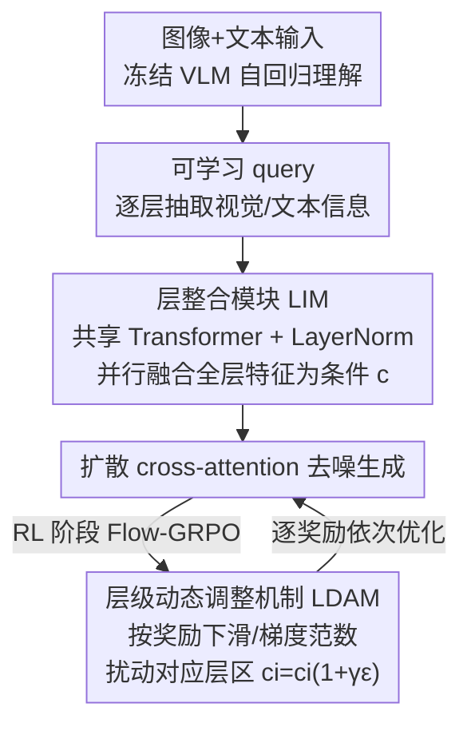

# ParaUni: Enhance Generation in Unified Multimodal Model with Reinforcement-driven Hierarchical Parallel Information Interaction

**会议**: CVPR 2026  
**论文**: [CVF Open Access](https://openaccess.thecvf.com/content/CVPR2026/html/Tan_ParaUni_Enhance_Generation_in_Unified_Multimodal_Model_with_Reinforcement-driven_Hierarchical_CVPR_2026_paper.html)  
**代码**: https://github.com/JosephTiTan/ParaUni  
**领域**: 图像生成 / 多模态VLM  
**关键词**: 统一多模态模型, 文生图, 扩散模型, VLM 层级特征, 强化学习

## 一句话总结
在"理解-生成统一"多模态模型里，ParaUni 不再只拿 VLM 最后一层特征当扩散条件，而是把 VLM 所有层的视觉特征并行喂进一个层整合模块（LIM）做条件，再在 RL 阶段用层级动态调整机制（LDAM）按不同奖励有针对性地扰动不同层，从而既补全细节又对齐语义，GenEval 达 0.87、DPG-Bench 达 83.45。

## 研究背景与动机

**领域现状**：统一多模态模型把负责理解的自回归 VLM 和负责生成的扩散模型拼到一起，是近年图像生成的热门方向。常见做法是把 VLM 的特征作为条件喂给扩散解码器。

**现有痛点**：作者把现有 VLM↔扩散交互方式归为三类，各有硬伤——
- (a) **末层交互**（如 Janus）：只用 VLM 最后一层特征当条件，信息交互不足，只能提供语义抽象、抓不住细节纹理，限制生成保真度；
- (b) **集成架构**（如 Show-o）：把扩散去噪过程塞进同一个 transformer 的自回归流程里，但两者优化目标迥异，训练难度大、还没法直接复用现成预训练模型；
- (c) **分离参数**（如 Bagel）：理解和生成各用一套参数、靠块内共享自注意力交互，交互是richer了，但两套参数紧耦合导致灵活性/可扩展性差、推理延迟高。

**核心矛盾**：充分交互（信息全）和灵活实现（架构松耦合、可复用、可扩展）之间存在 trade-off，根因是 VLM 表征与扩散表征差异巨大，单层条件信息太少、深度耦合又太重。

**本文目标**：找一种既能充分交互、又保持理解/生成模块灵活分离的条件化方式，并在 RL 阶段进一步提升生成质量。

**切入角度**：作者做了两个关键观察。其一，VLM 不同深度的层编码从低层细节到高层语义的不同信息——他们逐层抽视觉 token 当条件生成图像并测 CLIP score，发现浅层偏纹理、深层语义越来越强、CLIP score 随层深上升（图 2），用全部层比只用末层细节更丰富（图 3）。其二，把所有层都用上后分析层间余弦相似度，发现相邻层相似、且自然聚成几个区域，**这些区域对不同奖励的响应不一样**：中层区域对齐美学（Aesthetic）和人类偏好（Pickscore），深层区域对齐语义（CLIP score）。

**核心 idea**：用"并行整合 VLM 全层特征"代替"只用末层"来补全条件信息（LIM），再用"按奖励有针对性地扰动对应层区"来在 RL 阶段提升多个奖励（LDAM），全程保持 VLM 与扩散模块的松耦合分离。

## 方法详解

### 整体框架
ParaUni 沿用 MetaQuery/OpenUni 的设计：冻结的 VLM（InternVL3-2B）+ 一组可学习 query + 扩散模型（SANA-1.5）。生成时，可学习 query 在 VLM 前向中从**每一层**抽取上下文信息（视觉/文本），把所有层的 query 并行送入**层整合模块 LIM**（一个共享 Transformer + LayerNorm）融合成单一条件 $c$，再喂给扩散的 cross-attention 去噪出图。训练分三阶段：阶段 I 只训 LIM 和可学习 query、对齐 VLM 与扩散；阶段 II 用高质量数据微调 query/LIM/扩散；阶段 III 用 Flow-GRPO 做多奖励 RL，此时引入**层级动态调整机制 LDAM**——实时监控每个奖励的训练信号，当某奖励持续下滑或梯度范数剧烈波动时，就给该奖励对应的层区注入高斯噪声扰动，促其探索更优解并稳住训练，多个奖励依次训练、保留各自层的扰动结果。

### 关键设计

**1. 全层并行条件化：用 VLM 所有层而非只用末层喂扩散**

这条设计直击"末层交互信息不足"的痛点。作者先实证 VLM 层级性质：把第 $i$ 层抽出的视觉 token 单独当条件生成，CLIP score 随层深单调上升，浅层出纹理、深层出语义（图 2），说明每层都带独特信息。于是 ParaUni 把所有层的可学习 query $q_i$ 并行抽出来融合，而非只取最后一层。LIM 的形式化为：每层 $c_i=\text{LN}(f_\theta(q_i)),\ i\in[0,L]$，再取均值 $c=\frac1n\sum_{i=1}^n c_i$ 作为送进 DiT cross-attention 的条件。其中 $f_\theta$ 是一个**共享** Transformer 模块（所有层共用、参数高效），LN 用来对齐不同层量纲差异。消融显示去掉 Transformer 模块会显著掉点（因此不列入消融）、去掉 LayerNorm 也会下降，说明二者都有贡献。

**2. 层级动态调整机制 LDAM：按奖励有针对性地扰动对应层，撬动多奖励同时提升**

这条设计回应"不同层对不同奖励响应不同"的观察。作者实验性地移除某区域的层、测三个奖励的变化（图 5），发现：CLIP score 对三区都敏感、尤以深层为甚；Aesthetic 和 Pickscore 对中层最敏感、对浅层几乎无影响。据此，优化某奖励时就扰动它最敏感的层（实现里 CLIP 用 $i\in[24,28]$、Pickscore/Aesthetic 用 $i\in[12,23]$）。扰动机制借鉴推理时缩放——给该层条件注入高斯噪声 $c_i=c_i(1+\gamma\epsilon),\ \epsilon\sim\mathcal N(0,I)$，$\gamma$ 是控制扰动幅度的尺度因子（⚠️ 原文称 $\gamma$ 定义在补充材料，正文未给闭式）。触发条件是双重守门（Algorithm 1）：当某奖励持续下滑（reward guidance，连续掉 $r_s\ge5$ 轮）**且**梯度范数出现大幅尖峰（GradNorm guidance）时才扰动，扰动后进入随训练迭代递增的冷却期以保稳定。多奖励是**串行课程式**优化的：先用 Aesthetic、Pickscore 依次训，保留对应层权重，最后训 CLIP score。

**3. 三阶段训练配方：先对齐、再精调、最后 RL**

这条把"如何把上述两个模块落地"讲清。阶段 I 仅训 LIM 与可学习 query，用 text-to-image-2M、LAION-Aesthetic-6M 等数据对齐冻结的 VLM 与扩散；阶段 II 用 BLIP3-o-60k 高质量数据，同时训 query、LIM、扩散三者，此阶段后性能就已超过同配置下只用末层的模型；阶段 III 用 Flow-GRPO 框架做多奖励 RL，可训练参数与阶段 II 相同，配合 LDAM 撬动多奖励。Flow-GRPO 的关键是把确定性 ODE 采样重表述成 SDE 注入随机性 $dx_t=[v_t+\frac{\sigma_t^2}{2t}(x_t+(1-t)v_t)]dt+\sigma_t dw_t$，解决原 ODE 无法生成多样样本的问题，从而能在流匹配模型上用 GRPO。

### 一个例子：多奖励 RL 怎么走一遍
以提示"一只戴眼镜的小老鼠在台灯下看书"为例：阶段 II 后模型已能生成细节较全的图。进入阶段 III，先优化 Aesthetic——LDAM 盯住该奖励，若它连续下滑且梯度范数尖峰，就给中层区 $i\in[12,23]$ 注噪 $c_i(1+\gamma\epsilon)$ 促探索，待回稳进入冷却；保留这些层权重后切到 Pickscore（仍中层）同法；最后切到 CLIP score，转而扰动深层区 $i\in[24,28]$ 提升语义对齐。三个奖励依次抬升（图 8），最终细节与语义双双增强。

## 实验关键数据

### 主实验
基座 VLM=InternVL3-2B（冻结）、扩散=SANA-1.5-1.6B，三阶段均用流匹配训练，AdamW，lr=1e-4，batch=512，256 个可学习 query、28 层。在 NVIDIA A800 上训练。

GenEval 文生图（越高越好）：

| 类型 | 方法 | Two Obj. | Counting | Position | Color Attri. | Overall↑ |
|------|------|----------|----------|----------|--------------|----------|
| 仅生成 | SDXL | 0.74 | 0.39 | 0.15 | 0.23 | 0.55 |
| 仅生成 | SD3-Medium | 0.94 | 0.72 | 0.33 | 0.60 | 0.74 |
| 统一 | Janus | 0.68 | 0.30 | 0.46 | 0.42 | 0.61 |
| 统一 | BAGEL | 0.94 | 0.81 | 0.64 | 0.63 | 0.82 |
| 统一 | OpenUni | 0.92 | 0.76 | **0.82** | 0.77 | 0.86 |
| 统一 | **ParaUni** | 0.94 | 0.78 | **0.83** | 0.76 | **0.87** |

DPG-Bench 文生图（密集长 prompt 语义对齐，越高越好）：

| 方法 | Global | Entity | Relation | Overall↑ |
|------|--------|--------|----------|----------|
| Janus-Pro-1B | 87.58 | 88.63 | 88.98 | 82.63 |
| OpenUni | 87.01 | 90.02 | 90.28 | 83.08 |
| **ParaUni** | **90.01** | 89.31 | **91.85** | **83.45** |

关键看点：ParaUni GenEval 0.87、DPG-Bench 83.45，超过统一模型基线（OpenUni、BAGEL）并大幅领先纯生成模型，验证"全层条件化能抬高生成上限"。

### 消融实验
GenEval（部分类别 + Overall）：

| 配置 | Single Obj. | Colors | Position | Overall↑ |
|------|-------------|--------|----------|----------|
| (1) 去浅层子集 | 0.98 | 0.88 | 0.75 | 0.82 |
| (2) 去中层子集 | 0.99 | 0.90 | 0.81 | 0.85 |
| (3) 去深层子集 | 0.99 | 0.90 | 0.82 | 0.84 |
| (4) 隔层取（每隔一层） | 1.00 | 0.90 | 0.81 | 0.86 |
| (5) LIM 去 LayerNorm | 0.98 | 0.61 | 0.75 | 0.73 |
| (6) LDAM 去 GradNorm 守门 | 0.98 | 0.90 | 0.82 | 0.86 |
| (7) LDAM 去奖励下滑守门 | 0.98 | 0.90 | 0.81 | 0.86 |
| **Ours（全层+完整 LIM/LDAM）** | 0.99 | 0.91 | **0.83** | **0.87** |

即插即用到更弱基座：

| 方法 | GenEval↑ | DPG-Bench↑ |
|------|----------|-----------|
| Janus-Pro (1B) | 0.73 | 82.63 |
| Janus-Pro (1B) + ParaUni | **0.80** | **83.65** |
| BLIP-3o (4B) | 0.81 | 79.36 |
| BLIP-3o (4B) + ParaUni | **0.84** | **81.97** |

### 关键发现
- **任何层子集都不能省**：去掉浅/中/深任一子集 Overall 都下降（0.82~0.85 vs 0.87），隔层取也不如全层，证实"全层条件化"是必要的。
- **LayerNorm 至关重要**：去掉它 Colors 从 0.91 暴跌到 0.61、Overall 跌到 0.73，是消融里掉点最猛的，说明跨层特征量纲对齐是关键；去掉 Transformer 模块掉点更严重故未列。
- **LDAM 双守门各有贡献**：去掉 GradNorm 或奖励下滑任一守门，RL 训练结果都变差，说明两条触发条件互补。
- **强通用性**：作为即插即用模块挂到 Janus-Pro、BLIP-3o 等更弱基座上都能涨点。

## 亮点与洞察
- **"层即奖励旋钮"的洞察很漂亮**：把"VLM 不同层对应不同奖励敏感度"实证出来（中层管美学/偏好、深层管语义），再据此设计 LDAM 精准扰动——这把"多奖励 RL 难以同时提升"的难题转成了"在正确的层上施力"，是可迁移的思路。
- **全层并行 + 共享 Transformer 既补信息又省参**：用一个共享模块并行处理所有层，避免了一层一扩散层的紧耦合（保灵活），又比末层条件信息丰富得多（保充分），直接缓解了 trade-off。
- **梯度范数 + 奖励下滑双守门**给 RL 扰动加了"何时该探索"的判据，配合冷却期，是稳住 GRPO 训练的实用工程技巧。

## 局限与展望
- VLM 全程冻结，ParaUni 只提升生成、不改善理解能力，理解侧完全继承 InternVL3。
- LDAM 的层区划分（CLIP 用 24-28、Pick/Aesthetic 用 12-23）和触发阈值（连续下滑 $\ge5$ 轮等）依赖经验设定，换基座/奖励是否仍最优未充分讨论；扰动尺度 $\gamma$ 的定义只在补充材料给出，正文不可见。
- 多奖励采用串行课程式优化（先 Aesthetic/Pickscore 再 CLIP），并行联合优化是否可行、顺序是否敏感未探讨。
- 主要在 GenEval/DPG-Bench 等 T2I 基准上评测，图生图/编辑等任务的结果放在补充材料，正文证据有限。

## 相关工作与启发
- **vs 末层交互（Janus 等）**：他们只用 VLM 末层当条件，信息不足、细节差；ParaUni 用全层并行条件化补全细节与语义。
- **vs 集成架构（Show-o 等）**：他们把扩散去噪塞进自回归同一 transformer，训练难、不能复用预训练；ParaUni 保持 VLM 与扩散松耦合分离，可复用现成模型。
- **vs 分离参数（Bagel 等）**：他们两套参数紧耦合、推理慢；ParaUni 用一个轻量 LIM 做条件融合，灵活且开销小。
- **vs 同样用多层特征的工作**：有的对每个 VLM 层与每个扩散层做一对一交互（紧耦合、欠灵活）；有的虽整合多层但既不分析各层性质也不用其指导 RL。ParaUni 显式研究层级特性并据此驱动 LDAM，在 RL 中对不同层做针对性扰动，同时保持模块化灵活性。

## 评分
- 新颖性: ⭐⭐⭐⭐ "层级特征对应不同奖励"的洞察+LDAM 是真新点，全层条件化本身较直接。
- 实验充分度: ⭐⭐⭐⭐ GenEval/DPG-Bench 主实验 + 层选择/LIM/LDAM 消融 + 跨基座即插即用都有，部分（图生图、RL 前后定量）放补充材料。
- 写作质量: ⭐⭐⭐⭐ 动机用 CLIP score/层相似度/奖励响应三组实证铺得很扎实；$\gamma$ 等细节外推补充材料略影响自洽阅读。
- 价值: ⭐⭐⭐⭐ 即插即用提升统一模型生成质量、并给"多奖励 RL 如何提升"一个可操作答案，实用价值高。

<!-- RELATED:START -->

## 相关论文

- [\[NeurIPS 2025\] Co-Reinforcement Learning for Unified Multimodal Understanding and Generation](../../NeurIPS2025/image_generation/coreinforcement_learning_for_unified_multimodal_understandin.md)
- [\[CVPR 2026\] Learning to Generate via Understanding: Understanding-Driven Intrinsic Rewarding for Unified Multimodal Models](learning_to_generate_via_understanding_understanding-driven_intrinsic_rewarding_.md)
- [\[CVPR 2026\] UniVerse: Empower Unified Generation with Reasoning and Knowledge](universe_empower_unified_generation_with_reasoning_and_knowledge.md)
- [\[CVPR 2026\] HiCoGen: Hierarchical Compositional Text-to-Image Generation in Diffusion Models via Reinforcement Learning](hicogen_hierarchical_compositional_text-to-image_generation_in_diffusion_models_.md)
- [\[CVPR 2026\] MICON-Bench: Benchmarking and Enhancing Multi-Image Context Image Generation in Unified Multimodal Models](micon-bench_benchmarking_and_enhancing_multi-image_context_image_generation_in_u.md)

<!-- RELATED:END -->
