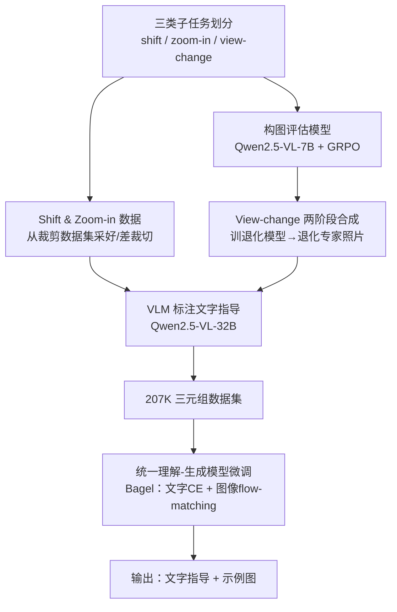

# PhotoFramer: Multi-modal Image Composition Instruction

**会议**: CVPR 2026  
**arXiv**: [2512.00993](https://arxiv.org/abs/2512.00993)  
**代码**: https://zhiyuanyou.github.io/photoframer （项目主页）  
**领域**: 图像生成 / 统一理解-生成模型 / 构图辅助  
**关键词**: 构图指导, 拍照辅助, 统一多模态模型, 图文联合生成, 数据合成

## 一句话总结
PhotoFramer 把"怎么拍出构图更好的照片"做成一个统一理解-生成模型：给一张构图差的照片，它先用自然语言说清楚该怎么改（如"去掉栅栏、把主体居中"），再生成一张同场景、构图好的示例图，让业余拍照者照着文字+示例去重拍。

## 研究背景与动机
**领域现状**：手机相机硬件已经很强（高分辨率、低噪、曝光准），但很多普通用户拍出来的照片依然不好看，问题主要出在**构图**——地平线歪了、主体没放好、边缘有杂物。现有改善构图的主流做法有两类：图像裁剪（cropping，在已拍好的图上找一个构图更好的子框）和检索式引导（在数据库里搜相似的好图当参考）。

**现有痛点**：裁剪是**拍完之后的后处理**，没法在拍摄当下指导用户换个角度重拍；检索式引导给的是别人拍的图，场景和主体对不上，用户很难照搬。最近的 CPAM 能给出相机位姿（yaw/pitch）调整建议，但它只输出角度数字、不支持变焦和大幅视角变换，而且理解和调整用两个分离的模型。

**核心矛盾**：好的构图指导需要**同时给"怎么改的文字理由"和"改完长什么样的示例图"**——文字可操作、可解释，示例图直观、好照搬，二者缺一不可。但纯 VLM 只能出文字、纯编辑/生成模型只能出图，没有一个模型能在拍摄场景里同时产出图文两种指导。

**本文目标**：做一个拍摄阶段的构图助手 $f$，输入构图差的图 $I_{poor}$ 和任务类型 $T_{task}$，同时输出文字指导 $T_{guide}$ 和构图好的示例图 $I_{good}$，即 $I_{good}, T_{guide} = f(I_{poor}, T_{task})$。

**切入角度**：作者从"人是怎么拍照的"出发，把拍摄拆成三步——先选**机位/视角**（vantage point）、再选**焦距/变焦**、最后微调**主体位置与对齐**。这个分解天然对应三类可学习的子任务，也决定了训练数据怎么造。

**核心 idea**：用一个统一理解-生成模型（Bagel）同时承载"文字指导（理解侧）"和"示例图生成（生成侧）"，并构造一个覆盖 shift / zoom-in / view-change 三类子任务的 207K 三元组数据集来微调它，让文字指导真正去驱动示例图的生成。

## 方法详解

### 整体框架
PhotoFramer 的核心其实分两大块：**怎么造数据**和**用什么模型学**。任务被定义成"给 $I_{poor}$ + 任务提示，产出 $T_{guide}$ + $I_{good}$"，但难点不在模型结构（直接用现成的统一模型 Bagel），而在于**没有现成的"差图—好图—文字"三元组数据**。

作者把拍照过程拆成三类子任务，并为每类设计不同的数据来源：**shift（平移调框、摆正、去边缘杂物）**和 **zoom-in（更紧的裁切，模拟更长焦距）**直接从已有裁剪数据集采样得到（裁剪库本身带构图分数标注，好裁切当 good、差裁切当 poor）；**view-change（换机位/相机位姿重新取景）**最难，没有现成成对数据，作者用"先训一个构图退化模型、再把好照片退化成差照片"的两阶段管线合成。三类图像对凑齐后，统一用一个 VLM（Qwen2.5-VL-32B）为每对生成文字指导。最终拿到 45K 原图、207K 图像对，去微调 Bagel：文字侧用交叉熵 next-token 预测、图像侧用 flow-matching，且**生成的图通过 attention 去 attend 文字指导**，实现"文字驱动出图"。

为了给 view-change 合成数据，作者还**单独训了一个构图评估模型**（Qwen2.5-VL-7B + GRPO 强化学习），用来从多视角数据集里挑好图/差图、以及给野外图打构图分做数据过滤。

### 关键设计

**1. 分层任务范式：把"怎么拍"拆成 shift / zoom-in / view-change 三级**

直接学"把差图改成好图"太笼统，模型不知道该平移还是换机位。作者借鉴摄影流程把构图操作分成三个递进子任务：shift 管主体摆位和去边缘杂物、zoom-in 管焦距/裁切松紧、view-change 管机位和相机位姿。这个分层既让每类操作有明确的数据来源和监督信号，也让模型学到的能力可解释。更关键的是，作者还加了 **auto prompt**（静态 auto 只允许 shift/zoom-in，full auto 三类都允许）：训练时把任务专用提示随机替换成 auto 提示，让模型在用户不指定任务时**自适应融合多种操作**——实验里 auto 模式能在单一任务失败（如 shift 误把杂物当主体、zoom-in 裁太紧切掉建筑顶）时给出更好的综合结果。

**2. view-change 的"训退化模型 + 退化专家照片"两阶段数据合成**

view-change 没有成对数据：多视角 3D 数据集（DL3DV-10K）虽然能采到不同视角的图对，但即使其中"最好"的帧也达不到专家级构图；而 Unsplash 等专家照片构图好，却没有对应的"差视角"版本。作者的解法是**反过来造差图**：第一阶段用 3D 数据集采到的 $\langle poor, good\rangle$ 对训一个**构图退化模型**（结构同最终模型），输入好图 + 退化指令"换个视角让构图变差"，用重建损失让它学会生成差构图图；第二阶段把这个退化模型作用到专家照片（25K Unsplash + 10K 自拍）上，合成伪差图，与专家好图配成最终 view-change 对。这样既拿到了专家级 good 图、又拿到了语义一致的 poor 图，规避了"多视角数据集好图不够好"的死结。

**3. 构图评估模型（GRPO 训练）作为数据引擎**

shift/zoom-in 能复用裁剪库的人工标注，但 view-change 用的野外图/多视角图没有构图标注，需要一个可靠的"构图打分器"来挑图和过滤。作者用 Qwen2.5-VL-7B 做基座、用 GRPO 强化学习训了一个构图评估模型，能输出推理文本 + 构图分。它在 CADB/GAIC 构图评估上 SRCC/PLCC 达 0.763/0.777 与 0.795/0.805，分类准确率 0.583，全面超过 Q-Align、AutoPhoto 乃至更大的 Qwen2.5-VL-32B。这个评估模型在数据构建里到处用：从多视角场景里选最好的 3 张、最差的 10 张配对，以及对合成数据做"构图分 > 3.0"的质量过滤。

**4. 统一理解-生成模型联合建模文字与图像，文字真正驱动出图**

因为要同时产文字（理解）和示例图（生成），纯 VLM 和纯编辑模型都不行，作者选 Bagel 作基座。视觉输入用两套 token：FLUX VAE token 带像素级信息供生成、SigLIP2 ViT token 带语义信息供理解；VAE/decoder 冻结，ViT 和主干可训。训练对文字用交叉熵 $\mathcal{L}_{text}$ 做 next-token 预测、对图像用 flow-matching $\mathcal{L}_{img}$，两项等权。核心在于**生成的图像 token 通过 attention 去 attend 文字指导 token**，所以文字不是摆设——消融显示改几个关键词（去掉"upper"、加"including lower body"）生成图就会显著不同。推理分两阶段：先理解（出文字指导），再把文字指导拼到输入、从纯噪声 flow-matching 去噪 30 步、VAE 解码出示例图。

### 损失函数 / 训练策略
最终模型微调：文字 $\mathcal{L}_{text}$（交叉熵 next-token）+ 图像 $\mathcal{L}_{img}$（flow-matching），两项等权。8× A100、AdamW、batch=8、lr=2e-5、50K 步，EMA decay 0.9999；图像短边 resize 到 512、推理 30 步去噪。view-change 退化模型则用差图与真实差图之间的图像重建损失训练。

## 实验关键数据

### 主实验
评估示例图采用**胜率（win rate）**：把模型生成图分别与"原图 / 真值好图"对比，由 GPT-5 和人类各打一次（格式 `vs原图 / vs真值`，单位 %），每个任务人工精选 200~300 样本建 benchmark。

| 方法 | Shift (GPT-5) | Shift (人类) | View-change (GPT-5) | View-change (人类) | Quality (DeQA) | Aesthetic (Q-Align) |
|------|------|------|------|------|------|------|
| Kontext | 39.88 / 12.27 | 49.69 / 4.94 | 46.74 / 15.76 | 48.37 / 5.98 | 3.88 | 3.13 |
| Qwen-Image-Edit | 46.01 / 16.56 | 48.43 / 10.49 | 70.65 / 36.96 | 61.96 / 20.65 | 4.03 | 3.29 |
| Bagel（原版） | 27.61 / 14.73 | 38.36 / 8.02 | 47.28 / 14.13 | 64.13 / 15.22 | 3.87 | 3.08 |
| gpt-image-1 | 69.93 / 33.99 | 68.46 / 22.37 | **84.61 / 51.65** | 81.52 / 41.30 | 3.97 | 3.26 |
| **PhotoFramer** | **80.37 / 35.58** | **88.05 / 43.83** | 82.07 / 50.54 | **85.87 / 47.28** | **4.07** | 3.17 |

zoom-in 任务只报 `vs真值` 胜率（PhotoFramer 67.24 GPT-5 / 48.28 人类），因为"裁切 vs 原图"有明显尺度线索、会虚高胜率。开源编辑模型几乎不会改善构图；gpt-image-1 效果强但常**篡改原图语义细节、保真度不足**；PhotoFramer 全面超开源、匹配甚至超过 gpt-image-1，同时保住图像质量与美学。

文字指导一致性（GPT-5 评"文字是否准确描述了原图→示例图的改动"）：

| 任务 | Shift | Zoom-in | View-change | 平均 |
|------|------|------|------|------|
| Bagel（原版） | 77.01 | 84.82 | 87.47 | 83.10 |
| **PhotoFramer** | **91.96** | **92.59** | **91.52** | **92.02** |

### 消融实验
| 配置 | 现象 | 说明 |
|------|------|------|
| 文字指导喂给 Qwen-Image-Edit | 无法利用，甚至降低保真度 | 即便它用 LLM 当文本编码器，也接不住该文字 |
| 文字指导喂给 gpt-image-1 | 能照做（如"包含整只鸟"） | 但保真度仍不理想 |
| Bagel 只用图像对训练（无文字） | 失败：去不掉前景栅栏 | 加入文字训练后才学会"remove the fence" |
| 微调 Kontext（仅图像数据） | 只能部分平移木屋、无法完整纳入 | 微调 Bagel（图文）能"include the whole wooden structure" |
| 手改文字关键词 | 生成图显著变化 | 证明图像生成确实 attend 文字 |

### 关键发现
- **文字与图像缺一不可**：只有文字、把它喂给外部编辑模型不行（接不住、还掉保真度）；只有图像、不带文字训练也不行（学不会"去掉栅栏"这种具体操作）。统一模型里文字-图像联合建模才让文字真正驱动出图。
- **auto prompt 比单任务更鲁棒**：单一 shift/zoom-in 在棘手场景会犯错（误判主体、裁太紧），auto 模式自适应融合多操作反而更稳。
- **数据是瓶颈而非模型**：view-change 的"先训退化模型再退化专家照片"是整套方法最巧的一环，绕开了多视角好图不够好、专家好图缺差图配对的双重缺数据困境。

## 亮点与洞察
- **"反向造差图"思路很巧**：缺 $\langle poor, good\rangle$ 对时，不去找差图，而是训一个退化模型把好图主动退化成差图。这把"专家好图丰富、差图稀缺"的不对称转成了可控的数据合成，值得迁移到任何"好样本易得、坏样本难得"的成对学习任务。
- **把摄影知识结构化成任务层级**：shift/zoom-in/view-change 对应机位-焦距-摆位三步，让笼统的"改善构图"变成有明确数据来源和监督的子任务，还能用 auto prompt 让模型自己组合——这是把领域先验注入数据设计的好例子。
- **统一理解-生成模型的"杀手级应用"**：构图指导天然需要图文双输出，文字给可操作理由、图给直观示例，正好坐实了统一模型相对纯 VLM / 纯生成模型的价值，而非为统一而统一。
- **评估模型自己当数据引擎**：用 GRPO 训的构图评估器既是产物又是数据构建的过滤器/选图器，闭环利用同一能力。

## 局限与展望
- **不改变长宽比**：方法明确只做构图指导、不改 aspect ratio，把比例离散成 11 档、只在同比例间配对，限制了一部分构图自由度。
- **数据合成依赖退化模型质量**：view-change 的伪差图由退化模型生成，退化模型本身的偏差会传导到最终训练对里；构图评估模型用于数据构建，论文也承认不能直接拿它评估生成结果（会偏置），只能改用 GPT-5/人类胜率，评估成本高。
- **示例图与真值的胜率仍不算高**：vs 真值的人类胜率多在 35~50% 区间，说明离专家级示例还有差距；保真度与 gpt-image-1 的取舍也未完全解决。
- **生成式建议的可执行性**：模型给的是"换个视角"的示例图，但真实世界里那个机位用户未必到得了，落地到拍摄动作的可达性未讨论。

## 相关工作与启发
- **vs 图像裁剪（GAIC/CPC/GenCrop/ProCrop）**：裁剪是拍完后的后处理、只能在已有像素里找子框；PhotoFramer 在**拍摄当下**给指导，且支持换机位这种裁剪做不到的大幅重构。但作者反过来复用了裁剪库的标注来造 shift/zoom-in 数据。
- **vs CPAM（相机位姿建议）**：CPAM 只输出 yaw/pitch 角度数字、理解与调整用两个分离模型；PhotoFramer 输出**文字+示例图**更直观，额外支持变焦和大幅视角变化，且用统一模型让理解与生成互相增强。
- **vs 纯编辑/生成模型（Kontext / Qwen-Image-Edit / gpt-image-1）**：它们只能出图、接不住可操作文字理由；gpt-image-1 虽强但篡改语义、保真度低。PhotoFramer 用统一模型保住保真度并产出可解释文字。
- **vs 检索式构图引导**：检索给的是别人场景的图、易错配；本文为同一场景直接生成示例图，避免场景/主体不匹配。

## 评分
- 新颖性: ⭐⭐⭐⭐⭐ 首个"拍摄阶段、图文双输出"的构图指导框架，反向造差图的数据合成管线很有启发
- 实验充分度: ⭐⭐⭐⭐ 三任务胜率 + 文字一致性 + 多组消融较扎实，但缺自动化构图指标、依赖 GPT-5/人类评估
- 写作质量: ⭐⭐⭐⭐ 任务分解与数据构建讲得清晰，图示丰富
- 价值: ⭐⭐⭐⭐ 把专家构图先验普及给普通用户，落地场景明确；不改长宽比与机位可达性是现实限制

<!-- RELATED:START -->

## 相关论文

- [\[CVPR 2026\] MICo-150K: A Comprehensive Dataset Advancing Multi-Image Composition](mico-150k_a_comprehensive_dataset_advancing_multi-image_composition.md)
- [\[CVPR 2025\] UNIC-Adapter: Unified Image-Instruction Adapter with Multi-modal Transformer for Image Generation](../../CVPR2025/image_generation/unic-adapter_unified_image-instruction_adapter_with_multi-modal_transformer_for_.md)
- [\[CVPR 2026\] ConsistCompose: Unified Multimodal Layout Control for Image Composition](consistcompose_multimodal_layout_control.md)
- [\[CVPR 2026\] CompBench: Benchmarking Complex Instruction-guided Image Editing](compbench_benchmarking_complex_instruction-guided_image_editing.md)
- [\[CVPR 2026\] MICON-Bench: Benchmarking and Enhancing Multi-Image Context Image Generation in Unified Multimodal Models](micon-bench_benchmarking_and_enhancing_multi-image_context_image_generation_in_u.md)

<!-- RELATED:END -->
