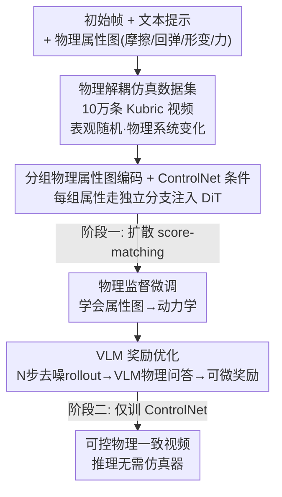

# PhyCo: Learning Controllable Physical Priors for Generative Motion

**会议**: CVPR 2026  
**arXiv**: [2604.28169](https://arxiv.org/abs/2604.28169)  
**代码**: https://phyco-video.github.io (项目主页)  
**领域**: 扩散模型 / 可控视频生成  
**关键词**: 物理一致性, 视频扩散, ControlNet, 物理属性条件, VLM奖励优化

## 一句话总结
PhyCo 通过「10万条物理仿真视频数据集 + 用 ControlNet 注入像素对齐的物理属性图做监督微调 + 用微调过的 VLM 对生成视频做物理问答打分提供可微奖励」三件套，让视频扩散模型能在推理时**不依赖任何仿真器/几何重建**，就连续可控地生成符合摩擦、回弹、形变、外力等物理规律的运动，在 Physics-IQ 基准上把 IQ Score 从 baseline 的 ~28 提到 43.6。

## 研究背景与动机
**领域现状**：现代视频扩散模型（SVD、CogVideoX、Cosmos 等）在纹理、光照、运动连续性上已经很强，能合成以假乱真的画面。

**现有痛点**：但它们经常违背基本物理规律——物体悬空或下落过慢、碰撞没有回弹、软体不会真实形变。更关键的是，即便训练数据极其海量，也**没法可控地生成「物理属性的变化」**：你没法让模型"把这个球的回弹系数调高一点"。

**核心矛盾**：现有解决思路分两派，各有死穴。一派（PhysGen、PhysDreamer、WonderPlay）把显式物理求解器（刚体动力学、MPM）耦合进生成，运动确实精细，但推理时**需要重建 3D 几何或预定义材料**，可扩展性和泛化都被卡死；另一派（PhysCtrl、VLIPP、ForcePrompting）用学到的或语言驱动的隐式先验（轨迹生成、VLM 推理、力条件提示）绕开求解器，但**只能做粗粒度的运动学引导，缺乏对多种底层物理属性的连续控制**。最接近的 Force-Prompting 只能控单一属性（力），数据集场景也单薄。

**本文目标**：让扩散模型对摩擦、回弹、形变、外力四个物理属性同时具备**连续、可解释**的控制，且推理时不需要任何仿真器或几何重建。

**切入角度**：作者认为问题的根本在于"模型从没在『视觉表观 ↔ 底层物理』被解耦的数据上学过"。如果给它看大量物理属性被系统性变化、而表观被随机化的干净仿真视频，它就能把每个物理属性和它的"标准视觉签名"绑定起来。

**核心 idea**：把物理属性做成像素对齐的空间条件图喂给 ControlNet 做监督微调（让模型"学会表征物理"），再用 VLM 对生成结果做物理问答打分做奖励微调（让模型"控制得更准"）。

## 方法详解

### 整体框架
PhyCo 的输入是「初始帧 + 文本提示 + 一组像素对齐的物理属性图（摩擦/回弹/形变/力）」，输出是符合这些物理属性的视频。整条管线建立在预训练的 Cosmos-Predict2-2B DiT 扩散骨干上，分两阶段训练：**阶段一是物理监督微调**——构造 10 万条把表观和物理解耦的仿真视频，用 ControlNet 把物理属性图注入去噪过程，靠扩散 score-matching 损失学会"看属性图生成对应动力学"；**阶段二是 VLM 奖励优化**——因为光做监督微调控制保真度不够，于是让一个微调过的 VLM 当"物理裁判"，对生成视频做针对性物理问答，把答题 logits 转成可微奖励反传，进一步逼模型生成物理上更可信、控制更精准的结果。两阶段都**只训练 ControlNet 层**，冻结扩散骨干和 tokenizer 以保住预训练表征。

### 关键设计

**1. 物理解耦的大规模仿真数据集：让模型把每个属性和它的视觉签名对上号**

作者发现"用物理引擎造数据很容易，但造出对可控生成真正有用的数据很难"——难的不是数量而是质量。他们提出仿真必须满足两条：(1) 目标物理属性必须在视觉运动里**清晰无歧义地显现**；(2) 场景必须落在预训练扩散骨干的"能力范围"内——过于复杂的多物体/杂乱交互会让当前扩散模型崩，反而引入无谓方差、拖慢学习。基于此，他们用 Kubric（PyBullet 算物理、Blender 渲染）造了 6 个受控场景（砖块在平面滑行、球撞墙回弹、垂直弹跳球、软球受重力下落、物体撞可形变体、台球桌上多球碰撞），系统性地变化摩擦、回弹、形变、力四个参数，同时随机化物体颜色、表面材质、相机位置、HDRI 光照（50 个环境）和 Polyhaven 高质量纹理。这种"物理受控 + 表观多样"的组合，正是让扩散模型把视觉变化和底层动力学**解耦**的关键。最终共 10 万+ 视频，相比 Force-Prompting 只标注单一隐式力属性，PhyCo 同时标注摩擦 F、质量 M、回弹 R、形变 D 加显式力，且是多视角、照片级真实。

**2. 分组物理属性图 + 多分支 ControlNet 条件注入：把连续物理量喂进冻结的扩散骨干**

形式上生成器 $G_\theta$ 建模条件分布 $p_\theta(\mathbf{x}_{1:T}\mid \mathbf{t}, \mathbf{x}_0^0, \mathbf{p})$，其中 $\mathbf{p}\in\mathbb{R}^{K\times H\times W}$ 是空间对齐的物理属性图。为了在有限数据下更紧凑、更易泛化，作者把物体表示成**空间对齐的圆形 blob**，每个属性归一化到 $[-1,1]$。关键是把 $\mathbf{p}$ 按语义**分组** $\{\mathbf{p}^{(g)}\}_{g=1}^{G}$，每组 $\mathbf{p}^{(g)}\in\mathbb{R}^{3\times H\times W}$ 装相关通道：(1) 摩擦 $\mu_f$ + 回弹 $e$（补一个常数通道）；(2) Neo-Hookean 形变参数 $d_\mu, d_\lambda, d_\gamma$；(3) 力大小 $F$ + 方向 $(\cos\phi, \sin\phi)$。每组用 Cosmos tokenizer $\tau(\cdot)$ 编码成 $\mathbf{z}^{(g)}=\tau(\mathbf{p}^{(g)})$，经适配网络 $A(\cdot)$ 投影到 DiT 维度后，**每个语义组走一条独立的 ControlNet 分支**——这样做的好处是训练更快，且不同物理属性可以**组合（compositionality）**，比如同时控"力+摩擦"或"回弹+形变"。训练时只更新 ControlNet 层，冻结基础扩散模型和 tokenizer，并且每条 ControlNet 只在"对应属性会显现"的数据子集上训，优化沿用 Cosmos 的扩散 score-matching 目标。

**3. VLM 引导的奖励优化：用物理问答把"控得准不准"变成可微信号**

监督微调能给出视觉连贯、物理大致合理的结果，但**不保证控制保真度**。作者引入一个 VLM 当"通用物理裁判"。难点在于：标准 score-matching 是对加噪 GT 视频做单步去噪，这种重建对 VLM 评估不合适——(i) 物体边界仍模糊；(ii) 它已经从条件信号（如施力方向）里编码了全局物理轨迹，会**掩盖模型在推理时的真实行为**（哪怕模型推理时根本复现不出这个运动，加噪 GT 里仍能看到主运动方向）。所以他们改成做 **N 步（实际 10 步）去噪 rollout**，从初始帧、文本、属性图生成预测潜变量 $\hat{\mathbf{z}}_0$，解码成视频 $\hat{\mathbf{x}}_0$ 喂给 VLM，配一组结构化物理问题。VLM 用的是把 Qwen2.5-VL-3B 在合成数据上微调 200 步的版本（每段视频配多个物理问题如"物体是否朝施力方向运动？"），100 次迭代内就到 ~85% 准确率。奖励设计成二元（Yes/No）问题：对每个属性在 $\{\text{min\_val}, \text{max\_val}\}$ 上做多个阈值化提问获得密集反馈；评估方向一致性时还在视频上叠一个蓝色角度扇区，问运动是否落在区域内。VLM 对齐损失是对"正确答案 token 和错误答案 token 的 logit 差"做二元交叉熵：

$$\mathcal{L}_{\text{VLM}} = -\sum_i \log \sigma\big(\zeta_+^{(i)} - \zeta_-^{(i)}\big)$$

其中 $\zeta_+^{(i)}, \zeta_-^{(i)}$ 分别是第 $i$ 个问题正确/错误回答的 logits。这一阶段**只用 $\mathcal{L}_{\text{VLM}}$、剔除 score-matching 目标**（作者发现单独用比联合训更稳、物理更一致），梯度端到端反传穿过 VLM、tokenizer 和 DiT 骨干。

### 损失函数 / 训练策略
- **阶段一**：扩散 score-matching 损失（沿用 Cosmos World Foundation Model 的噪声调度与时序监督），只训 ControlNet 分支，骨干和 tokenizer 冻结。
- **阶段二**：仅用 $\mathcal{L}_{\text{VLM}}$（式 1），不含 score-matching；做 10 步去噪 rollout 后解码再算奖励，端到端反传。
- VLM 裁判：Qwen2.5-VL-3B 在合成仿真数据上微调 200 步，~85% 物理问答准确率。

## 实验关键数据

### 主实验
Physics-IQ 基准衡量生成视频在五个领域（固体力学、流体、光学、磁学、热力学）的物理真实度，通过对比生成视频与真实参考序列中关键动作的时序与空间对齐算出 IQ Score。下表为"训练时条件"设置（57 帧 @24FPS + 末帧重复以匹配基准时长）：

| 方法 | 固体力学↑ | 流体↑ | 光学↑ | 磁学↑ | 热力学↑ | IQ Score↑ |
|------|----------|------|------|------|--------|-----------|
| SVD-XT | 21.9 | 20.5 | 6.8 | 8.4 | 17.1 | 19.1 |
| Cosmos-Predict2-2B (骨干) | 31.7 | 25.2 | 26.2 | 9.1 | 16.9 | 27.7 |
| SG-I2V | 34.6 | 31.2 | 15.9 | 13.1 | 8.4 | 29.7 |
| VLIPP | 42.3 | 34.1 | 16.9 | 13.4 | 8.8 | 34.6 |
| **Ours (Text only)** | 43.9 | 38.5 | 17.5 | 21.7 | 26.8 | 36.5 |
| **Ours (ControlNet)** | 49.7 | 37.8 | 16.3 | 19.9 | 18.2 | 38.9 |
| **Ours (ControlNet + VLM)** | **53.1** | **44.3** | 20.3 | 20.8 | 35.9 | **43.6** |

即便存在训练（57 帧）与测试（120 帧/5 秒）的时长错配，PhyCo 全栈仍把 IQ Score 从骨干的 27.7 拉到 43.6，且仅文本微调（Text only，只在 PhyCo 数据上微调不加 ControlNet）就已达 36.5，说明数据集本身带来的物理监督价值显著。

**力方向控制**：在 25 条真实视频上施加随机力方向、测意图与实际运动的角度偏差，PhyCo 平均方向误差 **15.2°**，远低于 Force-Prompting 的 **40.5°**。

### 消融实验
在 100 条 in-domain 仿真测试集上，用微调过的 Qwen2.5-VL-3B 从生成视频反预测物理属性，与 GT 条件比对，误差越低越好（FD 为力方向角度偏差，单位度）：

| 配置 | 力大小误差 | 摩擦误差 | 力方向 FD(°) | 回弹误差 | 形变误差 | 说明 |
|------|-----------|---------|-------------|---------|---------|------|
| Base 零样本 | 0.38 | 0.33 | 91.87 | 0.40 | 0.45 | 骨干直接生成 |
| Text-only 微调 | 0.31 | 0.30 | 40.35 | 0.31 | 0.14 | 只文本微调，无属性图 |
| ControlNet (−VLM) | 0.33 | 0.24 | 38.05 | 0.28 | 0.14 | 加 ControlNet 条件 |
| **ControlNet (+VLM)** | **0.28** | **0.20** | **22.53** | **0.16** | **0.10** | 完整模型 |

### 关键发现
- **VLM 奖励是控制保真度的主力**：从 ControlNet(−VLM) 到 (+VLM)，回弹误差 0.28→0.16、力方向 38.05°→22.53°、形变 0.14→0.10，几乎每个属性都明显收紧，证明奖励优化确实强化了对输入物理条件的"忠实跟随"。
- **ControlNet 显式条件 vs 纯文本微调**：纯文本微调已能压低误差（尤其形变 0.45→0.14），但力方向控制仍弱（40.35°），加入像素对齐属性图后方向控制和摩擦控制进一步改善。
- **强泛化**：仅在合成仿真上训练，却能迁移到新物体/运动类型——只在简单弹跳球上训练的模型能泛化到"人在蹦床上跳"（低回弹设置下撞击后不反弹），平面滑块训练能扩展到更复杂物体与表面。
- **用户研究**：16 名参与者做 2AFC，PhyCo 的 ControlNet 生成在物理真实度上对各 baseline 多数项偏好率 >50%（如对 Cosmos-Predict2 在摩擦上 100%、对 CogVideoX 在回弹上 100%）。

## 亮点与洞察
- **"推理时零仿真器"是核心卖点**：把物理一致性从"测试时跑求解器/重建几何"转移到"训练时学物理先验"，彻底解耦了物理可控性与可扩展性，这是相比 PhysGen/PhysDreamer/WonderPlay 这类混合管线的根本优势。
- **N 步 rollout 取代单步去噪做 VLM 评估，很巧**：单步加噪 GT 会"泄漏"条件里的全局轨迹，让裁判看到的是答案而非模型真实能力；改成多步 rollout 才得到推理时行为的忠实代理——这个洞察对所有"用判别器/VLM 给扩散打分"的工作都通用。
- **物理属性按语义分组 + 多分支 ControlNet**：让不同属性独立编码、可自由组合（力+摩擦、回弹+形变），既加速训练又天然支持组合泛化，是把"连续物理量"塞进扩散条件的一个干净范式，可迁移到材料、光照等其他可解释属性控制。
- **数据集设计哲学反直觉但关键**："简单干净 > 复杂逼真"——故意避开超出骨干能力的复杂场景，让每个属性有清晰视觉签名，这点对任何"造数据教模型学某种先验"的任务都有借鉴价值。

## 局限性 / 可改进方向
- **训练/测试时长错配**：模型训 57 帧、Physics-IQ 测 120 帧/5 秒，靠"末帧重复"硬凑，长时程物理一致性是否成立未充分验证。
- **场景仍偏受控**：6-8 个仿真场景虽随机化了表观，但都是单/少物体的规范交互，复杂多物体杂乱动力学被作者主动回避，真实开放世界的物理（流体、布料、铰接体）覆盖有限。
- **依赖 VLM 裁判质量**：奖励信号上限由微调 Qwen2.5-VL-3B 的 ~85% 物理问答准确率决定，VLM 对隐式物理推理本就薄弱，裁判错误会直接污染奖励。
- **物理属性仍是离散四类**：摩擦/回弹/形变/力之外的质量、重力、流变等属性未纳入；属性图用圆形 blob 近似物体，对非规则形状/铰接物体的像素对齐精度存疑。

## 相关工作与启发
- **vs Force-Prompting**：都做物理监督微调，但 Force-Prompting 只控**单一隐式力**属性、数据集场景单薄；PhyCo 通过像素对齐属性图同时控摩擦/回弹/形变/力四属性，力方向误差 15.2° vs 40.5°，且支持属性组合。
- **vs PhysGen / PhysDreamer / WonderPlay（显式求解器派）**：它们推理时要跑刚体动力学/MPM 或重建 3D 几何，运动精细但不可扩展；PhyCo 把物理学进生成模型，推理零仿真器，牺牲一点精细换来强泛化和可扩展性。
- **vs VLIPP / PhysCtrl（隐式引导派）**：它们用 VLM 规划轨迹或点云轨迹做运动学引导，只能粗粒度控运动；PhyCo 直接对底层物理属性做连续条件，控制更细、更可解释（IQ Score 43.6 vs VLIPP 34.6）。
- **vs ImageReward / VADER（奖励优化）**：前者面向人类偏好/美学对齐，PhyCo 把可微 VLM 奖励专门用于**物理可控性**，用阈值化物理问答 + logit 差 BCE 给出密集物理反馈。

## 评分
- 新颖性: ⭐⭐⭐⭐ "推理零仿真器 + 多属性连续物理条件 + VLM 物理问答奖励"组合扎实，N 步 rollout 评估的洞察有普适价值。
- 实验充分度: ⭐⭐⭐⭐ Physics-IQ 主表 + 合成属性反预测消融 + 真实视频力方向 + 16 人用户研究，证据链完整；长时程与复杂场景验证偏弱。
- 写作质量: ⭐⭐⭐⭐ 两阶段管线和动机讲得清楚，图表对应到位；部分实现细节（属性图 blob、分组依据）略简。
- 价值: ⭐⭐⭐⭐ 给"物理可控视频生成"提供了一条可扩展、不依赖求解器的实用路线，数据集设计与奖励范式都可复用。

<!-- RELATED:START -->

## 相关论文

- [\[CVPR 2026\] MoCoDiff: A Controllable Autoregressive Diffusion Model for Expressive Motion Generation](mocodiff_a_controllable_autoregressive_diffusion_model_for_expressive_motion_gen.md)
- [\[CVPR 2026\] Learning Latent Proxies for Controllable Single-Image Relighting](learning_latent_proxies_for_controllable_single-image_relighting.md)
- [\[CVPR 2026\] SPREAD: Spatial-Physical REasoning via geometry Aware Diffusion](spread_spatial-physical_reasoning_via_geometry_aware_diffusion.md)
- [\[CVPR 2025\] Learning Visual Generative Priors without Text](../../CVPR2025/image_generation/learning_visual_generative_priors_without_text.md)
- [\[ECCV 2024\] Learning Semantic Latent Directions for Accurate and Controllable Human Motion Prediction](../../ECCV2024/image_generation/learning_semantic_latent_directions_for_accurate_and_controllable_human_motion_p.md)

<!-- RELATED:END -->
