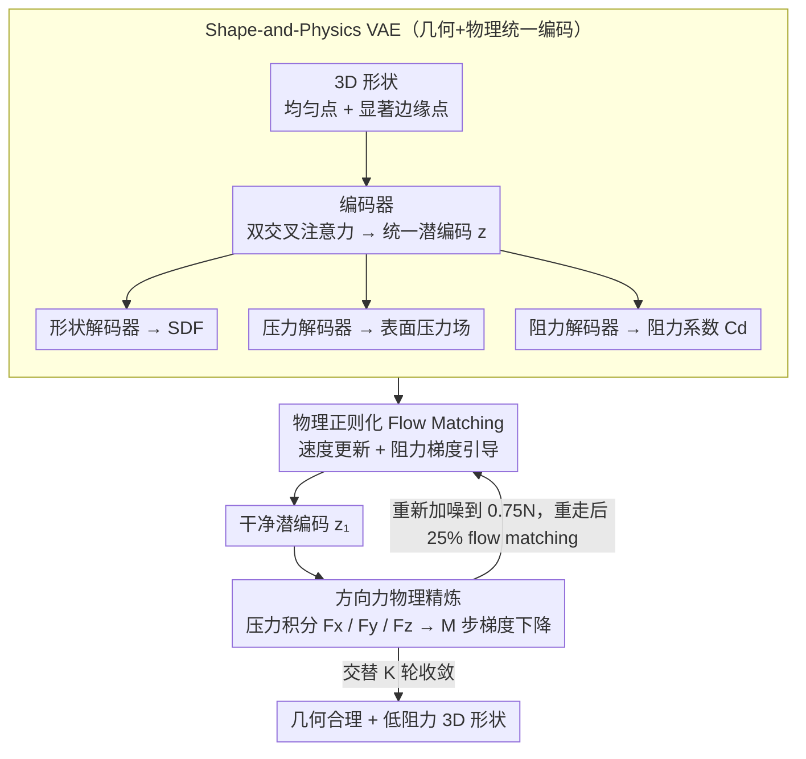

# PhysGen: Physically Grounded 3D Shape Generation for Industrial Design

**会议**: CVPR 2026  
**arXiv**: [2512.00422](https://arxiv.org/abs/2512.00422)  
**代码**: [https://github.com/kasvii/PhysGen](https://github.com/kasvii/PhysGen)  
**领域**: 扩散模型 / 3D生成  
**关键词**: 物理引导、3D形状生成、Flow Matching、气动优化、工业设计

## 一句话总结

本文提出 PhysGen，一个将物理约束（空气动力学效率）融入 3D 形状生成的统一框架：通过 Shape-and-Physics VAE 将几何和物理信息联合编码到统一潜空间，然后用交替更新的 Flow Matching 模型在速度更新和物理精炼之间迭代，生成既视觉逼真又物理高效的 3D 形状（如低阻力系数的汽车）。

## 研究背景与动机

1. **领域现状**：3D 生成模型（3DShape2VecSet、Dora、Hunyuan3D 等）已能产生视觉上高质量的 3D 物体。但这种"真实感"仅限于外观层面。
2. **现有痛点**：工程设计领域的物体——如汽车、飞机——其形状受到物理约束（空气动力学效率）的强烈影响。现有方法完全不具备物理意识：生成的汽车可能轮子嵌入车身、椅子的腿拓扑错误无法承重。
3. **核心矛盾**：(a) 现有 3D VAE 仅编码几何信息，潜空间中无法恢复物理属性；(b) 后处理优化方法（如 TripOptimizer）在潜空间中进行物理梯度优化时缺乏形状流形意识，容易使几何畸变不可恢复；(c) 将物理梯度注入扩散过程的早期步骤时，对噪声样本进行物理估计不可靠。
4. **本文目标** 如何在 3D 形状生成流程中有效整合物理引导，使生成结果同时满足几何合理性和物理效率。
5. **切入角度**：将物理引导和形状生成统一到一个交替更新框架中——flow matching 负责维持几何流形，物理精炼负责推动物理目标——二者交替进行而非顺序执行。
6. **核心 idea**：联合几何-物理的 VAE 潜空间 + 交替进行的物理正则化 flow matching 与方向力物理精炼，生成工程可用的 3D 形状。

## 方法详解

### 整体框架

两阶段体系：(1) **SP-VAE** 将 3D 形状和物理信息（表面压力场、阻力系数）编码到统一潜空间，配备一个形状解码器（SDF）、一个压力解码器和一个阻力系数解码器；(2) **物理引导 Flow Matching** 在推理时交替执行速度更新（带物理正则化的 rectified flow 采样）和物理精炼（基于方向力的梯度更新），多轮迭代收敛到几何合理且物理高效的形状。

### 关键设计

**1. Shape-and-Physics VAE：让潜空间同时记住"长什么样"和"受多大力"**

现有 3D VAE（如 Dora）只把几何塞进潜空间，压力场、阻力系数这些物理量在编码后就丢光了，后面想做物理引导也无从下手。SP-VAE 的做法是给同一份潜编码 $\mathbf{z}$ 挂上四个出口：编码器沿用 Dora 架构，从均匀表面点 $\mathbf{P}_u$ 和显著边缘点 $\mathbf{P}_s$ 抽特征，经双交叉注意力 + 自注意力压成 $\mathbf{z}$；形状解码器 $\mathcal{D}_s$ 以查询点 $\mathbf{x}$ 为 query 输出 SDF 值 $s = \mathcal{D}_s(\mathbf{x}, \mathbf{z})$，再用 Marching Cubes 重建 mesh；压力解码器 $\mathcal{D}_p$ 输出任意 3D 点的压力 $p = \mathcal{D}_p(\mathbf{x}, \mathbf{z})$；阻力解码器 $\mathcal{D}_d$ 则吐出全局阻力系数 $C_d$。

压力解码器是其中最讲究的一块，它用三条分支并行读取 $\mathbf{z}$ 再加权融合：自注意力分支抓全局表面依赖、squeeze-excitation 通道分支做通道重加权、MLP 分支补局部细节，阻力解码器复用同样的三分支提取后接三层 MLP。这样一来，潜编码里就同时携带了几何和物理两套信息，后续的梯度引导才有可微的物理代理可用。

**2. 物理正则化 Flow Matching：在采样轨迹上顺手把阻力往目标拽**

光有物理潜空间还不够，生成时得让轨迹软性地朝物理合理的方向走。本文用 rectified flow 在噪声 $\epsilon$ 和数据 $\mathbf{z}_1$ 之间做线性插值，学速度场 $\mathbf{u}_{t_n} = \mathbf{z}_1 - \epsilon$，推理时逆向走一步是

$$\mathbf{z}'_{t_{n+1}} = \mathbf{z}_{t_n} - (t_{n+1} - t_n)\,\hat{\mathbf{u}}(\mathbf{z}_{t_n}, t_n, \mathbf{c})$$

关键在于每走完一步速度更新，再叠一道阻力解码器的梯度引导，把轨迹往目标阻力系数 $d_{tar}$ 附近推：

$$\mathbf{z}_{t_{n+1}} = \mathbf{z}'_{t_{n+1}} - \lambda_d \nabla_{\mathbf{z}_{t_n}} \|\mathcal{D}_d(\mathbf{z}_{t_n}) - d_{tar}\|_2^2$$

这一项形式上就是分类器引导，但因为它始终在学到的形状流形上行走，比"先生成、后处理优化"那种离线纠偏稳得多——后者一旦把潜编码推出流形就拉不回来了。条件 $\mathbf{c}$ 可选地接草图或图像，让物理引导和外观控制叠加在同一条采样轨迹上。

**3. 方向力物理精炼 + 交替更新：让流形和物理目标轮流当家**

软引导只能粗调，真正的精细气动优化要靠稠密压力场。拿到 flow matching 采出的干净潜编码 $\mathbf{z}_1^k$ 后，用压力解码器预测表面压力，按三个方向积分出受力 $F_s = \sum_{i=1}^V p_i \mathbf{n}_{s,i} A_i$（$s \in \{x, y, z\}$），再定义物理损失

$$\mathcal{L} = \lambda_x \|F_x\|_2 + \lambda_y \|F_y\|_2 + \lambda_z \,\text{ReLU}(F_z)$$

三项分别管最小化纵向阻力、压住侧向力不对称、以及用 $\text{ReLU}(F_z)$ 确保负升力（下压力）以维持抓地力。梯度回传到 $\mathbf{z}_1^k$ 做 $M$ 步精炼，得到 $\hat{\mathbf{z}}_1^k$。

但纯精炼会把潜编码推离流形导致几何畸变，纯 flow matching 又满足不了物理约束，于是本文把两者拧成一个交替循环：精炼后的 $\hat{\mathbf{z}}_1^k$ 被重新加噪回到 $t_{n_s} = 0.75N$ 时刻，重走 flow matching 的后 25% 步骤把它拉回流形，然后再做一轮物理精炼，如此交替 $K$ 轮直至收敛。flow matching 负责"拉回流形"，物理精炼负责"推向物理最优"，两个操作各在自己最擅长的域里干活、互相矫正。

### 一个完整示例：从噪声到一辆低阻力的车

以一次草图条件生成为例走一遍交替循环。flow matching 先从噪声 $\epsilon$ 出发，沿 rectified flow 逆向采样，每步在速度更新后叠加阻力梯度引导，把轨迹朝目标阻力系数 $d_{tar}$ 软性收拢，得到第一版干净潜编码 $\mathbf{z}_1^1$——此时形状已经像车，但侧向受力还不对称、阻力也没压到位。

进入物理精炼：压力解码器在 $\mathbf{z}_1^1$ 的表面采样压力场，积分出 $F_x, F_y, F_z$，按损失 $\mathcal{L}$ 做 $M$ 步梯度下降，把车身轮廓往低阻力、对称、带下压力的方向微调，得到 $\hat{\mathbf{z}}_1^1$。但这一步可能让某处曲面脱离流形（比如轮拱处出现非自然褶皱），于是把 $\hat{\mathbf{z}}_1^1$ 重新加噪到 $0.75N$ 时刻，重走最后 25% 的 flow matching 步骤——这一段把畸变"打磨"回合理几何，输出 $\mathbf{z}_1^2$。

如此交替 $K$ 轮，每一轮里阻力都更低一点、几何都更干净一点，最终收敛到一辆既视觉逼真又通过 CFD 验证的低阻力车型。对比来看，后处理优化（SP-VAE+TripOptimizer 500 步强设置）因为没有"拉回流形"这一环，F-score 反而从 74.03 掉到 67.70；PhysGen 则升到 89.65。

### 损失函数 / 训练策略

**SP-VAE 两阶段训练**：Stage 1 独立训练——编码器+形状解码器初始化自 Dora 预训练权重，用 $\mathcal{L}_{shape} = \lambda_{sdf}\|s - \hat{s}\|_2^2 + \lambda_{KL}\mathcal{L}_{KL}$ 微调；冻结编码器后分别训练压力解码器（MAE+MSE）和阻力解码器（MAE+MSE）。Stage 2 联合微调所有组件：$\mathcal{L}_{total} = \lambda_{shape}\mathcal{L}_{shape} + \lambda_{press}\mathcal{L}_{press} + \lambda_{drag}\mathcal{L}_{drag}$。数据集为 DrivAerNet++（高保真 CFD 仿真汽车）。

## 实验关键数据

### 主实验

**物理引导生成 vs 后处理优化**

| 方法 | F-score(0.01)×100↑ | CD×1000↓ | 整体精度 |
|------|-------------------|----------|---------|
| 无物理引导生成 | 74.03 | 27.14 | 60.86 |
| SP-VAE+TripOptimizer (100步) | 73.93 | 27.13 | 60.89 |
| SP-VAE+TripOptimizer (500步强) | 67.70 | 32.78 | 58.75 |
| **PhysGen** | **89.65** | **20.99** | **66.48** |

**目标阻力系数下的形状精度提升**

| 配置 | F-score(0.01)×100↑ | CD×1000↓ |
|------|-------------------|----------|
| 无目标阻力 | 74.03 | 27.14 |
| 有目标阻力 | **89.65** (+21.09%) | **20.99** (+22.68%) |

**形状重建对比**

| 方法 | 整体精度 | 整体IoU |
|------|---------|---------|
| 3DShape2VecSet | 73.58 | 51.28 |
| Hunyuan3D 2.1 | 89.43 | 76.55 |
| Hi3DGen | 91.47 | 81.52 |
| Dora (微调) | 95.31 | 88.61 |
| **PhysGen SP-VAE** | **96.73** | **91.89** |

### 消融实验

| 配置 | 阻力 MSE(×10⁻⁵)↓ | 形状整体精度 | 形状整体IoU |
|------|-------------------|------------|-----------|
| 独立训练 | 4.6 | 95.31 | 88.61 |
| 联合微调 | **4.0** | **96.73** | **91.89** |

| 压力解码器分支 | MSE↓ | MAE↓ | Rel L2↓ | Rel L1↓ |
|--------------|------|------|---------|---------|
| 仅 Attn | 8.26 | 1.52 | 27.44 | 24.68 |
| 仅 Channel | 5.43 | 1.23 | 22.09 | 20.07 |
| 完整三分支 | **4.55** | **1.09** | **20.02** | **17.78** |

### 关键发现
- **后处理优化的根本缺陷**：TripOptimizer 保守设置几乎不改变几何，强设置则严重畸变形状——一旦偏离流形就无法恢复。PhysGen 的交替策略完美解决了这个两难
- **物理信息缓解深度模糊**：从单视角图像生成 3D 时，目标阻力系数提供了形状宽度等方面的额外约束，F-score 提升 21%
- **联合训练的互利效果**：联合微调同时提升了形状重建和物理估计——几何和物理表征在统一潜空间中相互增强
- 阻力系数预测 MSE 4.0×10⁻⁵ 显著优于所有基线（TripNet 9.1×10⁻⁵），压力场预测同样 SOTA
- 通过 OpenFOAM CFD 仿真验证了生成形状的真实物理性能

## 亮点与洞察
- **"物理引导 = 缓解深度模糊"**是一个优雅的洞察：阻力系数隐含了车身宽度/高度/后部形态的约束，弥补了 2D→3D 投影的歧义性。这提示在其他单视角 3D 重建任务中引入领域物理先验的可能。
- **交替更新策略**比 classifier guidance 更稳健：classifier guidance 在扩散早期噪声大时物理估计不可靠，交替策略让物理精炼只在干净潜编码上执行，然后重新加噪重新走 flow matching，两个操作各在自己最擅长的域中执行。
- SP-VAE 的三分支压力解码器设计（全局注意力 + 通道重加权 + 局部 MLP）是一个实用的多层次物理场预测架构，可迁移到其他 PDE 相关的神经算子任务。
- 方向力损失中 $\text{ReLU}(F_z)$ 的设计体现了工程常识——汽车需要负升力（下压力）以保持抓地力，而非最小化升力绝对值。

## 局限与展望
- 当前仅关注空气动力学（汽车/飞机），碰撞安全、结构强度等其他工程约束尚未探索
- 物理精炼依赖可微的物理解码器作为代理——当代理精度不足时物理引导可能失效
- SP-VAE 的联合训练需要配对的几何+CFD 数据，获取成本高
- 交替更新的超参数（重新加噪比例 0.75、精炼步数 $M$、迭代轮数 $K$）需要手动调整

## 相关工作与启发
- **vs TripOptimizer**: TripOptimizer 将生成和物理优化分离为两阶段，无形状流形意识，强优化导致畸变；PhysGen 的交替策略将两阶段统一
- **vs Diffusion 中注入物理梯度 (DiffPhys/PhysReaction)**: 早期扩散步骤的噪声样本上物理估计不可靠，后期步骤数不足以收敛；PhysGen 始终在干净潜编码上执行物理精炼
- **vs Dora VAE**: Dora 仅编码几何（占据场），PhysGen 的 SP-VAE 切换为 SDF 表示并联合编码物理，形状重建精度从 95.31 提升到 96.73

## 评分
- 新颖性: ⭐⭐⭐⭐⭐ 首个将工程物理约束系统性融入 3D 生成的框架，交替更新策略设计巧妙
- 实验充分度: ⭐⭐⭐⭐ 覆盖无条件生成、草图条件、真实图像条件，含 CFD 仿真验证，但应用范围限于汽车
- 写作质量: ⭐⭐⭐⭐⭐ 动机清晰、方法论述条理分明、算法伪代码完整
- 价值: ⭐⭐⭐⭐ 对工业设计领域有直接应用价值，交替更新思路可推广到其他物理约束生成任务

<!-- RELATED:START -->

## 相关论文

- [\[CVPR 2026\] PosterIQ: A Design Perspective Benchmark for Poster Understanding and Generation](posteriq_a_design_perspective_benchmark_for_poster_understanding_and_generation.md)
- [\[CVPR 2026\] GIST: Towards Design Compositing](gist_towards_design_compositing.md)
- [\[ICML 2026\] PhysForge: Generating Physics-Grounded 3D Assets for Interactive Virtual World](../../ICML2026/image_generation/physforge_generating_physics-grounded_3d_assets_for_interactive_virtual_world.md)
- [\[ECCV 2024\] NeuSDFusion: A Spatial-Aware Generative Model for 3D Shape Completion, Reconstruction, and Generation](../../ECCV2024/image_generation/neusdfusion_a_spatial-aware_generative_model_for_3d_shape_completion_reconstruct.md)
- [\[ICLR 2026\] RIDER: 3D RNA Inverse Design with Reinforcement Learning-Guided Diffusion](../../ICLR2026/image_generation/rider_3d_rna_inverse_design_with_reinforcement_learning-guided_diffusion.md)

<!-- RELATED:END -->
