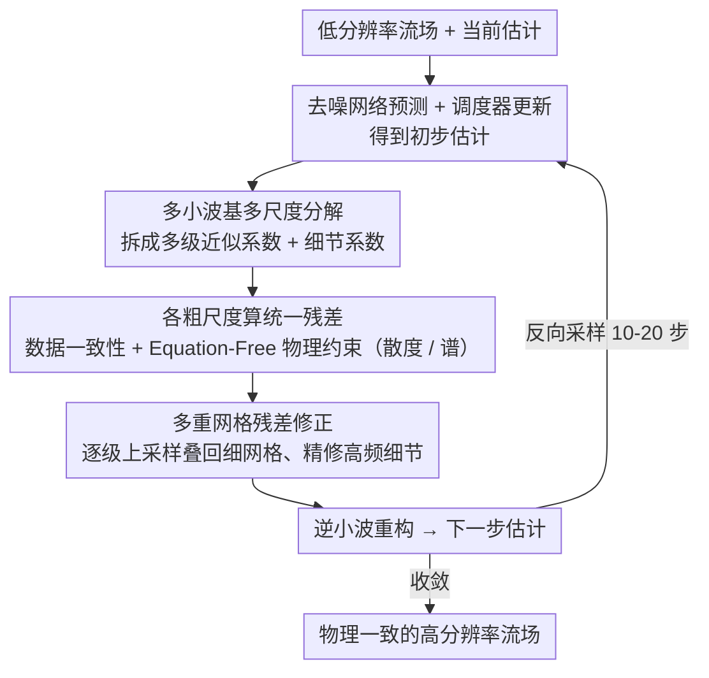

# Physics-Consistent Diffusion for Efficient Fluid Super-Resolution via Multiscale Residual Correction

**会议**: CVPR2026  
**arXiv**: [2603.00149](https://arxiv.org/abs/2603.00149)  
**代码**: [lizhihao2022/ReMD](https://github.com/lizhihao2022/ReMD)  
**作者**: Zhihao Li, Shengwei Dong, Chuang Yi, Junxuan Gao, Zhilu Lai, Zhiqiang Liu, Wei Wang, Guangtao Zhang
**领域**: 图像生成  
**关键词**: 流体超分辨率, 扩散模型, 多重网格残差修正, 多小波基, 物理一致性, equation-free

## 一句话总结

提出 ReMD（Residual-Multigrid Diffusion），在扩散模型的每一步反向采样中嵌入多重网格残差修正，利用多小波基构建跨尺度层次结构，无需显式 PDE 即可实现物理一致的高效流体超分辨率。

## 研究背景与动机

流体超分辨率（Fluid SR）在气象预报、海洋模拟和工程 CFD 中有重要价值：高分辨率模拟的计算代价极高，需要从低分辨率场高效重建精细流场。然而现有方法存在明显短板：

**通用图像 SR 方法**（EDSR、SwinIR 等）缺乏物理约束——生成的流场可能违反连续性方程、出现非物理散度，且在频谱高频段保真度差

**标准扩散模型**（DDPM/DDIM）虽能生成高质量样本，但需要大量采样步数（通常 >100 步），推理效率低；且不感知流体物理，容易产生谱失配和伪散度

**物理信息方法**（PINN 类或显式 PDE 约束）需要知道控制方程的具体形式，泛化性受限

核心矛盾是：**如何在不依赖显式 PDE 的前提下，将物理一致性注入扩散过程内部，同时加速采样收敛？** ReMD 提出的方案是将多重网格求解器的残差修正思想与扩散模型的反向过程融合。

## 方法详解

### 整体框架

ReMD 要回答的核心问题是：怎样在不依赖显式 PDE 的前提下，把物理一致性注入扩散过程内部、同时加速采样收敛。它的思路是改造扩散模型的每一步反向更新——标准扩散反向步只是用去噪网络预测噪声或 $x_0$、再按调度器更新，ReMD 在这之上插入一个**多重网格残差修正**环节：先把当前估计下采样到多个粗尺度，在粗网格上以较低成本算出数据一致性残差和物理约束残差、获得全局修正方向；再把粗网格的修正量逐级上采样叠回细网格、精修局部细节；每个尺度上的数据一致性项与轻量物理约束项被耦合成统一残差。这种 coarse-to-fine 修正借的是数值计算里多重网格方法的经典经验：粗网格高效消除低频误差、细网格精修高频细节，整体收敛更快。

### 关键设计

**1. 多小波基的多尺度层次：用频率分离匹配流体的跨尺度结构**

传统多重网格在尺度间只用简单线性插值/限制算子传信息，对流体这种横跨多个数量级的尺度特征不够。ReMD 改用多小波基（Multi-Wavelet Basis）：小波变换天然把信号分解成不同频率子带，能同时抓住大尺度结构（大气环流、洋流分布）和细小涡旋（高频湍流）；多小波的正交完备性又保证各尺度信息不冗余、限制与延拓算子数值稳定。具体实现上，每个反向扩散步内先用多小波把当前估计拆成多级近似系数与细节系数，在各级分别算残差并修正，再用逆小波变换重构——比固定的 2× 下采样提供了更丰富、更贴合流体的多分辨率分解。

**2. Equation-Free 的轻量物理约束：不写 PDE，靠通用统计先验约束物理合理性**

PINN 类方法需要预先知道控制方程的具体形式，泛化性受限。ReMD 的物理约束是无方程的，只施加三类通用先验：**散度约束**对不可压/弱可压流体要求 $\nabla \cdot \mathbf{u} \approx 0$、把散度惩罚并入残差以保连续性；**谱约束**利用湍流能量谱的统计规律（如 Kolmogorov -5/3 定律），在频域对生成场功率谱与目标分布做软匹配；**数据一致性**则要求超分结果下采样后与低分辨率输入吻合。三者都不需要写出 Navier-Stokes，而是用频域和空域统计量隐式约束物理，因此能泛化到不同流体系统。

**3. 多重网格残差修正加速采样：把"低频收敛慢"这个老问题一并解掉**

多重网格修正还顺带解决了扩散采样步数多的痛点。原理类似数值 PDE 中多重网格加速迭代求解器：标准扩散反向过程像 Jacobi/Gauss-Seidel 迭代，低频分量收敛慢；而粗网格修正能高效消除低频残差，使整体收敛大幅提速。实验上 ReMD 用 10-20 步即可达到标准扩散 100+ 步的质量，效率与质量并非此消彼长，而是借更好的修正策略一起改善。

## 实验关键数据

### 表1：大气基准（ERA5 等）超分结果对比

| 方法 | RMSE ↓ | 谱相关 ↑ | 散度误差 ↓ | NFE（采样步数） |
|------|--------|----------|-----------|----------------|
| Bicubic | 较高 | 较低 | 高 | 1 |
| EDSR | 中等 | 中等 | 高 | 1 |
| SwinIR | 中等 | 中等 | 较高 | 1 |
| DDPM (100步) | 中等 | 较高 | 中等 | 100 |
| DDIM (50步) | 中等 | 较高 | 中等 | 50 |
| **ReMD (20步)** | **最低** | **最高** | **最低** | **20** |

ReMD 在仅用 20 步采样时即在 RMSE 和谱保真度上超越 100 步的标准 DDPM，同时生成场的散度违反显著降低。

### 表2：海洋基准超分结果对比

| 方法 | RMSE ↓ | 能量谱误差 ↓ | 散度误差 ↓ | 推理加速比 |
|------|--------|-------------|-----------|-----------|
| EDSR | 基准 | 基准 | 基准 | 1× |
| FNO | 略低于 EDSR | 低于 EDSR | 中等 | ~1× |
| DDPM (100步) | 低于 EDSR | 低于 EDSR | 中等 | 0.2× |
| **ReMD (15步)** | **显著低于 DDPM** | **最低** | **最低** | **~5× vs DDPM** |

在海洋数据上，ReMD 同样以大幅减少的采样步数取得最优精度。相比 DDPM 100步，ReMD 15步的推理速度快约 5 倍，且效果更好。

### 消融实验要点

- **去掉多重网格修正**：退化为标准扩散后向采样，需 5× 以上步数才达到相当精度
- **去掉物理约束**：RMSE 略升，但散度误差和谱失配显著恶化，说明物理约束对流体场质量至关重要
- **用标准下采样替代多小波基**：高频细节（小涡旋）的恢复质量明显下降，能量谱高频段误差增大
- **NFE-质量曲线**：ReMD 在 10-20 步即进入平台区，而 DDPM/DDIM 需要 50-100 步才稳定

## 关键发现

1. **将多重网格残差修正嵌入扩散反向过程是加速收敛的有效手段**——这建立了数值方法与生成模型之间的有趣联系
2. **多小波基在流体多尺度建模中优于简单的线性插值/下采样**——它天然匹配流体场的多尺度结构（大尺度环流 + 小尺度湍流）
3. **Equation-free 的物理约束足以显著改善流场质量**——不需要知道具体 PDE，只需施加散度和谱分布等通用先验
4. **物理约束应放在扩散过程内部而非外部后处理**——在每步修正中耦合物理信息比事后投影更高效

## 亮点与洞察

- **跨领域思维**：将数值方法领域的多重网格技术与深度生成模型优雅结合，是一个很有启发性的工作。多重网格在数值 PDE 中已有 40 年历史，将其引入扩散模型是一个值得关注的新方向
- **效率与质量双赢**：不是牺牲质量换速度，而是通过更好的修正策略同时改善了两者。这与 CFD 中多重网格加速的经验一致
- **泛化性好**：equation-free 的设计使得方法不绑定于特定流体系统，在大气和海洋两个截然不同的场景都有效
- **谱保真度的重视**：流体 SR 中谱保真度比像素级 RMSE 更重要（因为谱影响下游物理分析），本文专门评估并优化了这一点

## 局限性

1. **仅验证在 2D 流场**——大气/海洋基准通常是 2D 表面场，3D 湍流场的效果未知；3D 多小波分解计算量也会上升
2. **物理约束的通用性有限**——散度约束假设不可压或弱可压，对高马赫数可压流体可能不适用
3. **超分倍率较低**——论文中的实验多为 4× 或 8× 超分，对于 16× 以上的极端超分效果存疑
4. **代码尚未完全开源**——GitHub 仓库目前仅含 LICENSE 文件，无法复现
5. **与最新加速采样方法的对比不充分**——如 Consistency Models、Flow Matching 等新范式也能大幅减少步数，需要补充对比

## 相关工作与启发

- **流体超分辨率**：FNO（Fourier Neural Operator）、U-Net based SR 等确定性方法是主要 baseline；扩散模型在流体领域的应用是新趋势
- **物理信息生成模型**：PhysDiff、PDE-Refiner 等将物理约束与生成模型结合，但通常需要显式 PDE。ReMD 的 equation-free 路线更灵活
- **加速扩散采样**：DDIM、DPM-Solver 等通过改进 ODE 求解加速，ReMD 从另一个角度（多重网格）实现加速，两者可能是正交的
- **小波与深度学习**：WaveletDiffusion、MWCNN 等已经探索了小波在深度学习中的应用，ReMD 将多小波用于多重网格的限制/延拓算子是新的用法
- **启发**：多重网格加速思想可以推广到其他物理场重建任务（如医学影像中的 MRI 重建、地球物理反演）

## 评分
- 新颖性: ⭐⭐⭐⭐ — 多重网格 + 扩散模型的结合是创新性的交叉贡献
- 实验充分度: ⭐⭐⭐⭐ — 大气海洋双基准 + 消融，但缺少 3D 和极端超分实验
- 写作质量: ⭐⭐⭐⭐ — 问题动机清晰，方法解释较直观
- 价值: ⭐⭐⭐⭐ — 对科学计算领域的流体 SR 有实用价值，跨领域启发好

<!-- RELATED:START -->

## 相关论文

- [\[CVPR 2026\] AlignVAR: Towards Globally Consistent Visual Autoregression for Image Super-Resolution](alignvar_towards_globally_consistent_visual_autoregression_for_image_super-resol.md)
- [\[ICLR 2026\] Step-Aware Residual-Guided Diffusion for EEG Spatial Super-Resolution](../../ICLR2026/image_generation/step-aware_residual-guided_diffusion_for_eeg_spatial_super-resolution.md)
- [\[CVPR 2026\] Training-free, Perceptually Consistent Low-Resolution Previews with High-Resolution Image for Efficient Workflows of Diffusion Models](training-free_perceptually_consistent_low-resolution_previews.md)
- [\[ICCV 2025\] 3DSR: Bridging Diffusion Models and 3D Representations for 3D Consistent Super-Resolution](../../ICCV2025/image_generation/bridging_diffusion_models_and_3d_representations_a_3d_consis.md)
- [\[CVPR 2026\] VOSR: A Vision-Only Generative Model for Image Super-Resolution](vosr_a_vision_only_generative_model_for_image_super_resolution.md)

<!-- RELATED:END -->
