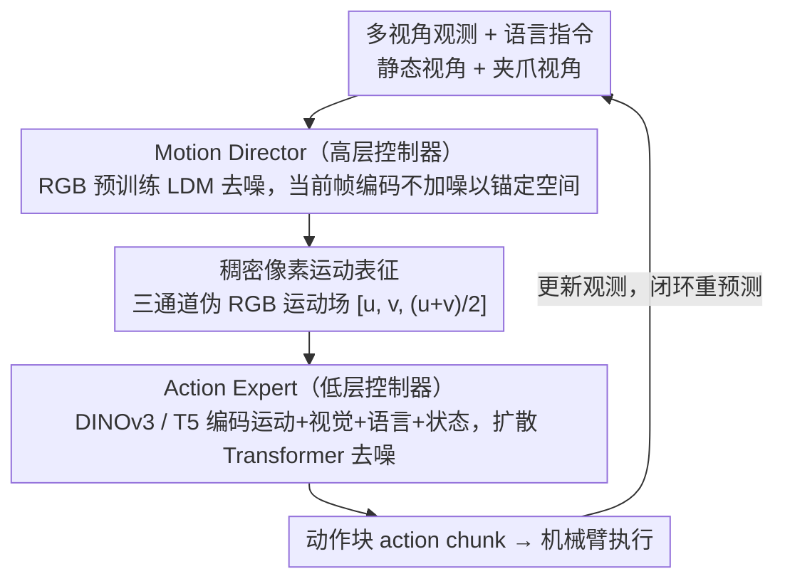

# Pixel Motion Diffusion Is What We Need for Robot Control

**会议**: CVPR 2026  
**arXiv**: [2509.22652](https://arxiv.org/abs/2509.22652)  
**代码**: [有](https://eronguyen.github.io/DAWN)  
**领域**: 图像生成  
**关键词**: 像素运动扩散, 机器人控制, 视觉-语言-动作, 光流表征, 层级扩散策略

## 一句话总结

DAWN 提出两阶段全扩散框架——Motion Director 生成稠密像素运动场作为可解释中间表征，Action Expert 将其转化为可执行机器人动作序列，在 CALVIN（Avg Len 4.00）、MetaWorld（Overall 65.4%）和真实世界均达到 SOTA，且模型容量和训练数据远小于竞争方法。

## 研究背景与动机

**领域现状**：Vision-Language-Action（VLA）模型通过大规模网络数据训练实现广泛泛化，但在运动感知和空间推理方面仍有局限。现有运动引导方案分为两条路线：（1）稀疏像素轨迹（General Flow、FLIP、Track2Act 等）从关键点或稀疏点追踪获取运动线索；（2）未来 RGB 帧预测（SuSIE、UniPi、VPP 等）利用视频扩散模型生成未来观测再推导动作。

**核心问题**：
- **稀疏轨迹信息不足**：仅追踪少量关键点，无法提供全场景运动描述，在复杂操作中丢失关键空间信息
- **RGB 帧预测开销大**：在高维 RGB 空间生成完整视频帧计算昂贵，且缺乏显式运动结构
- **间接提取增加复杂性**：Gen2Act 先生成视频再追踪像素提取运动，引入不必要的间接层级和误差累积

**关键洞察**：与其在 RGB 空间生成完整帧再间接提取运动，不如直接预测稠密像素运动——这在保留全场景运动信息的同时大幅降低生成复杂度，因为像素运动场比 RGB 帧结构更简单、更适合学习。

**本文方案**：DAWN（Diffusion is All We Need）——两阶段均采用扩散模型，Motion Director 在潜在空间预测稠密像素运动场，Action Expert 将运动场转化为动作序列，形成全可训练、端到端、可解释的控制管道。

## 方法详解

### 整体框架

DAWN 要解决的是 VLA 模型"会看会说但运动感知差"的老问题：它不直接从语言跳到动作，而是先在两者之间插一层看得见的"运动意图"，再把这层意图翻译成机器人指令。整条管道由两个扩散模型串成。前半段是 Motion Director（高层控制器），基于预训练潜在扩散模型（LDM），吃进多视角图像（静态视角 + 夹爪视角）和语言指令，吐出一张稠密像素运动场 $\mathbf{F}'_{t,k} = [u, v, (u+v)/2]$，相当于把"接下来场景里每个像素往哪挪"画出来。后半段是 Action Expert（低层控制器），一个扩散 Transformer，把这张运动场连同视觉观测、语言指令、机器人状态一起编码，去噪生成一段可执行的动作序列。两段都只学扩散去噪，靠结构化的像素运动场对接——这层中间表征既让两个模块能各自独立升级，又因为可以直接可视化而带来天然的可解释性。

### 关键设计

**1. 稠密像素运动表征：用一张"运动图"取代稀疏轨迹和 RGB 帧预测**

现有运动引导要么追踪几个关键点（信息太稀，复杂操作里丢空间细节），要么生成完整 RGB 未来帧（在高维像素空间生成既贵又没有显式运动结构）。DAWN 的取舍是直接预测稠密像素运动：把帧 $\mathbf{I}_t$ 到 $\mathbf{I}_{t+k}$ 的位移定义成 $\mathbf{F}_{t,k} = [u, v]$，其中 $u, v \in \mathbb{R}^{H \times W}$ 分别是每个像素的水平、垂直位移，覆盖整个场景而非几个点。关键的一笔是表征形式——为了能复用在海量 RGB 图像上预训练好的扩散模型，它把这个二通道运动场补成三通道"伪 RGB 图像" $\mathbf{F}'_{t,k} = [u, v, (u+v)/2]$，让 RGB 扩散权重可以原样迁移过来。这样既保住了全场景动态信息，又因为运动场比 RGB 帧维度更低、结构更规则而更好学。训练标签不需要人工标注，直接用 RAFT 光流模型从相邻帧对 $(\mathbf{I}_t, \mathbf{I}_{t+k})$ 抽出 ground-truth 运动。

**2. Motion Director：让 RGB 预训练扩散模型改去生成运动**

这一段负责"看图听指令、画运动"。它在预训练 LDM 上改造：把当前帧的 VAE 编码（注意这一路不加噪，作为干净的条件信号）和高斯噪声拼起来送进 U-Net，去噪目标是运动场的潜在表示。语言指令经 CLIP 文本编码器、夹爪视角经 CLIP 视觉编码器、时间偏移 $k$ 一起通过交叉注意力注入。让当前帧编码保持无噪是为了给生成锚定空间结构、不让物体位置漂掉；夹爪视角这一条新增条件则用零初始化权重接入，保证训练刚启动时不会一上来就破坏预训练模型已经学好的行为，再慢慢把夹爪信息学进去。训练时只更新 U-Net 去噪器，VAE、CLIP 等全部冻结，损失就是标准的 MSE 噪声估计。

**3. Action Expert：把运动图翻译成机器人能执行的动作块**

拿到运动场之后还得落到关节/夹爪指令上，这就是 Action Expert 的活。它先做多模态编码——用 DINOv3 ConvNeXt-S 同时编码像素运动场和视觉观测，T5-small 编码语言指令，2 层 MLP 编码机器人本体状态——再把这些条件喂给一个去噪 Transformer，迭代去噪出一整段动作块（action chunk）。这里特意用扩散 Transformer 而不是简单的 MLP 去噪头，是因为要同时消化运动、视觉、语言、状态四路条件，它们之间的依赖关系复杂，Transformer 的注意力更能把这些条件耦合好。和前一段一样，视觉/文本编码器都冻结、只训去噪器和状态编码器，靠预训练表征把数据需求压下来；损失同样是动作空间上的 MSE 噪声估计。

### 一个完整示例

以"把桌上的苹果抬起来放进盒子"为例走一遍闭环：当前时刻 $t$，系统先编码静态相机和夹爪相机的两路观测，连同指令文本送进 Motion Director；它跑 25 步扩散，生成一张稠密运动场——画面里苹果区域的像素被预测为朝盒子方向位移，背景像素位移近零，这张图直观地"指出"了接下来该往哪动。Action Expert 接过这张运动场，连同实时观测和机器人状态去噪出一段动作块，机械臂据此执行几步；执行后观测更新，回到 Motion Director 重新预测下一段运动，如此闭环直到任务完成。整条链路里，那张可视化的运动场就是人能看懂的"模型打算怎么做"。

### 训练与推理流程

两个模块可以**并行训练**：Motion Director 用 RAFT 光流当 GT，Action Expert 用对应的 GT 光流和动作监督，互不依赖；可选地，Action Expert 还能在 Motion Director 的真实输出上再微调一轮，缩小训练-推理分布差。**推理**则是串行闭环：观测编码 → Motion Director（25 步扩散）→ 像素运动场 → Action Expert 去噪 → 动作序列 → 执行 → 更新观测 → 回到第一步。因为接口是统一的运动场，两个模块可以各自独立替换升级，方便日后接入更强的视觉或控制模型。

## 实验关键数据

### 主实验

**CALVIN ABC→D（无外部机器人数据，表1）**：

| 方法 | Task 1 | Task 2 | Task 3 | Task 4 | Task 5 | Avg Len ↑ |
|------|--------|--------|--------|--------|--------|-----------|
| Diffusion Policy | 0.40 | 0.12 | 0.03 | 0.01 | 0.00 | 0.56 |
| Robo-Flamingo | 0.82 | 0.62 | 0.47 | 0.33 | 0.24 | 2.47 |
| MoDE | 0.92 | 0.79 | 0.67 | 0.56 | 0.45 | 3.39 |
| RoboUniview | 0.94 | 0.84 | 0.73 | 0.62 | 0.51 | 3.65 |
| Seer-Large | 0.93 | 0.85 | 0.76 | 0.69 | 0.60 | 3.83 |
| VPP | 0.96 | 0.88 | 0.78 | 0.71 | 0.60 | 3.93 |
| Enhanced DP (ours) | 0.82 | 0.67 | 0.53 | 0.41 | 0.35 | 2.78 |
| **DAWN (ours)** | **0.98** | **0.91** | **0.79** | **0.71** | **0.61** | **4.00** |

**CALVIN ABC→D（有外部数据，表2）**：

| 方法 | 额外数据 | Task 1 | Task 2 | Task 3 | Task 4 | Task 5 | Avg Len ↑ |
|------|----------|--------|--------|--------|--------|--------|-----------|
| GR-1 | Ego4D | 0.85 | 0.71 | 0.60 | 0.50 | 0.40 | 3.06 |
| LTM | OpenX | 0.97 | 0.82 | 0.73 | 0.67 | 0.61 | 3.81 |
| MoDE | Multiple | 0.96 | 0.89 | 0.81 | 0.72 | 0.65 | 4.01 |
| VPP | Multiple | 0.97 | 0.91 | 0.87 | 0.82 | 0.77 | 4.33 |
| DreamVLA | DROID | 0.98 | 0.95 | 0.90 | 0.83 | 0.78 | 4.44 |
| **DAWN (ours)** | DROID | 0.98 | 0.92 | 0.81 | 0.75 | 0.64 | 4.10 |

**MetaWorld 11 任务成功率（表3）**：

| 方法 | door-open | door-close | basketball | shelf-place | btn-press | faucet-close | hammer | assembly | Overall |
|------|-----------|------------|------------|-------------|-----------|--------------|--------|----------|---------|
| Diffusion Policy | 45.3 | 45.3 | 8.0 | 0.0 | 40.0 | 22.7 | 4.0 | 1.3 | 24.1 |
| ATM | 75.3 | 90.7 | 24.0 | 16.3 | 77.3 | 50.0 | 4.3 | 2.0 | 52.0 |
| LTM | 77.3 | 95.0 | 39.0 | 20.3 | 82.7 | 52.3 | 10.3 | 7.7 | 57.7 |
| **DAWN (ours)** | **94.7** | **97.3** | **42.0** | **24.7** | **92.0** | **76.3** | **12.7** | **10.7** | **65.4** |

**真实世界 lift-and-place 实验（表4，每任务 20 次随机初始化）**：

| 方法 | Apple 成功 | Avocado 成功 | Banana 成功 | Grape 成功 | Kiwi 成功 | Orange 成功 | 推理延迟(ms) |
|------|-----------|-------------|-------------|-----------|-----------|-------------|-------------|
| Enhanced DP | 5→4 | 6→6 | 5→4 | 4→3 | 5→5 | 4→4 | 112.77 |
| π₀ | 10→9 | 6→6 | 5→3 | 8→5 | 5→3 | 8→7 | 571.89 |
| VPP | 16→14 | 15→15 | 15→14 | 17→17 | 15→15 | 16→14 | 190.55 |
| **DAWN** | **19→19** | **20→19** | **17→16** | **19→19** | **17→16** | **18→16** | 319.82 |

（→ 左侧为抬起成功数，右侧为放置成功数）

### 消融实验（CALVIN ABC→D，表6）

**(a) 像素运动 vs 其他中间表征**：

| 设置 | Avg Len |
|------|---------|
| 无中间表征（仅 Action Expert） | 2.78 |
| RGB 目标图像 | 3.21 |
| 像素运动（U-Net 从头训练） | 3.42 |
| **像素运动（预训练 LDM）** | **4.00** |

**(b) 夹爪视角条件化**：

| 设置 | Avg Len |
|------|---------|
| VPP 不含夹爪视角 | 3.58 |
| DAWN 不含夹爪视角 | 3.74 |
| **DAWN 含夹爪视角** | **4.00** |

**(c) Motion Director 扩散步数**：

| 步数 | 2 | 10 | 25 | 40 |
|------|---|----|----|-----|
| Avg Len | 3.88 | 3.96 | **4.00** | 3.95 |

**双臂操作（表5）**：DAWN 在 Galaxea R1-Lite 双臂操作上动作预测 MSE 为 0.117，优于 Enhanced DP 的 0.128。

### 关键发现

- 无外部数据即达 SOTA（4.00 > VPP 3.93），数据效率极高
- 像素运动比 RGB 目标图像提升显著（4.00 vs 3.21），且预训练 LDM 迁移到运动生成额外提升（4.00 vs 3.42）
- 语义理解能力强：在语义相似但不同任务对上（door-open 94.7% vs door-close 97.3%）表现均优
- Motion Director 仅 2 步扩散即达 3.88，运动信息高度集中在前几步去噪
- 真实世界仅 1000 个 episode、100k 步微调即实现可靠迁移，且错误抓取率极低（DAWN 几乎为 0）
- 双臂场景同样有效，验证框架泛化性

## 亮点与洞察

1. **稠密运动场作为通用中间语言**：相比稀疏轨迹和 RGB 帧，稠密像素运动既保留完整空间信息又降低生成复杂度，三通道编码巧妙复用 RGB 预训练权重
2. **预训练迁移的惊喜**：在 RGB 图像上训练的 LDM 竟能高效迁移到像素运动生成（从头训练 3.42 vs 预训练 4.00），说明运动场与 RGB 图像在潜在空间共享有意义的结构
3. **模块化设计实现极高数据效率**：冻结预训练编码器 + 仅训练去噪器，在模型容量和训练数据远小于 VLA 方法的条件下达到甚至超越 SOTA
4. **可解释中间表征**：像素运动场可直接可视化，让用户理解模型的运动意图，这在机器人部署安全性方面具有实际价值

## 局限性

1. 两阶段串行推理带来额外延迟（319ms vs Enhanced DP 的 113ms），实时性受限
2. RAFT 光流作为训练标签可能在遮挡、大形变场景引入噪声
3. 使用外部数据时性能不如 VPP/DreamVLA（4.10 vs 4.33/4.44），大规模数据利用效率有待提升
4. 真实世界实验仅覆盖 lift-and-place 和双臂单类任务，复杂长程操作未验证
5. 单步运动预测（预测偏移 $k$），缺乏多步规划能力

## 相关工作与启发

- **Gen2Act / FLIP**：从生成视频间接提取运动轨迹 → DAWN 跳过视频生成直接预测运动，更高效
- **Diffusion Policy**：端到端扩散动作生成但缺乏运动中间抽象 → DAWN 的 Action Expert 在此基础上加入运动条件获得巨大提升（2.78→4.00）
- **VPP**：在 RGB 空间提取视频扩散特征作为隐式运动表征 → DAWN 用显式像素运动替代，无外部数据时更优
- **π₀**：大规模 VLA 流匹配模型 → 在真实世界 DAWN 以更小模型和更少数据大幅超越
- **启发**：预训练图像扩散模型可视为通用的视觉预测引擎，其能力远超 RGB 图像生成，可迁移到运动预测等结构化输出任务

## 评分

| 维度 | 分数 (1-5) | 说明 |
|------|-----------|------|
| 创新性 | 4 | 稠密像素运动 + 双扩散管道，三通道编码复用 RGB 预训练权重的设计巧妙 |
| 技术深度 | 3.5 | 精良的系统工程，但核心原理较为直接（LDM + 光流 GT） |
| 实验完整性 | 4.5 | 三大基准（CALVIN/MetaWorld/真实世界）+ 双臂 + 详尽消融 |
| 写作质量 | 4 | 结构清晰，动机和对比分析充分 |
| 实用价值 | 4 | 数据效率高、可解释、模块化可部署 |
| 总分 | 4.0 | 以小模型和少数据实现 SOTA 的实用框架 |

<!-- RELATED:START -->

## 相关论文

- [\[CVPR 2026\] Exploring Conditions for Diffusion Models in Robotic Control](exploring_conditions_for_diffusion_models_in_robotic_control.md)
- [\[CVPR 2026\] PixelDiT: Pixel Diffusion Transformers for Image Generation](pixeldit_pixel_diffusion_transformers_for_image_generation.md)
- [\[CVPR 2026\] DiP: Taming Diffusion Models in Pixel Space](dip_taming_diffusion_models_in_pixel_space.md)
- [\[CVPR 2026\] Causal Motion Diffusion Models for Autoregressive Motion Generation](causal_motion_diffusion_models_for_autoregressive_motion_generation.md)
- [\[CVPR 2026\] Beyond Pixel Simulation: Pathology Image Generation via Diagnostic Semantic Tokens and Prototype Control](beyond_pixel_simulation_pathology_image_generation_via_diagnostic_semantic_token.md)

<!-- RELATED:END -->
