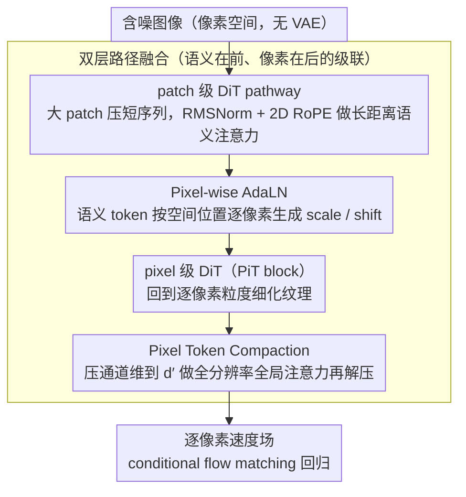

# PixelDiT: Pixel Diffusion Transformers for Image Generation

**会议**: CVPR 2026  
**arXiv**: [2511.20645](https://arxiv.org/abs/2511.20645)  
**代码**: [https://github.com/](https://github.com/)  
**领域**: 图像生成  
**关键词**: 像素扩散, 双层Transformer, 端到端生成, 像素建模, 文本到图像

## 一句话总结
PixelDiT 提出完全基于Transformer的双层像素空间扩散模型：patch级DiT捕捉全局语义 + pixel级DiT细化纹理细节，无需VAE即可在ImageNet上达到1.61 FID，并直接在1024分辨率像素空间训练文本到图像模型。

## 研究背景与动机
1. **领域现状**：潜空间扩散是DiT的标准范式，但依赖预训练autoencoder引入有损重建，限制了采样保真度并阻碍联合优化。
2. **现有痛点**：像素空间扩散面临像素建模的核心挑战——需要同时处理全局语义和高频细节。激进patchification损失细节，小patch/长序列则计算爆炸。
3. **核心矛盾**：缺乏一种高效的像素建模机制能同时捕捉全局语义和逐像素更新。
4. **本文目标**：设计纯Transformer的像素空间扩散模型，显式结构化像素建模。
5. **切入角度**：将语义学习与像素级更新解耦为两个层次，各用不同粒度的Transformer处理。
6. **核心idea**：patch级pathway做长距离语义注意力（粗粒度），pixel级pathway做密集逐像素建模（细粒度），通过pixel-wise AdaLN和token compaction连接。

## 方法详解

### 整体框架
PixelDiT 想在不借助 VAE 的前提下直接在像素空间做扩散，难点是单个 Transformer 既要看清全局语义又要刻画逐像素的高频纹理，而这两件事对 token 粒度的需求正好相反。它的解法是把这两个任务拆给两条独立的 pathway：先用一条 patch 级 DiT 把图像切成大 patch、压成短序列，在低分辨率网格上做长距离注意力，专门学全局布局和语义；再用一条 pixel 级 DiT（论文称 PiT block）回到逐像素粒度，把第一条 pathway 输出的语义当条件，细化纹理并预测最终的逐像素速度场。两条 pathway 通过 pixel-wise AdaLN（让语义按空间位置调制每个像素）和 token compaction（让像素级全局注意力算得动）衔接起来。

### 关键设计

**1. Pixel-wise AdaLN：让语义按空间位置逐像素调制，而不是一刀切**

标准 DiT 的 AdaLN 用一个全局条件（如 timestep）给整张图生成同一组 scale/shift，但像素空间里不同位置需要的语义引导完全不同——天空区域和人脸区域该被怎样调制并不一样。PixelDiT 改成由 patch 级 pathway 输出的语义 token 来产生调制参数：每个像素 token 根据它在空间上对应的那个语义 token，拿到专属的 scale 和 shift，再做 LayerNorm 仿射。这样语义信息不是作为全局偏置广播给所有像素，而是按空间自适应地注入，patch 级学到的布局才能真正"落"到对应的像素上。

**2. Pixel Token Compaction：在维度上压、不在数量上砍，让逐像素全局注意力算得动**

逐像素建模的麻烦在 token 数量太大——256×256 分辨率就是 65536 个像素 token，直接在这上面做全局注意力，复杂度按序列长度平方爆炸。常见做法是下采样减少 token 数，但那会丢空间分辨率，正好背离了像素建模的初衷。PixelDiT 的取舍是压维度而非压数量：进全局注意力之前，用一个线性投影把每个像素 token 的通道维压到更低的 $d'$，注意力在低维 token 上算完，再用另一个线性层解压回原始维度。token 个数（也就是空间分辨率）一个不少，省下来的是每个 token 的特征宽度，于是全分辨率上的全局注意力第一次变得可行。

**3. 双层路径融合：把语义推理集中到低分辨率，给像素级 pathway 减负**

两条 pathway 不是平级并联，而是语义在前、像素在后的级联。patch 级 pathway 由 N 个增强版 DiT block 堆成，用 RMSNorm 和 2D RoPE，在短序列上把大部分语义推理做完；pixel 级 pathway 的 PiT block 接过它的输出当语义条件，靠上面两个机制（pixel-wise AdaLN 注入语义 + compaction attention 做全局交互）生成逐像素的速度预测。这样设计的好处是昂贵的全局语义推理只在低分辨率网格上跑一次，像素级 pathway 只需在已有语义骨架上补纹理，整体负担和收敛速度都比让单条 pathway 同时扛两件事更友好。

### 损失函数 / 训练策略
训练目标就是标准的 conditional flow matching 损失，直接在像素空间上回归速度场，不经过任何潜空间。文本到图像版本把 patch 级 pathway 换成 multi-modal DiT block 以接入文本条件，其余架构不变，因此能直接在 1024 分辨率的像素上端到端训练 T2I 模型。

## 实验关键数据

### 主实验

| 方法 | 类型 | FID↓ (256) | FID↓ (512) | 说明 |
|------|------|-----------|-----------|------|
| PixelDiT | 像素 | 1.61 | 1.81 | 像素空间SOTA |
| DeCo | 像素 | 1.62 | 2.22 | 频率解耦方法 |
| DiT-XL/2 | 潜空间 | 2.27 | - | 需要VAE |
| PixelFlow | 像素 | - | - | 层级方法 |

### 消融实验

| 配置 | 关键指标 | 说明 |
|------|---------|------|
| Pixel-wise AdaLN | 优于全局AdaLN | 空间自适应调制有效 |
| Token Compaction | 优于无压缩 | 使全局注意力可行 |
| 双层 vs 单层 | 双层显著更优 | 解耦设计是关键 |

### 关键发现
- PixelDiT在像素空间模型中达到最低FID，证明纯Transformer架构在像素空间也能高效工作。
- 像素空间模型在图像编辑任务中天然避免了VAE重建伪影，背景保持更好。
- 可以直接在1024分辨率像素空间训练T2I模型，GenEval达0.74，DPG-Bench达83.5。

## 亮点与洞察
- **完全端到端**：无VAE的纯Transformer架构是最简洁的生成pipeline。
- **Token Compaction**是实用的工程创新：维度压缩而非空间下采样，保留了全空间分辨率。
- 证明了像素空间扩散可以在所有指标上接近甚至超越潜空间扩散。

## 局限与展望
- 相比LDM，训练成本仍然更高。
- 文本到图像在benchmark分数上略逊于最好的LDM（如FLUX）。
- 未来可结合更先进的训练技巧进一步缩小差距。

## 相关工作与启发
- **vs DeCo**: DeCo用无注意力的线性解码器，PixelDiT用带注意力的PiT blocks。两者思路类似但实现不同。
- **vs PixNerd**: 用神经场层预测像素速度，PixelDiT用纯Transformer更标准。

## 评分
- 新颖性: ⭐⭐⭐⭐ 双层像素Transformer设计新颖但与DeCo并行
- 实验充分度: ⭐⭐⭐⭐⭐ ImageNet+T2I+编辑多任务验证
- 写作质量: ⭐⭐⭐⭐ 架构描述详细清晰
- 价值: ⭐⭐⭐⭐ 推动像素扩散重新成为可行范式

<!-- RELATED:START -->

## 相关论文

- [\[CVPR 2026\] DeCo: Frequency-Decoupled Pixel Diffusion for End-to-End Image Generation](deco_frequency-decoupled_pixel_diffusion_for_end-to-end_image_generation.md)
- [\[CVPR 2026\] FlashDecoder: Real-Time Latent-to-Pixel Streaming Decoder with Transformers](flashdecoder_real-time_latent-to-pixel_streaming_decoder_with_transformers.md)
- [\[CVPR 2026\] Circuit Mechanisms for Spatial Relation Generation in Diffusion Transformers](circuit_mechanisms_for_spatial_relation_generation_in_diffusion_models.md)
- [\[CVPR 2026\] DiP: Taming Diffusion Models in Pixel Space](dip_taming_diffusion_models_in_pixel_space.md)
- [\[CVPR 2026\] Region-Adaptive Sampling for Diffusion Transformers](region-adaptive_sampling_for_diffusion_transformers.md)

<!-- RELATED:END -->
