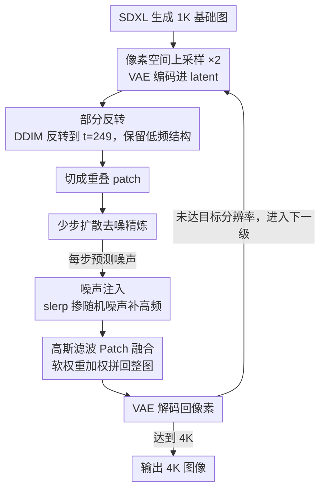

# PixelRush: Ultra-Fast, Training-Free High-Resolution Image Generation via One-step Diffusion

**会议**: CVPR 2026  
**arXiv**: [2602.12769](https://arxiv.org/abs/2602.12769)  
**代码**: 无  
**领域**: 图像生成 / 扩散模型加速  
**关键词**: 免训练高分辨率生成, patch-based推理, 部分反转, 少步扩散, 高斯混合  

## 一句话总结

首个让免训练高分辨率生成进入实用化阶段的方法——通过部分反转策略使少步扩散模型在patch精炼中可行，20秒生成4K图像，比现有方法快10-35倍且质量更优。

## 研究背景与动机

**预训练扩散模型（如SDXL）只能在原生分辨率下生成高质量图像**，超分辨率推理产生严重物体重复和纹理伪影。免训练高分辨率方法（DemoFusion、FreeScale等）通过patch-based或频域干预来解决，但都依赖完整的50步反向扩散——**生成一张4K图像需要5-10分钟，完全不实用**。

**速度瓶颈的根源是"全噪声到全步反向"的冗余设计**。作者发现高分辨率精炼的反向过程也遵循频率分层重建：低频全局结构在早期形成，高频细节在后期合成。既然粗糙上采样图已包含完整的低频结构，从全噪声开始重建是计算冗余的。

**但直接截断步数会引入新问题**：少步模型的大幅更新导致patch边界严重伪影和过度平滑。因此需要整套配套方案来逐一克服这些副作用。

## 方法详解

### 整体框架

PixelRush 要解决的是"免训练高分辨率生成太慢"这一痛点：现有方法都靠完整 50 步反向扩散把粗糙的上采样图重画一遍，4K 图要 5-10 分钟。它的整体流程是两阶段——先让 SDXL 在原生分辨率生成一张基础图，再做级联上采样，每一级把分辨率翻倍。每一级内部是一个固定循环：先在像素空间把图放大，VAE 编码进 latent，交给 PixelRush 精炼，再 VAE 解码回像素，作为下一级的输入。所以 1K 基础图经过若干级循环逐步长到 2K、4K。

真正的创新全集中在"精炼"这一环。作者想用少步（甚至 1 步）扩散模型来做精炼以提速，但少步模型直接上会带来一连串副作用——边界伪影、过度平滑。下面三个设计正是按"提速 → 补每个副作用"的顺序串起来的，缺一不可。

### 关键设计

**1. 部分反转（Partial Inversion）：让少步精炼变得可行的前提**

要省掉那 50 步里的冗余，得先想清楚冗余在哪。作者观察到高分辨率精炼的反向过程也遵循频率分层：低频全局结构在早期形成，高频细节在后期合成。而粗糙上采样图本来就携带完整的低频结构，从全噪声 $t=999$ 重建低频纯属浪费。于是 PixelRush 只用 DDIM 反转把粗糙 latent 扰动到一个中间时间步 $t=249$，保留已有结构，再从这里开始去噪：

$$z_t = \text{DDIM-Inv}(z_0,\, t=249), \qquad t \ll 999$$

这一截断让计算量直接砍掉约 75%（消融里从全噪声 50 步的 49s 降到部分反转 15 步的 13s，FID 反而从 54.70 降到 52.90）。更关键的是，少步模型的"大步更新"特性原本是缺点（一步走太远容易糊），但放在这条只剩高频要补的短轨迹里恰好合适——剩下要做的事情少，大步反而够用。反转深度是个敏感超参，$K=249$ 最优，$K$ 越大重建得越多、FID 越差。

**2. 高斯滤波 Patch 融合：补掉少步带来的拼缝**

高分辨率图放不进显存，只能切成重叠 patch 分别精炼再拼回。多步精炼时各 patch 在重叠区差异很小，标准平均混合就够；但换成少步模型后，每个 patch 的大幅更新让重叠区出现不可调和的差异，平均混合直接拼出棋盘格状的边界伪影。PixelRush 的做法是对重叠区的二值 mask 施加高斯模糊，得到一张从 patch 中心向边缘平滑衰减的连续权重图——越靠中心权重越高，越靠边越低，本质就是把图像 feathering 搬到 latent 空间。两个 patch 在交界处按这个软权重加权融合，硬边界被抹成渐变，棋盘格随之消失（消融里加上它 FID 从 57.23 降到 56.16）。

**3. 噪声注入（Noise Injection）：补掉少步带来的过度平滑**

去掉拼缝后还剩最后一个副作用：少步模型天生倾向输出平滑、缺细节的结果。PixelRush 在每步预测噪声里掺入一点随机噪声来对抗它，用球面线性插值混合：

$$\epsilon' = \text{slerp}(\epsilon_\theta,\, \epsilon_{rand},\, 0.95)$$

混入的随机分量把数据分布稍微"展平"，逼模型去合成更多高频细节，纹理因此更锐利（消融里它把 FID 从 56.16 一路压到最优的 50.13）。要注意这招只对少步模型成立——多步模型每步都注噪会让误差不断积累，反而越走越坏，所以它和部分反转是绑定使用的。

### 损失函数 / 训练策略

完全免训练，全程不动任何权重。基础生成用预训练 SDXL，少步精炼用蒸馏好的 SDXL-Turbo，直接拿来推理即可。

## 实验关键数据

### 主实验

| 方法 | 2K FID↓ | 2K时间 | 4K FID↓ | 4K时间 |
|------|---------|--------|---------|--------|
| SDXL-DI | 73.34 | 28s | 153.53 | 247s |
| DemoFusion | 68.46 | 75s | 74.75 | 507s |
| FreeScale | 52.87 | 53s | 58.28 | 323s |
| **PixelRush** | **50.13** | **4s** | **54.67** | **20s** |

### 消融实验

| 配置 | FID | 时间 | 说明 |
|------|-----|------|------|
| 全噪声+50步 | 54.70 | 49s | 基线 |
| 部分反转+15步 | 52.90 | 13s | 3.7×加速，质量不降反升 |
| +少步模型(1步) | 57.23 | 4s | 极速但出伪影+过度平滑 |
| +高斯融合 | 56.16 | 4s | 消除棋盘格 |
| +噪声注入 | 50.13 | 4s | 消除平滑，达最优 |

### 关键发现

- 四个技术逐层递进解决前一步引入的问题，最终同时实现速度与质量最优
- 反转深度K=249最优，K越大FID越差
- 25%重叠与50%重叠质量几乎无差但patch数减半，可进一步加速

## 亮点与洞察

- 核心洞察极为清晰：粗糙图已有低频结构→无需从全噪声重建→部分反转自然适配少步模型。四个组件的设计逻辑链条完整，每个都是前一个的必要修补，最终形成闭环。

## 局限与展望

- 依赖SDXL-Turbo蒸馏质量
- 逐帧用于视频无时序一致性保证
- 与Transformer架构扩散模型兼容性未验证
- 噪声注入系数固定，不同内容可能需要自适应

## 相关工作与启发

- **vs DemoFusion**: 全噪声+50步且有物体重复；PixelRush用DDIM反转+1步精炼，更快更好
- **vs FreeScale**: 频域操作常引入不自然纹理；PixelRush纯空间域操作

## 评分

- 新颖性: ⭐⭐⭐⭐ 部分反转+少步模型结合新颖，各组件技术简单但组合精妙
- 实验充分度: ⭐⭐⭐⭐⭐ 双分辨率+多指标+丰富消融
- 写作质量: ⭐⭐⭐⭐⭐ 叙事流畅，逐步引导理解每个组件必要性
- 价值: ⭐⭐⭐⭐⭐ 10-35×加速，首次实现实用化

<!-- RELATED:START -->

## 相关论文

- [\[CVPR 2026\] Training-free, Perceptually Consistent Low-Resolution Previews with High-Resolution Image for Efficient Workflows of Diffusion Models](training-free_perceptually_consistent_low-resolution_previews.md)
- [\[CVPR 2026\] DBMSolver: A Training-free Diffusion Bridge Sampler for High-Quality Image-to-Image Translation](dbmsolver_a_training-free_diffusion_bridge_sampler_for_high-quality_image-to-ima.md)
- [\[CVPR 2026\] DUO-VSR: Dual-Stream Distillation for One-Step Video Super-Resolution](duo-vsr_dual-stream_distillation_for_one-step_video_super-resolution.md)
- [\[CVPR 2026\] Training-free Mixed-Resolution Latent Upsampling for Spatially Accelerated Diffusion Transformers](training-free_mixed-resolution_latent_upsampling_for_spatially_accelerated_diffu.md)
- [\[CVPR 2026\] DiT360: High-Fidelity Panoramic Image Generation via Hybrid Training](dit360_high-fidelity_panoramic_image_generation_via_hybrid_training.md)

<!-- RELATED:END -->
