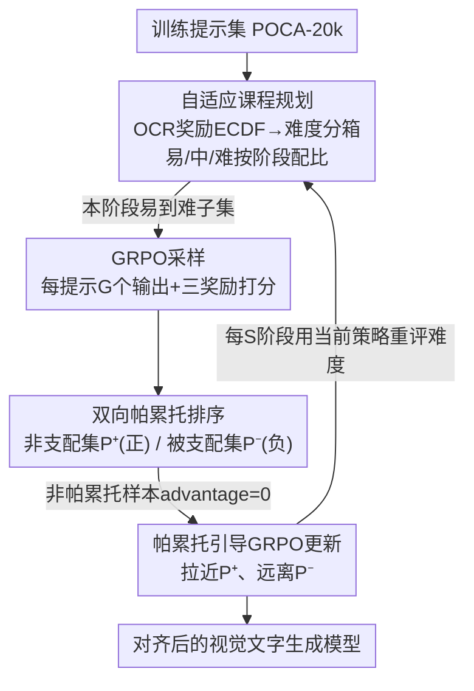

# POCA: Pareto-Optimal Curriculum Alignment for Visual Text Generation

**会议**: CVPR 2026  
**arXiv**: [2604.24171](https://arxiv.org/abs/2604.24171)  
**代码**: 无  
**领域**: 图像生成 / 视觉文字生成 / 强化学习对齐  
**关键词**: 视觉文字生成, GRPO, 帕累托最优, 多奖励对齐, 课程学习

## 一句话总结
针对视觉文字生成中「文字准确度」与「图像整体协调度/美学」难以兼顾的矛盾，POCA 把 GRPO 多奖励对齐重新建模成多目标优化问题：用双向帕累托排序在联合奖励空间里挑出非支配（好）/被支配（差）样本来做正负信号，再配一个基于 OCR 奖励 ECDF 的自适应课程，把训练数据按「由易到难」排布，在 AnyText-benchmark 上同时提升了 Sen.ACC、CLIP、HPS。

## 研究背景与动机
**领域现状**：视觉文字生成（visual text generation）要在图像里渲染出清晰、正确的文字。可控生成方法（GlyphControl、AnyText、FLUX-Text 等）通过注入字形（glyph）、位置等辅助条件来提升文字渲染精度；同时强化学习后训练（尤其是 GRPO 这类 group-relative 方法）被用来用多个奖励（提示对齐、美学、OCR 准确度）继续对齐基模型。

**现有痛点**：在同一次生成里同时满足「文字辅助条件」和「整体图像质量」两套指令，本身存在内在 trade-off——把文字渲染得越准，往往美学和指令跟随能力越差。而现有 RL 方法把多个奖励用**加权求和（weighted-sum）**聚成一个标量再优化，作者的实证分析发现：OCR 和 CLIP 这类奖励信号在视觉文字生成里经常**互相冲突**（100 个训练样本里有约 50 个出现奖励信号矛盾），加权求和把这些矛盾信号混在一起，优化目标变得模糊，GRPO 训练因此不稳、收敛到次优解。

**核心矛盾**：① 多个奖励之间存在冲突，标量化（scalarization）会丢失「哪个样本是真正好的折中」这一信息，而且各奖励权重极难调；② RL 还要选训练提示集——数据太多则训练慢、算力贵，数据太少又学不好，且多奖励优化需要不同领域偏置的提示混合，混在一起会让优化地形（landscape）复杂、收敛慢。「该选哪些提示、按什么顺序喂」是个未解问题。

**本文目标**：在不调权重的前提下，找到多个冲突奖励下的最佳折中状态；同时高效地选择并组织训练提示，让 RL 在有限数据里也能稳定快速收敛。

**切入角度**：把多奖励对齐看成**多目标优化**而非标量化——冲突目标问题的解就是帕累托最优（一个目标无法在不损害另一个目标的前提下再改进）。每张生成的文字图像都代表奖励空间里一个特定折中，其中既文字准又美观的样本就是帕累托最优（非支配）样本，模型应当被推着多生成这类样本。再借鉴人类学习路径，用课程学习把数据由易到难排布。

**核心 idea**：用「双向帕累托排序选样本 + 基于 OCR 难度的自适应课程」替代「加权求和 + 静态数据集」，在统一奖励空间里直接挑折中最优样本做 GRPO 的正负信号，并在易到难的优化地形上训练。

## 方法详解

### 整体框架
POCA 是一个在 GRPO 之上的两阶段协同框架，目标是用多个奖励（提示对齐 CLIP、美学 HPS、文字准确度 OCR）对齐视觉文字生成模型，同时避开加权求和的不稳定和静态数据的低效。整体分两个相互咬合的阶段：**课程规划（Curriculum Planning）**先评估每个提示的难度、把数据组织成「由易到难」的学习序列；这个序列再喂给**训练阶段（Training）**，后者对每组采样输出做**双向帕累托排序**，只用帕累托集合（非支配集做正信号、被支配集做负信号）来更新策略，其余样本 advantage 置零、不参与梯度。

具体一轮：给定同一原始提示和文字条件，采样一组 $G$ 个输出，用三个奖励模型给每张图打分得到 $K$ 维奖励向量；双向帕累托排序在这个联合奖励空间里找出非支配集 $\mathcal{P}^+$（最优折中）和被支配集 $\mathcal{P}^-$（明显差的折中）；GRPO 用前者拉高、用后者压低对应输出的生成概率。整个优化过程被自适应课程「套」着：每隔若干阶段重新用当前策略评估全量数据难度，动态决定本阶段喂哪批提示。

### 关键设计

**1. 双向帕累托排序：用非支配/被支配集替代加权求和，消除冲突信号**

针对加权求和把 OCR、CLIP 等冲突奖励混成一个模糊目标导致 GRPO 不稳的痛点，POCA 在每个 GRPO 组（$G$ 个采样输出）内做基于支配关系的排序。对输出 $\mathbf{o}$ 取 $K$ 维奖励向量 $R(\mathbf{o})=(R_1(\mathbf{o}),\dots,R_K(\mathbf{o}))$，定义支配关系：$\mathbf{o}_1 \succeq \mathbf{o}_2$ 当且仅当 $R_i(\mathbf{o}_1)\ge R_i(\mathbf{o}_2)$ 对所有 $i$ 成立、且至少存在一个 $j$ 使 $R_j(\mathbf{o}_1)>R_j(\mathbf{o}_2)$。一个样本若组内没有任何点支配它，即为**非支配（帕累托最优）样本**，构成正集合 $\mathcal{P}^+$。

「双向」的关键在于：除了正集合，POCA 还把奖励取负 $\{-r_i^k\}$ 再跑一次非支配排序，得到**完全被支配集** $\mathcal{P}^-$——这些是明显糟糕的折中样本。和只取最优的做法相比，双向同时给出「最好」和「最差」：最好样本提供正 advantage、最差样本提供负 advantage，于是模型既被拉向最优折中、又被推离最差折中，信用分配更干净。这一步直接去掉了那些既非典型好、也非典型坏的模糊样本，把冲突信号从优化里剔除，是稳定训练的来源。

**2. 帕累托引导的 GRPO 目标：非帕累托样本零 advantage**

帕累托集合选出来后，POCA 把不在 $\mathcal{P}$ 内的样本 advantage 直接置零，让它们不贡献梯度，只有 $\mathcal{P}$ 中的点进入目标函数：

$$\mathcal{J}_{\mathcal{P}}(\theta)=\mathbb{E}\Bigg[\frac{1}{n(\mathcal{P})}\sum_{i\in\mathcal{P}}\frac{1}{T}\sum_{t=1}^{T}\min\Big(\rho_{t,i}A_i,\;\mathrm{clip}(\rho_{t,i},1-\epsilon,1+\epsilon)A_i\Big)\Bigg]$$

其中 advantage $A_i$ 仍用 GRPO 的组内标准化形式 $A_i=\frac{r_i-\mathrm{mean}(\{r\})}{\mathrm{std}(\{r\})}$，归一化分母从原来的 $G$ 换成帕累托集合大小 $n(\mathcal{P})$。这样保留了 GRPO group-relative 的稳定性，又把更新限制在「明确的好折中 / 明确的坏折中」上，避免被模糊样本污染。

**3. 自适应课程规划：用 OCR 奖励 ECDF 评难度，分箱按阶段配比由易到难**

针对静态大数据集训练贵、混合提示让优化地形复杂的痛点，POCA 用「难度测量器 + 训练调度器」把数据组织成自适应课程。**难度测量器**复用 OCR 奖励模型当难度信号——因为实证发现 OCR 奖励在数据集上的方差最大、最能区分难易。对每个提示 $\mathbf{c}$，用当前策略采样 $N$ 次估其平均 OCR 奖励 $\mu_c=\frac{1}{N}\sum_{j=1}^{N}R_{\text{ocr}}(\mathbf{o}_{c,j})$，再用经验累积分布函数（ECDF）把它归一化成百分位排名：

$$ECDF(x)=\frac{1}{|\mathcal{D}|}\sum_{\mathbf{c}'\in\mathcal{D}}\mathbf{1}(\mu_{c'}\le x)$$

$ECDF(\mu_c)\in[0,1]$ 即该提示的相对难度排名（值越高越「容易」，即 OCR 奖励越高）。**训练调度器**先裁掉最易和最难的一小撮样本（模型要么秒会、要么学不动），再按固定百分位阈值把数据分三箱：$\mathcal{D}_{easy}$（$ECDF\ge0.7$）、$\mathcal{D}_{medium}$（$0.3<ECDF<0.7$）、$\mathcal{D}_{hard}$（$ECDF\le0.3$）。然后把训练分成 $S$ 个阶段，每阶段用不同混合比 $\mathbf{w}_s$ 抽三箱：默认 $S=3$，$\mathbf{w}_1=(0.6,0.3,0.1)$、$\mathbf{w}_2=(0.4,0.5,0.1)$、$\mathbf{w}_3=(0.1,0.6,0.3)$（易/中/难比例），逐步把模型暴露到更难环境。这个偏「中等难度更利于成长」的配置呼应了近期 RL 课程的发现。为保证课程随模型成长走，每个阶段开头都用**当前策略**重新评一遍全量难度，做到难度与模型能力紧耦合（self-paced，类似主动学习）。

### 损失函数 / 训练策略
基模型用 AnyText（开源、广泛使用的视觉文字生成基线），按 DanceGRPO 配置：batch size 4、50 步去噪、每个提示无 classifier-free guidance 采样 16 次。不全参微调，用 rank=128 的 LoRA。在 POCA-20k 上训练 300 步。三个奖励模型：CLIP（ViT-B/32，测文图对齐）、EasyOCR（先识别再用 NED 测文字准确度，作 OCR 奖励兼难度测量器）、HPS-v2.1（美学打分）。训练数据 POCA-20k 混三类共 20k 图（5k SynthText 通用图保泛化、10k AnyWord-3M 富文字场景图供 OCR 信号、5k LeX-Art 海报偏美学），用 Gemini 2.5 生成描述性提示。

## 实验关键数据

### 主实验
在 AnyText-benchmark 上对比主流视觉文字生成方法（英文 / 中文，↑越高越好；†为作者复现）：

| 方法 | 语言 | Sen.ACC | NED | CLIP | HPS |
|------|------|---------|-----|------|-----|
| AnyText† | EN | 0.7041 | 0.8827 | 0.8827 | 0.2624 |
| AnyText2† (前SOTA) | EN | 0.8122 | 0.9194 | 0.8941 | 0.2497 |
| GRPO baseline (加权求和) | EN | 0.7246 | 0.8935 | 0.8970 | 0.2708 |
| **POCA** | EN | **0.7651** | **0.8983** | **0.8985** | 0.2694 |
| AnyText† | ZH | 0.6452 | 0.8181 | 0.8022 | 0.2588 |
| AnyText2† (前SOTA) | ZH | 0.7171 | 0.8488 | 0.8102 | 0.2486 |
| GRPO baseline | ZH | 0.6782 | 0.8663 | 0.8138 | 0.2668 |
| **POCA** | ZH | 0.6942 | **0.8696** | **0.8170** | 0.2653 |

要点：POCA 相对 AnyText 基模型全指标提升；在文图对齐（CLIP）和美学（HPS）上超过前 SOTA AnyText2，且 AnyText2 的 HPS 明显偏低（0.2497）说明它牺牲了美学换文字准。相比 GRPO 加权求和 baseline，POCA 在文字准确度（Sen.ACC 0.7246→0.7651）和 CLIP 上都更好，说明帕累托选择找到了更优折中。SDXL-based 模型上也观察到类似提升（附录），说明可泛化到更大模型。人类研究（22 人、50 组图）显示 POCA 在文字准确、提示跟随、美学三维度上的偏好胜率显著超过基模型和 GRPO baseline。

### 消融实验
课程规划策略消融（AnyText-benchmark 英文，均训练 300 步）：

| 配置 | Sen.ACC | NED | CLIP | HPS | 说明 |
|------|---------|-----|------|-----|------|
| Pareto-guided（无课程，10k） | 0.7378 | 0.8923 | 0.8996 | 0.2700 | 仅帕累托选择 |
| POCA-1k | 0.7374 | 0.8941 | 0.8966 | 0.2678 | 1k 课程，数据效率 |
| POCA-5k | 0.7530 | 0.8968 | 0.8980 | 0.2682 | 5k 课程 |
| POCA-10k（Full） | **0.7651** | **0.8983** | 0.8985 | 0.2694 | 完整 |
| POCA-one stage | 0.7572 | 0.8980 | 0.8973 | 0.2688 | 单阶段（无多阶段调度） |

### 关键发现
- **加权求和是不稳定的根因**：奖励曲线对比（无课程、同数据）显示 GRPO 加权求和收敛到次优、只在 HPS 上还行，而帕累托引导在 OCR 和 CLIP 上显著更高；训练快照（step 40→280）显示 GRPO 在文图对齐上波动大，帕累托引导稳定单调上升——双向选择给出更干净的优化路径。
- **数据效率强**：POCA-1k 的表现就已接近用 10k 训练的纯 Pareto-guided 方法（Sen.ACC 0.7374 vs 0.7378），说明课程规划让小数据也能学好，10k 仍随数据量提升（0.7374→0.7530→0.7651）。
- **多阶段优于单阶段**：多阶段 POCA-10k（0.7651）比单阶段变体（0.7572）句子准确度更高，验证自适应分阶段调度的价值。
- **OCR 奖励适合当难度信号**：因其在数据集上方差最大、最能区分难易（附录）。

## 亮点与洞察
- **把多奖励 RL 对齐重构成多目标优化**：不再纠结于「OCR、CLIP、HPS 各给多少权重」，而是直接在联合奖励空间挑非支配样本——这是从根上回避了权重调参，思路可迁移到任何多奖励冲突的 RLHF/GRPO 场景（如多目标 LLM 对齐）。
- **「双向」帕累托很巧**：把奖励取负再跑一次非支配排序就拿到「最差折中」当负信号，几乎零额外成本却让 GRPO 的正负 advantage 都来自明确折中样本，避免被模糊样本拖累。
- **用现成奖励模型兼当难度测量器**：OCR 奖励既是优化目标又复用为课程难度信号，ECDF 归一化给出无量纲的百分位难度，不需要额外训练难度模型——self-paced、随模型成长重评，工程上很轻。
- **诚实暴露 trade-off 证据**：图 2 直接量化「100 样本里 50 个奖励冲突」，把加权求和为什么不稳说清楚，而非泛泛而谈。

## 局限与展望
- **课程超参数靠经验定**：作者自己承认分箱阈值（0.3/0.7）、阶段数 $S=3$、各阶段混合比 $\mathbf{w}_s$ 难找最优组合，目前是经验配置 + 借鉴「中等难度更利成长」的结论，缺乏系统的自动搜索。
- **难度测量器单一**：只取 OCR 奖励当难度信号（因方差大），但对美学/对齐主导的提示，OCR 难度未必能代表其真实学习难度。
- **依赖基模型与奖励模型质量**：基于 AnyText + EasyOCR/CLIP/HPS，奖励模型自身的偏差（如 OCR 对艺术字体的误识别）会直接传到帕累托选择里；评测也主要在 AnyText-benchmark。
- **改进思路**：把分箱阈值/阶段配比变成可学习或随训练自适应；引入多奖励联合的难度度量；在更多基模型/更大规模上验证组内帕累托集合大小波动对 batch 利用率的影响。

## 相关工作与启发
- **vs GRPO 加权求和 baseline（DanceGRPO 类）**: 他们把多奖励标量化后优化，本文在联合奖励空间做帕累托非支配选择并只用帕累托集合更新；区别在于是否保留奖励间的多目标结构，本文优势是避开权重调参、消除冲突信号带来更稳的收敛，代价是每组要做 $O(G^2K)$ 的支配比较。
- **vs 单向帕累托方法（如文中 [16]）**: 他们只取非支配（最优）样本，本文双向同时取被支配（最差）集做负信号，让模型既靠近最优又远离最差，信用分配更完整。
- **vs 预定义课程学习（人工 difficulty measurer + scheduler）**: 传统 CL 用预设的难度排序和固定进度，本文是 model-driven、用当前策略 + ECDF 自动测难度并每阶段重评，类似主动学习/self-paced，难度与模型成长紧耦合。
- **vs AnyText/AnyText2 等可控文字生成**: 它们靠注入字形/位置条件提升渲染精度，本文不改条件注入、而是在后训练用多奖励 RL 对齐去补「文字准 vs 美学/指令跟随」的折中短板，二者正交可叠加。

## 评分
- 新颖性: ⭐⭐⭐⭐ 把多奖励 GRPO 重构成帕累托多目标优化 + 双向排序 + ECDF 课程，组合新颖且动机扎实。
- 实验充分度: ⭐⭐⭐⭐ 中英双语主表 + 课程消融 + 加权求和对比 + 训练快照 + 人类研究 + SDXL 泛化，较完整；但消融主要在英文、缺更多基模型横评。
- 写作质量: ⭐⭐⭐⭐ 动机清晰、图 2 量化冲突有说服力，算法 1 给了帕累托排序伪代码。
- 价值: ⭐⭐⭐⭐ 帕累托替代加权求和的思路对多奖励 RLHF 普遍适用，数据效率（1k≈10k）对算力受限场景实用。

<!-- RELATED:START -->

## 相关论文

- [\[CVPR 2026\] Synthetic Curriculum Reinforces Compositional Text-to-Image Generation](synthetic_curriculum_reinforces_compositional_text-to-image_generation.md)
- [\[CVPR 2026\] Curriculum Group Policy Optimization: Adaptive Sampling for Unleashing the Potential of Text-to-Image Generation](curriculum_group_policy_optimization_adaptive_sampling_for_unleashing_the_potent.md)
- [\[ICML 2026\] Pareto-Guided Optimal Transport for Multi-Reward Alignment](../../ICML2026/image_generation/pareto-guided_optimal_transport_for_multi-reward_alignment.md)
- [\[CVPR 2026\] Seeing What Matters: Visual Preference Policy Optimization for Visual Generation](seeing_what_matters_visual_preference_policy_optimization_for_visual_generation.md)
- [\[CVPR 2026\] ThinkGen: Generalized Thinking for Visual Generation](thinkgen_generalized_thinking_for_visual_generation.md)

<!-- RELATED:END -->
