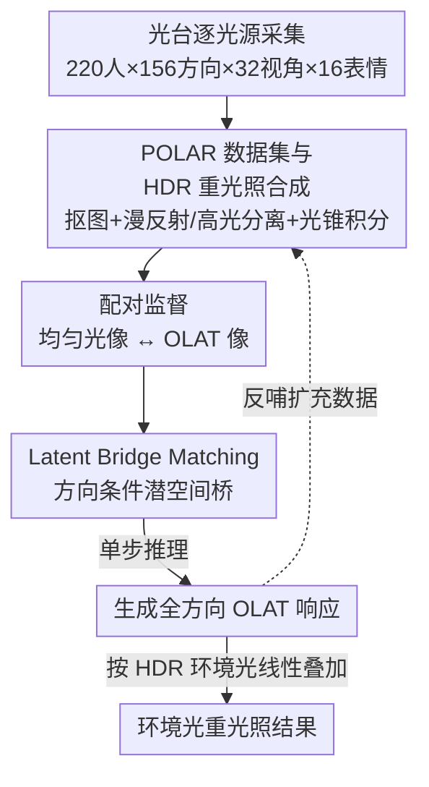

# POLAR: A Portrait OLAT Dataset and Generative Framework for Illumination-Aware Face Modeling

**会议**: CVPR 2026  
**论文**: [CVF Open Access](https://openaccess.thecvf.com/content/CVPR2026/html/Chen_POLAR_A_Portrait_OLAT_Dataset_and_Generative_Framework_for_Illumination-Aware_CVPR_2026_paper.html)  
**代码**: 无（项目页 https://rex0191.github.io/POLAR/）  
**领域**: 图像生成 / 人像重光照  
**关键词**: OLAT、人脸重光照、光台、Flow/Bridge Matching、HDR 环境光

## 一句话总结
作者一边采集了目前开源规模最大的人脸 OLAT（单光源逐一点亮）数据集 POLAR（220 人、156 个光源方向、32 视角、16 表情、4K），一边训练一个基于「latent bridge matching」的生成模型 POLARNet，从一张均匀打光的人像直接一步生成各方向的单光响应，再线性叠加成任意 HDR 环境光下的重光照，物理一致且能跨身份泛化。

## 研究背景与动机
**领域现状**：人像重光照（face relighting）要在保持身份和几何的前提下，把一张人脸换到新的光照环境下。近年神经渲染和扩散生成把画质推得很高，但作者强调一个被忽视的瓶颈——**模型再好也受限于训练数据的物理保真度和规模**。在所有光照数据里，OLAT（One-Light-at-a-Time，每次只点亮一个方向光、逐一拍摄）是对人脸光传输最忠实的测量：由于光传输对光照是线性的，任意环境光都能由这些单光基底线性组合重建出来，因此 OLAT 是物理渲染和数据驱动学习之间的桥梁。

**现有痛点**：OLAT 数据极度稀缺。工业界的光台数据（Adobe/NetFlix/Google）几乎都闭源；学术界放出的 OLAT 数据集要么身份太少（< 10 人）、要么分辨率低、要么缺表情多样性。于是「需要高保真可重光照人脸数据」和「公开资源极少」之间存在巨大缺口。

**核心矛盾**：OLAT 采集必须在受控光台里逐光源拍摄，**只能覆盖被拍到的那些人**，无法泛化到任意个体；而要让重光照模型对任意人脸都管用，又必须有海量、多样的 OLAT 监督。数据采集的成本/封闭性 与 模型对数据规模的渴求 形成死锁。

**切入角度**：作者把数据和模型做成一个互相喂养的「先有鸡还是先有蛋」闭环——真实 OLAT 数据约束模型走向物理准确，模型反过来为任意新人脸合成 OLAT、扩充数据多样性。关键观察是：**光照变化不是随机的图像变化，而是遵循一致的物理规律**，所以可以用一个在两个语义对齐端点（均匀光像 ↔ 目标 OLAT 像）之间的连续轨迹来建模，而不是像扩散那样从高斯噪声去噪。

**核心 idea**：把「重光照」重新表述为「在两个光照状态之间的连续、物理可解释的变换」——用方向条件的 latent bridge matching 学这条轨迹，一步推理即可从均匀光生成指定方向的 OLAT 响应。

## 方法详解
POLAR 这篇有两个并列的产出：**一个数据集**（POLAR，含采集 + HDR 重光照合成管线）和**一个生成模型**（POLARNet，从单张人像生成 OLAT）。两者通过线性光传输这条物理纽带串成一个闭环。

### 整体框架
整条管线分三段：(1) 在自建光台上逐光源拍摄真实 OLAT，经抠图/扩散合成得到大规模 HDR 重光照人像，构成数据集 POLAR；(2) 在 POLAR 的「均匀光像 ↔ OLAT 像」配对上训练 POLARNet，用方向条件的潜空间桥学习光传输；(3) 推理时给任意一张均匀光人像，一步生成全部 156 个方向的 OLAT，再按目标 HDR 环境光线性叠加，得到环境光重光照结果。生成出的 OLAT 又可以反哺数据，形成「鸡生蛋」闭环。

### 关键设计

**1. POLAR 数据集与物理校准的 HDR 重光照合成：把稀疏单光拍摄变成可扩展监督**

原始 OLAT 只是「某个方向单光下的脸」，要变成训练重光照模型的监督，必须能合成任意 HDR 环境光下的样子。基础公式是光传输的线性叠加：给定单光像 $\{I_i\}$ 和对应光方向 $\{l_i\}$，环境光 $E(l)$ 下的外观近似为 $I_E \approx \sum_i w_i I_i$，权重 $w_i = \int_{\Omega_i} E(l)\,dl$，即把 HDR 贴图投影到 156 个校准方向上、每个方向取一个 30° 光锥的立体角积分。直接这么叠对漫反射成立，但高光会带来曝光失衡和颜色偏移。作者的关键改进是**把漫反射和高光分开加权**：

$$I_E \approx \alpha \sum_i w_i^{\text{diff}} I_i + (1-\alpha)\sum_i I_i \odot w_i^{\text{spec}}$$

漫反射权重 $w^{\text{diff}}$ 由灰度强度算（避免光的颜色过度染肤色），高光权重 $w^{\text{spec}}$ 保留 RGB（还原彩色高光），$\odot$ 是逐元素乘，$\alpha$ 是场景相关的混合系数。再加上能量归一化（匹配 HDR 总光能、保持全局曝光一致）和感知 tone-mapping。作者还用**光锥积分**而非点光近似来覆盖整张 HDR 贴图、更好地抓住高强度局部光。最终数据集 220 人 / 32 视角 / 16 表情 / 4K，加上 HDR 合成共 2880 万张，是目前开源里规模和多样性最大的人脸 OLAT。

**2. Pair-wise Latent Bridge Matching：用光传输的物理结构取代扩散的噪声起点**

重光照和普通图像翻译不同——同一个人的均匀光像和 OLAT 像**外观一致、只差光照方向和强度**。标准扩散从高斯噪声去噪，容易把光照和纹理/身份纠缠在一起，导致 shading 不一致、身份漂移。作者改用**两个语义对齐端点之间的连续潜空间桥**：均匀光像和目标 OLAT 像各自经一个轻量 VAE 编码为 $z_u = E(x_u)$、$z_l = E(x_l^{(\theta,\phi)})$，桥上的潜插值定义为

$$z_t = (1-t)z_u + t z_l + \sigma\sqrt{t(1-t)}\,\epsilon$$

其中 $\epsilon \sim \mathcal{N}(0,I)$ 只引入有限随机性，$t\in[0,1]$ 参数化光照路径。和原始 Flow Matching / LBM 学两个**未对齐域**之间分布映射不同，这里用 OLAT 提供的**逐对对齐监督**——每个训练对就是同一人的均匀光像和它在某方向 $(\theta,\phi)$ 下的 OLAT 像——给出确定性、物理有据的光照过渡指导，把轨迹约束在「只沿光照维度演化、保留两端共享的身份」上。

**3. 方向条件速度场与单步推理：可控且快**

为了能按指定方向打光，速度网络 $v_\theta$ 以光方向条件 $c_{\text{dir}} = (\sin\theta, \cos\theta, \sin\phi, \cos\phi)$（正弦位置编码）为输入，训练目标是让预测漂移逼近目标漂移：

$$L_{\text{LBM}} = \mathbb{E}_{t,\epsilon}\big[\,\|v_\theta(z_t, t, c_{\text{dir}}) - (z_l - z_t)/(1-t)\|_2^2\,\big]$$

网络主体是一个条件 U-Net。推理时给任意人的均匀光像 $I_{\text{uni}}$，编码 $z_u = E(I_{\text{uni}})$，对目标方向 $L=(\theta,\phi)$ **一步**预测 $\hat z_l = z_u + (1-t)\,v_\theta(z_u, t{=}0, c_{\text{dir}})$，绕开扩散那种迭代积分，解码 $\hat I_{\text{olat}}(L) = D(\hat z_l)$ 即得该方向的单光像；对所有校准方向重复一遍就得到整套 OLAT 序列，再用设计 1 的物理叠加合成任意环境光重光照。

### 损失函数 / 训练策略
总目标在 LBM 损失外加三项正则：$L_{\text{total}} = L_{\text{LBM}} + \lambda_{\text{id}}L_{\text{id}} + \lambda_{\text{pix}}L_{\text{pix}} + \lambda_{\text{energy}}L_{\text{energy}}$。
- **身份一致** $L_{\text{id}} = \|f_{\text{id}}(D(z_t)) - f_{\text{id}}(D(z_0))\|_1$：因为 OLAT 常含强阴影，用预训练人脸编码器（ArcFace）在图像空间约束身份不漂。
- **能量/不确定性感知像素损失** $L_{\text{pix}} = \|w \odot (\hat I_{\text{olat}} - I_{\text{olat}})\|_1$，逐像素权重 $w(x) = \min(1, \kappa I_{\text{olat}}(x)/\bar I_{\text{olat}})$ 按相对亮度缩放，压低暗区低信号、强调亮区，避免模型过拟合暗部把结果整体压暗。
- **能量正则** $L_{\text{energy}} = \big|\,\|\hat I_{\text{olat}}\|_1 / \|I_{\text{olat}}\|_1 - 1\,\big|_1$，约束预测与 GT 的总曝光一致、防亮度漂移。

## 实验关键数据

### 主实验
在野外（in-the-wild）人像上，与三个代表性重光照方法对比：SwitchLight（物理启发的本征分解）、IC-Light、DreamLight（后两者是背景条件重光照）。指标用 LPIPS（感知相似/自然度）、PSNR/SSIM（像素重建保真）。

| 方法 | LPIPS↓ | PSNR↑ | SSIM↑ |
|------|--------|-------|-------|
| SwitchLight | 0.168 | 20.69 | **0.84** |
| IC-Light | 0.314 | 18.47 | 0.702 |
| DreamLight | 0.175 | 19.87 | 0.79 |
| **POLARNet（本文）** | **0.115** | **22.12** | 0.82 |

POLARNet 拿到最低感知误差和最高 PSNR，SSIM 与最佳的 SwitchLight 接近（0.82 vs 0.84），整体在保留人脸细节和光照一致性上更好。

### 数据集对比

| 数据集 | 身份数 | 视角 | 表情 | 总帧数 | 分辨率 | 开源 |
|--------|-------|------|------|--------|--------|------|
| Total Relighting | 70 | 6 | 9 | 10.6M | 4K | ✗ |
| NetFlix Data | 67 | 36 | - | 12M | 4K | ✗ |
| ICT-3DRFE | 23 | 2 | 15 | 14K | 1K | ✓ |
| Dynamic OLAT | < 10 | 4 | 1 | 603K | 4K | ◦ |
| FaceOLAT（并行工作） | 139 | 40 | 4 | 5.5M | 4K | ✓ |
| **POLAR（本文）** | **220** | 32 | **16** | **28.8M** | 4K | ✓ |

在「完全开源」的前提下，POLAR 在身份数、表情多样性、总帧数上都明显领先，且是少数同时提供 OLAT 原始拍摄 + HDR 重光照人像的开源资源。

### 消融实验

| 配置 | 现象 | 说明 |
|------|------|------|
| 物理 OLAT 叠加 vs 背景条件模型（环境光旋转） | 本文随 HDR 旋转保持 shading/高光物理一致；背景条件法出现光照/阴影不连续 | 验证显式建模光照结构而非依赖背景上下文的价值 |
| w/o 能量/不确定性损失（$w$ 与 $L_{\text{energy}}$） | 模型过拟合暗区，整体偏暗、亮区对比丢失 | 加权 + 能量约束让网络保住整体曝光和强光下的高频 shading |

### 关键发现
- **物理结构 > 上下文线索**：在 HDR 环境光旋转测试里，背景条件方法（靠背景推光照）会随背景旋转产生阴影跳变，而本文显式按方向叠加单光基底，shading 和高光随真实光向连续移动——这是「物理可解释」相对扩散类方法最直观的优势。
- **生成 OLAT ≈ 真实 OLAT**：用生成的 OLAT 序列叠加出的环境光人像，和用真实拍摄 OLAT 叠加的结果高度吻合，说明模型确实学到了底层光传输规律，而非只是拟合外观。
- **能量感知损失是暗区杀手**：去掉后结果整体压暗，说明 OLAT 监督里大量暗区（强阴影）会把朴素 L1 拖偏，必须按亮度重加权。

## 亮点与洞察
- **「鸡生蛋」数据-模型闭环**：真实 OLAT 给模型物理约束，模型又为任意新人脸合成 OLAT 扩数据——把「采集贵且封闭」和「模型缺数据」这对死锁拆成了自我增强循环，这个范式可迁移到任何「真实测量稀缺但物理线性」的场景（如材质 BRDF、声学）。
- **用 bridge matching 而非扩散建模重光照**：关键洞察是「重光照的两端语义对齐、只差光照」，所以不该从噪声起步。把光照变化建成两个潜码之间的确定性轨迹，既保身份又支持一步推理，比扩散快且更不易身份漂移。
- **漫反射/高光分离加权**这个看似工程的细节，实际是让线性叠加在彩色光下不崩的关键——漫反射走灰度权重保肤色、高光走 RGB 权重还原彩色高光。

## 局限与展望
- 作者承认：生成的 OLAT 在高光和阴影边界附近会丢高频细节；极端人脸姿态或极端光照下性能下降；任意光照输入目前靠一个 delighting（去光）模块处理（细节在补充材料）。
- 自己发现的：定量对比只有三个 baseline、且野外评测主要靠合成 GT，缺乏在多套真实采集 GT 上的交叉验证；身份保持靠 ArcFace 监督，对非正脸/遮挡人群的鲁棒性存疑 ⚠️。
- 展望：作者计划扩到**视频 OLAT 合成**，做时间一致的光照——这正好接上「光照感知视频生成」这类下游。

## 相关工作与启发
- **vs SwitchLight（物理本征分解）**：SwitchLight 把人像分解成本征分量再用 BRDF 重渲染，物理可解释但简化的 BRDF 抓不住次表面散射等复杂光传输；本文直接用真实 OLAT 学光传输，绕开手工反射模型，LPIPS/PSNR 更优。
- **vs IC-Light / DreamLight（背景条件扩散）**：它们靠背景上下文推光照、画质高但物理不一致（环境旋转时阴影跳变），且本是为物体/场景设计、对身份保持弱；本文显式建模方向并保留身份，环境旋转下 shading 连续。
- **vs 普通 Flow Matching / LBM**：原版学两个**未对齐域**之间的分布映射；本文利用 OLAT 的逐对对齐监督，给出确定性、物理有据的光照过渡，并叠加身份/能量正则适配重光照。

## 评分
- 新颖性: ⭐⭐⭐⭐ 数据-模型闭环 + 用 bridge matching 重述重光照的角度新颖，但 latent bridge matching 本身是借用已有框架。
- 实验充分度: ⭐⭐⭐ 数据集对比扎实，但模型侧只有 3 个 baseline、定量表偏小、消融多为定性。
- 写作质量: ⭐⭐⭐⭐ 数据集和模型两条线交代清晰，公式完整，物理动机讲得透。
- 价值: ⭐⭐⭐⭐⭐ 开源最大规模人脸 OLAT 数据集 + 可复现合成管线，对整个人像重光照社区是稀缺基础资源。

<!-- RELATED:START -->

## 相关论文

- [\[CVPR 2026\] FG-Portrait: 3D Flow Guided Editable Portrait Animation](fg-portrait_3d_flow_guided_editable_portrait_animation.md)
- [\[CVPR 2026\] SpatialDiff: 3D-Aware Object Movement via Implicit Spatial Modeling](spatialdiff_3d-aware_object_movement_via_implicit_spatial_modeling.md)
- [\[CVPR 2026\] ExpPortrait: Expressive Portrait Generation via Personalized Representation](expportrait_expressive_portrait_generation_via_personalized_representation.md)
- [\[CVPR 2026\] AS-Bridge: A Bidirectional Generative Framework Bridging Next-Generation Astronomical Surveys](as-bridge_a_bidirectional_generative_framework_bridging_next-generation_astronom.md)
- [\[CVPR 2026\] SegQuant: A Semantics-Aware and Generalizable Quantization Framework for Diffusion Models](segquant_a_semantics-aware_and_generalizable_quantization_framework_for_diffusio.md)

<!-- RELATED:END -->
