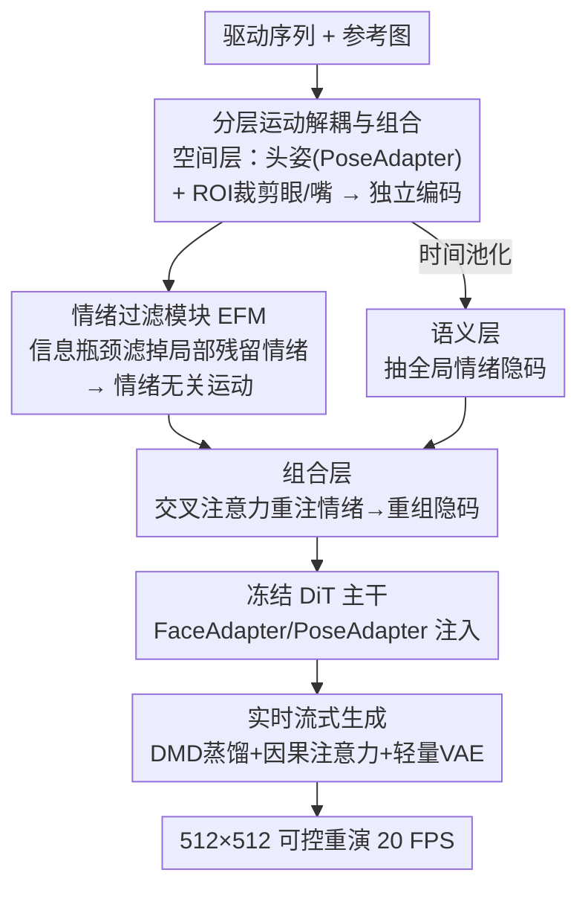

# PortraitDirector: A Hierarchical Disentanglement Framework for Controllable and Real-time Facial Reenactment

**会议**: CVPR 2026  
**论文**: [CVF Open Access](https://openaccess.thecvf.com/content/CVPR2026/html/Ji_PortraitDirector_A_Hierarchical_Disentanglement_Framework_for_Controllable_and_Real-time_Facial_CVPR_2026_paper.html)  
**代码**: 待确认  
**领域**: 图像生成 / 人脸重演  
**关键词**: 人脸重演, 运动解耦, 信息瓶颈, 扩散蒸馏, 实时生成

## 一句话总结
PortraitDirector 把人脸重演从"驱动一个纠缠的整体运动信号"重构为"分层组合任务"，用空间层/语义层/组合层把头姿、局部表情（眼/嘴）、全局情绪分别解耦再重组，并配一个基于信息瓶颈的情绪过滤模块去除局部运动里的残留情绪，最后靠扩散蒸馏 + 因果注意力 + 轻量 VAE 在单张 5090 上实现 512×512、20 FPS、800 ms 延迟的可控实时重演。

## 研究背景与动机
**领域现状**：人脸重演（facial reenactment）用驱动视频的运动去驱动一张参考人脸，目标是照片级、保身份的结果，并且最好能对表情、头姿等单个组件做细粒度控制。现有方法分两条路线：一是基于几何代理（3DMM、人脸关键点，如 AniPortrait、StyleAvatar）；二是学习隐式运动隐码（Face-vid2vid、LivePortrait、以及近期把扩散模型当生成器的 XPortrait、HunyuanPortrait 等）。

**现有痛点**：两类方法各有死角。整体式（holistic）端到端模型把运动学成单个纠缠表示，表现力强但**牺牲了细粒度可控性**——没法独立操纵某一个动作分量。反过来，为可控性服务的方法又分两种问题：基于几何代理的受限于代理本身的表达上限，连情绪都没法从物理动作里分离出来；而 EDTalk、PD-FGC 这类先驱靠**专门的训练目标 + 数据增强间接监督**去拆隐空间，但间接监督很难做到稳健、彻底的分离。

**核心矛盾**：表现力（expressiveness）与可控性（controllability）之间长期存在 trade-off，其根源在于大家**习惯把人脸运动当成一个单一的整体信号去建模**。一旦在编码阶段就纠缠了，事后（post-hoc）再去拆分注定不彻底。此外驱动图自带的情绪会**主导合成结果**，让输出无视甚至抵抗目标情绪。

**本文目标**：把"高表现力"和"细粒度可控"同时拿到——既能照片级重建，又能让眼、嘴、头姿、情绪各由不同驱动视频独立控制。

**切入角度**：作者的关键观察是，人脸运动不是单一纠缠信号，而是**多层组合**——不同分量运行在不同的空间、语义、时间尺度上（头姿是全局物理运动，眼/嘴是局部高频运动，情绪是全局低频语义）。既然如此，就该在**编码前的物理层面**先把它们分开，而不是事后从隐码里硬拆。

**核心 idea**：把重演从"驱动（driving）"重构为"组合（composition）"任务——先按分量属性路由到专门的层做解耦，再重组成一个统一的、表现力强的运动隐码；并用信息瓶颈把局部运动里的残留情绪滤掉，从而打破"运动 ↔ 情绪"的固有纠缠。

## 方法详解

### 整体框架
PortraitDirector 基于 Wan-I2V 的扩散 Transformer（DiT）架构。先按 Wan-Animate 的范式预训练一个基础人脸重演模型，含 MotionEncoder（从裁剪人脸提运动隐码 $l_{face}$）、PoseEncoder（把显式头姿参数映成 $l_{pose}$）、DiT（吃噪声隐码 + 运动条件预测去噪结果）、以及 FaceAdapter / PoseAdapter（通过交叉注意力把人脸/头姿隐码注入 DiT）。预训练目标是标准扩散去噪损失，但对人脸区域加权（mask 区域权重放大 $1+\lambda M$，$\lambda=50$）。

在此基础上引入核心模块 **分层运动解耦与组合（Hierarchical Motion Disentanglement and Composition）**，作为原 MotionEncoder 的"即插即用"替换：驱动序列先被预处理出头姿隐码和各人脸区域（眼、嘴）的初始运动隐码 → 经 **情绪过滤模块 EFM** 滤掉残留情绪、同时并行分支用时间池化抽全局情绪隐码 → 在 **组合层** 重组成整体运动隐码 → 连同头姿隐码经交叉注意力注入冻结的 DiT 主干。最后叠加一套 **实时流式生成** 优化把它压到消费级 GPU 可跑的速度。训练时 DiT 主干和情绪用的 MotionEncoder 都冻结，只优化新模块。

### 关键设计

**1. 分层运动解耦与组合：在物理层面先拆再重组，而非事后硬拆**

这是对"整体式建模导致纠缠"痛点的正面回应。作者用三层结构。**空间层（Spatial Layer）** 负责分离空间上彼此独立的分量：先把全局头姿从局部人脸运动里剥出来——用 MediaPipe 检人脸框，直接推出头的位置 $f_w,f_h=x/s,y/s$ 和尺度 $f_s=\Delta s/s$，再用预训练 HopeNet 估旋转角 $f_p,f_y,f_r$，拼成 $f_{pose}=(f_w,f_h,f_s,f_p,f_y,f_r)$ 经 PoseEncoder 得 $l_{pose}$，**通过独立的 PoseAdapter 注入**，注入通路与表情流完全分开，从而拿到对位置、旋转、尺度的显式独立控制；这正是 XPortrait2 那类统一隐空间模型头姿控制弱、尺度纠缠的病根所在。局部表情则在**编码前**就按区域裁剪——MediaPipe 检关键点裁出眼、嘴 ROI，分别送进专门的 MotionEncoder 得 $l_{eye}$、$l_{mouth}$，这种输入级分离从源头保证了运动隐码解耦、防止运动泄漏。**语义层（Semantic Layer）** 把情绪当作低频、时间平滑的分量处理：对一段视频窗口的运动隐码做时间池化 $l_{emo}=\frac{1}{N}\sum_i^N l_i$，抑制掉高频的局部动作、留下持续的情绪状态；这里用的 MotionEncoder 与重演那个共享架构和预训练权重并冻结，逼它靠预训练知识抽全局语义、避免嘴部运动等局部信息泄漏进去。**组合层（Composite Layer）** 把"情绪无关的基础动作"和"情绪风格"重新合成：

$$l^{compose}_{mouth}=l^{basic}_{mouth}+\mathrm{CrossAttn}(l^{basic}_{mouth},l_{emo}),\quad l'_{full}=\mathrm{SelfAttn}(\mathrm{MLP}(l^{compose}_{eye}\oplus l^{compose}_{mouth})),\quad l_{full}=\mathrm{CrossAttn}(l'_{full},l_{emo})$$

即先用交叉注意力把情绪分别注入眼、嘴隐码，再用自注意力融合并消解冲突，最后再用一层交叉注意力让全局情绪调制融合后的整体隐码。这套"先分量解耦、后情绪调制重组"比事后从一个整体隐码里拆分量稳健得多。

**2. 情绪过滤模块 EFM：用信息瓶颈把残留情绪从局部运动里挤掉**

即便做了结构化分解，局部隐码里仍残留情绪——比如从驱动图提的嘴部隐码不可避免编码了原情绪，这会**削弱全局情绪隐码的控制权**。已有方法（EDTalk、PD-FGC）靠只在中性数据集上训练来缓解情绪泄漏，但依赖数据纯度、很脆，还限制了表现力。EFM 走 analysis-by-synthesis 路线：基于信息瓶颈原理设计一个自编码器式模块，**分析阶段**它作为低容量通道，把局部隐码（如 $l_{mouth}$）先用 Encoder 压到紧凑特征空间（用 128 维），再用 Decoder 还原出情绪无关隐码 $l^{basic}_{mouth}$——低维瓶颈 + KL 散度正则强迫它丢掉情绪、只保留基础人脸运动；**合成阶段**再由组合层把全局情绪重注回来还原成完整表现力隐码。整个系统端到端优化去重建原始整体运动隐码，从而逼瓶颈学到有意义的"运动/情绪"分离，而不必依赖中性数据。

**3. 实时流式生成：三管齐下把扩散重演压到消费级 GPU 实时**

高保真扩散重演天然算得慢，作者在 Self-Forcing 基础上叠了一套优化。**DiT 蒸馏**：用 Distribution Matching Distillation（DMD）把采样步从 20 步蒸到 4 步（CFG=2），并把双向注意力改成因果注意力以支持流式，再加滑动窗口式 mask 和 KV cache（最小 chunk size 为 2）做高效流式推理。**VAE 加速**：在 4 步流式模型里 Wan-VAE 解码器成了主瓶颈（占约 50% 延迟），于是把解码器宽度砍到原来的 1/4 重训，目标 $L_{vae}=\|x_{pred}-x_{gt}\|_2^2+\lambda L_{LPIPS}(x_{pred},x_{gt})$（$\lambda=1$），换来约 4× 解码加速且重建质量基本不掉。最终管线在单张 NVIDIA 5090 上约 20 FPS、端到端 800 ms 延迟，512×512 分辨率流式生成。

### 损失函数 / 训练策略
两阶段训练。第一阶段在 VFHQ + NerSemble + MEAD 合成数据集（约 30 万段 ≤30s 的片段，512×512）上训人脸重演任务 100K 步（24×A100）；数据增强按 XPortrait2 对驱动帧做随机缩放、颜色抖动、分段仿射，并对源图随机裁剪以增强跨尺度鲁棒性，逼模型只从源图取身份信息。第二阶段冻结 DiT 主干、PoseEncoder、情绪用 MotionEncoder，只微调解耦模块 20K 步。除去噪损失 $L$ 外，加一条隐码约束让组合隐码对齐预训练 MotionEncoder 的输出以保表现力：$L_{latent}=\mathbb{E}[\|l_{gt}-l_{pred}\|]+(1-\frac{l_{gt}\cdot l_{pred}}{\|l_{gt}\|\|l_{pred}\|})$，总损失 $L_{edit}=L+L_{latent}$。

## 实验关键数据

### 主实验
VFHQ 上的人脸重演评测（200 段视频 × 48 帧做目标，200 张图做跨身份参考）。自重演用 MSE/SSIM/LPIPS 衡量，跨重演用身份（ArcFace 余弦距离）、头姿、表情相似度（L2 距离）衡量。

| 方法 | MSE↓ | SSIM↑ | LPIPS↓ | ID-SIM↑ | Pose↓ | Expression↓ |
|------|------|-------|--------|---------|-------|-------------|
| AniPortrait | 0.032 | 0.576 | 0.429 | 0.886 | 8.347 | 0.027 |
| Follow-Your-Emoji | 0.033 | 0.570 | 0.428 | **0.892** | 9.543 | 0.026 |
| XPortrait2 | 0.046 | 0.540 | 0.462 | 0.823 | 4.894 | 0.010 |
| EDTalk | 0.022 | 0.641 | 0.405 | 0.792 | 8.169 | 0.017 |
| PDFGC | 0.047 | 0.531 | 0.563 | 0.756 | 19.401 | 0.026 |
| **Ours** | **0.018** | **0.654** | **0.316** | 0.880 | **4.707** | **0.010** |

本文在重建质量（MSE/SSIM/LPIPS）和头姿/表情控制上全面领先，仅 ID-SIM 略逊于 Emoji（0.880 vs 0.892）。作者强调一个突出优势是**对尺度变化的鲁棒性**——XPortrait2 靠死守参考图尺度换来高表情精度但重建损失更大，而本文显式解耦头姿缓解了这种尺度纠缠。

MEAD 上的单组件控制精度（一次只驱动一个组件，报对应区域相似度，L2 距离，越小越好）：

| 方法 | Pose↓ | Expression↓ | Mouth↓ | Eye↓ |
|------|-------|-------------|--------|------|
| EDTalk | 25.999 | 0.028 | 0.014 | – |
| PDFGC | 33.081 | 0.035 | 0.025 | 0.046 |
| AniPortrait | 19.200 | 0.032 | – | – |
| Follow-Your-Emoji | 16.160 | 0.029 | – | – |
| **Ours** | **13.695** | **0.023** | **0.012** | **0.033** |

本文在四个组件控制指标上全部最优，且是少数能同时控制眼、嘴、头姿、情绪四个维度的方法（AniPortrait/Emoji 只能控头姿+表情，且表情信号仅来自嘴部图）。

### 消融实验
论文的消融以定性图为主（⚠️ 未给数值表）。

| 配置 | 现象 | 说明 |
|------|------|------|
| Full model | 尺度稳健、情绪可独立控 | 完整模型 |
| w/o Struct（仿 XPortrait2 用 MLP 把姿态+表情融成统一隐码） | 严重尺度纠缠，模型继承参考图尺度而非驱动头姿 | 验证显式姿态-表情分离的必要性 |
| w/o EFM（换成参数匹配的 MLP、去掉瓶颈和 KL） | 抑制源表情能力下降，独立表情控制变弱 | 验证 EFM 对情绪解耦的作用 |

### 关键发现
- 去掉结构化分解（w/o Struct）会复现 XPortrait2 的尺度纠缠问题——显式的姿态-表情分离是稳健解耦的关键。
- 去掉 EFM 后模型压不住源情绪，目标情绪控制权被驱动图自带情绪夺走，印证了"残留情绪污染局部隐码"这一痛点真实存在。
- 实时性方面，4 步流式模型里 VAE 解码器占约 50% 延迟，砍宽度到 1/4 后约 4× 加速且质量基本不掉，是把扩散重演做到消费级实时的关键工程点。

## 亮点与洞察
- **"先在物理层面裁剪再编码"替代"事后从隐码硬拆"**：把眼、嘴在输入级就 crop 开分别编码，从源头保证解耦——这比 EDTalk/PD-FGC 的隐空间正交约束更直接、更稳，思路可迁移到任何"组件天然纠缠但物理上可分割"的可控生成任务。
- **用信息瓶颈做"情绪滤波器"很巧**：把"去情绪"建模成低容量瓶颈 + KL 的 analysis-by-synthesis，而不是依赖中性数据集，既绕开了数据纯度依赖又保住了表现力，是信息瓶颈在解耦控制上的一个干净应用。
- **把扩散重演真正做到了实时可控**：DMD 蒸馏（20→4 步）+ 因果注意力流式 + 轻量 VAE 的组合拳，让"高保真 + 细粒度可控 + 实时"三者首次在单张消费级 GPU 上同时成立，对直播虚拟人、互动娱乐有直接落地价值。

## 局限与展望
- 消融以定性图呈现、**缺数值消融表**，难以量化各模块的精确贡献（⚠️ 正文未给 w/o Struct / w/o EFM 的指标数字）。
- ID-SIM 略逊于 Follow-Your-Emoji（0.880 vs 0.892），说明在身份保持上仍有提升空间，可能与解耦-重组过程的信息损失有关。
- 依赖 MediaPipe、HopeNet 等现成检测器做姿态/ROI 提取，这些前置模块的失败（大角度、遮挡、低质输入）可能级联影响整条管线，论文未充分讨论其鲁棒边界。
- 时间池化抽情绪假设"情绪=低频、动作=高频"，对快速情绪切换或表演性夸张表情是否成立存疑，可探索更自适应的频带分离。

## 相关工作与启发
- **vs EDTalk / PD-FGC**：它们事后对整体运动隐码做隐空间分解（正交约束 / 由粗到细），依赖精心设计的数据增强和辅助目标，分离不彻底；本文在编码前的物理层面就裁剪分离，并用 EFM 显式滤情绪，分离更稳健、更细粒度。
- **vs XPortrait2 / AniPortrait / Follow-Your-Emoji**：它们只能做粗粒度的姿态-表情解耦（且表情信号常只来自嘴部），且输出易被参考图固有表情/尺度污染；本文做到眼、嘴、头姿、情绪四维独立控制，并显式解耦头姿以缓解尺度纠缠。
- **vs Self-Forcing / TalkingMachines（加速路线）**：本文在 Self-Forcing 上叠加高效注意力模式和加速 VAE 解码器，把流式重演的端到端延迟压到 800 ms，是把可控人脸重演推向实时落地的工程贡献。

## 评分
- 新颖性: ⭐⭐⭐⭐ "重演=分层组合"的视角 + 物理层面解耦 + 信息瓶颈滤情绪组合得很完整，但各组件多源自已有技术的巧妙拼装
- 实验充分度: ⭐⭐⭐ 主实验对比充分、双数据集双任务，但消融只有定性图、缺数值表，略减说服力
- 写作质量: ⭐⭐⭐⭐ 动机推导清晰、三层结构讲得明白，公式与图配合到位
- 价值: ⭐⭐⭐⭐ 首次让高保真+细粒度可控+实时在单张消费级 GPU 同时成立，对虚拟人/直播应用价值明确

<!-- RELATED:START -->

## 相关论文

- [\[CVPR 2026\] Semantic Scale Space: A Framework for Controllable Image Abstraction](semantic_scale_space_a_framework_for_controllable_image_abstraction.md)
- [\[CVPR 2026\] DreamStereo: Towards Real-Time Stereo Inpainting for HD Videos](dreamstereo_towards_real-time_stereo_inpainting_for_hd_videos.md)
- [\[CVPR 2026\] FlashDecoder: Real-Time Latent-to-Pixel Streaming Decoder with Transformers](flashdecoder_real-time_latent-to-pixel_streaming_decoder_with_transformers.md)
- [\[ECCV 2024\] MotionLCM: Real-time Controllable Motion Generation via Latent Consistency Model](../../ECCV2024/image_generation/motionlcm_real-time_controllable_motion_generation_via_latent_consistency_model.md)
- [\[CVPR 2026\] StreamAvatar: Streaming Diffusion Models for Real-Time Interactive Human Avatars](streamavatar_streaming_diffusion_models_for_real-time_interactive_human_avatars.md)

<!-- RELATED:END -->
