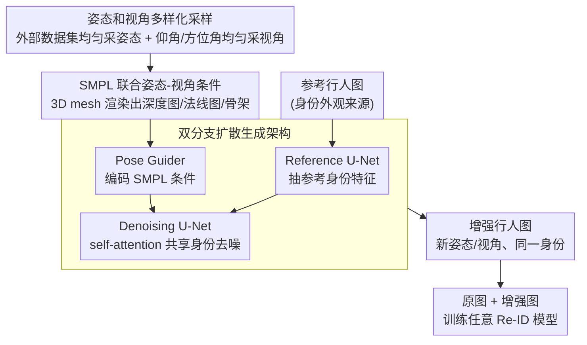

# Pose-dIVE: Pose-Diversified Augmentation with Diffusion Model for Person Re-Identification

**会议**: CVPR 2026  
**arXiv**: [2406.16042](https://arxiv.org/abs/2406.16042)  
**代码**: [https://cvlab-kaist.github.io/Pose-dIVE](https://cvlab-kaist.github.io/Pose-dIVE)  
**领域**: 扩散模型/图像生成  
**关键词**: 行人重识别, 数据增强, 扩散模型, SMPL, 姿态多样化

## 一句话总结
Pose-dIVE通过SMPL模型联合控制人体姿态和相机视角，利用扩散模型生成具有多样化姿态和视角的行人图像，系统性地弥补Re-ID训练数据中的分布偏差，在多个基准上持续提升任意Re-ID模型的泛化能力。

## 研究背景与动机

**领域现状**：行人重识别(Re-ID)在多摄像头网络中追踪和识别个体方面已取得显著进展。CLIP-ReID、SOLIDER等方法在标准基准上表现优异，但在训练条件与真实场景之间仍存在显著差距。

**现有痛点**：现有Re-ID数据集在人体姿态和相机视角方面严重缺乏多样性——通常只包含有限的行走/站立姿态和2-3个固定视角。这种unimodal分布使模型难以学习姿态和视角无关的身份特征。

**核心矛盾**：收集更丰富多样的数据集受到隐私问题和大规模多视角摄像头安装成本的限制。而现有的数据增强方法（GAN-based或简单几何变换）要么只利用数据集内已有的姿态/视角变化，要么将姿态和视角视为独立因素分别处理。

**本文目标**：(1) 如何系统性地向训练数据中注入稀疏和欠表示的姿态和视角样本？(2) 如何联合而非独立地处理姿态和视角变化？(3) 如何确保生成的增强数据保持身份一致性？

**切入角度**：利用SMPL 3D人体模型同时编码姿态和视角信息（通过深度图和法线图隐式包含相机视角），然后用预训练Stable Diffusion的强大先验知识生成高保真增强图像。

**核心 idea**：从外部数据源均匀采样姿态和视角，通过SMPL渲染为2D条件信号，引导扩散模型生成身份一致的多样化训练样本。

## 方法详解

### 整体框架
Pose-dIVE要解决的是Re-ID训练数据姿态/视角太单一的问题：把一张已有的行人参考图，重新"摆"成数据集里见不到的姿态和相机角度，且保证还是同一个人。整条流水线分三步——先训一个以SMPL条件驱动的人物生成扩散模型（双阶段：先在时尚视频上学通用人体表示，再用Re-ID数据微调），再用它做增强（从外部数据源均匀采样一个姿态、随机一个相机视角，渲染成SMPL条件图，喂给模型生成出对应的新行人图像），最后把原图加增强图一起喂给任意Re-ID模型训练。关键是中间那个"SMPL作为姿态与视角的统一中介"，下面三个设计都围绕它展开。

### 关键设计

**1. SMPL驱动的联合姿态-视角条件：用3D mesh消除2D骨架的深度歧义**

纯2D骨架投影最大的毛病是丢了深度信息——当相机架在人头顶往下拍时，骨架会被垂直压缩，但模型分不清这是"相机俯视"还是"这个人本来就矮"，姿态和视角就纠缠在一起了。本文改用SMPL 3D人体模型作为条件源：先由 $\{V, F\} \leftarrow M(\beta, \theta)$ 从形状参数 $\beta$ 和姿态参数 $\theta$ 生成3D mesh，再由渲染函数 $\{I_d, I_n, I_s\} \leftarrow R(\{V,F\}, \phi)$ 在给定相机参数 $\phi$ 下把mesh投影成深度图 $I_d$、法线图 $I_n$ 和骨架 $I_s$。深度图天然把相机视角信息编码进去（俯视和平视产生的深度分布不同），法线图补上表面朝向细节，于是同一套SMPL条件就同时把"什么姿态"和"从哪个角度看"都说清楚了，不再有2D骨架那种歧义。

**2. 姿态和视角多样化策略：从外部数据源补进数据集里完全没有的运动模式**

Re-ID数据集的分布是出了名的窄——视角几乎都贴着水平方向、角度覆盖很有限，姿态也基本只有行走和站立。要补的就是这些欠表示的区域。视角上，直接对仰角 $\alpha \sim U(\alpha_{min}, \alpha_{max})$ 和方位角 $\gamma \sim U(\gamma_{min}, \gamma_{max})$ 做均匀采样（实际取 $\alpha$ 为 0–30 度、$\gamma$ 为 0–360 度），把缺的角度均匀铺满；姿态上，则从外部数据集 $P_{ext}$（如 Everybody Dance Now 这类舞蹈视频）均匀采样，直接把原数据集里压根不存在的运动模式搬进来。因为采的是均匀分布而非沿用原数据，增强后的训练分布才真正变"宽"，而不是把已有的偏差再放大一遍。

**3. 双分支扩散生成架构：在换姿态/视角的同时锁住身份不变**

换了姿态和视角还得是同一个人，这就要求生成时把"身份外观"和"姿态条件"分开喂。本文沿用 AnimateAnyone 的思路，把预训练 Stable Diffusion 克隆成两个 U-Net 分支：Reference U-Net 只负责读参考身份图、抽出这个人的外观特征，Denoising U-Net 负责实际去噪生成。两支通过 self-attention 共享身份——Query 来自去噪分支，Key/Value 则拼接参考分支与去噪分支的特征，让生成过程时刻"对照"着参考人的长相。姿态条件则走另一条路：把前面渲染的 $[I_d, I_n, I_s]$ 经 Pose Guider 网络 $c_{pose} = G([I_d, I_n, I_s])$（几层卷积堆叠）编码后注入去噪 U-Net。这样身份从参考图来、姿态从SMPL条件来，两者解耦；又因为底座是预训练SD，它见过海量人体外观，哪怕碰到训练里没出现过的极端姿态也能补全出合理的图。

### 损失函数 / 训练策略
- 两阶段训练：第一阶段在时尚视频数据集上学习通用人体表示（15小时，单A6000），第二阶段在Re-ID数据集上微调（192x384分辨率，batch=4）
- 使用MSE损失，Adam优化器，lr=1e-5，weight decay=0.01
- VAE编码器和CLIP图像编码器权重冻结，只训练reference U-Net、denoising U-Net和pose guider

## 实验关键数据

### 主实验

| 方法 | MSMT17 mAP | MSMT17 R1 | Market1501 mAP | CUHK03(L) mAP |
|------|-----------|----------|----------------|---------------|
| CLIP-ReID (baseline) | 68.0 | 85.8 | 89.6 | 95.5 |
| + Pose-dIVE | **71.0** | **87.5** | **90.3** | **97.2** |
| SOLIDER (baseline) | 67.4 | 85.9 | 91.6 | 97.4 |
| + Pose-dIVE | **68.3** | 85.9 | **92.3** | **97.6** |

### 消融实验

| 姿态增强 | 视角增强 | MSMT17 mAP | Market1501 mAP | CUHK03(D) mAP |
|---------|---------|-----------|----------------|---------------|
| × | × | 68.0 | 89.6 | 93.7 |
| × | ✓ | 70.9 | 90.1 | 93.8 |
| ✓ | × | 70.9 | 90.2 | 94.6 |
| ✓ | ✓ | **71.0** | **90.3** | **95.5** |

数据多样性 vs 数据量对比（Market1501，固定30453张图像）：

| 训练数据 | ResNet-50 mAP | SOLIDER mAP |
|----------|-------------|-------------|
| 原始数据 (11883张) | 74.7 | 91.6 |
| + 真实图像 (30453张) | 77.8 | 91.8 |
| + Pose-dIVE增强 (30453张) | **80.2** | **92.3** |

### 关键发现
- 姿态增强和视角增强各自独立带来增益，联合使用效果最佳（+3.0 mAP on MSMT17）
- 在数据量相同的情况下，Pose-dIVE增强数据比简单添加真实图像效果更好（80.2 vs 77.8 mAP），说明多样性比数量更重要
- 真实世界测试集上的提升更为显著（+13.6 mAP, +11.0 R1），证明增强显著改善了域外泛化能力

## 亮点与洞察
- **多样性 > 数量**：在控制数据规模的实验中，Pose-dIVE增强数据比等量真实数据效果更好，这一发现对所有数据增强研究都有启发——关键不是更多的样本，而是更均匀的分布覆盖
- **SMPL作为统一条件桥梁**：用SMPL的3D mesh作为姿态和视角的统一表示，既避免了2D骨架的歧义问题，又能解耦并独立控制两个因素。这种3D中间表示→2D条件信号的设计范式可以迁移到其他需要精确控制的生成任务
- **通用增强框架**：Pose-dIVE可以即插即用地与任意Re-ID模型结合，在CLIP-ReID和SOLIDER两个SOTA上都持续带来提升

## 局限与展望
- 生成图像质量在极端姿态下可能下降，虽然利用了SD先验但仍受限于训练数据分布
- 仰角范围限制在0-30度，更大仰角（如无人机视角）的效果未经验证
- 仅涉及外观层面的增强，未考虑遮挡、光照变化等其他域偏移因素
- 可以探索利用视频扩散模型生成时序一致的增强序列，用于视频Re-ID

## 相关工作与启发
- **vs GCL**: GCL使用3D mesh水平旋转改变视角但保持原始姿态不变，Pose-dIVE同时多样化姿态和视角
- **vs LSRO/PoseTransfer GANs**: 这些方法只在数据集内部转移姿态，Pose-dIVE引入外部数据源的全新姿态
- **vs 3DInvarReID**: 关注3D体型重建用于长期Re-ID，与本文目标（增强训练数据多样性）不同

## 评分
- 新颖性: ⭐⭐⭐⭐ SMPL联合控制姿态+视角的设计很有思路，但整体框架基于AnimateAnyone
- 实验充分度: ⭐⭐⭐⭐⭐ 4个Re-ID基准、2个baseline、多种消融实验、真实世界测试，非常全面
- 写作质量: ⭐⭐⭐⭐ 动机清晰，方法描述详细，但部分公式偏routine
- 价值: ⭐⭐⭐⭐ 通用的Re-ID增强框架，实用性强，对其他姿态敏感任务有参考价值

<!-- RELATED:START -->

## 相关论文

- [\[CVPR 2026\] MOS: Mitigating Optical-SAR Modality Gap for Cross-Modal Ship Re-Identification](mos_mitigating_optical-sar_modality_gap_for_cross-modal_ship_re-identification.md)
- [\[CVPR 2025\] Modeling Thousands of Human Annotators for Generalizable Text-to-Image Person Re-identification](../../CVPR2025/image_generation/modeling_thousands_of_human_annotators_for_generalizable_text-to-image_person_re.md)
- [\[ICCV 2025\] DPoser-X: Diffusion Model as Robust 3D Whole-Body Human Pose Prior](../../ICCV2025/image_generation/dposer-x_diffusion_model_as_robust_3d_whole-body_human_pose_prior.md)
- [\[CVPR 2025\] Free-viewpoint Human Animation with Pose-correlated Reference Selection](../../CVPR2025/image_generation/free-viewpoint_human_animation_with_pose-correlated_reference_selection.md)
- [\[CVPR 2025\] Pursuing Temporal-Consistent Video Virtual Try-On via Dynamic Pose Interaction](../../CVPR2025/image_generation/pursuing_temporal-consistent_video_virtual_try-on_via_dynamic_pose_interaction.md)

<!-- RELATED:END -->
