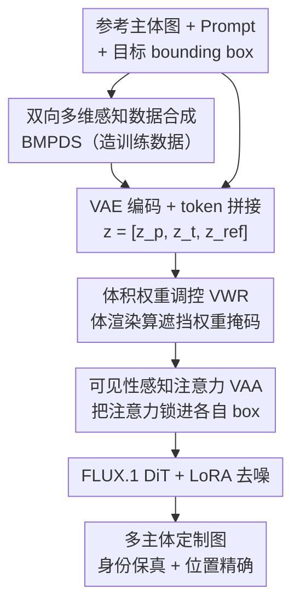

# PositionIC: Unified Position and Identity Consistency for Image Customization

**会议**: CVPR 2026  
**论文**: [CVF Open Access](https://openaccess.thecvf.com/content/CVPR2026/html/Hu_PositionIC_Unified_Position_and_Identity_Consistency_for_Image_Customization_CVPR_2026_paper.html)  
**代码**: https://github.com/MeiGenAI/PositionIC  
**领域**: 扩散模型 / 图像定制  
**关键词**: 主体定制、位置控制、身份一致性、可见性注意力、体渲染

## 一句话总结
PositionIC 用一条自动数据合成管线（BMPDS）造出带位置标注的多主体配对数据，再用一个 NeRF 体渲染启发的「可见性感知注意力」把每个参考主体的注意力范围锁死在指定 bounding box 内，从而在不加任何训练参数和推理开销的前提下，让多主体定制生成同时拿到 SOTA 的身份保真度和空间可控性。

## 研究背景与动机

**领域现状**：主体驱动图像定制（subject-driven customization）这几年在「身份保真」上进步很大——给一张参考物体图，模型能把它的外观较好地搬进新场景，主流做法是把参考图编码成 token 拼接进扩散 Transformer（DiT），靠全局注意力让目标区域去「吸」参考特征。

**现有痛点**：但实际落地（电商商品展示、绘本插图、室内设计）真正缺的是另一个维度——细粒度的空间控制：主体放在哪、多大、谁挡谁、彼此怎么排布。现有方法只擅长决定「生成什么」，却很难精确控制「每个主体出现在哪、怎么出现」。少数尝试做布局控制的工作（如 GLIGEN、MS-Diffusion）又陷在一个 trade-off 里：要么位置精确但身份糊了，要么身份保住了但位置摆不准。

**核心矛盾**：作者把根因拆成两条互相耦合的瓶颈。其一是**数据瓶颈**——几乎没有大规模、带显式多主体位置标注的配对数据集，模型没法学会空间推理；现有开源数据（如 Subject200K）用拼贴图（diptych）造对，分辨率低、还会出现物体不一致。其二是**机制瓶颈**——DiT 里普遍用的全局注意力会把「语义身份」和「空间布局」纠缠在一起，一个 token 能看到全图所有 token，自然无法做到「这个主体只该出现在这个框里、还要懂遮挡」。

**本文目标**：把任务重新定义为「既要身份保真、又要 instance 级空间可控」的主体定制，并同时打通数据和机制两条瓶颈。

**核心 idea**：数据上，用一条双向、多维感知的自动合成 + 过滤管线造出高保真带位置标注的多主体数据；机制上，借 NeRF 体渲染的思想把「谁挡谁」算成一张物理上合理的注意力权重掩码，再用它把每个参考主体的注意力视野「关」进指定区域——用注意力屏蔽来解耦布局和身份，而不是去额外训一套控制网络。

## 方法详解

### 整体框架
PositionIC 由两块紧耦合的组件组成：一条**数据合成管线 BMPDS** 负责造训练数据，一个**布局感知的扩散框架** 负责在生成时做位置控制。推理时输入是若干张参考主体图、一段文本 prompt、以及每个主体的目标 bounding box；输出是把这些主体按指定位置、指定遮挡关系合成进同一张图、且各自外观都保真的目标图像。

生成框架基于 FLUX.1-dev（沿用 UNO 的初始化与 UnoPE 位置编码扩展），训练一个 rank=512 的 LoRA。参考图经 VAE 编码成 $z_{ref}$，与文本嵌入 $z_p$、噪声潜变量 $z_t$ 拼接成 DiT 的输入 token，过 N 层 double-stream + N 层 single-stream Transformer。关键在于：每个主体的 bounding box 先经体渲染算出一张「体积权重掩码」，这张掩码以 **可见性感知注意力（VAA）** 的形式注入到每一层注意力计算里，强制每个参考主体只能影响它自己被分配到的区域、且参考主体之间互相屏蔽。

### 关键设计

**1. BMPDS：用双向生成 + 多维过滤造出带位置标注的多主体配对数据**

这一块直接打数据瓶颈：现有数据要么没位置标注、要么分辨率低还物体不一致，模型根本没素材学空间推理。BMPDS（Bidirectional Multi-dimensional Perception Data Synthesis）用「分层生成 + 分层筛选」逐步把数据质量拔上去，分三阶段：(1) 仿 UNO 先用 Subject200K 训一个弱的定制模型，把它的输出分割后丢进 Flux-Outpainting 模型、随机摆位以注入空间控制信号，过滤后得到的高保真配对再去训一个更强的 PositionIC-Single 模型；(2) **正向生成**多主体对——用 PositionIC-Single 独立处理 Subject200K 样本，再随机配对、定位、outpaint 成多主体配对；(3) **反向生成**——先用 LLM 写多主体文本描述，用 Flux 生成高分辨率成品图，再检测裁剪出各物体、分别过 PositionIC-Single 反推回参考图，得到高分辨率多主体配对。正反两个方向互补，既扩多样性又压主体漂移（subject drift），最终得到 PIC-400K。

但合成数据有残留噪声，于是配了一套**多维感知过滤器**：作者发现 MLLM 直接看图对比细粒度一致性其实很弱，所以不直接把图对喂给 MLLM，而是分三个粒度层级打分——先用 CLIP-I、DINO 的视觉相似度 $s_v$ 滤掉明显不一致的；再把两个主体图过 MLLM（如 GPT-4o）拿语义相似度 $s_{vlm}$；并辅以 caption 维度排序。多个维度的排名取平均后只留 Top 子集，把 PIC-400K 精炼成 PIC-98K。消融显示 PIC-400K 已显著超过 Subject200K，而过滤后的 PIC-98K 分数最高——证明「造得多」不如「造得准」，过滤这一步才是质量的关键。

**2. 体积权重调控（VWR）：把「谁挡谁」算成一张物理上合理的注意力权重掩码**

光有 bounding box 还不够——多个主体在画布上重叠时，模型需要知道前后遮挡关系，否则会糊成一团或丢主体。作者的巧思是：把「在 2D 画布上控制各物体生成位置」看成一台正交虚拟相机拍下的合成图，于是可以借体渲染（Volume Rendering）来建模遮挡。类比 NeRF，沿相机光线从远界 $t_f$ 到近界 $t_n$ 的累积颜色为 $C(r)=\int_{t_n}^{t_f} T(t)\,\sigma(r(t))\,c(r(t),d)\,dt$，其中透过率 $T(t)=\exp(-\int_{t_n}^{t}\sigma(r(s))\,ds)$，离散化后 $\hat{C}(r)=\sum_{i=1}^{N} T_i(1-\exp(-\sigma_i\delta_i))c_i$。

VWR 把这套渲染权重搬来当注意力掩码用：给定前景掩码 $M_i$ 和采样间距 $\delta$，第 $n$ 个距离层级的体积权重为

$$\hat{M}_n = \exp\!\Big(-\sum_{j=1}^{n-1}\sigma_i\delta\Big)\big(1-\exp(-\sigma_n\delta)\big)\,M_n\,\hat{M}_{n-1}$$

和原始体渲染不同的是，这里 $\hat{M}_n$ 表示「图像在注意力计算时对参考图各区域应该投放多少注意力」，而且用的是**语义密度** $\sigma_i$ 而非真实体密度——即用密度的远近来编码物体间的语义/遮挡交互。直观说：靠「近」的主体权重大、靠「后」被遮的主体在重叠区权重被压低，于是重叠区的注意力被分配给该露出来的那个主体。消融里把重叠区权重直接设成 1（关掉 VWR），模型就理解不了「玩偶在跑车后面」这种前后关系，甚至因概念混淆漏画物体——说明 VWR 正是解遮挡的那把钥匙。

**3. 可见性感知注意力（VAA）：用 VWR 掩码把每个主体的注意力视野锁进自己的框，零额外参数解耦布局与身份**

有了 VWR 算出的权重掩码，怎么真正作用到生成上？作者观察到一个核心量叫**注意力累积（attention accumulation）**：目标区域和参考图对应区域之间注意力越强、物体保真度越高。但一旦用拼接法做多主体，注意力图会膨胀到近三倍大小，token 反而更难聚焦到该聚焦的区域。VAA 的做法是构造一张注意力掩码 $M$ 直接屏蔽掉「每个 token 本不该看的区域」：参考图之间互相不可见 $M(z^i_{ref}, z^j_{ref})=0\ (i\neq j)$；某参考主体对噪声 token 的可见性正是它的体积权重 $M(z^i_{ref}, z^n_t)=\hat{M}_i$（即只有 box 内、且没被遮挡的区域可见）；其余位置 $M(\text{other})=1$。掩码以加性 log 形式进 softmax：

$$\text{Attention} = \text{Softmax}\!\Big(\frac{QK^\top}{\sqrt{d}} + \log M\Big)\cdot V$$

被屏蔽处 $\log M\to-\infty$ 注意力归零。这一设计的精妙在于：它把「空间布局」完全交给掩码、把「语义身份」留给参考特征本身，从机制上解耦了二者，既不像全局注意力那样纠缠，又**不引入任何额外训练参数或推理开销**（只是改了注意力的可见性）——这正是它能同时拿下位置精度和身份一致、跳出旧方法 trade-off 的根本原因。

### 损失函数 / 训练策略
基于 FLUX.1-dev 训 rank=512 LoRA，8×A100、总 batch 128、学习率 $10^{-5}$ 余弦 warmup。两阶段课程：先在 44k 单主体对上训 10k 步得到单主体模型，再在 54k 多主体对上续训 8k 步，把多主体生成能力扩到已有模型上。

## 实验关键数据

### 主实验
DreamBench 上的单主体与多主体定制（CLIP-I / DINO 衡量身份相似度，CLIP-T 衡量文本保真）：

| 任务 | 方法 | CLIP-I↑ | CLIP-T↑ | DINO↑ |
|------|------|---------|---------|-------|
| 单主体 | UNO | 0.840 | 0.253 | 0.814 |
| 单主体 | DreamO | 0.835 | 0.258 | 0.802 |
| 单主体 | **PositionIC** | **0.846** | **0.269** | **0.823** |
| 多主体 | UNO | 0.781 | 0.279 | 0.707 |
| 多主体 | DreamO | 0.779 | 0.273 | 0.698 |
| 多主体 | **PositionIC** | **0.819** | 0.279 | **0.771** |

单主体三项指标全面第一；多主体在 CLIP-I / DINO 上大幅领先（CLIP-I 0.819 vs UNO 0.781，DINO 0.771 vs 0.707），CLIP-T 与最强方法持平——说明它在多主体这个更难的场景里身份保真优势尤其明显。

PositionIC-Bench（作者自建，252 单主体 + 296 多主体样本，用 VisionR1 检测框算 mIoU 与 AP）上的空间可控性：

| 方法 | 单主体 IoU↑ | 单主体 AP↑ | 多主体 mIoU↑ | 多主体 AP↑ |
|------|------------|-----------|-------------|-----------|
| MS-Diffusion | 0.501 | 0.097 | 0.421 | 0.028 |
| Instance-Diffusion | 0.789 | 0.593 | 0.799 | 0.497 |
| GLIGEN | 0.808 | 0.632 | 0.825 | 0.628 |
| **PositionIC** | **0.828** | 0.628 | **0.860** | **0.701** |

单主体 IoU 领先（0.828）、AP 与 GLIGEN 持平；多主体在 mIoU 和 AP 上都超过所有基线（mIoU 0.860、AP 0.701 vs GLIGEN 0.628），AP50 更是到 0.939。值得注意 MS-Diffusion / RPF 这类方法在多主体下空间精度直接崩塌（AP < 0.03），印证「空间精度 vs 身份」的旧 trade-off。

### 消融实验
| 配置 | 现象 | 说明 |
|------|------|------|
| Subject200K（无位置注入） | 分数最低 | 旧拼贴数据，低分辨率 + 不一致 |
| PIC-400K | 显著高于 Subject200K | 双向合成扩了数据规模与多样性 |
| PIC-98K（过滤后） | 分数最高 | 多维过滤把质量再拔高，"准"胜过"多" |
| w/o VWR（重叠区权重设 1） | 理解不了前后遮挡、概念混淆漏画物体 | VWR 是解遮挡关键 |
| Full（VWR + VAA） | 正确处理重叠 / 遮挡 | 完整模型 |

数据过滤器与人工标注的一致性（百分比一致 Acc.）平均达 **0.89**，说明这套 CLIP/DINO + MLLM 多维过滤确实可靠。

### 关键发现
- **过滤比规模更值钱**：PIC-98K（精滤）> PIC-400K（全量）> Subject200K，证明 BMPDS 的价值主要在多维过滤这一步，盲目堆数据反而被噪声拖累。
- **VWR 专治多主体遮挡**：去掉 VWR 后，「A 放在 B 后面」这类指令直接失效、还会因概念混淆漏画主体；它是从崩塌到可用的分水岭。
- **多主体是优势放大器**：单主体时各方法差距不大，但到多主体（更难）PositionIC 的身份一致性和空间精度优势同时被显著拉开，正好打中现有方法的痛点。

## 亮点与洞察
- **把 NeRF 体渲染搬进注意力掩码**：用语义密度替代体密度、用体积权重表达「谁该被注意、谁被遮挡」，这是个很跨界的迁移——把 3D 渲染里成熟的遮挡建模直接变成 2D 生成里的注意力调控，思路非常巧。
- **零成本解耦布局与身份**：VAA 只改注意力可见性、不加任何参数和推理开销，却把困扰一众方法的「位置 vs 身份」trade-off 直接化解，是「用约束而非用新模块解决问题」的典范。
- **双向数据合成 + 多维过滤可复用**：正向（单→多）+ 反向（文本→图→裁剪→反推）互补造数据、再用 CLIP/DINO 粗筛 + MLLM 精筛分粒度过滤，这套范式可迁移到任何缺标注配对数据的可控生成任务。
- **把抽象指标讲清**：attention accumulation（目标区与参考区注意力强度决定保真度）这个观察，给「为什么拼接法多主体会糊」提供了直白解释。

## 局限与展望
- **依赖 bounding box 作为空间信号**：位置控制建立在矩形框上，对非矩形、不规则布局或更精细的姿态/朝向控制可能力不从心。
- **数据管线重度依赖外部大模型**：BMPDS 链路里 Flux、GPT-4o、CLIP/DINO、检测裁剪环环相扣，任一环节的偏差都会传进训练数据，且合成数据与真实分布的差距未充分讨论。
- **语义密度 $\sigma_i$ 的设定**：VWR 里 $\sigma_i$ 的具体取法被放进 appendix（正文未展开），它对遮挡建模影响很大，鲁棒性与敏感性缺乏正文分析。⚠️ 具体设置以原文附录为准。
- **评测部分自定**：PositionIC-Bench 是作者自建基准，虽填补了「带位置标注」的空白，但用自家 benchmark 报 SOTA 仍需第三方复现佐证；且作者也提到不同物体尺寸会影响相似度分数。

## 相关工作与启发
- **vs GLIGEN**：GLIGEN 把 Fourier 位置嵌入当 grounding token 注入，PositionIC 改用体渲染权重掩码做注意力屏蔽——后者在多主体 mIoU/AP 上全面反超（0.860/0.701 vs 0.825/0.628），且不像 grounding token 那样需要额外可训模块。
- **vs MS-Diffusion / GroundingBooth**：它们靠 grounding resampler / 特征提取模块把空间约束塞进注意力层，仍受「视觉与位置不一致」困扰；PositionIC 用掩码从机制上解耦，多主体下空间精度不崩塌。
- **vs UNO / DreamO（纯主体驱动）**：这类方法身份保真强但没有显式位置控制，PositionIC 在沿用其拼接范式的基础上加可见性掩码，既保住身份又补上空间可控，是「自然扩展而非另起炉灶」的定位。

## 评分
- 新颖性: ⭐⭐⭐⭐⭐ 把 NeRF 体渲染遮挡建模迁移成零成本注意力掩码、并配双向数据合成管线，跨界且自洽
- 实验充分度: ⭐⭐⭐⭐ 主实验 + 空间基准 + 数据/VWR 消融 + 用户研究都齐，但关键基准自建、$\sigma_i$ 设定与部分细节放进附录
- 写作质量: ⭐⭐⭐⭐ 动机—瓶颈—方案的逻辑链清晰，公式与图配合到位；个别符号（如 $s_{vlm}$、$\sigma_i$）正文交代略简
- 价值: ⭐⭐⭐⭐⭐ 同时解决数据与机制两大瓶颈，对电商/绘本/设计等真实可控生成场景实用价值高，代码与数据开源

<!-- RELATED:START -->

## 相关论文

- [\[CVPR 2026\] Scaling Multi-Identity Consistency for Image Customization via Multi-to-Multi Matching Paradigm](scaling_multi-identity_consistency_for_image_customization_via_multi-to-multi_ma.md)
- [\[CVPR 2026\] Resolving the Identity Crisis in Text-to-Image Generation](resolving_the_identity_crisis_in_text-to-image_generation.md)
- [\[CVPR 2026\] Image Diffusion Preview with Consistency Solver](image_diffusion_preview_with_consistency_solver.md)
- [\[CVPR 2026\] PureCC: Pure Learning for Text-to-Image Concept Customization](purecc_pure_learning_for_text-to-image_concept_customization.md)
- [\[CVPR 2026\] Unified Customized Generation by Disentangled Reward Modeling](unified_customized_generation_by_disentangled_reward_modeling.md)

<!-- RELATED:END -->
