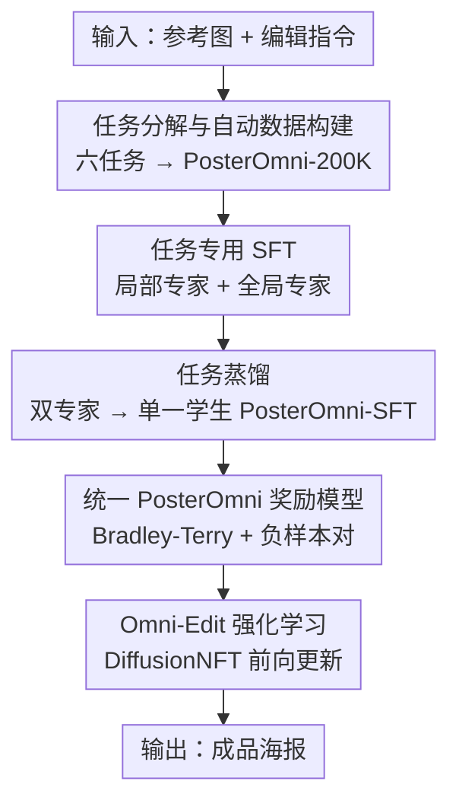

# PosterOmni: Generalized Artistic Poster Creation via Task Distillation and Unified Reward Feedback

**会议**: CVPR 2026  
**论文**: [CVF Open Access](https://openaccess.thecvf.com/content/CVPR2026/html/Chen_PosterOmni_Generalized_Artistic_Poster_Creation_via_Task_Distillation_and_Unified_CVPR_2026_paper.html)  
**代码**: 项目页 https://ephemeral182.github.io/PosterOmni/  
**领域**: 图像生成 / 扩散模型  
**关键词**: 图像到海报生成、任务蒸馏、奖励反馈、扩散强化学习、统一模型

## 一句话总结
PosterOmni 把"图生海报"拆成局部编辑（扩展/填充/缩放/身份保持）与全局创作（版式迁移/风格迁移）两类共六个任务，先训局部与全局两个专家、再用任务蒸馏把它们融进单一学生模型，最后用统一奖励模型 + DiffusionNFT 强化学习对齐审美与指令，单模型在自建 PosterOmni-Bench 上超过所有开源编辑模型、逼近甚至超过 Seedream-4.0 等闭源商业系统。

## 研究背景与动机
**领域现状**：真实海报创作大多是"图像驱动"——设计师从已有照片、产品图或模板出发，做局部修改并补齐文字、版式、风格。现有开源编辑模型（Qwen-Image-Edit、FLUX.1 Kontext、ICEdit）擅长自然图像编辑（换背景、去物体），闭源商业系统（Seedream-3/4、GPT-Image、Gemini-2.5）能处理复杂海报但贵且不可控。

**现有痛点**：把通用编辑模型直接用到海报上，会在缩放、身份保持生成、版式驱动全局合成这些海报特有任务上翻车——版式错位、文字扭曲、审美崩坏。目前没有任何开放框架专门针对"多任务图生海报"。

**核心矛盾**：海报创作天然耦合两种诉求——一类是**像素级精确**的局部编辑（要保住具体视觉实体），另一类是**概念级理解**的全局创作（要读懂版式、风格这类抽象设计意图）。两者放进一个模型混合训练会互相干扰：低层纠错和高层构图的目标互相拉扯。

**本文目标**：用一个统一模型同时把六个海报任务做好，既保证局部精度又保留全局构图与审美。

**切入角度**：与以往"把所有编辑任务混训"不同，作者从**任务中心视角**重新拆解图生海报，明确分成局部编辑与全局创作两组，让各组先各自训成专家、再融合，避免一开始就互相干扰。

**核心 idea**：用"任务蒸馏 + 统一奖励反馈"把两个专家的能力蒸进一个轻量学生，并用面向海报的强化学习对齐人类审美偏好——而不是从零训一个大杂烩模型。

## 方法详解

### 整体框架
PosterOmni 不是从零训练，而是把一个强开源编辑模型（Qwen-Image-Edit [2509]）改造成海报专家。整条管线分四步：先用全自动数据管线造出覆盖六任务的 PosterOmni-200K；再把六任务分成局部编辑与全局创作两组、各训一个专家（LoRA SFT）；然后用任务蒸馏把两个专家融进单一学生骨干 PosterOmni-SFT；最后训一个统一奖励模型并用 DiffusionNFT 做 Omni-Edit 强化学习，对齐审美与指令精度。评测则在自建的 PosterOmni-Bench 上做。

### 关键设计

**1. 任务分解 + 全自动数据构建：把"图生海报"落成可训练的六任务配对数据**

痛点是没有现成的多任务图生海报数据。作者先从任务中心视角把图生海报拆成六个代表任务——局部编辑组的扩展、填充、缩放、身份驱动生成，与全局创作组的风格驱动、版式驱动生成，前者强调局部精度与实体保真，后者强调对抽象设计概念的整体重绎。再造一条全自动管线：用 GPT 与 Qwen3 从实体库（产品/食物/活动…）和风格库（极简/复古/Y2K…）采样组合生成提示词，用 Qwen-Image 等渲染多张候选图，经早期过滤去掉主体缺失、文字损坏、版式崩塌的样本；随后做多模态过滤——训练集用 PaddleOCR + Jina-clip-v2 校验文字正确性与图文一致，基准集更严，额外用 Gemini-2.5-Flash 评任务适配性、用 SAM-2 做分割细化生成掩码监督。每个任务用专门子管线落地（扩展/填充用 SAM2 掩码，缩放用 BrushNet，身份驱动用 PaddleDet + 强编辑模型，版式/风格驱动靠提示控制重渲染），最终得到 20 万+配对样本的 PosterOmni-200K，覆盖产品/食物/活动/自然/教育/娱乐六大主题。

**2. 任务蒸馏：把局部专家与全局专家融进单一学生，避免参数级融合的互相干扰**

痛点是局部编辑与全局创作目标差异大，混训会互相干扰，而直接在参数层面合并 LoRA（线性相加、SVD 融合、ZipLoRA 压缩）会因两者潜空间差异过大导致严重退化。作者先分两组各训一个专家 $E_{local}$、$E_{global}$（rank-128 LoRA，流匹配损失 $\mathcal{L}_{SFT}=\mathbb{E}\,[\,\lVert v_t-v_\theta(x_t,t,c_t)\rVert_2^2\,]$，并混入纯文字数据保持字符级渲染），再设计任务蒸馏：让一个新学生在两个专家的联合监督下学习，逐步吸收各自关键知识而非合并参数。总目标为
$$\mathcal{L}_{total}=\underbrace{\mathbb{E}\,[\,\lVert v_t-v_\theta\rVert_2^2\,]}_{\text{文字渲染辅助损失}}+\lambda_E\,\underbrace{\mathbb{E}\,[\,\lVert v_\theta-v_E\rVert_2^2\,]}_{\text{任务蒸馏损失}}$$
其中 $v_E$ 是对应任务专家的输出速度场，$\lambda_E=1$。这样每个专家在自己领域专精、互不破坏，学生收到一致的教师信号收敛更快，且解耦的专家结构省去了繁琐的任务平衡——学生（half-rank LoRA 64）既继承局部专家的精度又继承全局专家的生成推理能力。

**3. 统一 PosterOmni 奖励模型：用一个奖励同时学审美偏好与任务保真**

痛点是 SFT 容易学到捷径、泛化差、缺高层审美理解。作者训一个统一奖励模型 $R_{omni}$（Qwen3-VL 编码器 + 轻量 MLP 头），从 SFT 模型的成对输出构建偏好数据，由 Gemini-2.5-Pro 初筛、人工挑出更具审美与任务保真的那张。一个巧点是**负样本对策略**：把输入图本身当作 rejected、生成结果当作 preferred，逼模型学会"什么是真正完成了图生海报"。每个样本是四元组 $(I_{in},p_{t,edit},I_{chosen},I_{rejected})$，偏好对齐用 Bradley-Terry 形式
$$\mathcal{L}_{BT}=-\mathbb{E}\big[\log\sigma\big(r_\theta(I_{chosen})-r_\theta(I_{rejected})\big)\big]$$
由于成对差异往往同时来自全局审美（文字渲染、配色）与指令/任务遵从两个互补维度，$R_{omni}$ 得以联合学到审美与任务两类质量信号，既能给通用审美奖励、也能给任务专属奖励。

**4. Omni-Edit 强化学习：把奖励信号直接注入前向扩散，对齐审美而不破坏一致性**

痛点是常规策略梯度对扩散模型不稳。作者把 DiffusionNFT 扩展到图生海报：它在前向过程上优化策略（而非 GRPO 用的反向轨迹），梯度更稳、可连续调制奖励。与 UniWorld-V2（放大多模态 LLM、用 logits 当通用编辑奖励）不同，本文把 DiffusionNFT 与 $R_{omni}$ 的任务专属分数耦合，联合优化局部与全局并改进海报专属审美。策略损失为
$$\mathcal{L}_{RL}=\mathbb{E}_{c,t}\big[\,r\lVert v^{+}_\theta-v\rVert_2^2+(1-r)\lVert v^{-}_\theta-v\rVert_2^2\,\big]$$
其中 $r\in[0,1]$ 是 $R_{omni}$ 归一化后的奖励，正/负策略定义为 $v^{+}_\theta=(1-\beta)v_{old}+\beta v_\theta$、$v^{-}_\theta=(1+\beta)v_{old}-\beta v_\theta$，$\beta$ 控制更新强度。这个对比目标把模型速度场拉向高奖励、推离低奖励，同时保持扩散一致性。该阶段只在 PosterOmni-SFT 上更新轻量 rank-32 LoRA、训 500 步。

### 损失函数 / 训练策略
四阶段分别用不同 LoRA 秩：局部/全局专家 rank-128（lr=1e-4，分别 100K/50K 步），任务蒸馏学生 rank-64（lr=2e-4，4000 步，$\lambda_E=1$），奖励模型 rank-64（lr=1e-4，6000 步），Omni-Edit RL rank-32（500 步）。各阶段均用 AdamW；专家训练样本在各任务类别内随机采样以保持平衡；全程混入纯文字渲染辅助损失防止字符级质量退化。

## 实验关键数据

### 主实验
评测在 PosterOmni-Bench 上进行：540 条中文提示（cn）+ 480 条英文提示（en），均匀覆盖六主题，含单图与多图场景，用 Gemini-2.5-Pro 在 1–5 分上对审美与任务完成度加权打分。下表为各任务总分（en / cn，⚠️ 以原文为准）。

| 模型 | 扩展 | 填充 | 缩放 | 身份一致 | 版式驱动 | 风格驱动 | 总分 ↑ |
|------|------|------|------|----------|----------|----------|--------|
| Qwen-Image-Edit [2509]（基线，开源） | 4.28/4.24 | 3.95/3.79 | 3.40/3.54 | 3.06/3.37 | 3.44/2.97 | 2.91/2.83 | 3.51/3.46 |
| UniWorld-V2-Qwen（开源） | 4.25/4.22 | 3.57/3.18 | 3.07/3.23 | 2.87/3.20 | 3.66/3.79 | 3.14/2.85 | 3.42/3.41 |
| Seedream-4.0（闭源商业） | 4.41/4.57 | 4.44/4.64 | 4.00/3.69 | 4.53/4.62 | 4.05/4.22 | 4.23/4.31 | 4.28/4.34 |
| **PosterOmni（本文）** | **4.76/4.72** | **4.69/4.77** | 3.97/3.81 | 3.98/4.23 | 4.20/4.35 | 3.99/4.36 | **4.27/4.37** |
| vs. 基线 | +0.48/+0.48 | +0.74/+0.98 | +0.57/+0.27 | +0.92/+0.86 | +0.76/+1.38 | +1.08/+1.53 | +0.76/+0.91 |

PosterOmni 总分超过所有开源系统，与最新闭源 Seedream-4.0 持平甚至在中文集（4.37 vs 4.34）反超，相对自己的基线总分提升 +0.76/+0.91；风格驱动这类纯全局创作任务提升最大（+1.08/+1.53）。

### 消融实验
任务蒸馏消融（局部 extend / 全局 layout 任务平均分）：

| 配置 | 局部 / 全局 ↑ | 说明 |
|------|---------------|------|
| Qwen-Image-Edit 基线 | 4.28 / 3.44 | 跨任务泛化弱 |
| (i) 混合训练 (L+G) | 4.33 / 3.72 | 仍受低层编辑与高层构图干扰 |
| (ii) 仅局部专家 | 4.48 / 2.79 | 局部强、全局崩 |
| (iii) 仅全局专家 | 3.35 / 3.96 | 全局强、局部崩 |
| (iv) 任务蒸馏 | 4.39 / 3.82 | 两端都稳 |
| (v) (iv)+文字辅助损失（PosterOmni-SFT） | 4.43 / 3.89 | 文字清晰度最佳 |

统一奖励反馈消融：

| 配置 | 局部 / 全局 ↑ | 说明 |
|------|---------------|------|
| PosterOmni-SFT | 4.43 / 3.89 | RL 前基础 |
| (i) + VLM 奖励 $R_v$ + Omni-Edit RL | 4.58 / 3.97 | 用 VLM 当奖励 |
| (ii) + 统一 $R_{omni}$ + FlowGRPO | 4.65 / 4.08 | 换 RL 策略 |
| (iii) + 统一 $R_{omni}$ + Omni-Edit RL（本文） | **4.76 / 4.20** | 奖励+RL 双匹配最佳 |

### 关键发现
- 单专家方案验证了"互相干扰"假设：仅局部专家把全局分压到 2.79，仅全局专家把局部分压到 3.35；任务蒸馏让两端同时稳住，证明问题确实出在混训干扰而非容量。
- 文字渲染辅助损失是隐形功臣：去掉它文字清晰度变差（4.39/3.82 → 加回 4.43/3.89），说明专精训练会侵蚀字符级渲染，需要专门维持。
- 奖励模型与 RL 策略要"配套"：统一 $R_{omni}$ 配 Omni-Edit RL（4.76/4.20）优于配 FlowGRPO（4.65/4.08），也优于用通用 VLM 奖励，说明任务专属奖励 + 前向扩散更新的组合才是增益主力。

## 亮点与洞察
- **负样本对策略很巧**：把输入图直接当作 rejected，等于免费给奖励模型注入"还没完成编辑"的负例，逼它学会区分"改到位 vs 没改"，比单纯人工成对标注更省且更有针对性。
- **任务蒸馏替代参数融合**：当多个 LoRA 专家潜空间差异大时，与其在参数层硬合并（SVD/ZipLoRA 会退化），不如让学生在功能层面蒸馏——这个"特征级融合优于参数级融合"的结论可迁移到任何多专家合并场景。
- **奖励-RL 配套思想**：把任务专属奖励直接注入 DiffusionNFT 的前向目标，而不是套通用 VLM logits，提示我们做扩散 RL 时奖励信号的语义粒度要和优化目标匹配。

## 局限与展望
- 评测高度依赖 Gemini-2.5-Pro 作为打分器，VLM 评审本身可能有偏，缺人类大规模主观评测交叉验证。
- 整条管线含数据构建、双专家、蒸馏、奖励、RL 五步，工程链路长、复现成本高；论文把不少数据构建与理论细节留在附录，正文难以完整还原。
- 缩放（rescaling）任务上仍略低于 Seedream-4.0（3.97/3.81 vs 4.00/3.69 的 en 端接近、cn 端略低），几何重排类任务可能仍是短板。
- 框架强绑定 Qwen-Image-Edit 基座与多个外部工具（SAM-2、BrushNet、PaddleDet/OCR、Gemini），换基座或换语种时的可迁移性未充分验证。

## 相关工作与启发
- **vs Qwen-Image-Edit / FLUX.1 Kontext / ICEdit（通用编辑模型）**：它们做通用自然图像编辑，本文专攻多任务图生海报；区别在于本文显式按局部/全局拆任务并用蒸馏+RL 改造基座，海报专属任务（缩放、版式驱动）上大幅领先。
- **vs Seedream-4.0 / GPT-Image / Gemini（闭源商业系统）**：它们效果强但闭源、昂贵；本文以开源基座 + 统一管线逼近甚至反超其总分，证明开放方案可达商业级海报质量。
- **vs UniWorld-V2**：它放大多模态 LLM、用通用 logits 当编辑奖励；本文用任务专属 $R_{omni}$ 耦合 DiffusionNFT，奖励语义更贴海报、消融中持续更高。
- **vs PosterMaker / DreamPoster / CreaiDesign（图生海报）**：它们也做图到海报，但不支持版式迁移、缩放等多样任务；本文首次统一六任务并建立配套基准 PosterOmni-Bench。

## 评分
- 新颖性: ⭐⭐⭐⭐ 任务蒸馏 + 统一奖励 + DiffusionNFT 的组合面向海报是新颖整合，但各单元（蒸馏、Bradley-Terry、DiffusionNFT）多为已有技术的工程化拼装。
- 实验充分度: ⭐⭐⭐⭐ 六任务、中英双基准、两组消融较完整，但缺人类主观评测、且评审器单一。
- 写作质量: ⭐⭐⭐⭐ 任务分解与四阶段叙述清晰，公式完整；大量数据构建与理论细节压在附录。
- 价值: ⭐⭐⭐⭐ 给出开源可达商业级海报生成的完整配方与基准，实用价值高。

<!-- RELATED:START -->

## 相关论文

- [\[CVPR 2026\] FontCrafter: High-Fidelity Element-Driven Artistic Font Creation with Visual In-Context Generation](fontcrafter_high-fidelity_element-driven_artistic_font_creation_with_visual_in-c.md)
- [\[CVPR 2026\] Unified Customized Generation by Disentangled Reward Modeling](unified_customized_generation_by_disentangled_reward_modeling.md)
- [\[CVPR 2026\] TAG-MoE: Task-Aware Gating for Unified Generative Mixture-of-Experts](tag-moe_task-aware_gating_for_unified_generative_mixture-of-experts.md)
- [\[CVPR 2026\] SimplePoster: A Simple Baseline for Product Poster Generation](simpleposter_a_simple_baseline_for_product_poster_generation.md)
- [\[CVPR 2026\] ThinkGen: Generalized Thinking for Visual Generation](thinkgen_generalized_thinking_for_visual_generation.md)

<!-- RELATED:END -->
