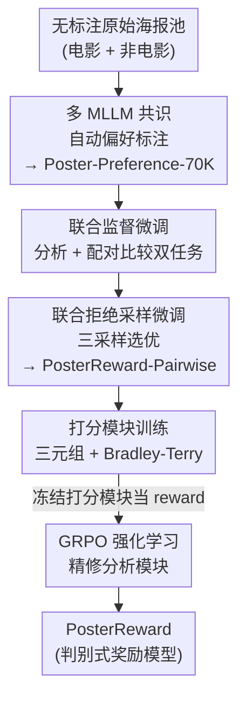

# PosterReward: Unlocking Accurate Evaluation for High-Quality Graphic Design Generation

**会议**: CVPR 2026  
**论文**: [CVF Open Access](https://openaccess.thecvf.com/content/CVPR2026/html/Lai_PosterReward_Unlocking_Accurate_Evaluation_for_High-Quality_Graphic_Design_Generation_CVPR_2026_paper.html)  
**代码**: [项目页](https://alexlai2860.github.io/PosterReward/)  
**领域**: 图像生成 / 奖励模型  
**关键词**: 海报生成、奖励模型、图形设计评估、AI 偏好数据、级联训练

## 一句话总结
PosterReward 用多个 MLLM 共识自动构建了 70K 海报偏好数据集，再用「图像分析驱动」的四阶段级联训练，得到首个专门评估海报/图形设计生成质量的奖励模型，在自建及公开偏好基准上把准确率从基线的 40%~53% 拉到 86%。

## 研究背景与动机

**领域现状**：随着 Flux、Seedream、Qwen-Image 等文生图模型文字渲染能力突飞猛进，端到端生成海报这类图形设计内容已经越来越可行。要做后训练（如 Flow-GRPO、Pref-GRPO、Diffusion-NFT）持续提升生成质量，就需要一个能打分的奖励模型来提供监督信号。

**现有痛点**：现有奖励模型（HPSv3、UnifiedReward 等）主要面向「通用图像审美偏好」，盯的是全局美感，却**忽略了排版（typography）和版式（layout）这两个海报最关键的维度**。一张好海报不仅要图好看，还要文字渲染准确、版面构图合理。直接拿通用奖励模型评海报，在作者自建的高质量海报基准 PosterRewardBench-Advanced 上，多数基线准确率只有 41%~53%，几乎接近随机。

**核心矛盾**：根子在数据——领域专用的海报偏好数据极度稀缺。在最大的公开偏好集 HPDv3 里，design 类只占 9.9%，远低于人物、建筑、艺术。没有专门的海报偏好数据，就训不出专门的海报评估器，也卡住了奖励驱动的后训练。

**本文目标**：(1) 低成本造出可靠的海报偏好数据；(2) 训出一个能**联合**判断「基础视觉质量、AI 伪影、文字准确性、提示词遵循、审美价值」五个维度并权衡它们的奖励模型；(3) 给海报评估和海报生成各立一个基准。

**切入角度**：作者指出海报偏好不能简单地对五个维度做加权平均——强奖励模型必须**联合分析这些维度并推理它们之间的权衡**。于是核心思路是「用图像分析（image analysis）当中枢」，让一个会写多维分析文本的模块去喂养打分模块。

**核心 idea**：用「多 MLLM 共识」自动标注偏好数据替代人工，再用「分析模块产出文本推理 → 打分模块据此打标量分」的两阶段判别式结构，并把判别式与生成式两类奖励模型统一进一条级联训练管线协同优化。

## 方法详解

### 整体框架

PosterReward 由两条线组成：**数据线**（自动造 70K 海报偏好对）和**模型线**（四阶段级联训练出奖励模型）。

数据线针对电影海报和非电影海报设计两条独立的过滤/配对流程，最后汇入统一的多模型验证，得到 Poster-Preference-70K。模型线则同时训练两类奖励模型——判别式的 **PosterReward**（输入图+提示+分析文本，输出标量分）和生成式的 **PosterReward-Pairwise**（输入两张图，先给 Yes/No 判断再给 CoT 推理）——并把二者用四个串行阶段（联合 SFT → 联合拒绝采样 → 打分模块训练 → 强化学习）拧成一条以「图像分析」为核心的级联管线，让两类模型互相增益。

### 关键设计

**1. 多 MLLM 共识的自动偏好数据流水线：用 AI 共识替代人工标注**

海报偏好数据稀缺、人工标注又慢又贵，是整个方向的瓶颈。作者搭了一条全自动流水线，从无标注原图里挤出可靠偏好对。它对两类数据分别处理：**电影海报**因为人像多、审美与 HPSv3 契合，先用 HPSv3 打分，再用 Kendall's W（六轮排名的一致性系数）筛出最稳定的 30K 提示组（450K 潜在对），经一个轻量闭源排序器六轮排序、保留至少五轮顺序一致的对，得到 164K 候选；**非电影海报**（Qwen-Image-Lightning 生成）则先保留同尺寸对（214K），再用 CLIP（语义相似）和 DINOv3（结构相似）双重过滤、取「DINOv3 top-15K ∪ CLIP top-25K」拿到 36K 高方差对，再补 36K 张 Seedream 4.0 高质量海报凑成 108K 候选。最后统一进**多模型验证**：用 Gemini-2.5-Pro、GPT-5、GLM-4.5v 三家 SOTA MLLM 联合两两比较，由于 MLLM 对第一张图有强位置偏置，每对都**交换顺序评两次**。整条「级联」设计的精髓是先用便宜模型粗筛、再用贵模型精验，在控制成本的同时保住最终数据可靠性。

**2. 两阶段判别式 PosterReward：让分析文本显式喂给打分头**

作者分析了三类指针式（pointwise）奖励模型的毛病：直接回归标量分易受标注偏置、靠人定标签的 logits 法难与真实图像分布对齐、纯判别式模型又缺可解释性且无法靠 test-time scaling 提升。于是设计了一个**两阶段**判别式模型：第一阶段是从 Qwen3-VL-8B 微调的**分析模块**，吃图+提示，吐出五维度的多维分析文本；第二阶段是**打分模块**，把「图+分析文本+提示」一起吃进去，把 Qwen3-VL-8B 的最后一层换成 SiLU 连接的两层 MLP，输出一个标量分。关键在于分析文本被**显式**当作打分依据传下去，相当于把「先想清楚为什么好，再打分」这条链固化进结构里——既保留了判别式打分在 RL 后训练里高效（不用做昂贵的两两比较）的优点，又通过分析文本拿回了可解释性和 test-time scaling 的空间。作者还提供去掉分析模块的轻量版 **PosterReward-Lite**，给对推理速度敏感的场景用。

**3. 生成式 PosterReward-Pairwise：先判断后推理，护住判断 token 的 logits**

为了给数据流水线做偏好过滤、也为级联管线提供初始分析模块，作者从 Qwen3-VL-8B 整体微调出一个生成式两两奖励模型。它遵循 RewardDance 的做法，让模型**先输出 Yes/No 偏好判断，再输出 CoT 推理**，而不是反过来。原因很实在：如果让判断在推理之后产生，CoT 会污染判断 token 的 logits 分布；先判断就能保住用于推导偏好分数的 judgment-token logits 的纯净度。推理时可以省掉完整 CoT 来加速。配对训练时还**随机交换 chosen/rejected 的位置**，让 Yes/No 回答数量均衡，从而压住模型固有的位置偏置——实验里它在交换顺序下表现出极小的位置偏差，明显好过现成 MLLM。

**4. 四阶段级联训练管线：用图像分析把两类模型拧成协同优化**

这是把上述模块串起来的中枢。四个阶段是：**(a) 联合监督微调**——用 Gemini-2.5-Pro 标注「单图分析」与「配对比较+CoT」两个任务（246K 单图分析 + 160K 配对样本），作者认为二者本质相连：学会判好坏会增强分析力，而全面分析又能让偏好判断更准；**(b) 联合拒绝采样微调**——对每个提示在两个任务上各采三个回答，用 Gemini-2.5-Flash-Lite 选最优做拒绝采样，判断错的样本直接换回 Gemini-2.5-Pro 的真值回答，产出的模型即最终的 PosterReward-Pairwise，同时充当第四阶段的初始分析模块；**(c) 打分模块训练**——用第二阶段模型重新标注分析文本，把每个样本组织成三元组 $x_w=(I_w,P,A_w)$、$x_l=(I_l,P,A_l)$（图、共享提示、分析文本），用 Bradley-Terry 损失优化：

$$\mathcal{L}_{BT} = -\mathbb{E}_{(x_w,x_l)\sim D}\big[\log\sigma\big(r_\theta(x_w)-r_\theta(x_l)\big)\big]$$

**(d) 强化学习**——冻结打分模块当奖励函数，用 GRPO 精修分析模块。对样本 $i$，偏好样本取打分模块分数、拒绝样本取其负值作为奖励 $r_i$，再在 batch 内归一化成优势 $\hat{A}_i=(r_i-\text{mean}(r))/\text{std}(r)$，最后用带裁剪和 KL 正则的 GRPO 目标优化分析策略 $\pi_\theta$：

$$\mathcal{L}_{GRPO}(\theta)=\mathbb{E}\Big[\min\big(\rho_i(\theta)\hat{A}_i,\ \text{clip}(\rho_i(\theta),1-\delta,1+\delta)\hat{A}_i\big)-\beta D_{KL}(\pi_\theta\|\pi_{ref})\Big]$$

整条管线的协同点在于：联合分析任务直接抬高 PosterReward-Pairwise 的表现，而精修后的分析模块又显著改善 PosterReward 的打分质量——「图像分析」既是判别式模型的输入，也是被 RL 优化的对象，两类模型因此互相喂养。

## 实验关键数据

### 主实验

指针式奖励模型在各基准上的准确率（PRB = PosterRewardBench）：

| 模型 | MMRB2 | HPDv3 | PRB-Basic | PRB-Advanced |
|------|------|------|------|------|
| ImageReward | 53.0 | 58.6 | 60.7 | 49.3 |
| PickScore | 57.6 | 65.6 | 66.7 | 44.1 |
| HPSv2 | 55.0 | 65.3 | 70.8 | 43.7 |
| UnifiedReward* | 56.9 | 59.4 | 60.0 | 52.7 |
| HPSv3 | 58.5 | 76.9 | 72.9 | 41.2 |
| PosterReward-Lite | 60.5 | 77.1 | 83.9 | 85.0 |
| **PosterReward** | 59.6 | **77.8** | **86.7** | **86.0** |

PosterReward 在最难的 PRB-Advanced 上达 86.0%，而基线大多卡在 40%~53%；在 OOD 的 PRB-Basic 上也拿到 86.7%，并在公开的 HPDv3、MMRB2 上同样领先，说明不是过拟合自家基准。

生成式（pairwise）模型在 PosterRewardBench 上的准确率（Yes/No 为正/负标签子集）：

| 模型 | PRB-Basic Avg | PRB-Advanced Avg |
|------|------|------|
| UnifiedReward-think | 68.3 | 50.6 |
| Qwen3-VL-Plus | 64.5 | 56.4 |
| Gemini-2.5-Pro | 79.3 | 75.2 |
| GPT-5 | **85.4** | 82.9 |
| **PosterReward-Pairwise** | 83.0 | **83.8** |

PosterReward-Pairwise 在 Advanced 上排第一、Basic 上仅次于 GPT-5，且因训练数据平衡，交换图序时位置偏差极小（基线如 Qwen3-VL-Plus 在 Advanced 上 Yes 98.7%/No 14.2%，位置偏置严重）。

### 消融实验

PosterReward 各组件累计贡献（准确率↑）：

| 配置 | HPDv3 | PRB-Basic | PRB-Advanced |
|------|------|------|------|
| PosterReward-Lite（仅打分） | 77.1 | 83.9 | 85.0 |
| + Analysis（加分析模块） | 77.5 | 85.7 | 85.8 |
| + Analysis + GRPO（完整 PosterReward） | 77.8 | 86.7 | 86.0 |

PosterReward-Pairwise 的训练阶段消融（Avg 准确率↑）：

| 配置 | Advanced Avg | Basic Avg | 说明 |
|------|------|------|------|
| SFT (Single) | 81.93 | 81.72 | 仅单任务 SFT |
| SFT (Joint) | 82.71 | 81.92 | 联合双任务 SFT |
| + RSFT (Single) | 82.96 | 82.11 | 加单任务拒绝采样 |
| + RSFT (Joint) | 83.82 | 82.98 | 加联合拒绝采样（最终） |

### 关键发现
- **分析模块是判别式模型涨点主力**：在海报基准上，加分析模块让 PRB-Basic 从 83.9 → 85.7（+1.8），再加 GRPO 精修分析到 86.7；HPDv3 上增益较小（77.1→77.8），说明分析文本对「需要看排版/文字」的海报任务收益更大。
- **联合训练 > 单任务**：无论 SFT 还是 RSFT，联合「分析 + 配对比较」双任务都稳定优于单任务，印证了作者「判与析互促」的假设。
- **位置偏置是 MLLM-as-judge 的大坑**：通用 MLLM 在交换图序后 Yes/No 准确率天差地别，而 PosterReward-Pairwise 靠平衡数据训练几乎免疫，这也是它能当可靠数据过滤器的前提。
- **生成基准 PosterBench** 上，闭源 Nano-Banana-Pro 综合最强（Mean 13.36），开源里 Qwen-Image-2512（11.86）已逼近先进闭源，老模型 Seedream-3.0、SD3.5-L 在精确文字渲染和版式上仍吃力（SD3.5-L 甚至 Mean -2.90）。

## 亮点与洞察
- **「分析文本当中介」把可解释性塞回判别式奖励模型**：判别式模型快但黑箱，作者用一个显式产出五维分析文本的前置模块，让打分有据可依，还顺便恢复了 test-time scaling 的空间——这种「先解释后打分」的结构化思路可迁移到任何需要多维权衡的评估任务（视频质量、UI 设计、文档排版）。
- **级联+多模型共识的低成本数据范式**：先便宜模型粗筛、再贵模型交换顺序精验，配合 Kendall's W 一致性筛选与 CLIP/DINOv3 双视角去冗余，给「专用领域偏好数据怎么自动造」提供了一个可复制蓝图。
- **判与析协同**：把生成式 pairwise 模型既当数据过滤器、又当判别式模型的初始分析模块，一套训练喂两类模型，工程上很省。
- **先判断后推理护 logits**：这个看似细节的次序选择，直接关系到从 judgment-token logits 导出的偏好分数是否可靠，是个值得记住的实操 trick。

## 局限与展望
- **依赖闭源 MLLM 标注**：数据靠 Gemini-2.5-Pro/GPT-5/GLM-4.5v 共识、拒绝采样真值也来自 Gemini-2.5-Pro，奖励模型质量上限被这些教师模型的偏好与偏置封顶，可能继承其审美/文化倾向。
- **中文提示能力缺位**：作者承认现有奖励模型缺乏评估中文提示的能力，可视化后训练实验只用英文提示训练，海报这种重排版文字的任务上中文场景被回避。
- **评估循环可能自洽偏置**：PosterBench 用 PosterReward 自己当裁判去给生成模型排名，存在「自家奖励模型偏好自家数据分布」的潜在循环验证风险，缺少独立人工对生成排名的大规模核验。
- **可改进方向**：把分析维度做成可配置/可扩展（不同设计品类强调不同维度）、引入人类小样本校准来纠正 MLLM 教师偏置、把奖励模型直接闭环进文生图后训练并报告端到端生成增益。

## 相关工作与启发
- **vs HPSv3 / 通用图像偏好模型**：它们面向全局审美、design 数据仅占 9.9%，在海报上几乎随机（PRB-Advanced 41%）；PosterReward 专门补齐排版与文字渲染维度，把同基准拉到 86%。
- **vs UnifiedReward / RewardDance（生成式范式）**：本文沿用 RewardDance「先判断后 CoT」护 logits 的思路，但不止于生成式两两比较——还把它蒸进判别式打分模块，规避了 RL 后训练里两两比较算力爆炸的问题。
- **vs 布局中心 / 智能体式图形设计评估**：以往方法要么只盯 layout、要么用解耦智能体产生碎片化反馈，难以联合捕捉结构、排版、美感的相互作用；PosterReward 给出统一奖励信号，做整体优化。
- **启发**：「多维分析文本作为可微/可优化的中间表示」（这里被 GRPO 直接优化）是个通用模式，凡是评估对象本身需要多因素权衡、且单一标量难解释的场景都可借鉴。

## 评分
- 新颖性: ⭐⭐⭐⭐ 首个专门评海报/图形设计的奖励模型，「分析文本驱动判别式打分」+「判析协同级联」组合扎实，但单个组件多沿用已有范式。
- 实验充分度: ⭐⭐⭐⭐ 自建两套基准 + 公开 HPDv3/MMRB2 验证泛化，组件与训练阶段消融齐全；后训练增益偏定性、缺端到端生成数字。
- 写作质量: ⭐⭐⭐⭐ 动机与级联管线讲得清楚，公式规范；部分细节（多模型权重、阈值）需查补充材料。
- 价值: ⭐⭐⭐⭐ 直接服务于文生图后训练的奖励信号缺口，数据流水线与基准对社区有复用价值。

<!-- RELATED:START -->

## 相关论文

- [\[CVPR 2026\] PSDesigner: Automated Graphic Design with a Human-Like Creative Workflow](psdesigner_automated_graphic_design_with_a_human-like_creative_workflow.md)
- [\[CVPR 2026\] Frequency-Aware Flow Matching for High-Quality Image Generation](freqflow_frequency_aware_flow_matching.md)
- [\[ICCV 2025\] Rethinking Layered Graphic Design Generation with a Top-Down Approach](../../ICCV2025/image_generation/rethinking_layered_graphic_design_generation_with_a_top-down_approach.md)
- [\[CVPR 2025\] From Elements to Design: A Layered Approach for Automatic Graphic Design Composition](../../CVPR2025/image_generation/from_elements_to_design_a_layered_approach_for_automatic_graphic_design_composit.md)
- [\[CVPR 2026\] EffectErase: Joint Video Object Removal and Insertion for High-Quality Effect Erasing](effecterase_joint_video_object_removal_and_insertion_for_high-quality_effect_era.md)

<!-- RELATED:END -->
