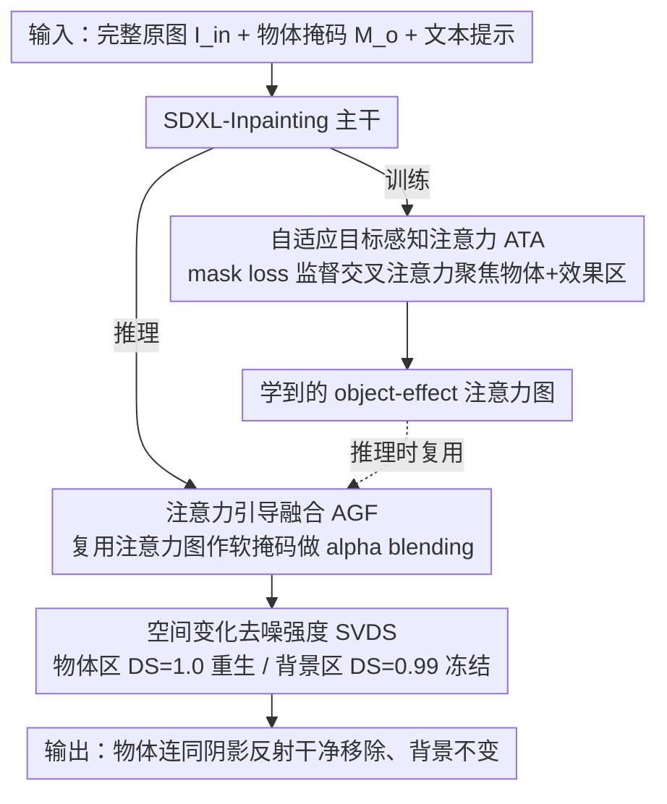

# Precise Object and Effect Removal with Adaptive Target-Aware Attention

**会议**: CVPR 2026  
**arXiv**: [2505.22636](https://arxiv.org/abs/2505.22636)  
**代码**: [https://zjx0101.github.io/projects/ObjectClear](https://zjx0101.github.io/projects/ObjectClear)  
**领域**: 图像生成  
**关键词**: 物体移除, 阴影/反射消除, 扩散模型, 注意力引导融合, 数据集构建

## 一句话总结
提出 ObjectClear 框架，通过自适应目标感知注意力（ATA）将前景移除与背景重建解耦，配合注意力引导融合（AGF）和空间变化去噪强度（SVDS）策略，实现对目标物体及其阴影、反射等附带效果的精准移除，同时构建了首个大规模 Object-Effect Removal 数据集 OBER。

## 研究背景与动机

**领域现状**：基于扩散模型的图像修复/物体移除已成为主流范式，通过结合目标分割掩码与扩散生成器来擦除图像中的不需要物体。代表方法包括 SDXL-Inpainting、PowerPaint、BrushNet、RORem 等。

**现有痛点**：现有方法存在三个核心问题——（a）**效果残留**：只能移除物体本身，难以同时去除阴影和反射等视觉效果；（b）**幻觉生成**：在移除区域生成不需要的新物体或纹理；（c）**背景篡改**：非目标区域的颜色、纹理被意外修改。

**核心矛盾**：缺乏对目标物体与其附带视觉效果之间关联的显式建模，以及缺少有效约束来引导生成模型的注意力聚焦于移除区域。现有数据集要么只有模拟数据（缺少真实效果标注）、要么规模太小或未公开。

**本文切入角度**：将前景移除与背景重建解耦——通过学习目标感知的注意力图来自适应定位物体及其效果区域，同时保持背景的高保真度。此外构建包含物体+效果掩码标注的大规模混合数据集。

**核心idea**：用自适应目标感知注意力（ATA）学习 object-effect 区域的注意力图，然后利用该图在推理时进行注意力引导融合，实现精准移除与背景保持的双重目标。

## 方法详解

### 整体框架
ObjectClear 要解决的是「移除物体时连同它的阴影、反射一起干净擦掉，又不动背景」这件难事，整套流程建立在 SDXL-Inpainting 之上。它的输入是 $\langle z_t, I_{in}, M_o, c \rangle$：噪声潜变量、原始图像、物体掩码和文本提示。一个容易被忽略但关键的选择是，喂进网络的是**完整原始图像** $I_{in}$，而不是传统 inpainting 里那张已经把目标区域抠空的掩码图 $I_m$——保留完整图像，模型才能看清物体投下的阴影、玻璃上的反射，乃至透明物体背后透出来的背景，这些线索是后面定位「效果区域」的依据。

训练阶段，模型一边学着把物体连同效果重建掉，一边被强制把交叉注意力聚焦到物体+效果区域上（ATA）；推理阶段，这张训练时学到的注意力图被反过来当作融合掩码（AGF），再叠加上物体区与背景区分别处理的去噪策略（SVDS），最终把「彻底移除」和「背景纹丝不动」这两个本来打架的目标同时兜住。

### 关键设计

**1. 自适应目标感知注意力（ATA）：让注意力自己长出 object-effect 掩码**

现有方法往往只盯着物体本身、靠模型隐式去猜阴影和反射在哪，结果效果残留。ATA 的做法是把定位这件事显式地教给注意力：先把文本提示 "remove the instance of" 的文本嵌入，与物体的视觉嵌入（$I_{in} \cdot M_o$ 过 CLIP 视觉编码器、再经一个 MLP 投射）拼到一起，作为交叉注意力的引导信号；然后取出视觉嵌入 token 对应的那张交叉注意力图 $\mathbf{A}$，用 object-effect 掩码 $M_{fg}$ 直接监督它。监督用的是一个对比式的 mask loss

$$\mathcal{L}_{mask} = \text{mean}(\mathbf{A}[1-M_{fg}]) - \text{mean}(\mathbf{A}[M_{fg}])$$

也就是压低背景区的注意力、抬高前景（物体+效果）区的注意力。这样训练完，注意力图自己就成了一张能圈出物体连带阴影反射的软掩码，物体与效果的关联被写进了网络，而不是碰运气。

**2. 注意力引导融合（AGF）：把训练时学到的注意力图当推理时的融合掩码复用**

扩散去噪和 VAE 重建天然会让本该不变的背景发生细微漂移——颜色、纹理一点点跑偏。AGF 在推理阶段反向利用 ATA 的产物来止损：取推理时第一层交叉注意力图（对应物体嵌入），上采样回原图分辨率，再做一次高斯模糊得到带软边缘的 object-effect 掩码，用它对生成结果和原始输入做 alpha blending——前景区用生成结果，背景区直接保留原图。妙处在于这张掩码不需要用户额外提供（这正是它和 BrushNet 那类依赖用户掩码的方法的区别），而是模型训练时顺带学出来的，一个 ATA 模块在训练和推理两端各干了一件事。

**3. 空间变化去噪强度（SVDS）：物体区彻底重生，背景区几乎冻结**

统一一个去噪强度会陷入两难：$DS=1.0$（完全从噪声生成）能把物体擦得干净，却会让全图颜色整体偏移；$DS=0.99$ 颜色一致了，物体又移除不彻底。SVDS 干脆按区域分开给强度——物体掩码区用 $DS=1.0$ 让它从噪声里重新长出干净背景，背景区用 $DS=0.99$ 并在去噪过程中不断把原始背景重新注入，保住颜色稳定。两个区域各取所需，把「移得干净」和「不串色」这对矛盾拆解开。

### OBER 数据集构建
精准的效果移除离不开带 object-effect 标注的真实数据，而这正是过去缺的，OBER 用「真拍 + 模拟」两路混合补上。**相机拍摄数据（2,878 对）**用固定机位分别拍下物体在场/不在场的两张图，先用 DINO+SAM 框出物体掩码，再拿输入图与 GT 做像素差分，自动算出包含阴影反射的 object-effect 掩码。**模拟数据（10,000 张）**则从互联网收集背景图（用 Mask2Former 筛出平坦区域、Depth Anything V2 验证深度一致），再用 alpha blending 把前景物体连同效果层合成上去，还能构造多物体遮挡的复杂场景；效果区域的 alpha 由 $\alpha(p) = (I_{gt} - I_{in})/(I_{gt} + \varepsilon)$ 算得。两路数据互补：真拍提供真实的光影，模拟提供规模和遮挡多样性。

### 训练策略
基于 SDXL-Inpainting 在 512×512 分辨率上训练，batch size 32，8× A100 跑 100k 步，学习率 1e-5。总损失是标准扩散损失加上前面的 $\mathcal{L}_{mask}$。推理时 guidance scale 取 1.0，20 步去噪。

## 实验关键数据

### 主实验

| 数据集 | 指标 | ObjectClear | OmniPaint（前SOTA） | 提升 |
|--------|------|-------------|---------------------|------|
| RORD-Val | PSNR↑ | **26.24** | 22.75 | +3.49 |
| RORD-Val | PSNR-BG↑ | **29.78** | 24.66 | +5.12 |
| RORD-Val | LPIPS↓ | **0.1157** | 0.1178 | -0.002 |
| OBER-Test | PSNR↑ | **33.04** | 29.06 | +3.98 |
| OBER-Test | PSNR-BG↑ | **35.62** | 30.04 | +5.58 |
| OBER-Test | LPIPS↓ | **0.0342** | 0.0521 | -0.018 |

关键：即便 ObjectClear 仅使用物体掩码，也超越了使用 object-effect 掩码的所有方法。PSNR-BG 指标大幅领先（+5dB），说明背景保持优势显著。

### 消融实验

| 配置 | PSNR↑ | PSNR-BG↑ | LPIPS↓ | 说明 |
|------|-------|----------|--------|------|
| 仅 CC Data | 27.29 | 27.96 | 0.0910 | 基线 |
| + ATA | 27.56 | 28.37 | 0.0845 | 注意力的作用 |
| + Sim. Data | 28.04 | 28.80 | 0.0805 | 模拟数据的贡献 |
| + AGF | 32.77 | 35.50 | 0.0348 | **AGF 贡献最大** |
| + SVDS | **33.04** | **35.62** | **0.0342** | 完整模型 |

### 关键发现
- **AGF 是最大贡献者**：加入 AGF 后 PSNR 从 28.04 跃升到 32.77（+4.73dB），因为它直接利用学到的注意力图保护背景
- ATA 和 Sim. Data 各贡献约 0.5dB，SVDS 额外贡献约 0.3dB
- 多物体模拟数据对遮挡和物体交互等复杂场景的鲁棒性至关重要

## 亮点与洞察
- **ATA+AGF 的协同设计**极为巧妙：训练时学习的注意力图不仅提升移除精度，还作为推理时融合的自然引导信号，一个模块服务双重目的
- **SVDS 的空间异质去噪**思路可泛化——在任何需要区域差异化处理的扩散编辑任务中，都可以在不同区域使用不同去噪强度
- **数据集构建流程**（像素差分提取效果掩码 + alpha blending 模拟合成）是一套可复用的工具链

## 局限与展望
- 训练分辨率限于 512×512，面对高分辨率实际应用需要额外适配
- 物体掩码依赖外部分割模型（DINO+SAM），掩码质量直接影响结果
- 对于非常复杂的多光源场景（如多物体交叉阴影），效果掩码的自动提取可能不够准确
- 仅处理静态图像，视频物体移除需要额外的时序一致性设计

## 相关工作与启发
- **vs OmniPaint**：同为只需物体掩码的方法，OmniPaint 隐式学习效果移除，ObjectClear 通过 ATA 显式建模效果区域，后者在 PSNR-BG 上领先 5dB+
- **vs RORem**：RORem 需要人工标注质量保证，ObjectClear 通过相机拍摄+像素差分自动获取高质量效果掩码
- **vs Attentive Eraser**：都关注注意力机制，但 Attentive Eraser 在 test-time 优化，ObjectClear 在训练阶段通过 mask loss 学习

## 评分
- 新颖性: ⭐⭐⭐⭐ ATA/AGF/SVDS 三个组件协同设计巧妙，但核心思路（显式效果建模+注意力引导）相对直觉
- 实验充分度: ⭐⭐⭐⭐⭐ 三个测试集（含自建Wild集）、完整消融、公平对比（两种掩码设置）
- 写作质量: ⭐⭐⭐⭐ 结构清晰，数据集构建流程描述详尽
- 价值: ⭐⭐⭐⭐ 数据集 OBER 和精准效果移除对实际应用价值大，但需要高分辨率版本

<!-- RELATED:START -->

## 相关论文

- [\[CVPR 2026\] Object-WIPER: Training-Free Object and Associated Effect Removal in Videos](object-wiper_training-free_object_and_associated_effect_removal_in_videos.md)
- [\[CVPR 2026\] EffectErase: Joint Video Object Removal and Insertion for High-Quality Effect Erasing](effecterase_joint_video_object_removal_and_insertion_for_high-quality_effect_era.md)
- [\[ICML 2026\] AdaEraser: Training-Free Object Removal via Adaptive Attention Suppression](../../ICML2026/image_generation/adaeraser_training-free_object_removal_via_adaptive_attention_suppression.md)
- [\[CVPR 2026\] Diff-SemiER: Transparency-Aware Adaptive Fusion Diffusion Model with Generative Prior for Semi-Transparent Eyeglasses Removal](diff-semier_transparency-aware_adaptive_fusion_diffusion_model_with_generative_p.md)
- [\[CVPR 2026\] Denoising, Fast and Slow: Difficulty-Aware Adaptive Sampling for Image Generation](denoising_fast_and_slow_difficulty-aware_adaptive_sampling_for_image_generation.md)

<!-- RELATED:END -->
