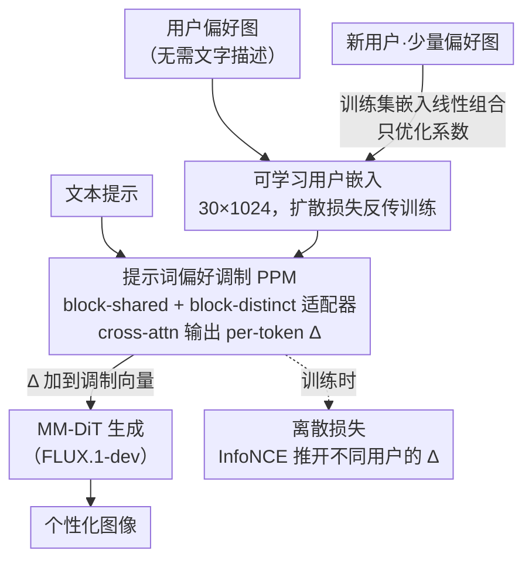

# Premier: Personalized Preference Modulation with Learnable User Embedding in Text-to-Image Generation

**会议**: CVPR 2026  
**论文**: [CVF Open Access](https://openaccess.thecvf.com/content/CVPR2026/html/Wang_Premier_Personalized_Preference_Modulation_with_Learnable_User_Embedding_in_Text-to-Image_CVPR_2026_paper.html)  
**代码**: 待确认  
**领域**: 扩散模型 / 个性化图像生成  
**关键词**: 个性化文生图、可学习用户嵌入、偏好调制、MM-DiT、离散损失

## 一句话总结
Premier 把每个用户的偏好表示成一个**可学习嵌入**，再用偏好适配器把它和文本提示融合、输出 per-token 调制方向注入 MM-DiT 的调制机制，配合一个离散损失（dispersion loss）拉开不同用户的偏好方向，并用「老用户嵌入的线性组合」解决新用户数据稀缺的冷启动，从而在不需要任何文字偏好描述、只给偏好图的前提下生成更贴合个人口味的图像。

## 研究背景与动机
**领域现状**：文生图（如 FLUX、扩散模型）质量已经很高，大量非专业用户在用。但很多用户难以用文字准确描述想要的图，偏好也常常「只可意会、难以言传」。好在用户的点击、下载、收藏行为里隐含了偏好——用户挑过的图天然携带其口味信息。个性化文生图就是要从这些偏好图里提取偏好，再用来引导生成。

**现有痛点**：当前主流做法是「靠多模态大模型（MLLM）从偏好图里抽偏好」，但有两条路都不灵：(1) 抽 MLLM 隐状态当偏好表示、再用 connector 模块注入生成过程——connector 会成为性能瓶颈，把 MLLM 抽到的丰富偏好信息「降级」掉；(2) 让 MLLM 直接吐自然语言偏好描述——文生图模型面对复杂细腻的偏好描述时指令遵循能力差，生成不准。此外，用户偏好历史之间相关性弱，历史一长，MLLM 会忽略样本间的细粒度差异，提取的偏好保真度下降。

**核心矛盾**：偏好信息的「表示空间」和「注入方式」是瓶颈。MLLM 的隐状态空间/语义和文生图模型的不一致，跨空间转换必然丢信息；而把偏好当条件 token 拼接进 MM-DiT 又会遇到 **token dilution（token 稀释）**——文本和图像 token 本就很多，要让用户嵌入有效控制生成，得加更多专用 token 或上 LoRA 微调，两者都可能损害模型原有性能。

**本文目标**：(1) 找一种比 MLLM 抽取更忠实的用户偏好表示；(2) 找一种不稀释、可细粒度控制的注入方式；(3) 解决新用户只给少量偏好图时的冷启动。

**切入角度**：与其靠 MLLM「翻译」偏好，不如让偏好表示**直接通过扩散损失反传来端到端学**——可学习用户嵌入天生就活在文生图模型能用的表示空间里。注入方式上，作者选**调制（modulation）而非 token 拼接**：调制能在每个文本 token 层级施加偏好，避免 token 稀释，且因为直接吃文本编码器的文本 token，可以在图像生成之前就完成。

**核心 idea**：用可学习用户嵌入表示偏好 + 用偏好适配器把它转成 per-token 调制方向注入 MM-DiT（提示词偏好调制 PPM）+ 用离散损失逼模型区分不同用户 + 用线性组合解决新用户冷启动。

## 方法详解

### 整体框架
Premier 基于开源的 FLUX.1-dev，整体是一个「偏好表示 → 偏好调制 → 训练正则 → 新用户冷启动」的两阶段流程。输入是用户的若干偏好图（不需要任何文字描述）和当前文本提示，输出是贴合该用户口味、又忠实于文本的图像。

第一阶段在训练集（1000 个有充足偏好数据的用户）上**联合训练**两个偏好适配器和每个训练用户的可学习偏好嵌入：每个用户嵌入是一个 $30\times1024$ 的可学习张量；偏好适配器以「文本 token 作 query、用户嵌入作 key/value」做 cross-attention，为每个文本 token 输出一个偏好调制方向 $\Delta$，加到 MM-DiT 原有的调制向量上（这就是提示词偏好调制 PPM）。为防止适配器只学到「通用偏好」、对不同用户输出趋同，训练时额外加离散损失把不同用户的调制方向在特征空间里推开。第二阶段处理新用户：保持适配器和训练集用户嵌入冻结，只把新用户表示成训练集用户嵌入的**线性组合**、仅优化组合系数，从而在数据稀缺时也能拿到稳定的偏好嵌入。

### 关键设计

**1. 提示词偏好调制（PPM）：可学习用户嵌入 + 双适配器输出 per-token 调制方向**

这是全文的核心，针对「MLLM 抽取丢信息 + token 拼接稀释」的痛点。Premier 不用 MLLM，而是给每个用户一个可学习嵌入 $e_u$，通过扩散损失反传直接在文生图模型的表示空间里学到偏好。注入则走调制而非拼接：在 MM-DiT 里，原始调制向量 $y$ 对所有 token 共享，前人发现给某个文本 token 的调制加一个方向 $\Delta$（$y_i' = y + \Delta_i$）就能把参考图属性「转印」到对应物体上。Premier 用两个偏好适配器为每个文本 token $e_{p_i}$ 算出调制方向：

$$y_i^{\,j} = y + \Delta_{\text{shared}}(e_u, e_{p_i}) + \Delta_{\text{distinct}}^{\,j}(e_u, e_{p_i})$$

其中 block-shared 适配器输出对所有 DiT block 一致的方向 $\Delta_{\text{shared}}$，block-distinct 适配器在最后一层扩展输出维度、为不同 DiT block（索引 $j$）输出**不同**的方向 $\Delta_{\text{distinct}}^{\,j}$。两个适配器都用 cross-attention：文本 token 作 query $Q$、用户偏好嵌入作 key/value $K,V$，每个适配器堆三个 attention block。这样偏好控制发生在「每个文本 token」粒度，既细又灵活，且因为只吃文本编码器输出，可在图像生成前完成，从根上绕开 token dilution。

**2. 离散损失（Dispersion Loss）：逼适配器按用户而非文本区分调制方向**

针对训练中观察到的一个失效：只用扩散损失 $L_{\text{flow}}$ 训练时，适配器对用户特征不够敏感，会**过拟合到文本 token**，导致不同用户生成的图几乎一样（只学到「通用偏好」）。作者希望偏好调制方向「首先按用户嵌入区分、其次才按文本 token 细化」。于是引入基于 InfoNCE 的对比式离散损失：把同一 batch 内**用别的用户嵌入算出的调制方向**当负样本，把 $L_{\text{flow}}$ 视作正样本对齐项，鼓励不同用户的 $\Delta$ 在特征空间里彼此远离：

$$L_{\text{disp}} = \log \sum_{j} \exp\!\big(-D(\Delta_\theta(e_u, e_p),\, \Delta_\theta(e_{u'}, e_p))\big)$$

其中 $D$ 取 L2 距离，输入文本 $p$ 设为空提示，$u, u'$ 是两个不同用户。两个适配器各自单独计算离散损失。总损失为：

$$L = L_{\text{flow}} + \lambda_{\text{shared}} L_{\text{disp}}^{\text{shared}} + \lambda_{\text{distinct}} L_{\text{disp}}^{\text{distinct}}$$

实验显示去掉离散损失掉点最狠，证明它是「让不同用户真正不同」的关键。

**3. 新用户冷启动：用训练集用户嵌入的线性组合做稳健表示**

针对实际场景里新用户只给极少偏好图、直接训嵌入会过拟合/不稳的问题。训练集里的 1000 个用户都有充足数据（每人 40–80 条），它们的偏好嵌入稳定可靠。于是 Premier 把新用户的偏好嵌入表示成这些训练集用户嵌入的**线性组合**，第二阶段冻结适配器和训练集嵌入，**只优化线性组合系数**。这样即便历史数据很少，新用户也能借力一组已训练好的稳定嵌入，得到稳健且有意义的表示，避免直接训练稀疏数据导致的过拟合。实验里这一策略在历史长度短（2/4/8）时明显优于直接训练嵌入，历史够长时两者接近。

### 损失函数 / 训练策略
两阶段训练，均用 Prodigy 优化器、学习率 1.0。第一阶段在 8×A800 上联合训练适配器与训练集用户嵌入，batch 16、4000 epoch，$\lambda_{\text{shared}}=\lambda_{\text{distinct}}=0.1$，每个用户嵌入初始化为 $30\times1024$，两个适配器各三个 attention block。第二阶段在单卡 A800 上只训新用户的线性组合系数，batch 2、5000 步，此阶段只需 $L_{\text{flow}}$（适配器已训好，无需再用离散损失）。

## 实验关键数据

### 实验设置
训练数据用 PrefBench（含多维偏好标注和真实人类数据），选 1000 用户作训练用户（每人 40–80 条偏好），另选 50 个训练集外用户作测试用户（每人 8 条学偏好嵌入、20 条作测试）。评测指标：ViPer Score / ViPer Rate（用 ViPer 代理模型在 20 张上下文图条件下打分；win rate 是与 FLUX.1-dev 输出比谁 ViPer 分高）、CLIP T2I（文图一致性，越高越好）、LPIPS（感知相似度，越低越好）。

### 主实验：偏好对齐对比
本文方法在同样取 8 条用户历史的设定下，ViPer 系列指标、CLIP T2I、LPIPS 均取得最佳（论文表 1 中加粗为最优）。下表摘录本文与几个代表性基线（DrUM、ViPer 同为取 8 条历史的个性化方法）。⚠️ 抽取文本中各基线列的精确对齐略有歧义，以原文表 1 为准。

| 方法 | ViPer Score↑ | ViPer Rate↑ | CLIP T2I↑ | LPIPS↓ |
|------|--------------|-------------|-----------|--------|
| Bagel | 0.6277 | 0.777 | 0.2988 | 0.6641 |
| Qwen-Image-Edit | 0.5075 | 0.703 | 0.3107 | 0.6438 |
| DrUM | 0.4688 | 0.613 | 0.3101 | 0.6407 |
| ViPer | 0.5159 | 0.676 | 0.2981 | 0.6564 |
| **Premier（本文）** | **0.6889** | **0.876** | **0.3183** | **0.5986** |

本文在保持最高文图一致性（CLIP T2I 0.3183）的同时拿到最高的偏好对齐（ViPer Score 0.6889、Rate 0.876）和最低 LPIPS，说明既贴口味又不跑偏文本。专家用户研究（每位专家看 6 张历史偏好图，从本文与基线的同 prompt 图对里选最贴合「偏好+文本」的）也支持本文最优。

### 消融实验
| 配置 | ViPer Score↑ | ViPer Rate↑ | CLIP T2I↑ | LPIPS↓ | 说明 |
|------|--------------|-------------|-----------|--------|------|
| 完整 Premier | 0.6889 | 0.876 | 0.3183 | 0.5986 | 全模块 |
| w/o $\Delta_{\text{shared}}$ | 0.4818 | 0.667 | 0.3162 | 0.6247 | 去 block-shared 适配器，大跌 |
| w/o $\Delta_{\text{distinct}}$ | 0.4917 | 0.669 | 0.3131 | 0.6353 | 去 block-distinct 适配器，大跌 |
| w/o 离散损失 | 0.4498 | 0.618 | 0.3162 | 0.6249 | 掉点最狠，偏好趋同 |
| w/o PPM | 0.6492 | 0.840 | 0.3074 | 0.6225 | 去掉提示词-偏好交互，次优 |

### 关键发现
- **离散损失贡献最大**：去掉它 ViPer Score 从 0.6889 跌到 0.4498（掉约 0.24），印证没有它适配器会过拟合文本、对不同用户输出趋同——这正是「让个性化真正个性化」的关键。
- **两个适配器缺一不可**：去掉 block-shared 或 block-distinct 任一个，ViPer Score 都跌到 0.48–0.49，二者分别提供「跨 block 一致」和「逐 block 差异化」的调制，互补。
- **新用户冷启动随历史长度的曲线**：在历史长度 2/4/8（短）时，「线性组合系数」策略的 ViPer Score 明显高于「直接训练嵌入」；历史长到 16/32 时两者收敛——印证线性组合主要是为数据稀缺场景兜底。

## 亮点与洞察
- **可学习嵌入直接活在生成模型表示空间**：绕开 MLLM 抽取的跨空间信息损失，用扩散损失端到端学偏好，思路干净且更忠实——这点可迁移到任何「外部条件难以文字化」的可控生成任务。
- **调制 vs 拼接的取舍很关键**：作者明确指出 token 拼接会稀释、需加 token 或 LoRA 损性能，转而用 per-token 调制在文本编码阶段就注入偏好，是规避 token dilution 的实用范式。
- **离散损失把「个性化失效」显式建模**：很多个性化方法默认「学了就有区分度」，本文坦诚指出只用扩散损失会塌成通用偏好，并用 InfoNCE 式离散损失强行拉开用户——这种「先发现失效再针对性补正则」的做法很值得借鉴。
- **线性组合冷启动**：用稳定老用户嵌入的凸/线性组合表示新用户、只学系数，是个轻量又稳的少样本个性化技巧，可推广到其他基于嵌入的个性化系统。

## 局限与展望
- **依赖 PrefBench 单一数据集**：训练/评测都在 PrefBench 上，跨数据集、跨域泛化未验证 ⚠️。
- **评测高度依赖 ViPer 代理模型**：ViPer Score/Rate 都由 ViPer 代理打分，存在「用相近偏好模型自评」的潜在偏置；虽有专家研究佐证，但样本与规模有限。
- **用户嵌入维度/超参偏经验**：$30\times1024$ 嵌入、$\lambda=0.1$、各适配器 3 block 等设定未做系统敏感性分析。
- **新用户仍需训练**：冷启动虽稳，但第二阶段仍要为每个新用户优化线性组合系数（5000 步），尚非即插即用的零训练个性化。
- **可改进方向**：把线性组合换成更快的闭式/检索式系数求解以逼近零训练；在更多文生图骨干上验证调制注入的通用性。

## 相关工作与启发
- **vs ViPer**：ViPer 用 MLLM 从「喜欢/不喜欢图 + 用户评论」抽多维偏好再引导生成，依赖文字化偏好且受 MLLM 指令遵循限制；Premier 完全不需文字描述、用可学习嵌入端到端学偏好，主实验上偏好对齐显著更高。
- **vs DrUM / Tailored Visions / PMG**：这些方法走「用户历史文本」或「软硬偏好混合」路线，本质仍靠语言或 LLM 特征表示偏好；Premier 直接学嵌入并以调制注入，避开跨空间转换与 token 稀释。
- **vs 参考图生成（IP-Adapter / InstantStyle / TokenVerse / XVerse / OminiControl）**：这些是「给参考图做条件控制」，IP-Adapter 用 cross-attention 注入、OminiControl 训 LoRA、TokenVerse/XVerse 也走调制方向；Premier 借鉴「调制方向注入 MM-DiT」的思路，但把目标从「单图风格/属性迁移」换成「跨多张偏好图聚合出的用户级偏好」，并新增离散损失与冷启动来服务个性化场景。

## 评分
- 新颖性: ⭐⭐⭐⭐ 可学习用户嵌入 + per-token 偏好调制 + 离散损失 + 线性组合冷启动，组合新颖且每一步动机明确。
- 实验充分度: ⭐⭐⭐ 主实验、消融、历史长度曲线、专家研究都有，但局限在单一 PrefBench 数据集且评测依赖 ViPer 代理。
- 写作质量: ⭐⭐⭐⭐ 痛点（token 稀释/偏好趋同）与对策对应清晰，公式与框架图易懂。
- 价值: ⭐⭐⭐⭐ 给「无需文字描述、只给偏好图」的个性化文生图提供了实用且效果好的范式。

<!-- RELATED:START -->

## 相关论文

- [\[CVPR 2026\] Design Your Ad: Personalized Advertising Image and Text Generation with Unified Autoregressive Models](design_your_ad_personalized_advertising_image_and_text_generation_with_unified_a.md)
- [\[CVPR 2026\] Test-Time Alignment of Text-to-Image Diffusion Models via Null-Text Embedding Optimisation](test-time_alignment_of_text-to-image_diffusion_models_via_null-text_embedding_op.md)
- [\[CVPR 2026\] OSPO: Object-Centric Self-Improving Preference Optimization for Text-to-Image Generation](ospo_object-centric_self-improving_preference_optimization_for_text-to-image_gen.md)
- [\[CVPR 2026\] Compositional Text-to-Image Generation Via Region-aware Bimodal Direct Preference Optimization](compositional_text-to-image_generation_via_region-aware_bimodal_direct_preferenc.md)
- [\[ICLR 2026\] Directional Textual Inversion for Personalized Text-to-Image Generation](../../ICLR2026/image_generation/directional_textual_inversion_for_personalized_text-to-image_generation.md)

<!-- RELATED:END -->
