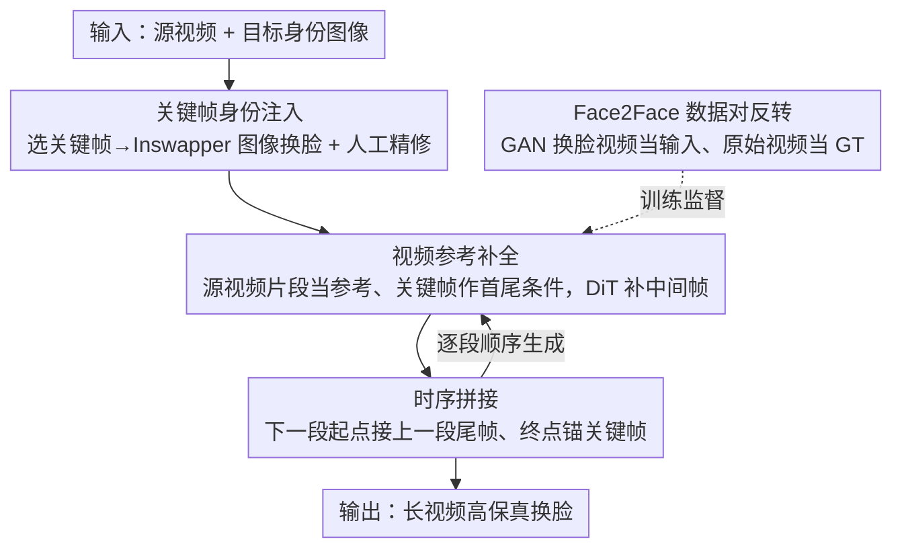

# Preserving Source Video Realism: High-Fidelity Face Swapping for Cinematic Quality

**会议**: CVPR 2026  
**arXiv**: [2512.07951](https://arxiv.org/abs/2512.07951)  
**代码**: [项目页面](https://aim-uofa.github.io/LivingSwap)  
**领域**: 扩散模型 / 视频编辑  
**关键词**: 人脸替换, 视频参考引导, 关键帧注入, 时序拼接, 电影级质量

## 一句话总结

提出 LivingSwap，首个视频参考引导的人脸替换模型，通过关键帧身份注入 + 源视频参考补全 + 时序拼接的可控流水线，实现长视频中的高保真人脸替换，在保持源视频表情、光照、运动等细节的同时稳定注入目标身份，将人工编辑量减少 40 倍。

## 研究背景与动机

1. **领域现状**：视频人脸替换在影视制作中需求强烈。现有方法主要分两类——GAN-based 方法逐帧处理，身份注入能力强但存在真实感差和时序闪烁问题；基于扩散模型的 inpainting 方法通过 mask 遮挡原始人脸区域再重新生成，时序一致性更好但丢弃了原始像素信息导致保真度下降（表情、光照、细微纹理等无法完美复原）。

2. **现有痛点**：diffusion inpainting 方法依赖外部编码器提取中间表示（如 landmark、3D face），不可避免地丢失源视频的丰富信息。而 GAN 方法虽然能利用完整源帧作为输入保留更多细节，但在长序列上会出现严重的时序不一致。近期参考引导生成在图像编辑上取得了突破，能同时兼顾编辑灵活性和高保真重建。

3. **核心矛盾**：如何在保留源视频丰富视觉属性（光照、表情、细微动态）的同时，稳定一致地注入目标身份，且适用于长视频场景？

4. **本文目标**（1）长视频中稳定一致的身份注入；（2）非身份属性（光照、表情、背景）的高保真保留；（3）跨片段的时序一致性；（4）训练数据的稀缺性。

5. **切入角度**：借鉴参考引导图像编辑的思路——不遮挡原始人脸再 inpaint，而是直接以源视频作为视觉参考引导扩散模型生成。将长视频人脸替换分解为关键帧编辑→视频参考补全→时序拼接的可控流水线，通过数据对反转（pair reversal）策略解决训练数据稀缺问题。

6. **核心 idea**：以源视频本身作为参考引导扩散模型进行人脸替换，用关键帧提供身份条件，用视频参考保留非身份细节，用时序拼接处理长视频，用数据对反转解决训练数据问题。

## 方法详解

### 整体框架

LivingSwap 将长视频人脸替换分解为四步可控流水线：（1）选取代表性关键帧并用图像级方法（如 Inswapper）执行单帧换脸；（2）以源视频片段为参考、关键帧换脸结果为身份条件，由视频扩散模型补全中间帧；（3）通过时序拼接策略将相邻片段无缝衔接处理长视频；（4）使用反转数据对构建训练集 Face2Face 提供可靠监督。整体基于 14B 参数的 DiT 视频生成模型（VACE 架构），采用 Rectified Flow 训练目标。

### 关键设计

**1. 关键帧身份注入：用图像方法把身份钉准，再交给视频模型铺开**

视频级换脸模型在单帧上的身份注入往往不如图像级方法精准，但逐帧用图像方法又会闪烁。LivingSwap 的折中是只在少数关键帧上用图像方法把身份"钉死"。具体做法是从源视频里挑出姿态、表情、光照变化显著的时刻作为关键帧 $F_{\text{key}}$，对这些帧用高质量图像换脸（Inswapper），必要时还可人工 Photoshop 精修。每一对相邻关键帧 $\{f_{k_i}^{\text{swap-in}}, f_{k_{i+1}}^{\text{swap-in}}\}$ 充当一个视频片段的时序边界条件，框住中间帧的身份。这样图像方法负责"身份准"、视频扩散模型负责"帧间稳"，二者各取所长；而且只需处理关键帧而非全部帧，相比逐帧的工业流水线大幅省力。

**2. 视频参考补全：不遮挡、不丢像素，直接把源视频喂进去当参考**

inpainting 方法把人脸区域 mask 掉再重画，原始像素连同光照、表情、纹理一起被丢弃，保真度天然受损。LivingSwap 反其道而行，把完整源视频片段 $V_s^{[k_i:k_{i+1}]}$ 当作视觉参考直接输入。目标身份图像、关键帧换脸结果、源视频片段、下一关键帧都经 VAE 编码后按时间顺序拼成条件 token $Z_c$，再与二值 mask 在通道维度拼接提供空间定位。为了让这些参考真正影响生成，作者加了一个与骨干网络逐层对齐的属性编码器（DiT blocks 结构），它每一层的输出通过 element-wise 加法注入骨干网络的对应层：

$$X^{(l+1)} = \mathcal{D}_\theta^{(l)}(X^{(l)} + \mathcal{A}_\psi^{(h)}(Z_c^{(h)}, M))$$

逐层加法而非替换，意味着源视频的像素细节是"叠加"进预训练先验、而不是覆盖它，所以模型既保住了生成能力，又能自适应地复原源视频的光照与微表情。

**3. 时序拼接：让前一段的尾帧当下一段的起跑线**

一段视频固定 81 帧，长视频按关键帧切成若干段顺序生成，但各段独立生成会在边界处跳帧。LivingSwap 让相邻段共享一帧：第一段首尾都用关键帧换脸结果作引导；从第二段起，起始引导改用前一段最后一帧的实际输出 $f_{k_i}^{\text{swap-out}}$，终止引导仍是关键帧。一段的生成可写成

$$\{f_t^{\text{swap-out}}\}_{t=k_i}^{k_{i+1}} = \mathcal{D}_{\theta,\psi}(f_{k_i}^{\text{swap-out}}, f_{k_{i+1}}^{\text{swap-in}}, V_s^{[k_i:k_{i+1}]}, I_{\text{tar}}, M)$$

用上一段的真实输出帧接力，既把一致的身份传下去，又因为终点始终锚在干净的关键帧上，抑制了跨段误差累积。工程上再辅以帧插值、时间反向播放、跳帧等技巧适配不同节奏的视频。

**4. Face2Face 数据集与数据对反转：把 GAN 的伪影留在输入端，让 GT 保持干净**

视频参考引导换脸几乎没有现成训练数据，最直接的做法是用 Inswapper 逐帧造换脸视频当 GT——但这等于把 GAN 的伪影和闪烁直接写进监督信号。作者的关键一招是把数据对的角色反转过来：基于 CelebV-Text（70K 视频）和 VFHQ（16K 视频），仍用 Inswapper 逐帧生成换脸结果，但让这份带伪影的 GAN 视频充当模型输入 $V_s$，而原始未编辑的真实视频反过来当 ground truth 和关键帧来源。这样参考帧和 GT 帧共享同一身份，监督信号干净无伪影；噪声只出现在输入侧。配合预训练模型的强先验，模型学到的其实是"把退化的输入纠正回干净视频"，最终生成质量反而超过用来造数据的 Inswapper 本身。

### 一个完整示例：一段 300 帧的电影镜头怎么换脸

假设要把一段 300 帧的源视频换成目标演员的脸。首先按关键帧间隔切出 4 个关键帧（约每 79 帧一个），对这 4 帧用 Inswapper 换脸、人工精修——全片 300 帧只需手工处理这 4 帧。接着把视频划成 3 个片段（每段 81 帧左右）：第一段以关键帧 1、2 的换脸结果为首尾引导，以原始 81 帧源视频为参考，由扩散模型补出中间帧；第二段不再用关键帧 2 的换脸结果当起点，而是接上第一段输出的最后一帧，终点锚在关键帧 3；第三段同理接第二段尾帧、锚关键帧 4。三段顺序生成、首尾相接，最终拼成 300 帧换脸视频。整段过程中目标身份由 4 个关键帧稳定供给，光照、表情、背景等非身份细节则由每段的源视频参考逐帧复原。

### 损失函数 / 训练策略

基于 Rectified Flow 框架，损失为预测速度场与真实速度场的 MSE：$\mathcal{L} = \mathbb{E}_{x_0,x_1,c,t}\|u(x_t,c,t;\theta) - v_t\|^2$，其中 $v_t = x_1 - x_0$。使用 AdamW 优化器，学习率 1e-5，batch size 16，640 分辨率 81 帧，8×H200 GPU 训练约 14 天。

## 实验关键数据

### 主实验

在 CineFaceBench（400 对电影场景测试，含 easy/hard 身份对）上的对比：

| 方法 | ID Sim↑(easy/hard) | Expr↓(easy/hard) | Light↓(easy/hard) | Pose↓(easy/hard) | FVD↓(easy/hard) | Avg Rank↓ |
|------|-----|-----|------|------|------|------|
| Inswapper | 0.567/0.422 | 2.081/2.607 | 0.189/0.243 | 3.421/3.916 | 66.62/73.48 | 2.500 |
| BlendFace | 0.482/0.315 | 1.919/2.285 | 0.245/0.271 | 4.450/4.520 | 100.28/106.58 | 3.583 |
| **LivingSwap** | **0.532/0.367** | **1.943/2.471** | **0.192/0.238** | **3.108/3.399** | **54.32/63.97** | **1.667** |

在 FF++ 上也达到 Avg Rank 3.17（仅次于 Inswapper），但在 Pose 和 FVD 上表现最优。

### 消融实验

| 配置 | ID Sim↑ | Expr↓ | Light↓ | Pose↓ |
|------|---------|-------|--------|-------|
| LivingSwap (full) | 0.536 | 2.84 | 0.285 | 2.84 |
| w/o Target Image | 0.515 | 2.74 | 0.279 | 2.80 |
| w/o Keyframe | 0.281 | 2.47 | 0.249 | 2.84 |
| Inpainting 替代参考引导 | 0.519 | 2.89 | 0.292 | 2.87 |
| VACE 基线 | 0.313 | 3.08 | 0.355 | 6.42 |

数据质量消融：

| 数据 | ID Sim↑ | Expr↓ | Light↓ |
|------|---------|-------|--------|
| 全部数据 | 0.536 | 2.84 | 0.285 |
| 仅上30%质量 | 0.532 | 2.82 | 0.289 |
| 仅下30%质量 | 0.540 | 2.83 | 0.288 |

### 关键发现

- **关键帧是身份注入的核心**：去掉关键帧后 ID Similarity 从 0.536 暴跌到 0.281，说明仅靠目标图像无法在视频中稳定传递身份信息
- **视频参考优于 inpainting**：用 inpainting 替代参考引导后保真度指标（Light、Expr、Pose）全面下降，验证了保留原始像素信息的重要性
- **模型对数据噪声高度鲁棒**：用质量最差的 30% 数据训练的效果与全部数据几乎一致，甚至在 ID Sim 上略优。数据多样性比数据质量更重要
- **数据对反转使模型超越数据质量**：LivingSwap 生成结果在真实感和时序一致性上优于其训练数据中 Inswapper 的输出，预训练先验 + 反转策略让模型学会纠正 GAN 伪影
- 相比 Inswapper（被用于生成关键帧），LivingSwap 在 Pose 和 FVD 上显著更优，说明视频扩散模型的时序建模能力有效弥补了图像方法的时序缺陷

## 亮点与洞察

- **数据对反转（Pair Reversal）**：这是全文最巧妙的设计。通过将 GAN 输出作为模型输入、原始视频作为 GT，巧妙避开了"GAN 伪影污染 GT"的死循环。这一思路可推广到任何需要合成训练数据的参考引导生成任务。
- **关键帧→参考补全→拼接的分解策略**：将复杂的长视频换脸问题化归为多个可控子问题。每个子问题都有成熟的解决方案（图像换脸、视频补全、片段拼接），组合后效果远超端到端方法。这种"分而治之"的工程思想值得学习。
- **40x 人工减负**：81 帧一个片段仅需手动编辑首尾 2 帧关键帧，对影视工业落地极有吸引力。

## 局限与展望

- 关键帧选取目前使用固定间隔策略（每 79 帧），未根据视频内容自适应调整，对剧烈运动场景可能不够密集
- 依赖 Inswapper 生成关键帧，其质量上限限制了最终结果的身份还原度
- CineFaceBench 的 easy/hard 划分基于身份相似度分数，可能未覆盖所有真实困难场景（如极端遮挡、模糊、微表情）
- 人脸检测→裁剪→换脸→贴回的流程中，裁剪区域边界可能引入拼接痕迹
- 未探索视频参考引导在全身替换或非人脸区域编辑上的推广

## 相关工作与启发

- **vs Inswapper**: Inswapper 是本文的上游工具（用于关键帧生成和数据构建），但其逐帧处理方式在长序列上严重闪烁。LivingSwap 通过视频扩散模型的时序建模能力克服了这一缺陷。
- **vs DiffSwap**: DiffSwap 用扩散模型做换脸但 ID Sim 低（0.261），说明简单的 diffusion inpainting 不足以保持身份。LivingSwap 的关键帧+参考引导设计显著提升了身份保持。
- **vs VACE**: VACE 是本文的骨干模型，但直接用 VACE 做换脸 ID Sim 仅 0.313。LivingSwap 的关键帧注入和参考引导设计将其提升到 0.536。

## 评分

- 新颖性: ⭐⭐⭐⭐ 首个视频参考引导换脸模型，数据对反转策略巧妙，但各组件（关键帧、参考引导、拼接）均借鉴已有思路
- 实验充分度: ⭐⭐⭐⭐⭐ FF++ 和自建 CineFaceBench 双基准，大量消融（数据质量、模型组件、关键帧质量），全面且有说服力
- 写作质量: ⭐⭐⭐⭐ 方法流水线的可视化清晰，但部分细节（如属性编码器结构）可以更详尽
- 价值: ⭐⭐⭐⭐⭐ 40x 人工减负的工业落地价值极高，数据对反转策略可广泛复用

<!-- RELATED:START -->

## 相关论文

- [\[CVPR 2026\] High-Fidelity Diffusion Face Swapping with ID-Constrained Facial Conditioning](high-fidelity_diffusion_face_swapping_with_id-constrained_facial_conditioning.md)
- [\[CVPR 2026\] Attribute-Preserving Pseudo-Labeling for Diffusion-Based Face Swapping](attribute-preserving_pseudo-labeling_for_diffusion-based_face_swapping.md)
- [\[CVPR 2026\] APPLE: Attribute-Preserving Pseudo-Labeling for Diffusion-Based Face Swapping](apple_attribute-preserving_pseudo-labeling_for_diffusion-based_face_swapping.md)
- [\[CVPR 2026\] Cinematic Audio Source Separation Using Visual Cues](cinematic_audio_source_separation_using_visual_cues.md)
- [\[CVPR 2026\] MMFace-DiT: A Dual-Stream Diffusion Transformer for High-Fidelity Multimodal Face Generation](mmface-dit_a_dual-stream_diffusion_transformer_for_high-fidelity_multimodal_face.md)

<!-- RELATED:END -->
