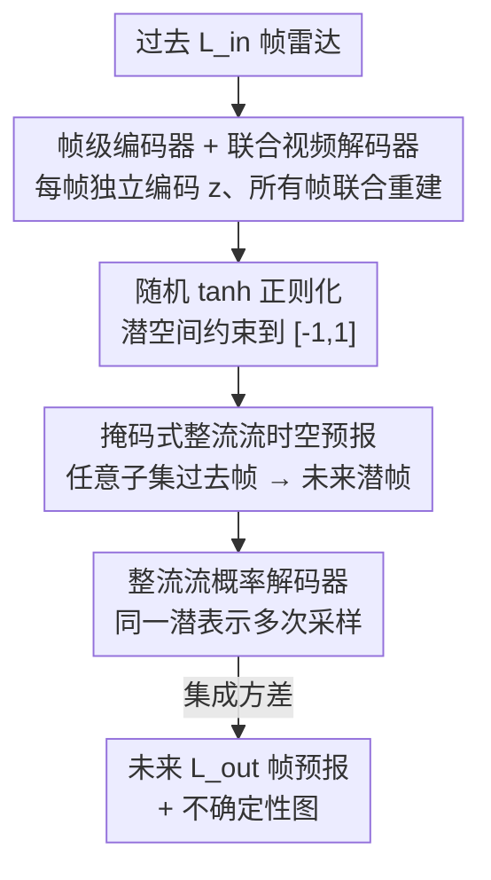

# Probabilistic Precipitation Nowcasting with Rectified Flow Transformers

**会议**: CVPR 2026  
**arXiv**: [2605.31204](https://arxiv.org/abs/2605.31204)  
**代码**: https://github.com/CompVis/weather-rf (有)  
**领域**: 时序预测 / 扩散模型 / 气象临近预报  
**关键词**: 降水临近预报, 整流流, 概率压缩, 不确定性量化, 时空 Transformer

## 一句话总结
本文提出 FREUD——一个用整流流（rectified flow）Transformer 充当"压缩第一阶段"的框架：帧级编码器独立编码每帧、联合视频解码器一次性重建所有帧，把确定性解码换成概率式解码，从而在压缩阶段就能量化不确定性；配合潜空间整流流临近预报模型，在 SEVIR 降水临近预报基准上取得 SOTA 的 CRPS（0.0190）和 SSIM。

## 研究背景与动机
**领域现状**：降水临近预报（nowcasting，未来 30 分钟到数小时的短时高分辨率预报）对极端天气是安全攸关的。基于物理模拟的数值天气预报（NWP）太慢，数据驱动的深度学习方法更高效；其中扩散/流模型因为有强概率基础、能输出"锐利且多样"的预报、并用样本方差天然刻画不确定性，已成为当前 SOTA（如 CasCast、PreDiff）。

**现有痛点**：这些扩散模型为了应对气象数据的超高维，普遍采用"两阶段"设计——先用一个**确定性的自编码器**把数据压到潜空间，再在潜空间做生成。但这种压缩对气象预报是"病态"的：① 压缩本身有损，图像里看不出的细微误差，对应到降水量上可能是巨大偏移，在安全攸关场景里直接损害可靠性；② 训练这类自编码器要在 KL 正则、感知损失、对抗损失之间反复调权重，对抗分量还会带回训练不稳定与模式崩溃，并抑制掉那些"细微但要命"的极端事件细节；③ 解码器在推理时是确定性的，**完全无法量化解码过程中的不确定性**。

**核心矛盾**：第一阶段的"确定性压缩"丢掉了解码不确定性，而临近预报恰恰最需要这部分——极端天气下，同一潜表示可能对应多种合理的像素级实现，这种"解码方差"本身就是有价值的预警信号。此外，已有方法的条件窗口要么固定（缺帧就崩）、要么自回归（误差累积），缺乏对缺帧/损坏帧的鲁棒性。

**本文目标**：设计一个简单、可扩展、且能在压缩阶段量化不确定性的第一阶段，同时让潜空间预报模型支持可变长度、对缺帧鲁棒的条件输入。

**切入角度**：把第一阶段的"确定性解码器"换成一个**整流流解码器**——既然解码本身就是从潜表示采样像素，那让它变成概率生成过程，就能对同一潜表示多次采样、用集成方差估计偶然不确定性（aleatoric uncertainty），而且整个第一阶段只用一个简单的流匹配损失训练，不再需要感知/对抗损失。

**核心 idea**：用"帧级编码 + 联合解码的概率式整流流第一阶段（FREUD）"替代"确定性两阶段压缩"，把不确定性量化前移到压缩阶段，再叠加掩码式整流流潜空间预报，做出又准又可校准的降水临近预报。

## 方法详解

### 整体框架
任务设定：给定过去 $L_{in}$ 帧降水图（VIL 雷达），预测未来 $L_{out}$ 帧（实验中 13 帧→12 帧，即 65 分钟→60 分钟）。由于降水是混沌的、无法确定性建模，作者把它当成概率时空预测，从条件分布 $p(\mathbf{x}^{out}\mid\mathbf{c})$ 采样未来。

整条管线是经典的"两阶段生成"，但两阶段都建立在整流流之上：

1. **第一阶段 FREUD（压缩 + 概率解码）**：帧级 Transformer 编码器把每帧独立编码成潜表示 $z$；分层整流流视频解码器把所有潜帧联合解码回像素。关键是解码器是**概率式**的，同一潜表示多采样几次就得到一组重建，其方差即偶然不确定性。
2. **第二阶段 潜空间预报（LSM）**：在 FREUD 潜空间里训练一个整流流 Transformer，用掩码式 diffusion forcing 学习"从任意子集的过去帧推断未来"。推理时把过去观测编码成条件潜帧、把未来位置填成高斯噪声潜帧，让潜空间流模型去噪，再用 FREUD 解码器映射回像素得到预报。

两阶段都能做集成：潜空间重采样得到"预报集成"，解码阶段换不同噪声初始化得到"解码集成"，二者共同刻画预测不确定性。

### 关键设计

**1. 帧级编码器 + 联合视频解码器：用非对称结构同时拿到鲁棒性和时序一致性**

纯帧级（frame-wise）压缩对每帧独立编码，天然鲁棒于缺帧/损坏帧、支持新帧到来时增量更新、且不会从未来帧泄漏信息到过去帧（保持预报所需的因果结构）；但它的弊病是帧间会闪烁、时序不一致。序列级编码器虽然时序好，却会泄漏未来信息、不适合预报。作者的解法是**编码用帧级、解码用联合**：编码器是轻量 Transformer，逐帧独立处理；解码器是基于 Transformer 的视频解码器，**一次性联合重建所有帧**来保证时序一致。解码器借鉴 Hourglass 扩散 Transformer 的分层结构，用 pixel-unshuffle/pixel-shuffle 在空间分辨率上逐级降/升以压住大视频张量的注意力开销，并通过在瓶颈处把编码器潜表示**按通道拼接**进来做条件；进一步用时空分解注意力（每个 block 交替做空间注意力和时间注意力）+ 高分辨率层的邻域注意力来提效。这种"编码独立、解码联合"的非对称设计，把帧级的工程鲁棒性和联合解码的时序连贯性合到了一起。

**2. 整流流概率解码器：把确定性解码换成可采样的生成过程，从而量化解码不确定性**

这是全文最核心的转变。传统第一阶段解码器是确定性的，推理时一个潜表示只能解出一个固定像素结果，无法表达"解码本身有多不确定"。FREUD 把解码器训练成一个整流流模型：整流流通过线性插值 $\mathbf{x}_i=\alpha_i\mathbf{x}_1+\sigma_i\mathbf{x}_0$（取 $\alpha_i=i,\ \sigma_i=1-i$）把先验噪声 $\mathbf{x}_0\sim\mathcal{N}(0,I)$ 输运到数据 $\mathbf{x}_1$，网络学习预测速度场 $\mathbf{v}_\theta(\mathbf{x}_i,i)$。推理时同一潜表示配不同噪声初始化，就能解出多个合理的像素级实现。作者把大气视为 $\mathbf{x}^{out}=\mathcal{F}(\mathbf{c})+\eta$（确定性动力学 + 不可约噪声），证明对 $N$ 个独立集成成员求样本方差 $\mathrm{Var}(\tilde{\mathbf{x}}^{out})$ 在 $N\to\infty$ 时收敛到偶然不确定性 $\mathrm{Var}(\eta)$。实验证实这种解码方差与降水强度强线性相关（T-reg 变体 $r=0.97$）：光雨区方差小，强降水/混沌区方差大且能可靠覆盖真值——恰好在最需要预警的高影响区给出有意义的局部不确定性。

**3. 随机 tanh 正则化（T-reg）：不加损失、不改架构地把潜空间约束成有界平滑**

潜空间生成要求潜空间平滑、结构良好。已有做法靠一个小的 KL 正则把潜分布拉向标准正态，但 KL 正则需要调权重（强 KL 改善正则却伤重建保真度），还要改架构（编码器得额外预测每维的均值和标准差）。作者提出 T-reg 作为更简单的替代：把编码器输出过一个 tanh 把潜值约束到 $[-1,1]$，再加一个小高斯扰动，即

$$\tilde{\mathbf{z}}^t = \tanh(\mathrm{Enc}_\theta(\mathbf{x}^t)) + \sigma\epsilon,\quad \epsilon\sim\mathcal{N}(0,\sigma I)$$

这个随机扰动让"相邻潜表示解码出相似的像素视频"，从而鼓励平滑性、对潜空间小扰动鲁棒。和 KL 正则不同，T-reg **纯粹是一个架构约束而非额外损失项**，完全不需要调权重。消融显示 T-reg 潜空间更紧致、密度更高，下游预报的 CRPS/SSIM 也更好。

**4. 基于掩码的整流流时空预报：让潜空间模型支持任意条件长度、对缺帧鲁棒**

因为 FREUD 编码器容忍缺帧，潜空间预报模型也必须支持可变长度条件。作者沿用 RaMViD 的掩码式 diffusion forcing：把长度 $T=L_{in}+L_{out}$ 的视频随机切成条件帧集合 $C$ 和生成帧集合 $G$，只对 $G$ 中的帧加噪，损失只在带噪帧上计算；每个样本从 $\{1,\dots,K\}$ 均匀抽取条件帧数 $|C|=k$（$K<T$ 为最大条件帧数），从而教会模型"用任意子集的过去信息做预测"，推理时即便只有两帧过去观测也能保持很强的预报技巧。同时以概率 $p_U$ 训练完全无条件样本（$C=\varnothing$），以支持 classifier-free guidance（CFG）。⚠️ 值得注意：作者发现 CFG 会系统性抬高预测降水量，定位指标的提升可能只是这种"整体偏移"而非更好的建模，因此认为 CFG 对临近预报是有缺陷的。

### 损失函数 / 训练策略
- **第一阶段**：编码器与解码器**联合**用整流流损失训练，无感知损失、无对抗损失。配合 T-reg 与线性 schedule，损失简化为 $\mathcal{L}=\lVert\mathbf{v}_\theta(\mathbf{x}_i,i)-(\mathbf{x}_1-\mathbf{x}_0)\rVert^2$（$\mathbf{x}_1$ 为数据、$\mathbf{x}_0\sim\mathcal{N}(0,I)$）。训练早期还加了一个简单的异常值惩罚（细节见原文附录，⚠️ 以原文为准）。
- **第二阶段**：在 FREUD 潜空间用掩码式整流流损失（仅对带噪帧计算），随机化条件帧数 + 概率无条件训练以支持可变条件与 CFG。
- **配置**：$L_{in}=13$、$L_{out}=12$，默认 10 个预报集成成员；latent 模型分 S/B/L 三档（44M / 141M / 473M）。

## 实验关键数据

### 主实验
SEVIR 基准：20,393 个（极端）天气事件，2017–2019 年采集，每个事件覆盖 384×384 km、时长 4 小时，VIL（垂直积分液态水，来自 NEXRAD 雷达）空间 1 km、时间 5 min 分辨率。

**降水临近预报对比（SEVIR，baseline 取自 CasCast）**：

| 方法 | CRPS↓ | SSIM↑ | HSS↑ | CSI↑ |
|------|-------|-------|------|------|
| EarthFormer (NeurIPS'22) | 0.0251 | 0.7756 | 0.5411 | 0.4310 |
| PreDiff (NeurIPS'23) | 0.0202 | 0.7648 | 0.4914 | 0.3875 |
| CasCast (ICML'24) | 0.0202 | 0.7797 | **0.5602** | **0.4401** |
| **FREUD + LSM-L（本文）** | **0.0190** | 0.7841 | 0.5011 | 0.3864 |
| **本文 + CFG** | 0.0192 | **0.7937** | 0.5537 | 0.4277 |

- 本文在 CRPS 上相比 CasCast 提升 +5.94%、SSIM +1.80%（而 SEVIR 上的提升通常很小：CasCast 相比 PreDiff 的 CRPS 提升仅 0%）。
- 不用确定性先验时 HSS/CSI 略逊于 CasCast；加 CFG 后定位指标变得有竞争力（HSS/CSI 接近 CasCast），但作者指出这部分提升存疑（CFG 整体抬高降水量）。

**第一阶段重建质量（Tab.1，部分）**：

| 模型 | 集成 | RMSE↓ | SSIM↑ | PSNR↑ | dMAE↓ |
|------|------|-------|-------|-------|-------|
| CasCast 自编码器 | – | 0.022 | 0.976 | 39.153 | 0.012 |
| FREUD (unreg.) | 10 | 0.023 | 0.987 | 38.915 | 0.012 |
| FREUD (KL-reg.) | 10 | 0.022 | 0.987 | 39.029 | 0.011 |
| **FREUD (T-reg.)** | 1 | 0.019 | 0.998 | 40.224 | 0.011 |
| **FREUD (T-reg.)** | 10 | **0.018** | **0.999** | **41.085** | **0.010** |

其中 **dMAE** = 离散时间导数的 MAE，用来刻画时序平滑性/一致性（越小越平滑）；**Var** = 集成成员间的方差，刻画整体预测不确定性。

- 效率：FREUD 比 CasCast 自编码器参数和 FLOPs 都更少，编码快 96%、解码快 68%（5 NFE）——既加速潜模型训练，也支持运行时快速更新预报。
- 校准：可靠性指数 RI = 0.135±0.01，显著优于 CasCast 的 0.312±0.01；rank histogram 更平（CasCast 呈 U 形，过度自信）。

### 消融实验

| 配置 | 关键指标 | 说明 |
|------|---------|------|
| 联合解码 vs 帧级 DiffAE | dMAE -33% | 联合解码显著提升时序一致性、消除闪烁 |
| T-reg latent（B-LSM） | CRPS 0.0196 / SSIM 0.7828 | 下游 CRPS、SSIM 最好 |
| KL-reg latent | CRPS 0.0201 / SSIM 0.7790 | 次之 |
| unreg latent | CRPS 0.0222 / SSIM 0.7630 | 最差 |
| 确定性先验 i=0.2 | CRPS 0.0198 / HSS 0.5714 / CSI 0.4444 | 零样本注入 Earthformer 先验，定位变好但覆盖变差 |

模型缩放（Tab.3）：LSM-S 44M（CRPS 0.0200）→ LSM-B 141M（0.0196）→ LSM-L 473M（0.0190），三档都优于 CasCast（309M, 0.0202）的 CRPS，且最小模型用极少参数就有竞争力。

### 关键发现
- **联合解码是时序一致性的主因**：相比帧级 DiffAE，FREUD 把 dMAE 降低 33%，定量证明"一次性联合重建所有帧"消除了帧级解码的闪烁。
- **T-reg 同时赢在重建与下游**：它给出最好的重建（SSIM 0.999）和最有意义的不确定性（强度-方差相关 $r=0.97$），且让下游预报的 CRPS/SSIM 最优；但在 HSS/CSI 等定位指标上反而略逊于 unreg/KL-reg，存在"分布覆盖好 vs 点定位准"的权衡。
- **确定性先验是一把双刃剑**：零样本注入 Earthformer 预测能改善定位（若先验正确），但会塌缩分布、损害覆盖（CRPS 变差），噪声水平 $i$ 控制对先验的信任度。
- **CFG 对临近预报可能有害**：CFG 系统性抬高预测降水量，定位指标的"提升"可能只是整体偏移，而非更好建模。

## 亮点与洞察
- **把不确定性量化前移到压缩阶段**：以往两阶段方法只在生成阶段做集成，压缩阶段的解码不确定性被丢掉了；本文用概率式整流流解码器，让"同一潜表示多次解码的方差"成为偶然不确定性的天然估计，且这种方差与降水强度强相关——在最危险的强降水区自动给出更大不确定性，这对安全攸关应用极有价值。
- **T-reg 是个干净利落的 trick**：用 `tanh + 高斯扰动` 替代 KL 正则，把"正则化"从需要调权重的损失项变成零超参的架构约束，同时拿到有界、平滑、可生成三大性质，可迁移到任何需要规整潜空间的自编码器。
- **"编码独立、解码联合"的非对称设计**：把帧级编码的工程鲁棒性（容忍缺帧、增量更新、无未来泄漏）和联合解码的时序一致性解耦到两端，是个清晰可复用的视频压缩范式。
- **去掉感知/对抗损失反而更好**：仅用一个流匹配损失训练第一阶段，训练更稳、更省算力、重建更锐利，说明对抗/感知损失在气象这类"细节即信号"的领域可能弊大于利。

## 局限性 / 可改进方向
- 作者把"剩余局限与潜在社会影响"放在附录（⚠️ 以原文为准），正文未充分展开。
- **覆盖与定位的权衡未根治**：T-reg / 纯生成模式在 CRPS、SSIM（分布覆盖、感知质量）上领先，但 HSS、CSI（点定位）反而不如 CasCast，需靠确定性先验或 CFG 补，而这两者都有副作用（塌缩分布 / 抬高降水量）。
- **CFG 被作者自己判为有缺陷**：默认结果在不加 CFG 时定位指标偏弱，加 CFG 又引入系统性偏移，临近预报的"正确引导方式"仍是开放问题。
- **评测集中在 SEVIR**：虽附录有 MeteoNet 实验（⚠️ 以原文为准），但主结论主要建立在单一区域单一雷达产品（VIL）上，跨地域/跨传感器泛化性待验证。
- 改进思路：把解码不确定性显式纳入预报模型的训练目标，或设计不偏移降水量的引导机制来同时兼顾覆盖与定位。

## 相关工作与启发
- **vs CasCast / PreDiff（两阶段扩散临近预报）**：它们用**确定性**自编码器压缩、靠 KL+感知+对抗损失训练，解码无法量化不确定性；本文把第一阶段换成概率式整流流、只用流匹配损失，既简化训练又在压缩阶段就拿到解码不确定性，CRPS 与校准均更优。
- **vs NowcastNet / GAN 类方法**：GAN 有训练不稳定与模式崩溃、难覆盖长尾极端事件；整流流第一阶段稳定且天然概率化。
- **vs 并发的 DiffAE 视频压缩器**：本文用分层 Transformer 架构解锁可扩展性、引入 T-reg 新正则，并针对预报特化（去感知损失、帧级独立编码、可评估重建不确定性）。
- **vs RaMViD（掩码 diffusion forcing）**：借用其掩码训练范式做可变长度条件，但把它接到整流流潜空间预报上，服务于"对缺帧鲁棒的临近预报"。

## 评分
- 新颖性: ⭐⭐⭐⭐⭐ 把概率式整流流解码器用作压缩第一阶段、将不确定性量化前移，思路干净且切中临近预报的安全攸关痛点。
- 实验充分度: ⭐⭐⭐⭐ SEVIR 上重建/预报/校准/缩放/消融齐全，但主战场偏单一基准，跨域泛化与定位指标偏弱。
- 写作质量: ⭐⭐⭐⭐⭐ 动机推导清晰，对 CFG、确定性先验的权衡有诚实讨论。
- 价值: ⭐⭐⭐⭐⭐ 给安全攸关的降水临近预报提供了可校准、可扩展、纯数据驱动的方案，T-reg 等组件可迁移性强。

<!-- RELATED:START -->

## 相关论文

- [\[ICLR 2026\] FlowCast: Advancing Precipitation Nowcasting with Conditional Flow Matching](../../ICLR2026/image_generation/flowcast_advancing_precipitation_nowcasting_with_conditional_flow_matching.md)
- [\[CVPR 2026\] NAMI: Efficient Image Generation via Bridged Progressive Rectified Flow Transformers](nami_efficient_image_generation_via_bridged_progressive_rectified_flow_transform.md)
- [\[CVPR 2026\] RecTok: Reconstruction Distillation along Rectified Flow](rectok_reconstruction_distillation_along_rectified_flow.md)
- [\[CVPR 2026\] CaReFlow: Cyclic Adaptive Rectified Flow for Multimodal Fusion](careflow_cyclic_adaptive_rectified_flow_for_multimodal_fusion.md)
- [\[CVPR 2026\] Region-Adaptive Sampling for Diffusion Transformers](region-adaptive_sampling_for_diffusion_transformers.md)

<!-- RELATED:END -->
