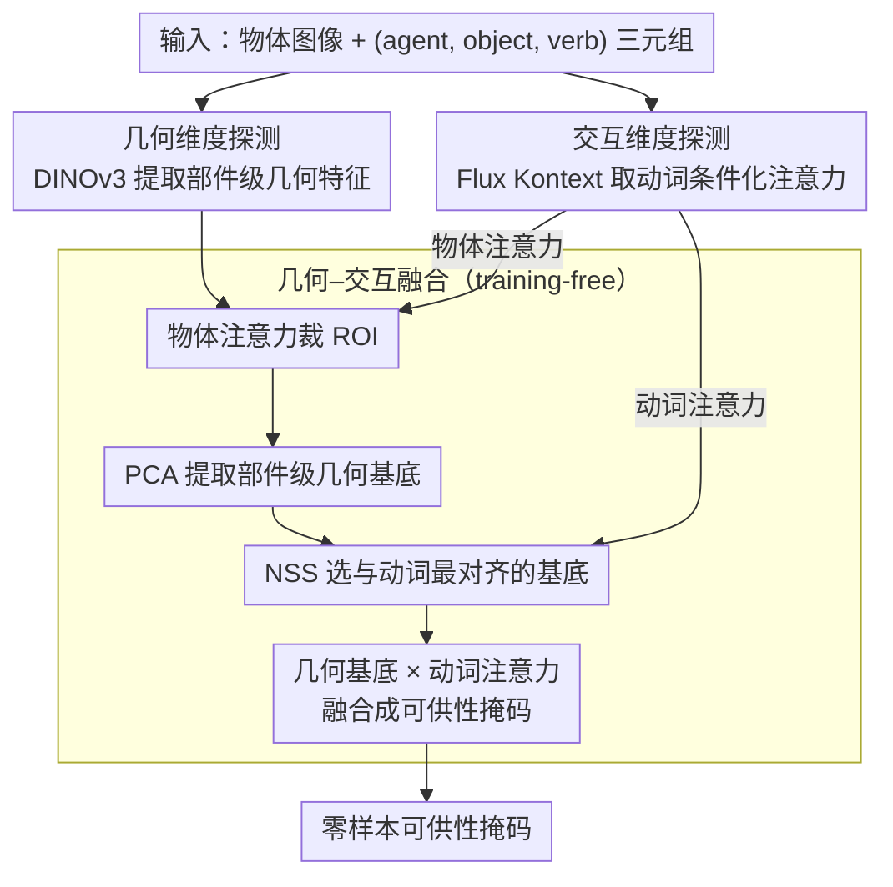

# Probing and Bridging Geometry–Interaction Cues for Affordance Reasoning in Vision Foundation Models

**会议**: CVPR 2026  
**arXiv**: [2602.20501](https://arxiv.org/abs/2602.20501)  
**代码**: [https://github.com/Probing-and-Bridging-Affordance](https://github.com/Probing-and-Bridging-Affordance) （待公开）  
**领域**: 图像生成  
**关键词**: 可供性推理, 视觉基础模型, 几何感知, 交互先验, 零样本融合

## 一句话总结
系统性地探测视觉基础模型（VFM）中的可供性（affordance）能力，发现 DINO 编码了部件级几何结构、Flux 编码了动词条件化的交互先验，并通过 training-free 融合两者实现了可与弱监督方法竞争的零样本可供性估计。

## 研究背景与动机

**领域现状**：视觉可供性描述物体如何被操作，是连接视觉感知与具身动作的桥梁。当前方法分三大范式：全监督（从像素标注学几何模式）、弱监督（从人-物交互推断）、开放词汇（利用文本-图像对齐泛化）。

**现有痛点**：全监督依赖密集标注、泛化差；弱监督空间不精确；开放词汇依赖语义关联而非真正的交互理解。三种范式各自强调不同证据，缺乏统一视角来回答"视觉系统理解可供性的核心能力是什么"。

**核心矛盾**：可供性不是物体的固有属性，而是 agent 与环境之间的交互可能性。现有方法将几何（物体结构）和交互（动作如何作用于结构）割裂处理，缺乏对这两个维度互补性的系统研究。

**切入角度**：视觉基础模型（VFM）通过大规模预训练已经内化了丰富的视觉知识，可以作为统一的"透镜"来直接查探可供性的核心能力——测试假说：几何感知 + 交互感知 = 可供性理解的基本组成。

**核心idea**：提出双维度框架，分别从 DINO（几何部件原型）和 Flux（动词条件化交叉注意力）中提取先验，training-free 融合后实现零样本可供性估计，证明这两个维度是可组合的基础能力。

## 方法详解

### 整体框架
这篇论文要回答的不是"怎么做一个更好的可供性分割器"，而是一个更基础的问题：视觉系统理解可供性，靠的到底是什么能力？作者的假说是「几何感知 + 交互感知」这两个维度合起来就是可供性理解的基本组成，于是把视觉基础模型（VFM）当成一面"透镜"来逐项查探。整条研究分三步走：先单独探测几何维度，确认一个模型的几何感知越强、可供性分割就越好；再单独探测交互维度，发现生成模型里动词条件化的空间注意力其实就是隐式的交互先验；最后把两者 training-free 地拼起来——用 DINOv3 提供几何原型、Flux Kontext 提供交互图，不训练任何参数就完成零样本可供性估计，反过来验证这两个维度确实是可组合的基础能力。

### 关键设计

**1. 几何维度探测：先证明"几何感知强 = 可供性分割好"，再看清 DINO 几何先验的形态**

可供性的第一半是物体结构——你得先认出"把手""杯沿""刀刃"这些功能部件，才谈得上知道它们怎么被用。作者用 Probing3D 协议对 6 个 VFM 做线性探针，结果几何感知越强的模型（DINOv2 最典型）可供性分割 mIoU 就越高；更关键的是，给 CLIP、SigLIP 这类语义模型额外喂入 Metric3Dv2 的深度/法线信息后 mIoU 显著上涨，而 DINOv2 几乎无收益——这说明它的几何先验已经嵌在预训练权重里，不需要外部 3D 信号来补。进一步用 PCA 可视化特征，会看到 DINO 家族独特地把场景组织成部件级结构（功能部件被清晰分离），而 SAM 只给出边界、CLIP 坍缩成语义类别、Stable Diffusion 产生平滑的表面嵌入。但这个几何先验并不"纯净"：作者发现一个"语义同化"现象——只看局部形状时所有环形结构都会被激活（纯几何响应），可一旦放回完整物体语境，非杯子的环形响应就被语义压制消失了。也就是说 DINO 的几何与语义是耦合的，这一点直接决定了后面融合时为什么必须先做 PCA。

**2. 交互维度探测：在生成模型的交叉注意力里挖出"动词条件化"的交互先验**

可供性的另一半是交互——同一个杯子，"hold"关注的是把手、"drink"关注的是杯沿，光有几何还分不出动作落在哪。作者分析 Flux.1-dev 的文本-图像交叉注意力，发现动词 token（hold、cut、drink、support）会一致地聚焦到物体上的接触区域，而名词 token 聚焦对应实体；这种动词/名词可分离的模式，说明生成模型在预训练时就内化了动词条件化的交互知识。为了把这种先验稳定地取出来，作者用 Flux Kontext 搭了一个可控图像编辑框架：给一个 (agent, object, verb) 三元组模板（如"add a hand to hold the knife"），在生成过程中读取动词的交叉注意力图。一个有力的旁证是，即便生成图本身翻车了，这些注意力图在空间上依然保持一致——说明交互先验来自模型内部表示，而不是从输出像素回溯出来的。把这张动词注意力直接当作零样本可供性预测，在 AGD20K 上就已经逼近弱监督水平（KLD 1.825，弱监督 Cross-View-AG 为 1.787）。

**3. 几何–交互融合：training-free 地把两种先验拼成可供性掩码**

既然几何告诉你"哪里是功能部件"、交互告诉你"动作落在哪",那把两者对齐叠加就该得到更准的可供性掩码——而且全程不训练。具体走四步：先用 Flux Kontext 的物体注意力裁出 DINOv3 特征图上的 ROI；对 ROI 特征做 PCA 得到一组部件级几何基底；再让 Flux 生成动词注意力，用 NSS（归一化扫视显著性，衡量预测分布与目标注意力的对齐程度）从这些基底里挑出与动词注意力最对齐的那一个；最后把选中的几何基底和动词注意力融合成最终掩码。这里 PCA 不是可有可无的预处理：正因为 DINO 的几何-语义耦合（见设计 1 的"语义同化"），直接拿原始特征会把语义噪声一起带进来，PCA 能提取更接近"形状中心"的纯几何原型，让动词注意力去对齐时不被语义干扰。举个具体的走法：输入一把刀加动词"cut"，物体注意力先框出刀的 ROI，PCA 把刀分解成刀刃、刀背、刀柄几个几何基底，"cut"的动词注意力与刀刃基底的 NSS 最高于是被选中，融合后掩码精确落在刀刃而非整把刀——这一步把仅交互版的 KLD 从 1.825 压到了 1.493。

### 训练策略
完全 training-free，不需要任何可供性标注或微调；DINOv3 与 Flux 均以冻结的预训练权重直接使用。

## 实验关键数据

### 主实验（AGD20K）

| 方法 | 监督方式 | KLD↓ | SIM↑ | NSS↑ |
|------|---------|------|------|------|
| AffordanceLLM | 全监督 | 1.463 | 0.377 | 1.070 |
| LOCATE | 弱监督 | 1.405 | 0.372 | 1.157 |
| Cross-View-AG | 弱监督 | 1.787 | 0.285 | 0.829 |
| Ours (仅交互) | Training-Free | 1.825 | 0.271 | 1.050 |
| **Ours (交互×几何)** | **Training-Free** | **1.493** | **0.326** | **1.090** |

### 几何探测实验（UMD Linear Probe mIoU）

| 模型 | 架构 | 监督 | mIoU（基础） | mIoU（+深度法线） |
|------|------|------|-------------|-------------------|
| DINOv2 | ViT-B/14 | SSL | 最高 | 几乎无提升 |
| CLIP | ViT-B/16 | VLM | 中等 | 显著提升 |
| SAM | ViT-B/16 | Seg. | 低 | 中等提升 |
| StableDiffusion | UNet | Gen. | 最低 | 有提升 |

### 关键发现
- **融合后效果显著**：几何+交互融合相比仅用交互，KLD 从 1.825 降至 1.493，SIM 从 0.271 涨至 0.326，说明几何先验抑制了不合理区域
- **零样本逼近弱监督**：training-free 方法在 NSS 指标上（1.090）甚至略超弱监督方法 Cross-View-AG（0.829），接近 AffordanceLLM（1.070）
- 动词注意力在**生成失败时仍保持一致**，证明交互先验是模型内在知识而非从输出图像回溯

## 亮点与洞察
- **双维度框架**极具理论深度——首次系统性地将可供性分解为"几何"和"交互"两个可操作的维度，并用实验验证了它们的互补性和可组合性
- **发掘生成模型的交互先验**是全新视角——此前无人将 Flux 的交叉注意力用于可供性估计，这打开了生成模型作为交互知识来源的新方向
- DINO 的"语义同化"现象的精妙实验设计——用同/异语境下的余弦相似度对比，巧妙分离了几何 vs 语义贡献
- 该方法是**模型无关的组合范式**：任何强几何模型 + 任何编码交互先验的生成模型可互换组合

## 局限与展望
- **原语质量受限**：名词条件化注意力图较嘈杂，生成输出不稳定，影响交互先验的提取质量
- **融合策略较浅**：当前仅用 NSS 选择+线性融合，是 open-loop 信号组合，没有闭环优化或迭代精炼
- 依赖 Flux Kontext 的可控图像编辑能力，对于某些抽象动词（如"思考"、"欣赏"）或非接触式交互效果可能退化
- **视频生成模型未探索**：作者在讨论中指出视频模型天然需要理解 3D 场景几何和交互动力学，可同时提供几何和交互先验，是重要未来方向
- PCA 提取的几何原型数量和选择策略较为简单，更复杂的物体结构可能需要层次化分解
- 定量评估仅在 AGD20K 上进行了融合对比，UMD 数据集仅用于定性验证几何一致性，评估广度有限

## 相关工作与启发
- **vs LOCATE / Cross-View-AG**（弱监督）：它们需要人-物交互训练数据，本文完全 training-free 但取得可竞争性能，且不受特定训练分布限制
- **vs AffordanceLLM**（全监督）：本文 NSS 接近其水平，但 KLD 仍有差距（1.493 vs 1.463），说明精细度还不够，未来可通过更好的融合改进
- **vs Affordance-R1**（后训练）：该方法用强化学习后训练但 KLD 高达 9.730，反而不如本文的 training-free 方案，说明 RL 在此任务上可能过拟合
- **vs GroundingDINO / MaskCLIP / EVF-SAM**：这些视觉语言模型能做全局语义匹配但无法定位功能区域，Flux Kontext 的动词注意力在细粒度交互定位上优势明显
- 该框架为 VFM 的能力分析提供了可推广的方法论——同样的双维度探测范式可迁移到其他任务（如空间关系理解、因果推理）

## 评分
- 新颖性: ⭐⭐⭐⭐⭐ 首个系统探测 VFM 可供性能力的工作，双维度框架和生成模型交互先验的发现具有开创性
- 实验充分度: ⭐⭐⭐⭐ 探测实验设计精妙，但定量评估仅在 AGD20K 上做了融合对比
- 写作质量: ⭐⭐⭐⭐⭐ 论文逻辑链非常清晰，从假说→探测→验证→融合环环相扣
- 价值: ⭐⭐⭐⭐ 为可供性研究和 VFM 理解提供了全新视角，但实际应用需要更强的融合策略

<!-- RELATED:START -->

## 相关论文

- [\[CVPR 2026\] Vision Foundation Models Can Be Good Tokenizers for Latent Diffusion Models](vision_foundation_models_can_be_good_tokenizers_for_latent_diffusion_models.md)
- [\[CVPR 2026\] SPREAD: Spatial-Physical REasoning via geometry Aware Diffusion](spread_spatial-physical_reasoning_via_geometry_aware_diffusion.md)
- [\[CVPR 2026\] VFM-VAE: Vision Foundation Models Can Be Good Tokenizers for Latent Diffusion Models](vfm-vae_vision_foundation_models_can_be_good_tokenizers_for_latent_diffusion_mod.md)
- [\[CVPR 2026\] Cinematic Audio Source Separation Using Visual Cues](cinematic_audio_source_separation_using_visual_cues.md)
- [\[NeurIPS 2025\] DEXTER: Diffusion-Guided EXplanations with TExtual Reasoning for Vision Models](../../NeurIPS2025/image_generation/dexter_diffusion-guided_explanations_with_textual_reasoning_for_vision_models.md)

<!-- RELATED:END -->
