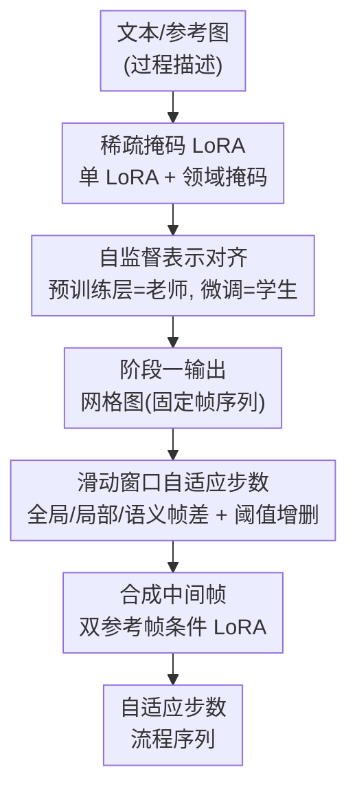

# ProcessMaker: A Generalized Process Visualization Framework with Adaptive Sequence Steps on Diffusion Transformers

**会议**: CVPR 2026  
**论文**: [CVF Open Access](https://openaccess.thecvf.com/content/CVPR2026/html/Xu_ProcessMaker_A_Generalized_Process_Visualization_Framework_with_Adaptive_Sequence_Steps_CVPR_2026_paper.html)  
**代码**: https://github.com/Molly260/ProcessMaker  
**领域**: 扩散模型 / 图像生成  
**关键词**: 流程序列生成, Diffusion Transformer, LoRA 稀疏掩码, 表示对齐, 自适应步数

## 一句话总结
ProcessMaker 在 Flux.1（DiT）上，用「稀疏掩码 LoRA + 自监督表示对齐」实现跨领域的流程图序列生成，再用滑动窗口按帧差自适应增删步数，仅训练 7.3% 参数就在 21 个领域的对齐度与连贯性上超过 MakeAnything。

## 研究背景与动机
**领域现状**：流程序列生成（procedural sequence generation）要把「绘画 / 烹饪 / 手工 / 产品设计」这类一步步演化的过程，渲染成一串中间状态图，用于教程、说明书、工业设计。文本到图像扩散模型出现后，给定一段过程描述就能生成这些中间帧。

**现有痛点**：现有方法基本各管一摊——CookingDiffusion、CoCook 只做烹饪，ProcessPainter、PaintsAlter 只做绘画；要覆盖多领域就得像 MakeAnything 那样给每个领域配一套专家网络（非对称 LoRA）。这带来三个具体毛病：(1) **对未见领域泛化差**——在单一领域训练会过拟合该领域的逻辑/视觉/语义复杂度，换个没见过的过程就生成不合逻辑的帧；(2) **参数冗余**——多领域要 fine-tune 多个专家模块，计算开销高；(3) **步数固定不自适应**——给定文本只能出固定帧数，简单过程浪费帧、复杂过程漏关键帧，导致序列要么重复要么跳变。

**核心矛盾**：「多领域覆盖」和「参数效率 + 泛化」之间存在张力——堆专家网络能覆盖更多领域，却既冗余又不泛化；而固定步数则把「过程复杂度」这个本应自适应的量写死了。

**本文目标**：用一个轻量框架同时解决三件事——泛化到未见领域、不靠多专家网络省参数、按过程复杂度自适应决定步数。

**切入角度**：预训练 DiT（Flux.1）本身就有很强的泛化表示，与其再训多套专家，不如(a) 直接把 DiT 内部某些层的预训练表示当「老师」来约束微调，(b) 用单个 LoRA 配不同领域掩码代替多个领域专属 LoRA，(c) 生成后再用滑动窗口按帧间差异补/删帧。

**核心 idea**：榨干预训练 DiT 的固有泛化能力，用「掩码化的单 LoRA + 自监督表示对齐」做跨域生成，再用「帧差驱动的滑动窗口」做自适应步数。

## 方法详解

### 整体框架
ProcessMaker 建在 Flux.1（一个用 flow matching 的 DiT）之上，整条流水线分两个阶段。**阶段一（多领域泛化）**：在 LoRA 微调里引入稀疏掩码让单个 LoRA 服务多个领域，同时用自监督表示对齐把微调后的中间表示锚回预训练表示，从而在少参数下保住泛化；阶段一输出的是一张「网格图」（grid image，把整个序列的若干帧排在一张图里）。**阶段二（自适应步数）**：把网格图拆成帧序列 $F=\{f_1,\dots,f_n\}$，用滑动窗口逐对比较相邻帧的全局/局部/语义差异，算出自适应阈值，差异过大处补插中间帧、差异过小处删冗余帧，最后用一个带两张参考帧条件的 LoRA 把补的中间帧合成出来。

### 关键设计

**1. 稀疏掩码 LoRA：用一个 LoRA + 领域掩码替掉多个专家网络**

针对的是「多领域 → 多专家网络 → 参数冗余 + 跨域干扰」这个痛点。MakeAnything 的做法类似 MoE——共享一个矩阵 $A$、给每个任务配一个专属 $B$，参数和算力都膨胀。ProcessMaker 反过来只用**一个** LoRA，但给每个领域学一个行级掩码 $m_{\ell,c}\in\mathbb{R}^d$ 来控制这个 LoRA 在该领域下哪些行生效。对第 $\ell$ 个 DiT Block，原始更新是 $\Delta W_\ell=B_\ell A_\ell$，加掩码后变成

$$\Delta W^{(c)}_\ell = (G(m_{\ell,c}) \odot B_\ell) A_\ell,$$

其中 $G(\cdot)$ 把掩码按列广播、$\odot$ 是 Hadamard 积；最终权重 $W^{(c)}_\ell = W_\ell + \frac{\alpha_\ell}{r_\ell}\Delta W^{(c)}_\ell$（$\alpha_\ell$ 是抵消秩 $r_\ell$ 增大时更新幅度被放大的缩放因子）。关键经验观察是：作者发现掩码矩阵里**后 70% 的参数和领域相关性不显著**，于是直接把每个领域掩码的后 70% 置 0、前 30% 置 1——等于让不同领域共享大部分通用容量、只在前 30% 上分化，既省参数又减少跨域干扰。推理时，数据集内领域用对应掩码；数据集外的未见领域**直接去掉掩码**，纯靠模型的泛化能力生成。

**2. 自监督表示对齐：把预训练 DiT 的内部表示当老师，锚住微调不让它丢泛化**

针对的是「fine-tune 后容易过拟合训练领域、对未见过程泛化差」。思路是不引入任何外部标注，而是用 Flux.1 自己的预训练表示来自监督。具体地，在指定的若干 DiT Block 集合 $L$（同时覆盖 MM-DiT 与 Single-DiT，实现里取第 4/9/14/19/29 层）上，把**预训练表示** $h^T_\ell(z)$ 当老师、**微调后表示** $h^S_\ell(z)$ 当学生，做对齐：

$$L_{sup} = \sum_{\ell\in L} W^{(c)}_\ell\, D\big(h^T_\ell(z), h^S_\ell(z)\big),$$

其中距离 $D = d_{cos}(h^T_\ell, h^S_\ell) + \gamma\,\|h^T_\ell - h^S_\ell\|_2^2$ 同时用余弦距离和 MSE——前者管高层语义方向、后者管低层纹理数值，两个一起拉等于同时对齐「纹理 + 语义」。它和原始 flow matching 主损失 $L_{main}$ 合成阶段一目标 $L_{stage1}=L_{main}+\lambda(t)L_{sup}$，其中 $\lambda(t)=\lambda_0 s(t)$ 让监督强度随扩散时间步 $t$ 调制（$\lambda_0=0.5$）。这样微调表示被「钉」在预训练的稳健归纳偏置上，未见领域也不至于漂掉。

**3. 滑动窗口自适应步数：按帧间「全局+局部+语义」差异决定补帧还是删帧**

针对的是「固定步数 → 简单过程冗余、复杂过程漏帧」。阶段一出的网格图被拆成 $n$ 帧的序列后，阶段二用步长 $s=1$ 的滑动窗口取相邻帧对，对每一对算三种差异综合判断变化大小：全局视觉差 $\Delta_{glob}(i,j)=1-\langle v_i,v_j\rangle$（CLIP 图像编码、L2 归一化的全局向量余弦）、局部视觉差 $\Delta_{loc}(i,j)=\frac{1}{|P_i|}\sum_{p\in P_i}\min_{q\in P_j}\|p-q\|_2$（DINO patch token 的最近邻距离，归一到 [0,1]）、语义差 $\Delta_{sem}(i,j)=1-\langle u_i,u_j\rangle$（CLIP 文本编码余弦）。三者按

$$\hat\Delta_{ij} = \alpha\Delta_{glob} + (1-\alpha-\beta)\Delta_{loc} + \beta\Delta_{sem}$$

加权合并（$\alpha=0.6,\beta=0.2$）。再用 $\hat\Delta$ 的均值 $\mu$、标准差 $\sigma$ 定两个自适应阈值：$\tau_{add}=\mu+k_1\sigma$ 用于在差异过大（跳变）处**补插**中间帧，$\tau_{del}=\mu-k_2\sigma$ 用于在差异过小（雷同）处**删除**冗余帧（$k_1,k_2\in[0.5,1]$，且 $\tau_{add}>\tau_{del}$）。补帧时再训练一个带两张参考帧条件 $c^1_I,c^2_I$ 的 LoRA 来真正合成中间图，阶段二损失 $L_{stage2}=\mathbb{E}\big[\|v_\Theta(z,t,c^1_I,c^2_I,c_T)-u_t(z|\epsilon)\|^2\big]$。这样步数不再写死，而是随过程复杂度自动伸缩。

### 损失函数 / 训练策略
两阶段都用 CAME 优化器、分辨率 1024×1024、LoRA rank 64、学习率 $1\times10^{-4}$、batch size 1，在 8 卡 A6000 上训练。阶段一损失 $L_{stage1}=L_{main}+\lambda(t)L_{sup}$（$\lambda_0=0.5,\gamma=0.1$），阶段二损失为带双参考帧条件的 flow matching 项。

## 实验关键数据

数据集用 MakeAnything（24,000+ 序列、21 个领域、4 格与 9 格网格图）。指标：CLIP Score 测文本-图像对齐（Align），GPT-4o 测序列连贯性（Coh），外加 100 人主观评测。

### 主实验
21 个领域上对比 Flux.1 / MakeAnything（节选，越高越好）：

| 领域 | 指标 | Flux.1 | MakeAnything | ProcessMaker |
|------|------|--------|--------------|--------------|
| Oil Painting | Align / Coh | 30.27 / 4.00 | 37.30 / 4.95 | **37.32 / 5.00** |
| LEGO | Align / Coh | 30.15 / 2.55 | 34.40 / 4.90 | **34.53 / 5.00** |
| Pencil Sketch | Align / Coh | 30.28 / 4.05 | 34.44 / 4.50 | **35.39 / 4.70** |
| Emoji | Align / Coh | 27.62 / 2.75 | 34.20 / 3.60 | **34.82 / 3.90** |
| Clay Sculpture | Align / Coh | 31.66 / 3.50 | 35.25 / 4.50 | **35.85 / 4.55** |

跨 21 域 ProcessMaker 在对齐度上**全部领域最高**，尤其在 Painting、LEGO 这类高精度要求的领域提升明显。与各领域专家模型单独比（Table 2）：

| 领域 | 专家模型 | 专家 Align/Coh | ProcessMaker Align/Coh |
|------|---------|----------------|------------------------|
| Painting | ProcessPainter | 26.43 / 4.85 | **34.47 / 4.85** |
| Icon | LayerTracer | 31.43 / 3.55 | **31.59 / 3.90** |
| Cook | CoCook | 32.28 / 4.15 | **34.47 / 4.50** |

即用一个通用框架就压过了各领域专门训练的模型。

### 消融实验
在 Fabric Toys 领域逐组件消融（Table 3）：

| 阶段 | 配置 | Align | Coh | 可训练参数 |
|------|------|-------|-----|-----------|
| Stage 1 | Base Model (MakeAnything) | 32.83 | 4.60 | 4.19B |
| Stage 1 | + LoRA Masks | 33.03 | 4.65 | 306.32M |
| Stage 1 | + RA（表示对齐） | 32.89 | 4.65 | - |
| Stage 2 | ProcessMaker（完整） | 33.61 | 4.95 | 306.32M |
| Stage 2 | w/o $\Delta_{glob}$ | 33.29 | 4.80 | - |
| Stage 2 | w/o $\Delta_{loc}$ | 33.55 | 4.70 | - |
| Stage 2 | w/o $\Delta_{sem}$ | 32.90 | 4.95 | - |

### 关键发现
- **稀疏掩码 LoRA 是省参数主力**：从 Base 的 4.19B 可训练参数降到 306.32M（减约 92.7%），同时对齐/一致性还小涨——印证「后 70% 参数与领域弱相关」这个观察。整体仅 7.3% 可训练参数即超 SOTA。
- **表示对齐主要补连贯性与逻辑**：加 RA 后 Coh 升、Align 提升较小（margin），说明它管的是步间过渡是否合逻辑，而非单帧对齐。
- **阶段二三种帧差各司其职**：去掉 $\Delta_{glob}$ 或 $\Delta_{loc}$ 都明显掉 Align/一致性（帧间一致性靠视觉差把关）；去掉 $\Delta_{sem}$ 主要伤 Align（语义差负责语义准确）。
- 主观评测在 Painting/Icon/Cook 及 5 个未见领域上，ProcessMaker 在 Alignment/Coherence/可用性等维度普遍领先，体现跨域泛化。

## 亮点与洞察
- **「单 LoRA + 领域掩码」替代多专家**：把多领域的差异压进一个小掩码（且只动前 30%），既避免 MoE 式参数爆炸，又天然减少跨域干扰——这种「共享主体 + 轻量掩码分化」的思路可迁移到任何多任务 LoRA 场景。
- **用预训练表示自监督微调**：不需要额外标注，直接拿冻结主干的中间层表示当老师约束学生，是「防止微调丢泛化」的低成本正则，余弦+MSE 双距离同时锚语义和纹理这一点尤其值得复用。
- **生成与步数解耦**：先固定网格生成、再用帧差滑窗后处理增删帧，把「该生成几帧」从一次性 decode 里拆出来变成可解释、可调阈值的模块，比直接让模型端到端决定步数更可控。

## 局限与展望
- 作者承认：网格图把多帧塞进一张图，单子图分辨率受限，细节会被压缩/模糊；未来想接超分丰富细节。
- 数据集外领域只能靠文本 + 预训练泛化，可能与期望过程/风格有偏差；计划引入参考图、草图、短视频等可控条件。
- ⚠️ 自己看：阶段二「补帧」依赖阶段一已生成的网格序列质量，若网格里某帧本身错了，滑窗只能在错帧之间插值，纠错能力有限；且补帧的双参考帧 LoRA 是额外训练的，端到端程度不及纯生成式步数自适应。
- 帧差权重 $\alpha,\beta$ 与阈值系数 $k_1,k_2$ 为手工设定，跨领域是否需要重调、敏感度多大，正文未充分给出。

## 相关工作与启发
- **vs MakeAnything**：两者都做多领域流程生成，但 MakeAnything 用非对称 LoRA（共享 A + 多个任务专属 B）逼近 MoE，参数冗余且对未见域泛化差；ProcessMaker 用单 LoRA + 稀疏掩码 + 表示对齐，参数仅 7.3%、还能去掩码裸跑未见域，并多了自适应步数。
- **vs 领域专家（ProcessPainter / CoCook / LayerTracer）**：它们各自在绘画/烹饪/图标上专精；ProcessMaker 一个通用框架在这三域上均追平或反超专家模型。
- **vs 视频生成**：视频生成能保连贯，但难覆盖完整过程且算力巨大；ProcessMaker 用网格图 + 帧差滑窗在更低成本下做完整流程的自适应步数。

## 评分
- 新颖性: ⭐⭐⭐⭐ 「单 LoRA 掩码替多专家 + 预训练表示自监督 + 帧差滑窗自适应步数」三件组合在流程生成里是新的，单点技术多为既有工具的巧用。
- 实验充分度: ⭐⭐⭐⭐ 21 域定量 + 三领域专家对比 + 100 人主观 + 逐组件消融，覆盖较全；但帧差权重/阈值的敏感性分析偏弱。
- 写作质量: ⭐⭐⭐⭐ 三大创新与两阶段结构清晰，公式完整；网格图分辨率等局限也如实交代。
- 价值: ⭐⭐⭐⭐ 7.3% 参数超 SOTA 且能泛化到未见域，对教程/工业设计等流程可视化应用实用性强。

<!-- RELATED:START -->

## 相关论文

- [\[CVPR 2026\] Region-Adaptive Sampling for Diffusion Transformers](region-adaptive_sampling_for_diffusion_transformers.md)
- [\[CVPR 2026\] ThinkGen: Generalized Thinking for Visual Generation](thinkgen_generalized_thinking_for_visual_generation.md)
- [\[CVPR 2026\] TAP: A Token-Adaptive Predictor Framework for Training-Free Diffusion Acceleration](tap_a_token-adaptive_predictor_framework_for_training-free_diffusion_acceleratio.md)
- [\[CVPR 2026\] SpotEdit: Selective Region Editing in Diffusion Transformers](spotedit_selective_region_editing_in_diffusion_transformers.md)
- [\[CVPR 2026\] PixelDiT: Pixel Diffusion Transformers for Image Generation](pixeldit_pixel_diffusion_transformers_for_image_generation.md)

<!-- RELATED:END -->
